``` r
#install packages

install.packages("sjmisc")
```

```
## Installing package into '/home/guest/R/x86_64-pc-linux-gnu-library/4.4'
## (as 'lib' is unspecified)
```

``` r
install.packages("likert")
```

```
## Installing package into '/home/guest/R/x86_64-pc-linux-gnu-library/4.4'
## (as 'lib' is unspecified)
```


Total number of respondents: ****

All question numbers below are based on the "Key Variables for Descriptive Statistics" doc file.

All the descriptives calculated for index questions were based on the **unimputed** variable.


```
## [1] "Q9.8.1"  "Q9.8.10" "Q9.8.11" "Q9.8.12"
```

```
## # A tibble: 2 × 2
##   Q2.1   count
##   <chr>  <int>
## 1 Female  2261
## 2 Male    1424
```

# 1) Political and Legal Fragility

All the answers are in a \*scale of 0-1\*\*, i.e. can have the following values: 0, 0.25, 0.5, 0.75, 1. The higher, the more fragile.

The higher, the more fragile.

## Index Questions

### Q10.1.2: How much confidence do you have in your state government? {.tabset}

0 - A lot of confidence

0.33 - Confidence

0.67 - Some Confidence

1 - No Confidence

#### Entire sample

<table class="table" style="width: auto !important; ">
 <thead>
  <tr>
   <th style="text-align:left;"> mean </th>
  </tr>
 </thead>
<tbody>
  <tr>
   <td style="text-align:left;"> 0.51 </td>
  </tr>
</tbody>
</table>

<table class="table" style="width: auto !important; ">
 <thead>
  <tr>
   <th style="text-align:left;"> Response </th>
   <th style="text-align:center;"> Number of Responses </th>
   <th style="text-align:left;"> Percent of Total Responses </th>
  </tr>
 </thead>
<tbody>
  <tr>
   <td style="text-align:left;"> Some confidence </td>
   <td style="text-align:center;"> 1440 </td>
   <td style="text-align:left;"> 0.39 </td>
  </tr>
  <tr>
   <td style="text-align:left;"> Confidence </td>
   <td style="text-align:center;"> 1323 </td>
   <td style="text-align:left;"> 0.36 </td>
  </tr>
  <tr>
   <td style="text-align:left;"> No confidence </td>
   <td style="text-align:center;"> 489 </td>
   <td style="text-align:left;"> 0.13 </td>
  </tr>
  <tr>
   <td style="text-align:left;"> A lot of confidence </td>
   <td style="text-align:center;"> 426 </td>
   <td style="text-align:left;"> 0.12 </td>
  </tr>
  <tr>
   <td style="text-align:left;"> Prefer not to answer </td>
   <td style="text-align:center;"> 7 </td>
   <td style="text-align:left;"> 0.00 </td>
  </tr>
</tbody>
</table>

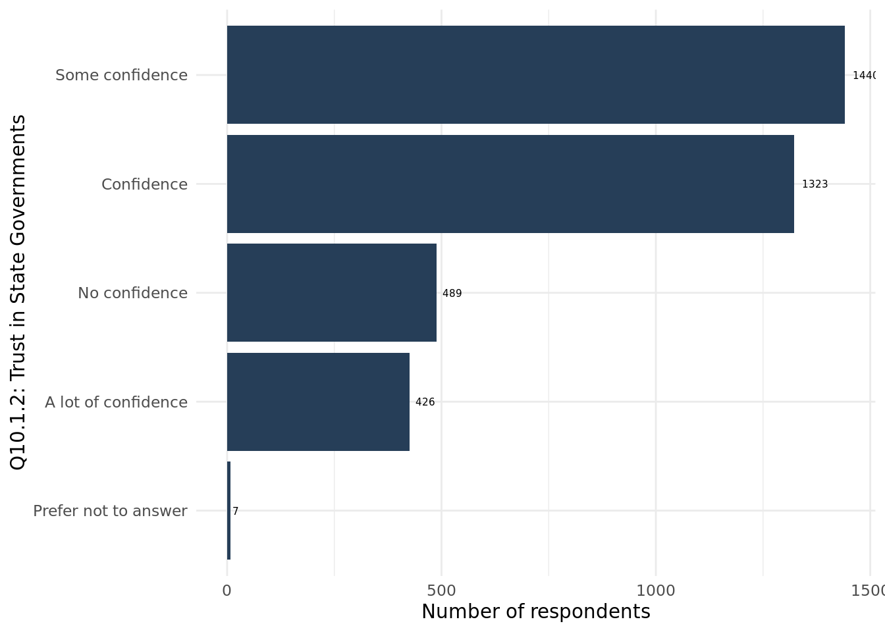

#### By county

<table class="table" style="width: auto !important; ">
 <thead>
  <tr>
   <th style="text-align:left;"> County </th>
   <th style="text-align:center;"> Mean Response (0 to 1) </th>
  </tr>
 </thead>
<tbody>
  <tr>
   <td style="text-align:left;"> Bor South </td>
   <td style="text-align:center;"> 0.65 </td>
  </tr>
  <tr>
   <td style="text-align:left;"> Yei </td>
   <td style="text-align:center;"> 0.63 </td>
  </tr>
  <tr>
   <td style="text-align:left;"> Lainya </td>
   <td style="text-align:center;"> 0.57 </td>
  </tr>
  <tr>
   <td style="text-align:left;"> Malakal </td>
   <td style="text-align:center;"> 0.55 </td>
  </tr>
  <tr>
   <td style="text-align:left;"> Rubkona </td>
   <td style="text-align:center;"> 0.53 </td>
  </tr>
  <tr>
   <td style="text-align:left;"> Morobo </td>
   <td style="text-align:center;"> 0.49 </td>
  </tr>
  <tr>
   <td style="text-align:left;"> Wau </td>
   <td style="text-align:center;"> 0.46 </td>
  </tr>
  <tr>
   <td style="text-align:left;"> Pibor </td>
   <td style="text-align:center;"> 0.40 </td>
  </tr>
  <tr>
   <td style="text-align:left;"> Kajo-keji </td>
   <td style="text-align:center;"> 0.32 </td>
  </tr>
</tbody>
</table>

<table class="table" style="width: auto !important; ">
 <thead>
  <tr>
   <th style="text-align:left;"> County </th>
   <th style="text-align:center;"> Response </th>
   <th style="text-align:left;"> Number of Responses </th>
   <th style="text-align:center;"> Percent of Total Responses in the County </th>
  </tr>
 </thead>
<tbody>
  <tr>
   <td style="text-align:left;"> Yei </td>
   <td style="text-align:center;"> A lot of confidence </td>
   <td style="text-align:left;"> 15 </td>
   <td style="text-align:center;"> 0.04 </td>
  </tr>
  <tr>
   <td style="text-align:left;"> Yei </td>
   <td style="text-align:center;"> Confidence </td>
   <td style="text-align:left;"> 113 </td>
   <td style="text-align:center;"> 0.28 </td>
  </tr>
  <tr>
   <td style="text-align:left;"> Yei </td>
   <td style="text-align:center;"> No confidence </td>
   <td style="text-align:left;"> 93 </td>
   <td style="text-align:center;"> 0.23 </td>
  </tr>
  <tr>
   <td style="text-align:left;"> Yei </td>
   <td style="text-align:center;"> Some confidence </td>
   <td style="text-align:left;"> 189 </td>
   <td style="text-align:center;"> 0.46 </td>
  </tr>
  <tr>
   <td style="text-align:left;"> Wau </td>
   <td style="text-align:center;"> A lot of confidence </td>
   <td style="text-align:left;"> 48 </td>
   <td style="text-align:center;"> 0.12 </td>
  </tr>
  <tr>
   <td style="text-align:left;"> Wau </td>
   <td style="text-align:center;"> Confidence </td>
   <td style="text-align:left;"> 184 </td>
   <td style="text-align:center;"> 0.46 </td>
  </tr>
  <tr>
   <td style="text-align:left;"> Wau </td>
   <td style="text-align:center;"> No confidence </td>
   <td style="text-align:left;"> 28 </td>
   <td style="text-align:center;"> 0.07 </td>
  </tr>
  <tr>
   <td style="text-align:left;"> Wau </td>
   <td style="text-align:center;"> Prefer not to answer </td>
   <td style="text-align:left;"> 3 </td>
   <td style="text-align:center;"> 0.01 </td>
  </tr>
  <tr>
   <td style="text-align:left;"> Wau </td>
   <td style="text-align:center;"> Some confidence </td>
   <td style="text-align:left;"> 139 </td>
   <td style="text-align:center;"> 0.35 </td>
  </tr>
  <tr>
   <td style="text-align:left;"> Rubkona </td>
   <td style="text-align:center;"> A lot of confidence </td>
   <td style="text-align:left;"> 32 </td>
   <td style="text-align:center;"> 0.08 </td>
  </tr>
  <tr>
   <td style="text-align:left;"> Rubkona </td>
   <td style="text-align:center;"> Confidence </td>
   <td style="text-align:left;"> 117 </td>
   <td style="text-align:center;"> 0.29 </td>
  </tr>
  <tr>
   <td style="text-align:left;"> Rubkona </td>
   <td style="text-align:center;"> No confidence </td>
   <td style="text-align:left;"> 19 </td>
   <td style="text-align:center;"> 0.05 </td>
  </tr>
  <tr>
   <td style="text-align:left;"> Rubkona </td>
   <td style="text-align:center;"> Some confidence </td>
   <td style="text-align:left;"> 232 </td>
   <td style="text-align:center;"> 0.58 </td>
  </tr>
  <tr>
   <td style="text-align:left;"> Pibor </td>
   <td style="text-align:center;"> A lot of confidence </td>
   <td style="text-align:left;"> 82 </td>
   <td style="text-align:center;"> 0.20 </td>
  </tr>
  <tr>
   <td style="text-align:left;"> Pibor </td>
   <td style="text-align:center;"> Confidence </td>
   <td style="text-align:left;"> 193 </td>
   <td style="text-align:center;"> 0.47 </td>
  </tr>
  <tr>
   <td style="text-align:left;"> Pibor </td>
   <td style="text-align:center;"> No confidence </td>
   <td style="text-align:left;"> 36 </td>
   <td style="text-align:center;"> 0.09 </td>
  </tr>
  <tr>
   <td style="text-align:left;"> Pibor </td>
   <td style="text-align:center;"> Some confidence </td>
   <td style="text-align:left;"> 96 </td>
   <td style="text-align:center;"> 0.24 </td>
  </tr>
  <tr>
   <td style="text-align:left;"> Morobo </td>
   <td style="text-align:center;"> A lot of confidence </td>
   <td style="text-align:left;"> 72 </td>
   <td style="text-align:center;"> 0.18 </td>
  </tr>
  <tr>
   <td style="text-align:left;"> Morobo </td>
   <td style="text-align:center;"> Confidence </td>
   <td style="text-align:left;"> 128 </td>
   <td style="text-align:center;"> 0.32 </td>
  </tr>
  <tr>
   <td style="text-align:left;"> Morobo </td>
   <td style="text-align:center;"> No confidence </td>
   <td style="text-align:left;"> 64 </td>
   <td style="text-align:center;"> 0.16 </td>
  </tr>
  <tr>
   <td style="text-align:left;"> Morobo </td>
   <td style="text-align:center;"> Prefer not to answer </td>
   <td style="text-align:left;"> 1 </td>
   <td style="text-align:center;"> 0.00 </td>
  </tr>
  <tr>
   <td style="text-align:left;"> Morobo </td>
   <td style="text-align:center;"> Some confidence </td>
   <td style="text-align:left;"> 139 </td>
   <td style="text-align:center;"> 0.34 </td>
  </tr>
  <tr>
   <td style="text-align:left;"> Malakal </td>
   <td style="text-align:center;"> A lot of confidence </td>
   <td style="text-align:left;"> 5 </td>
   <td style="text-align:center;"> 0.01 </td>
  </tr>
  <tr>
   <td style="text-align:left;"> Malakal </td>
   <td style="text-align:center;"> Confidence </td>
   <td style="text-align:left;"> 168 </td>
   <td style="text-align:center;"> 0.40 </td>
  </tr>
  <tr>
   <td style="text-align:left;"> Malakal </td>
   <td style="text-align:center;"> No confidence </td>
   <td style="text-align:left;"> 33 </td>
   <td style="text-align:center;"> 0.08 </td>
  </tr>
  <tr>
   <td style="text-align:left;"> Malakal </td>
   <td style="text-align:center;"> Some confidence </td>
   <td style="text-align:left;"> 215 </td>
   <td style="text-align:center;"> 0.51 </td>
  </tr>
  <tr>
   <td style="text-align:left;"> Lainya </td>
   <td style="text-align:center;"> A lot of confidence </td>
   <td style="text-align:left;"> 23 </td>
   <td style="text-align:center;"> 0.06 </td>
  </tr>
  <tr>
   <td style="text-align:left;"> Lainya </td>
   <td style="text-align:center;"> Confidence </td>
   <td style="text-align:left;"> 136 </td>
   <td style="text-align:center;"> 0.33 </td>
  </tr>
  <tr>
   <td style="text-align:left;"> Lainya </td>
   <td style="text-align:center;"> No confidence </td>
   <td style="text-align:left;"> 60 </td>
   <td style="text-align:center;"> 0.14 </td>
  </tr>
  <tr>
   <td style="text-align:left;"> Lainya </td>
   <td style="text-align:center;"> Prefer not to answer </td>
   <td style="text-align:left;"> 2 </td>
   <td style="text-align:center;"> 0.00 </td>
  </tr>
  <tr>
   <td style="text-align:left;"> Lainya </td>
   <td style="text-align:center;"> Some confidence </td>
   <td style="text-align:left;"> 193 </td>
   <td style="text-align:center;"> 0.47 </td>
  </tr>
  <tr>
   <td style="text-align:left;"> Kajo-keji </td>
   <td style="text-align:center;"> A lot of confidence </td>
   <td style="text-align:left;"> 130 </td>
   <td style="text-align:center;"> 0.33 </td>
  </tr>
  <tr>
   <td style="text-align:left;"> Kajo-keji </td>
   <td style="text-align:center;"> Confidence </td>
   <td style="text-align:left;"> 169 </td>
   <td style="text-align:center;"> 0.42 </td>
  </tr>
  <tr>
   <td style="text-align:left;"> Kajo-keji </td>
   <td style="text-align:center;"> No confidence </td>
   <td style="text-align:left;"> 23 </td>
   <td style="text-align:center;"> 0.06 </td>
  </tr>
  <tr>
   <td style="text-align:left;"> Kajo-keji </td>
   <td style="text-align:center;"> Prefer not to answer </td>
   <td style="text-align:left;"> 1 </td>
   <td style="text-align:center;"> 0.00 </td>
  </tr>
  <tr>
   <td style="text-align:left;"> Kajo-keji </td>
   <td style="text-align:center;"> Some confidence </td>
   <td style="text-align:left;"> 75 </td>
   <td style="text-align:center;"> 0.19 </td>
  </tr>
  <tr>
   <td style="text-align:left;"> Bor South </td>
   <td style="text-align:center;"> A lot of confidence </td>
   <td style="text-align:left;"> 19 </td>
   <td style="text-align:center;"> 0.04 </td>
  </tr>
  <tr>
   <td style="text-align:left;"> Bor South </td>
   <td style="text-align:center;"> Confidence </td>
   <td style="text-align:left;"> 115 </td>
   <td style="text-align:center;"> 0.27 </td>
  </tr>
  <tr>
   <td style="text-align:left;"> Bor South </td>
   <td style="text-align:center;"> No confidence </td>
   <td style="text-align:left;"> 133 </td>
   <td style="text-align:center;"> 0.31 </td>
  </tr>
  <tr>
   <td style="text-align:left;"> Bor South </td>
   <td style="text-align:center;"> Some confidence </td>
   <td style="text-align:left;"> 162 </td>
   <td style="text-align:center;"> 0.38 </td>
  </tr>
</tbody>
</table>

### Q10.1.10: How much confidence do you have in informal authorities, such as councils of elders? {.tabset}

0 - A lot of confidence

0.33 - Confidence

0.67 - Some Confidence

1 - No Confidence

#### Entire sample

<table class="table" style="width: auto !important; ">
 <thead>
  <tr>
   <th style="text-align:left;"> mean </th>
  </tr>
 </thead>
<tbody>
  <tr>
   <td style="text-align:left;"> 0.45 </td>
  </tr>
</tbody>
</table>

<table class="table" style="width: auto !important; ">
 <thead>
  <tr>
   <th style="text-align:left;"> Response </th>
   <th style="text-align:center;"> Number of Responses </th>
   <th style="text-align:left;"> Percent of Total Responses </th>
  </tr>
 </thead>
<tbody>
  <tr>
   <td style="text-align:left;"> Confidence </td>
   <td style="text-align:center;"> 1524 </td>
   <td style="text-align:left;"> 0.41 </td>
  </tr>
  <tr>
   <td style="text-align:left;"> Some confidence </td>
   <td style="text-align:center;"> 1215 </td>
   <td style="text-align:left;"> 0.33 </td>
  </tr>
  <tr>
   <td style="text-align:left;"> A lot of confidence </td>
   <td style="text-align:center;"> 605 </td>
   <td style="text-align:left;"> 0.16 </td>
  </tr>
  <tr>
   <td style="text-align:left;"> No confidence </td>
   <td style="text-align:center;"> 316 </td>
   <td style="text-align:left;"> 0.09 </td>
  </tr>
  <tr>
   <td style="text-align:left;"> Prefer not to answer </td>
   <td style="text-align:center;"> 25 </td>
   <td style="text-align:left;"> 0.01 </td>
  </tr>
</tbody>
</table>

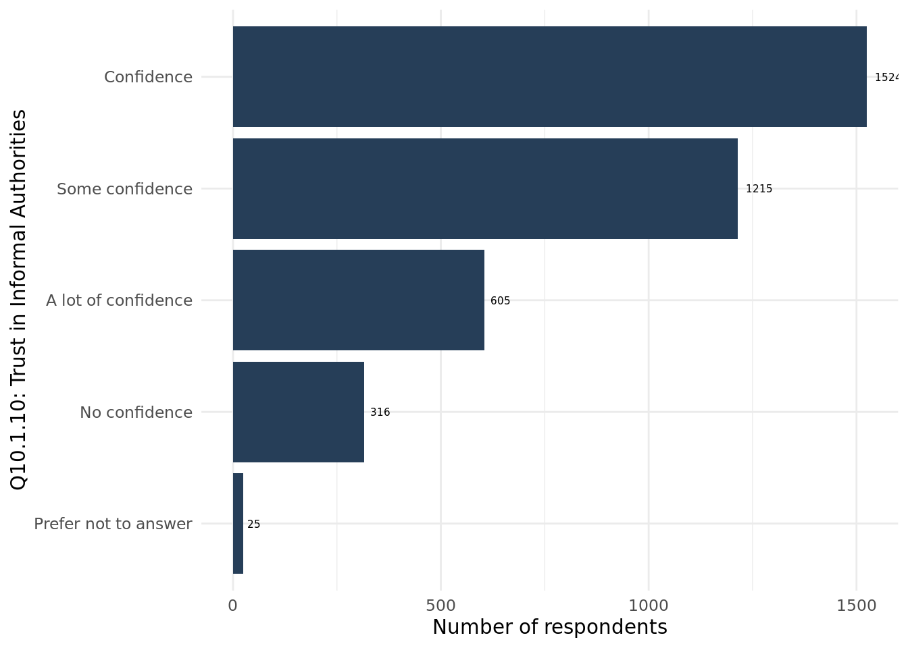

#### By county

<table class="table" style="width: auto !important; ">
 <thead>
  <tr>
   <th style="text-align:left;"> County </th>
   <th style="text-align:center;"> Mean Response (0 to 1) </th>
  </tr>
 </thead>
<tbody>
  <tr>
   <td style="text-align:left;"> Yei </td>
   <td style="text-align:center;"> 0.56 </td>
  </tr>
  <tr>
   <td style="text-align:left;"> Rubkona </td>
   <td style="text-align:center;"> 0.50 </td>
  </tr>
  <tr>
   <td style="text-align:left;"> Pibor </td>
   <td style="text-align:center;"> 0.49 </td>
  </tr>
  <tr>
   <td style="text-align:left;"> Wau </td>
   <td style="text-align:center;"> 0.46 </td>
  </tr>
  <tr>
   <td style="text-align:left;"> Malakal </td>
   <td style="text-align:center;"> 0.45 </td>
  </tr>
  <tr>
   <td style="text-align:left;"> Lainya </td>
   <td style="text-align:center;"> 0.45 </td>
  </tr>
  <tr>
   <td style="text-align:left;"> Morobo </td>
   <td style="text-align:center;"> 0.41 </td>
  </tr>
  <tr>
   <td style="text-align:left;"> Kajo-keji </td>
   <td style="text-align:center;"> 0.36 </td>
  </tr>
  <tr>
   <td style="text-align:left;"> Bor South </td>
   <td style="text-align:center;"> 0.34 </td>
  </tr>
</tbody>
</table>

<table class="table" style="width: auto !important; ">
 <thead>
  <tr>
   <th style="text-align:left;"> County </th>
   <th style="text-align:center;"> Response </th>
   <th style="text-align:left;"> Number of Responses </th>
   <th style="text-align:center;"> Percent of Total Responses in the county </th>
  </tr>
 </thead>
<tbody>
  <tr>
   <td style="text-align:left;"> Yei </td>
   <td style="text-align:center;"> A lot of confidence </td>
   <td style="text-align:left;"> 23 </td>
   <td style="text-align:center;"> 0.06 </td>
  </tr>
  <tr>
   <td style="text-align:left;"> Yei </td>
   <td style="text-align:center;"> Confidence </td>
   <td style="text-align:left;"> 139 </td>
   <td style="text-align:center;"> 0.34 </td>
  </tr>
  <tr>
   <td style="text-align:left;"> Yei </td>
   <td style="text-align:center;"> No confidence </td>
   <td style="text-align:left;"> 55 </td>
   <td style="text-align:center;"> 0.13 </td>
  </tr>
  <tr>
   <td style="text-align:left;"> Yei </td>
   <td style="text-align:center;"> Some confidence </td>
   <td style="text-align:left;"> 193 </td>
   <td style="text-align:center;"> 0.47 </td>
  </tr>
  <tr>
   <td style="text-align:left;"> Wau </td>
   <td style="text-align:center;"> A lot of confidence </td>
   <td style="text-align:left;"> 57 </td>
   <td style="text-align:center;"> 0.14 </td>
  </tr>
  <tr>
   <td style="text-align:left;"> Wau </td>
   <td style="text-align:center;"> Confidence </td>
   <td style="text-align:left;"> 150 </td>
   <td style="text-align:center;"> 0.37 </td>
  </tr>
  <tr>
   <td style="text-align:left;"> Wau </td>
   <td style="text-align:center;"> No confidence </td>
   <td style="text-align:left;"> 16 </td>
   <td style="text-align:center;"> 0.04 </td>
  </tr>
  <tr>
   <td style="text-align:left;"> Wau </td>
   <td style="text-align:center;"> Prefer not to answer </td>
   <td style="text-align:left;"> 9 </td>
   <td style="text-align:center;"> 0.02 </td>
  </tr>
  <tr>
   <td style="text-align:left;"> Wau </td>
   <td style="text-align:center;"> Some confidence </td>
   <td style="text-align:left;"> 170 </td>
   <td style="text-align:center;"> 0.42 </td>
  </tr>
  <tr>
   <td style="text-align:left;"> Rubkona </td>
   <td style="text-align:center;"> A lot of confidence </td>
   <td style="text-align:left;"> 34 </td>
   <td style="text-align:center;"> 0.09 </td>
  </tr>
  <tr>
   <td style="text-align:left;"> Rubkona </td>
   <td style="text-align:center;"> Confidence </td>
   <td style="text-align:left;"> 139 </td>
   <td style="text-align:center;"> 0.35 </td>
  </tr>
  <tr>
   <td style="text-align:left;"> Rubkona </td>
   <td style="text-align:center;"> No confidence </td>
   <td style="text-align:left;"> 6 </td>
   <td style="text-align:center;"> 0.01 </td>
  </tr>
  <tr>
   <td style="text-align:left;"> Rubkona </td>
   <td style="text-align:center;"> Prefer not to answer </td>
   <td style="text-align:left;"> 1 </td>
   <td style="text-align:center;"> 0.00 </td>
  </tr>
  <tr>
   <td style="text-align:left;"> Rubkona </td>
   <td style="text-align:center;"> Some confidence </td>
   <td style="text-align:left;"> 220 </td>
   <td style="text-align:center;"> 0.55 </td>
  </tr>
  <tr>
   <td style="text-align:left;"> Pibor </td>
   <td style="text-align:center;"> A lot of confidence </td>
   <td style="text-align:left;"> 52 </td>
   <td style="text-align:center;"> 0.13 </td>
  </tr>
  <tr>
   <td style="text-align:left;"> Pibor </td>
   <td style="text-align:center;"> Confidence </td>
   <td style="text-align:left;"> 182 </td>
   <td style="text-align:center;"> 0.45 </td>
  </tr>
  <tr>
   <td style="text-align:left;"> Pibor </td>
   <td style="text-align:center;"> No confidence </td>
   <td style="text-align:left;"> 73 </td>
   <td style="text-align:center;"> 0.18 </td>
  </tr>
  <tr>
   <td style="text-align:left;"> Pibor </td>
   <td style="text-align:center;"> Prefer not to answer </td>
   <td style="text-align:left;"> 1 </td>
   <td style="text-align:center;"> 0.00 </td>
  </tr>
  <tr>
   <td style="text-align:left;"> Pibor </td>
   <td style="text-align:center;"> Some confidence </td>
   <td style="text-align:left;"> 99 </td>
   <td style="text-align:center;"> 0.24 </td>
  </tr>
  <tr>
   <td style="text-align:left;"> Morobo </td>
   <td style="text-align:center;"> A lot of confidence </td>
   <td style="text-align:left;"> 74 </td>
   <td style="text-align:center;"> 0.18 </td>
  </tr>
  <tr>
   <td style="text-align:left;"> Morobo </td>
   <td style="text-align:center;"> Confidence </td>
   <td style="text-align:left;"> 194 </td>
   <td style="text-align:center;"> 0.48 </td>
  </tr>
  <tr>
   <td style="text-align:left;"> Morobo </td>
   <td style="text-align:center;"> No confidence </td>
   <td style="text-align:left;"> 35 </td>
   <td style="text-align:center;"> 0.09 </td>
  </tr>
  <tr>
   <td style="text-align:left;"> Morobo </td>
   <td style="text-align:center;"> Prefer not to answer </td>
   <td style="text-align:left;"> 2 </td>
   <td style="text-align:center;"> 0.00 </td>
  </tr>
  <tr>
   <td style="text-align:left;"> Morobo </td>
   <td style="text-align:center;"> Some confidence </td>
   <td style="text-align:left;"> 99 </td>
   <td style="text-align:center;"> 0.25 </td>
  </tr>
  <tr>
   <td style="text-align:left;"> Malakal </td>
   <td style="text-align:center;"> A lot of confidence </td>
   <td style="text-align:left;"> 16 </td>
   <td style="text-align:center;"> 0.04 </td>
  </tr>
  <tr>
   <td style="text-align:left;"> Malakal </td>
   <td style="text-align:center;"> Confidence </td>
   <td style="text-align:left;"> 250 </td>
   <td style="text-align:center;"> 0.59 </td>
  </tr>
  <tr>
   <td style="text-align:left;"> Malakal </td>
   <td style="text-align:center;"> No confidence </td>
   <td style="text-align:left;"> 6 </td>
   <td style="text-align:center;"> 0.01 </td>
  </tr>
  <tr>
   <td style="text-align:left;"> Malakal </td>
   <td style="text-align:center;"> Some confidence </td>
   <td style="text-align:left;"> 149 </td>
   <td style="text-align:center;"> 0.35 </td>
  </tr>
  <tr>
   <td style="text-align:left;"> Lainya </td>
   <td style="text-align:center;"> A lot of confidence </td>
   <td style="text-align:left;"> 91 </td>
   <td style="text-align:center;"> 0.22 </td>
  </tr>
  <tr>
   <td style="text-align:left;"> Lainya </td>
   <td style="text-align:center;"> Confidence </td>
   <td style="text-align:left;"> 145 </td>
   <td style="text-align:center;"> 0.35 </td>
  </tr>
  <tr>
   <td style="text-align:left;"> Lainya </td>
   <td style="text-align:center;"> No confidence </td>
   <td style="text-align:left;"> 57 </td>
   <td style="text-align:center;"> 0.14 </td>
  </tr>
  <tr>
   <td style="text-align:left;"> Lainya </td>
   <td style="text-align:center;"> Prefer not to answer </td>
   <td style="text-align:left;"> 5 </td>
   <td style="text-align:center;"> 0.01 </td>
  </tr>
  <tr>
   <td style="text-align:left;"> Lainya </td>
   <td style="text-align:center;"> Some confidence </td>
   <td style="text-align:left;"> 116 </td>
   <td style="text-align:center;"> 0.28 </td>
  </tr>
  <tr>
   <td style="text-align:left;"> Kajo-keji </td>
   <td style="text-align:center;"> A lot of confidence </td>
   <td style="text-align:left;"> 94 </td>
   <td style="text-align:center;"> 0.24 </td>
  </tr>
  <tr>
   <td style="text-align:left;"> Kajo-keji </td>
   <td style="text-align:center;"> Confidence </td>
   <td style="text-align:left;"> 188 </td>
   <td style="text-align:center;"> 0.47 </td>
  </tr>
  <tr>
   <td style="text-align:left;"> Kajo-keji </td>
   <td style="text-align:center;"> No confidence </td>
   <td style="text-align:left;"> 19 </td>
   <td style="text-align:center;"> 0.05 </td>
  </tr>
  <tr>
   <td style="text-align:left;"> Kajo-keji </td>
   <td style="text-align:center;"> Prefer not to answer </td>
   <td style="text-align:left;"> 7 </td>
   <td style="text-align:center;"> 0.02 </td>
  </tr>
  <tr>
   <td style="text-align:left;"> Kajo-keji </td>
   <td style="text-align:center;"> Some confidence </td>
   <td style="text-align:left;"> 90 </td>
   <td style="text-align:center;"> 0.23 </td>
  </tr>
  <tr>
   <td style="text-align:left;"> Bor South </td>
   <td style="text-align:center;"> A lot of confidence </td>
   <td style="text-align:left;"> 164 </td>
   <td style="text-align:center;"> 0.38 </td>
  </tr>
  <tr>
   <td style="text-align:left;"> Bor South </td>
   <td style="text-align:center;"> Confidence </td>
   <td style="text-align:left;"> 137 </td>
   <td style="text-align:center;"> 0.32 </td>
  </tr>
  <tr>
   <td style="text-align:left;"> Bor South </td>
   <td style="text-align:center;"> No confidence </td>
   <td style="text-align:left;"> 49 </td>
   <td style="text-align:center;"> 0.11 </td>
  </tr>
  <tr>
   <td style="text-align:left;"> Bor South </td>
   <td style="text-align:center;"> Some confidence </td>
   <td style="text-align:left;"> 79 </td>
   <td style="text-align:center;"> 0.18 </td>
  </tr>
</tbody>
</table>

### Q10.10: South Sudan’s next national elections are scheduled for December 2024 after being postponed several times. How safe or unsafe would you feel going to a polling station to cast your vote? {.tabset}

0 very safe

0.25 somewhat safe

0.5 neither safe nor unsafe

0.75 somewhat unsafe

1 very unsafe

#### Entire sample

<table class="table" style="width: auto !important; ">
 <thead>
  <tr>
   <th style="text-align:left;"> mean </th>
  </tr>
 </thead>
<tbody>
  <tr>
   <td style="text-align:left;"> 0.5 </td>
  </tr>
</tbody>
</table>

<table class="table" style="width: auto !important; ">
 <thead>
  <tr>
   <th style="text-align:left;"> Response </th>
   <th style="text-align:center;"> Number of Responses </th>
   <th style="text-align:left;"> Percent of Total Responses </th>
  </tr>
 </thead>
<tbody>
  <tr>
   <td style="text-align:left;"> Very unsafe </td>
   <td style="text-align:center;"> 820 </td>
   <td style="text-align:left;"> 0.22 </td>
  </tr>
  <tr>
   <td style="text-align:left;"> Very safe </td>
   <td style="text-align:center;"> 802 </td>
   <td style="text-align:left;"> 0.22 </td>
  </tr>
  <tr>
   <td style="text-align:left;"> Somewhat safe </td>
   <td style="text-align:center;"> 695 </td>
   <td style="text-align:left;"> 0.19 </td>
  </tr>
  <tr>
   <td style="text-align:left;"> Neither safe nor unsafe </td>
   <td style="text-align:center;"> 677 </td>
   <td style="text-align:left;"> 0.18 </td>
  </tr>
  <tr>
   <td style="text-align:left;"> Somewhat unsafe </td>
   <td style="text-align:center;"> 621 </td>
   <td style="text-align:left;"> 0.17 </td>
  </tr>
  <tr>
   <td style="text-align:left;"> Prefer not to answer </td>
   <td style="text-align:center;"> 70 </td>
   <td style="text-align:left;"> 0.02 </td>
  </tr>
</tbody>
</table>

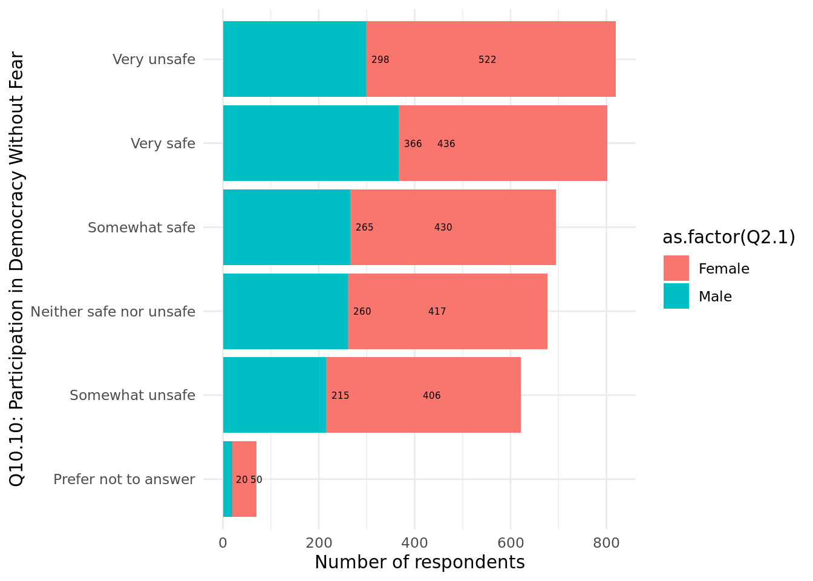

#### By county

<table class="table" style="width: auto !important; ">
 <thead>
  <tr>
   <th style="text-align:left;"> County </th>
   <th style="text-align:center;"> Mean Response (0 to 1) </th>
  </tr>
 </thead>
<tbody>
  <tr>
   <td style="text-align:left;"> Rubkona </td>
   <td style="text-align:center;"> 0.68 </td>
  </tr>
  <tr>
   <td style="text-align:left;"> Pibor </td>
   <td style="text-align:center;"> 0.60 </td>
  </tr>
  <tr>
   <td style="text-align:left;"> Bor South </td>
   <td style="text-align:center;"> 0.58 </td>
  </tr>
  <tr>
   <td style="text-align:left;"> Malakal </td>
   <td style="text-align:center;"> 0.55 </td>
  </tr>
  <tr>
   <td style="text-align:left;"> Lainya </td>
   <td style="text-align:center;"> 0.52 </td>
  </tr>
  <tr>
   <td style="text-align:left;"> Kajo-keji </td>
   <td style="text-align:center;"> 0.43 </td>
  </tr>
  <tr>
   <td style="text-align:left;"> Yei </td>
   <td style="text-align:center;"> 0.41 </td>
  </tr>
  <tr>
   <td style="text-align:left;"> Wau </td>
   <td style="text-align:center;"> 0.40 </td>
  </tr>
  <tr>
   <td style="text-align:left;"> Morobo </td>
   <td style="text-align:center;"> 0.29 </td>
  </tr>
</tbody>
</table>

<table class="table" style="width: auto !important; ">
 <thead>
  <tr>
   <th style="text-align:left;"> County </th>
   <th style="text-align:center;"> Response </th>
   <th style="text-align:left;"> Number of Responses </th>
   <th style="text-align:center;"> Percent of Total Responses in the county </th>
  </tr>
 </thead>
<tbody>
  <tr>
   <td style="text-align:left;"> Yei </td>
   <td style="text-align:center;"> Neither safe nor unsafe </td>
   <td style="text-align:left;"> 89 </td>
   <td style="text-align:center;"> 0.22 </td>
  </tr>
  <tr>
   <td style="text-align:left;"> Yei </td>
   <td style="text-align:center;"> Prefer not to answer </td>
   <td style="text-align:left;"> 3 </td>
   <td style="text-align:center;"> 0.01 </td>
  </tr>
  <tr>
   <td style="text-align:left;"> Yei </td>
   <td style="text-align:center;"> Somewhat safe </td>
   <td style="text-align:left;"> 132 </td>
   <td style="text-align:center;"> 0.32 </td>
  </tr>
  <tr>
   <td style="text-align:left;"> Yei </td>
   <td style="text-align:center;"> Somewhat unsafe </td>
   <td style="text-align:left;"> 66 </td>
   <td style="text-align:center;"> 0.16 </td>
  </tr>
  <tr>
   <td style="text-align:left;"> Yei </td>
   <td style="text-align:center;"> Very safe </td>
   <td style="text-align:left;"> 81 </td>
   <td style="text-align:center;"> 0.20 </td>
  </tr>
  <tr>
   <td style="text-align:left;"> Yei </td>
   <td style="text-align:center;"> Very unsafe </td>
   <td style="text-align:left;"> 39 </td>
   <td style="text-align:center;"> 0.10 </td>
  </tr>
  <tr>
   <td style="text-align:left;"> Wau </td>
   <td style="text-align:center;"> Neither safe nor unsafe </td>
   <td style="text-align:left;"> 105 </td>
   <td style="text-align:center;"> 0.26 </td>
  </tr>
  <tr>
   <td style="text-align:left;"> Wau </td>
   <td style="text-align:center;"> Prefer not to answer </td>
   <td style="text-align:left;"> 38 </td>
   <td style="text-align:center;"> 0.09 </td>
  </tr>
  <tr>
   <td style="text-align:left;"> Wau </td>
   <td style="text-align:center;"> Somewhat safe </td>
   <td style="text-align:left;"> 107 </td>
   <td style="text-align:center;"> 0.27 </td>
  </tr>
  <tr>
   <td style="text-align:left;"> Wau </td>
   <td style="text-align:center;"> Somewhat unsafe </td>
   <td style="text-align:left;"> 57 </td>
   <td style="text-align:center;"> 0.14 </td>
  </tr>
  <tr>
   <td style="text-align:left;"> Wau </td>
   <td style="text-align:center;"> Very safe </td>
   <td style="text-align:left;"> 73 </td>
   <td style="text-align:center;"> 0.18 </td>
  </tr>
  <tr>
   <td style="text-align:left;"> Wau </td>
   <td style="text-align:center;"> Very unsafe </td>
   <td style="text-align:left;"> 22 </td>
   <td style="text-align:center;"> 0.05 </td>
  </tr>
  <tr>
   <td style="text-align:left;"> Rubkona </td>
   <td style="text-align:center;"> Neither safe nor unsafe </td>
   <td style="text-align:left;"> 48 </td>
   <td style="text-align:center;"> 0.12 </td>
  </tr>
  <tr>
   <td style="text-align:left;"> Rubkona </td>
   <td style="text-align:center;"> Prefer not to answer </td>
   <td style="text-align:left;"> 4 </td>
   <td style="text-align:center;"> 0.01 </td>
  </tr>
  <tr>
   <td style="text-align:left;"> Rubkona </td>
   <td style="text-align:center;"> Somewhat safe </td>
   <td style="text-align:left;"> 56 </td>
   <td style="text-align:center;"> 0.14 </td>
  </tr>
  <tr>
   <td style="text-align:left;"> Rubkona </td>
   <td style="text-align:center;"> Somewhat unsafe </td>
   <td style="text-align:left;"> 84 </td>
   <td style="text-align:center;"> 0.21 </td>
  </tr>
  <tr>
   <td style="text-align:left;"> Rubkona </td>
   <td style="text-align:center;"> Very safe </td>
   <td style="text-align:left;"> 38 </td>
   <td style="text-align:center;"> 0.10 </td>
  </tr>
  <tr>
   <td style="text-align:left;"> Rubkona </td>
   <td style="text-align:center;"> Very unsafe </td>
   <td style="text-align:left;"> 170 </td>
   <td style="text-align:center;"> 0.42 </td>
  </tr>
  <tr>
   <td style="text-align:left;"> Pibor </td>
   <td style="text-align:center;"> Neither safe nor unsafe </td>
   <td style="text-align:left;"> 85 </td>
   <td style="text-align:center;"> 0.21 </td>
  </tr>
  <tr>
   <td style="text-align:left;"> Pibor </td>
   <td style="text-align:center;"> Prefer not to answer </td>
   <td style="text-align:left;"> 6 </td>
   <td style="text-align:center;"> 0.01 </td>
  </tr>
  <tr>
   <td style="text-align:left;"> Pibor </td>
   <td style="text-align:center;"> Somewhat safe </td>
   <td style="text-align:left;"> 60 </td>
   <td style="text-align:center;"> 0.15 </td>
  </tr>
  <tr>
   <td style="text-align:left;"> Pibor </td>
   <td style="text-align:center;"> Somewhat unsafe </td>
   <td style="text-align:left;"> 137 </td>
   <td style="text-align:center;"> 0.34 </td>
  </tr>
  <tr>
   <td style="text-align:left;"> Pibor </td>
   <td style="text-align:center;"> Very safe </td>
   <td style="text-align:left;"> 40 </td>
   <td style="text-align:center;"> 0.10 </td>
  </tr>
  <tr>
   <td style="text-align:left;"> Pibor </td>
   <td style="text-align:center;"> Very unsafe </td>
   <td style="text-align:left;"> 79 </td>
   <td style="text-align:center;"> 0.19 </td>
  </tr>
  <tr>
   <td style="text-align:left;"> Morobo </td>
   <td style="text-align:center;"> Neither safe nor unsafe </td>
   <td style="text-align:left;"> 43 </td>
   <td style="text-align:center;"> 0.11 </td>
  </tr>
  <tr>
   <td style="text-align:left;"> Morobo </td>
   <td style="text-align:center;"> Somewhat safe </td>
   <td style="text-align:left;"> 52 </td>
   <td style="text-align:center;"> 0.13 </td>
  </tr>
  <tr>
   <td style="text-align:left;"> Morobo </td>
   <td style="text-align:center;"> Somewhat unsafe </td>
   <td style="text-align:left;"> 42 </td>
   <td style="text-align:center;"> 0.10 </td>
  </tr>
  <tr>
   <td style="text-align:left;"> Morobo </td>
   <td style="text-align:center;"> Very safe </td>
   <td style="text-align:left;"> 215 </td>
   <td style="text-align:center;"> 0.53 </td>
  </tr>
  <tr>
   <td style="text-align:left;"> Morobo </td>
   <td style="text-align:center;"> Very unsafe </td>
   <td style="text-align:left;"> 52 </td>
   <td style="text-align:center;"> 0.13 </td>
  </tr>
  <tr>
   <td style="text-align:left;"> Malakal </td>
   <td style="text-align:center;"> Neither safe nor unsafe </td>
   <td style="text-align:left;"> 75 </td>
   <td style="text-align:center;"> 0.18 </td>
  </tr>
  <tr>
   <td style="text-align:left;"> Malakal </td>
   <td style="text-align:center;"> Prefer not to answer </td>
   <td style="text-align:left;"> 2 </td>
   <td style="text-align:center;"> 0.00 </td>
  </tr>
  <tr>
   <td style="text-align:left;"> Malakal </td>
   <td style="text-align:center;"> Somewhat safe </td>
   <td style="text-align:left;"> 150 </td>
   <td style="text-align:center;"> 0.36 </td>
  </tr>
  <tr>
   <td style="text-align:left;"> Malakal </td>
   <td style="text-align:center;"> Somewhat unsafe </td>
   <td style="text-align:left;"> 69 </td>
   <td style="text-align:center;"> 0.16 </td>
  </tr>
  <tr>
   <td style="text-align:left;"> Malakal </td>
   <td style="text-align:center;"> Very safe </td>
   <td style="text-align:left;"> 21 </td>
   <td style="text-align:center;"> 0.05 </td>
  </tr>
  <tr>
   <td style="text-align:left;"> Malakal </td>
   <td style="text-align:center;"> Very unsafe </td>
   <td style="text-align:left;"> 104 </td>
   <td style="text-align:center;"> 0.25 </td>
  </tr>
  <tr>
   <td style="text-align:left;"> Lainya </td>
   <td style="text-align:center;"> Neither safe nor unsafe </td>
   <td style="text-align:left;"> 88 </td>
   <td style="text-align:center;"> 0.21 </td>
  </tr>
  <tr>
   <td style="text-align:left;"> Lainya </td>
   <td style="text-align:center;"> Prefer not to answer </td>
   <td style="text-align:left;"> 8 </td>
   <td style="text-align:center;"> 0.02 </td>
  </tr>
  <tr>
   <td style="text-align:left;"> Lainya </td>
   <td style="text-align:center;"> Somewhat safe </td>
   <td style="text-align:left;"> 43 </td>
   <td style="text-align:center;"> 0.10 </td>
  </tr>
  <tr>
   <td style="text-align:left;"> Lainya </td>
   <td style="text-align:center;"> Somewhat unsafe </td>
   <td style="text-align:left;"> 50 </td>
   <td style="text-align:center;"> 0.12 </td>
  </tr>
  <tr>
   <td style="text-align:left;"> Lainya </td>
   <td style="text-align:center;"> Very safe </td>
   <td style="text-align:left;"> 105 </td>
   <td style="text-align:center;"> 0.25 </td>
  </tr>
  <tr>
   <td style="text-align:left;"> Lainya </td>
   <td style="text-align:center;"> Very unsafe </td>
   <td style="text-align:left;"> 120 </td>
   <td style="text-align:center;"> 0.29 </td>
  </tr>
  <tr>
   <td style="text-align:left;"> Kajo-keji </td>
   <td style="text-align:center;"> Neither safe nor unsafe </td>
   <td style="text-align:left;"> 48 </td>
   <td style="text-align:center;"> 0.12 </td>
  </tr>
  <tr>
   <td style="text-align:left;"> Kajo-keji </td>
   <td style="text-align:center;"> Prefer not to answer </td>
   <td style="text-align:left;"> 5 </td>
   <td style="text-align:center;"> 0.01 </td>
  </tr>
  <tr>
   <td style="text-align:left;"> Kajo-keji </td>
   <td style="text-align:center;"> Somewhat safe </td>
   <td style="text-align:left;"> 66 </td>
   <td style="text-align:center;"> 0.17 </td>
  </tr>
  <tr>
   <td style="text-align:left;"> Kajo-keji </td>
   <td style="text-align:center;"> Somewhat unsafe </td>
   <td style="text-align:left;"> 45 </td>
   <td style="text-align:center;"> 0.11 </td>
  </tr>
  <tr>
   <td style="text-align:left;"> Kajo-keji </td>
   <td style="text-align:center;"> Very safe </td>
   <td style="text-align:left;"> 140 </td>
   <td style="text-align:center;"> 0.35 </td>
  </tr>
  <tr>
   <td style="text-align:left;"> Kajo-keji </td>
   <td style="text-align:center;"> Very unsafe </td>
   <td style="text-align:left;"> 94 </td>
   <td style="text-align:center;"> 0.24 </td>
  </tr>
  <tr>
   <td style="text-align:left;"> Bor South </td>
   <td style="text-align:center;"> Neither safe nor unsafe </td>
   <td style="text-align:left;"> 96 </td>
   <td style="text-align:center;"> 0.22 </td>
  </tr>
  <tr>
   <td style="text-align:left;"> Bor South </td>
   <td style="text-align:center;"> Prefer not to answer </td>
   <td style="text-align:left;"> 4 </td>
   <td style="text-align:center;"> 0.01 </td>
  </tr>
  <tr>
   <td style="text-align:left;"> Bor South </td>
   <td style="text-align:center;"> Somewhat safe </td>
   <td style="text-align:left;"> 29 </td>
   <td style="text-align:center;"> 0.07 </td>
  </tr>
  <tr>
   <td style="text-align:left;"> Bor South </td>
   <td style="text-align:center;"> Somewhat unsafe </td>
   <td style="text-align:left;"> 71 </td>
   <td style="text-align:center;"> 0.17 </td>
  </tr>
  <tr>
   <td style="text-align:left;"> Bor South </td>
   <td style="text-align:center;"> Very safe </td>
   <td style="text-align:left;"> 89 </td>
   <td style="text-align:center;"> 0.21 </td>
  </tr>
  <tr>
   <td style="text-align:left;"> Bor South </td>
   <td style="text-align:center;"> Very unsafe </td>
   <td style="text-align:left;"> 140 </td>
   <td style="text-align:center;"> 0.33 </td>
  </tr>
</tbody>
</table>

### Q10.12: At present, how safe do you feel speaking publicly on politically sensitive issues? {.tabset}

0 - very safe

0.25 - safe

0.5 - neither safe nor unsafe

0.75 - unsafe

1 - very unsafe

#### Entire sample

<table class="table" style="width: auto !important; ">
 <thead>
  <tr>
   <th style="text-align:left;"> mean </th>
  </tr>
 </thead>
<tbody>
  <tr>
   <td style="text-align:left;"> 0.6 </td>
  </tr>
</tbody>
</table>

<table class="table" style="width: auto !important; ">
 <thead>
  <tr>
   <th style="text-align:left;"> Response </th>
   <th style="text-align:center;"> Number of Responses </th>
   <th style="text-align:left;"> Percent of Total Responses </th>
  </tr>
 </thead>
<tbody>
  <tr>
   <td style="text-align:left;"> Unsafe </td>
   <td style="text-align:center;"> 1093 </td>
   <td style="text-align:left;"> 0.30 </td>
  </tr>
  <tr>
   <td style="text-align:left;"> Very unsafe </td>
   <td style="text-align:center;"> 833 </td>
   <td style="text-align:left;"> 0.23 </td>
  </tr>
  <tr>
   <td style="text-align:left;"> Safe </td>
   <td style="text-align:center;"> 810 </td>
   <td style="text-align:left;"> 0.22 </td>
  </tr>
  <tr>
   <td style="text-align:left;"> Neither safe nor unsafe </td>
   <td style="text-align:center;"> 641 </td>
   <td style="text-align:left;"> 0.17 </td>
  </tr>
  <tr>
   <td style="text-align:left;"> Very safe </td>
   <td style="text-align:center;"> 238 </td>
   <td style="text-align:left;"> 0.06 </td>
  </tr>
  <tr>
   <td style="text-align:left;"> Prefer not to answer </td>
   <td style="text-align:center;"> 70 </td>
   <td style="text-align:left;"> 0.02 </td>
  </tr>
</tbody>
</table>

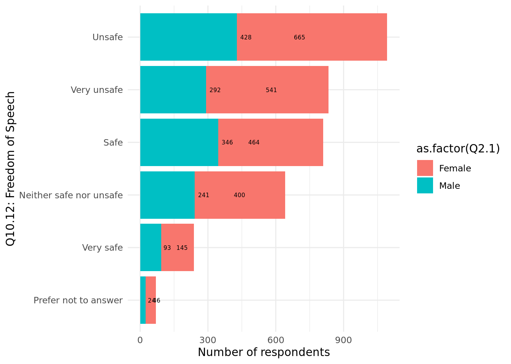

#### By county

<table class="table" style="width: auto !important; ">
 <thead>
  <tr>
   <th style="text-align:left;"> County </th>
   <th style="text-align:center;"> Mean Response (0 to 1) </th>
  </tr>
 </thead>
<tbody>
  <tr>
   <td style="text-align:left;"> Rubkona </td>
   <td style="text-align:center;"> 0.71 </td>
  </tr>
  <tr>
   <td style="text-align:left;"> Bor South </td>
   <td style="text-align:center;"> 0.69 </td>
  </tr>
  <tr>
   <td style="text-align:left;"> Kajo-keji </td>
   <td style="text-align:center;"> 0.65 </td>
  </tr>
  <tr>
   <td style="text-align:left;"> Malakal </td>
   <td style="text-align:center;"> 0.61 </td>
  </tr>
  <tr>
   <td style="text-align:left;"> Wau </td>
   <td style="text-align:center;"> 0.57 </td>
  </tr>
  <tr>
   <td style="text-align:left;"> Lainya </td>
   <td style="text-align:center;"> 0.57 </td>
  </tr>
  <tr>
   <td style="text-align:left;"> Morobo </td>
   <td style="text-align:center;"> 0.56 </td>
  </tr>
  <tr>
   <td style="text-align:left;"> Pibor </td>
   <td style="text-align:center;"> 0.54 </td>
  </tr>
  <tr>
   <td style="text-align:left;"> Yei </td>
   <td style="text-align:center;"> 0.53 </td>
  </tr>
</tbody>
</table>

<table class="table" style="width: auto !important; ">
 <thead>
  <tr>
   <th style="text-align:left;"> County </th>
   <th style="text-align:center;"> Response </th>
   <th style="text-align:left;"> Number of Responses </th>
   <th style="text-align:center;"> Percent of Total Responses in the county </th>
  </tr>
 </thead>
<tbody>
  <tr>
   <td style="text-align:left;"> Yei </td>
   <td style="text-align:center;"> Neither safe nor unsafe </td>
   <td style="text-align:left;"> 103 </td>
   <td style="text-align:center;"> 0.25 </td>
  </tr>
  <tr>
   <td style="text-align:left;"> Yei </td>
   <td style="text-align:center;"> Prefer not to answer </td>
   <td style="text-align:left;"> 5 </td>
   <td style="text-align:center;"> 0.01 </td>
  </tr>
  <tr>
   <td style="text-align:left;"> Yei </td>
   <td style="text-align:center;"> Safe </td>
   <td style="text-align:left;"> 117 </td>
   <td style="text-align:center;"> 0.29 </td>
  </tr>
  <tr>
   <td style="text-align:left;"> Yei </td>
   <td style="text-align:center;"> Unsafe </td>
   <td style="text-align:left;"> 151 </td>
   <td style="text-align:center;"> 0.37 </td>
  </tr>
  <tr>
   <td style="text-align:left;"> Yei </td>
   <td style="text-align:center;"> Very safe </td>
   <td style="text-align:left;"> 12 </td>
   <td style="text-align:center;"> 0.03 </td>
  </tr>
  <tr>
   <td style="text-align:left;"> Yei </td>
   <td style="text-align:center;"> Very unsafe </td>
   <td style="text-align:left;"> 22 </td>
   <td style="text-align:center;"> 0.05 </td>
  </tr>
  <tr>
   <td style="text-align:left;"> Wau </td>
   <td style="text-align:center;"> Neither safe nor unsafe </td>
   <td style="text-align:left;"> 78 </td>
   <td style="text-align:center;"> 0.19 </td>
  </tr>
  <tr>
   <td style="text-align:left;"> Wau </td>
   <td style="text-align:center;"> Prefer not to answer </td>
   <td style="text-align:left;"> 44 </td>
   <td style="text-align:center;"> 0.11 </td>
  </tr>
  <tr>
   <td style="text-align:left;"> Wau </td>
   <td style="text-align:center;"> Safe </td>
   <td style="text-align:left;"> 79 </td>
   <td style="text-align:center;"> 0.20 </td>
  </tr>
  <tr>
   <td style="text-align:left;"> Wau </td>
   <td style="text-align:center;"> Unsafe </td>
   <td style="text-align:left;"> 139 </td>
   <td style="text-align:center;"> 0.35 </td>
  </tr>
  <tr>
   <td style="text-align:left;"> Wau </td>
   <td style="text-align:center;"> Very safe </td>
   <td style="text-align:left;"> 22 </td>
   <td style="text-align:center;"> 0.05 </td>
  </tr>
  <tr>
   <td style="text-align:left;"> Wau </td>
   <td style="text-align:center;"> Very unsafe </td>
   <td style="text-align:left;"> 40 </td>
   <td style="text-align:center;"> 0.10 </td>
  </tr>
  <tr>
   <td style="text-align:left;"> Rubkona </td>
   <td style="text-align:center;"> Neither safe nor unsafe </td>
   <td style="text-align:left;"> 40 </td>
   <td style="text-align:center;"> 0.10 </td>
  </tr>
  <tr>
   <td style="text-align:left;"> Rubkona </td>
   <td style="text-align:center;"> Prefer not to answer </td>
   <td style="text-align:left;"> 2 </td>
   <td style="text-align:center;"> 0.00 </td>
  </tr>
  <tr>
   <td style="text-align:left;"> Rubkona </td>
   <td style="text-align:center;"> Safe </td>
   <td style="text-align:left;"> 56 </td>
   <td style="text-align:center;"> 0.14 </td>
  </tr>
  <tr>
   <td style="text-align:left;"> Rubkona </td>
   <td style="text-align:center;"> Unsafe </td>
   <td style="text-align:left;"> 89 </td>
   <td style="text-align:center;"> 0.22 </td>
  </tr>
  <tr>
   <td style="text-align:left;"> Rubkona </td>
   <td style="text-align:center;"> Very safe </td>
   <td style="text-align:left;"> 33 </td>
   <td style="text-align:center;"> 0.08 </td>
  </tr>
  <tr>
   <td style="text-align:left;"> Rubkona </td>
   <td style="text-align:center;"> Very unsafe </td>
   <td style="text-align:left;"> 180 </td>
   <td style="text-align:center;"> 0.45 </td>
  </tr>
  <tr>
   <td style="text-align:left;"> Pibor </td>
   <td style="text-align:center;"> Neither safe nor unsafe </td>
   <td style="text-align:left;"> 110 </td>
   <td style="text-align:center;"> 0.27 </td>
  </tr>
  <tr>
   <td style="text-align:left;"> Pibor </td>
   <td style="text-align:center;"> Prefer not to answer </td>
   <td style="text-align:left;"> 7 </td>
   <td style="text-align:center;"> 0.02 </td>
  </tr>
  <tr>
   <td style="text-align:left;"> Pibor </td>
   <td style="text-align:center;"> Safe </td>
   <td style="text-align:left;"> 115 </td>
   <td style="text-align:center;"> 0.28 </td>
  </tr>
  <tr>
   <td style="text-align:left;"> Pibor </td>
   <td style="text-align:center;"> Unsafe </td>
   <td style="text-align:left;"> 140 </td>
   <td style="text-align:center;"> 0.34 </td>
  </tr>
  <tr>
   <td style="text-align:left;"> Pibor </td>
   <td style="text-align:center;"> Very safe </td>
   <td style="text-align:left;"> 8 </td>
   <td style="text-align:center;"> 0.02 </td>
  </tr>
  <tr>
   <td style="text-align:left;"> Pibor </td>
   <td style="text-align:center;"> Very unsafe </td>
   <td style="text-align:left;"> 27 </td>
   <td style="text-align:center;"> 0.07 </td>
  </tr>
  <tr>
   <td style="text-align:left;"> Morobo </td>
   <td style="text-align:center;"> Neither safe nor unsafe </td>
   <td style="text-align:left;"> 40 </td>
   <td style="text-align:center;"> 0.10 </td>
  </tr>
  <tr>
   <td style="text-align:left;"> Morobo </td>
   <td style="text-align:center;"> Prefer not to answer </td>
   <td style="text-align:left;"> 1 </td>
   <td style="text-align:center;"> 0.00 </td>
  </tr>
  <tr>
   <td style="text-align:left;"> Morobo </td>
   <td style="text-align:center;"> Safe </td>
   <td style="text-align:left;"> 127 </td>
   <td style="text-align:center;"> 0.31 </td>
  </tr>
  <tr>
   <td style="text-align:left;"> Morobo </td>
   <td style="text-align:center;"> Unsafe </td>
   <td style="text-align:left;"> 75 </td>
   <td style="text-align:center;"> 0.19 </td>
  </tr>
  <tr>
   <td style="text-align:left;"> Morobo </td>
   <td style="text-align:center;"> Very safe </td>
   <td style="text-align:left;"> 45 </td>
   <td style="text-align:center;"> 0.11 </td>
  </tr>
  <tr>
   <td style="text-align:left;"> Morobo </td>
   <td style="text-align:center;"> Very unsafe </td>
   <td style="text-align:left;"> 116 </td>
   <td style="text-align:center;"> 0.29 </td>
  </tr>
  <tr>
   <td style="text-align:left;"> Malakal </td>
   <td style="text-align:center;"> Neither safe nor unsafe </td>
   <td style="text-align:left;"> 73 </td>
   <td style="text-align:center;"> 0.17 </td>
  </tr>
  <tr>
   <td style="text-align:left;"> Malakal </td>
   <td style="text-align:center;"> Safe </td>
   <td style="text-align:left;"> 103 </td>
   <td style="text-align:center;"> 0.24 </td>
  </tr>
  <tr>
   <td style="text-align:left;"> Malakal </td>
   <td style="text-align:center;"> Unsafe </td>
   <td style="text-align:left;"> 175 </td>
   <td style="text-align:center;"> 0.42 </td>
  </tr>
  <tr>
   <td style="text-align:left;"> Malakal </td>
   <td style="text-align:center;"> Very safe </td>
   <td style="text-align:left;"> 8 </td>
   <td style="text-align:center;"> 0.02 </td>
  </tr>
  <tr>
   <td style="text-align:left;"> Malakal </td>
   <td style="text-align:center;"> Very unsafe </td>
   <td style="text-align:left;"> 62 </td>
   <td style="text-align:center;"> 0.15 </td>
  </tr>
  <tr>
   <td style="text-align:left;"> Lainya </td>
   <td style="text-align:center;"> Neither safe nor unsafe </td>
   <td style="text-align:left;"> 87 </td>
   <td style="text-align:center;"> 0.21 </td>
  </tr>
  <tr>
   <td style="text-align:left;"> Lainya </td>
   <td style="text-align:center;"> Prefer not to answer </td>
   <td style="text-align:left;"> 4 </td>
   <td style="text-align:center;"> 0.01 </td>
  </tr>
  <tr>
   <td style="text-align:left;"> Lainya </td>
   <td style="text-align:center;"> Safe </td>
   <td style="text-align:left;"> 89 </td>
   <td style="text-align:center;"> 0.21 </td>
  </tr>
  <tr>
   <td style="text-align:left;"> Lainya </td>
   <td style="text-align:center;"> Unsafe </td>
   <td style="text-align:left;"> 123 </td>
   <td style="text-align:center;"> 0.30 </td>
  </tr>
  <tr>
   <td style="text-align:left;"> Lainya </td>
   <td style="text-align:center;"> Very safe </td>
   <td style="text-align:left;"> 37 </td>
   <td style="text-align:center;"> 0.09 </td>
  </tr>
  <tr>
   <td style="text-align:left;"> Lainya </td>
   <td style="text-align:center;"> Very unsafe </td>
   <td style="text-align:left;"> 74 </td>
   <td style="text-align:center;"> 0.18 </td>
  </tr>
  <tr>
   <td style="text-align:left;"> Kajo-keji </td>
   <td style="text-align:center;"> Neither safe nor unsafe </td>
   <td style="text-align:left;"> 45 </td>
   <td style="text-align:center;"> 0.11 </td>
  </tr>
  <tr>
   <td style="text-align:left;"> Kajo-keji </td>
   <td style="text-align:center;"> Prefer not to answer </td>
   <td style="text-align:left;"> 5 </td>
   <td style="text-align:center;"> 0.01 </td>
  </tr>
  <tr>
   <td style="text-align:left;"> Kajo-keji </td>
   <td style="text-align:center;"> Safe </td>
   <td style="text-align:left;"> 69 </td>
   <td style="text-align:center;"> 0.17 </td>
  </tr>
  <tr>
   <td style="text-align:left;"> Kajo-keji </td>
   <td style="text-align:center;"> Unsafe </td>
   <td style="text-align:left;"> 61 </td>
   <td style="text-align:center;"> 0.15 </td>
  </tr>
  <tr>
   <td style="text-align:left;"> Kajo-keji </td>
   <td style="text-align:center;"> Very safe </td>
   <td style="text-align:left;"> 49 </td>
   <td style="text-align:center;"> 0.12 </td>
  </tr>
  <tr>
   <td style="text-align:left;"> Kajo-keji </td>
   <td style="text-align:center;"> Very unsafe </td>
   <td style="text-align:left;"> 169 </td>
   <td style="text-align:center;"> 0.42 </td>
  </tr>
  <tr>
   <td style="text-align:left;"> Bor South </td>
   <td style="text-align:center;"> Neither safe nor unsafe </td>
   <td style="text-align:left;"> 65 </td>
   <td style="text-align:center;"> 0.15 </td>
  </tr>
  <tr>
   <td style="text-align:left;"> Bor South </td>
   <td style="text-align:center;"> Prefer not to answer </td>
   <td style="text-align:left;"> 2 </td>
   <td style="text-align:center;"> 0.00 </td>
  </tr>
  <tr>
   <td style="text-align:left;"> Bor South </td>
   <td style="text-align:center;"> Safe </td>
   <td style="text-align:left;"> 55 </td>
   <td style="text-align:center;"> 0.13 </td>
  </tr>
  <tr>
   <td style="text-align:left;"> Bor South </td>
   <td style="text-align:center;"> Unsafe </td>
   <td style="text-align:left;"> 140 </td>
   <td style="text-align:center;"> 0.33 </td>
  </tr>
  <tr>
   <td style="text-align:left;"> Bor South </td>
   <td style="text-align:center;"> Very safe </td>
   <td style="text-align:left;"> 24 </td>
   <td style="text-align:center;"> 0.06 </td>
  </tr>
  <tr>
   <td style="text-align:left;"> Bor South </td>
   <td style="text-align:center;"> Very unsafe </td>
   <td style="text-align:left;"> 143 </td>
   <td style="text-align:center;"> 0.33 </td>
  </tr>
</tbody>
</table>

### Q10.13: Which of the following statements best describes the role that politicians in Juba play in your community? {.tabset}

0 - make community much more safe

0.25 - make community more safe

0.5 - make community neither more nor less safe

0.75 - make community less safe

1 - make community much less safe

#### Entire sample

<table class="table" style="width: auto !important; ">
 <thead>
  <tr>
   <th style="text-align:left;"> mean </th>
  </tr>
 </thead>
<tbody>
  <tr>
   <td style="text-align:left;"> 0.67 </td>
  </tr>
</tbody>
</table>

<table class="table" style="width: auto !important; ">
 <thead>
  <tr>
   <th style="text-align:left;"> Response </th>
   <th style="text-align:center;"> Number of Responses </th>
   <th style="text-align:left;"> Percent of Total Responses in the county </th>
  </tr>
 </thead>
<tbody>
  <tr>
   <td style="text-align:left;"> Politicians in Juba make this community much less safe </td>
   <td style="text-align:center;"> 1043 </td>
   <td style="text-align:left;"> 0.28 </td>
  </tr>
  <tr>
   <td style="text-align:left;"> Politicians in Juba make this community less safe </td>
   <td style="text-align:center;"> 943 </td>
   <td style="text-align:left;"> 0.26 </td>
  </tr>
  <tr>
   <td style="text-align:left;"> Politicians in Juba neither make this community more nor less safe </td>
   <td style="text-align:center;"> 867 </td>
   <td style="text-align:left;"> 0.24 </td>
  </tr>
  <tr>
   <td style="text-align:left;"> Politicians in Juba make this community more safe </td>
   <td style="text-align:center;"> 404 </td>
   <td style="text-align:left;"> 0.11 </td>
  </tr>
  <tr>
   <td style="text-align:left;"> Prefer not to answer </td>
   <td style="text-align:center;"> 283 </td>
   <td style="text-align:left;"> 0.08 </td>
  </tr>
  <tr>
   <td style="text-align:left;"> Politicians in Juba make this community much more safe </td>
   <td style="text-align:center;"> 145 </td>
   <td style="text-align:left;"> 0.04 </td>
  </tr>
</tbody>
</table>

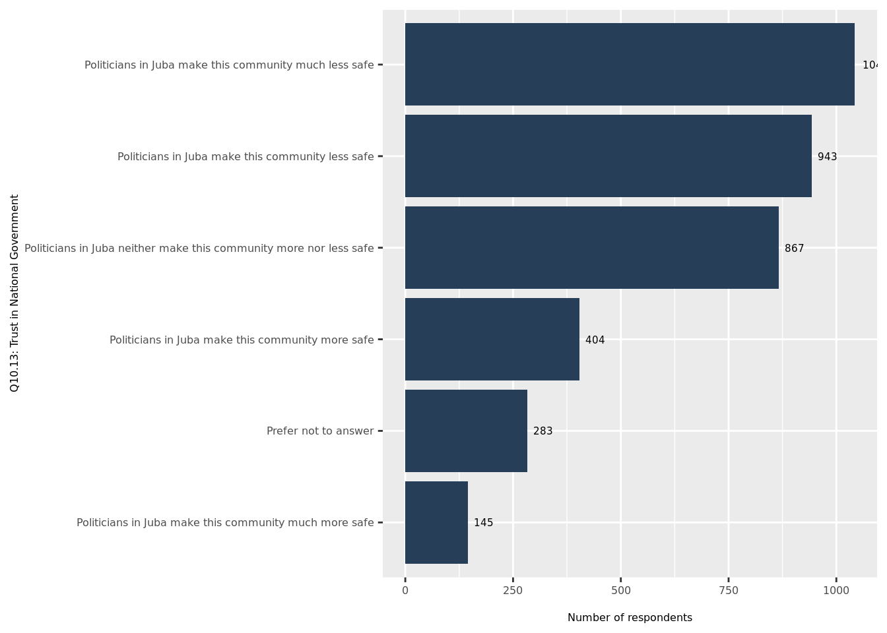

#### By county

<table class="table" style="width: auto !important; ">
 <thead>
  <tr>
   <th style="text-align:left;"> County </th>
   <th style="text-align:center;"> Mean Response (0 to 1) </th>
  </tr>
 </thead>
<tbody>
  <tr>
   <td style="text-align:left;"> Bor South </td>
   <td style="text-align:center;"> 0.76 </td>
  </tr>
  <tr>
   <td style="text-align:left;"> Rubkona </td>
   <td style="text-align:center;"> 0.76 </td>
  </tr>
  <tr>
   <td style="text-align:left;"> Yei </td>
   <td style="text-align:center;"> 0.75 </td>
  </tr>
  <tr>
   <td style="text-align:left;"> Malakal </td>
   <td style="text-align:center;"> 0.74 </td>
  </tr>
  <tr>
   <td style="text-align:left;"> Pibor </td>
   <td style="text-align:center;"> 0.67 </td>
  </tr>
  <tr>
   <td style="text-align:left;"> Morobo </td>
   <td style="text-align:center;"> 0.61 </td>
  </tr>
  <tr>
   <td style="text-align:left;"> Lainya </td>
   <td style="text-align:center;"> 0.58 </td>
  </tr>
  <tr>
   <td style="text-align:left;"> Kajo-keji </td>
   <td style="text-align:center;"> 0.56 </td>
  </tr>
  <tr>
   <td style="text-align:left;"> Wau </td>
   <td style="text-align:center;"> 0.54 </td>
  </tr>
</tbody>
</table>

<table class="table" style="width: auto !important; ">
 <thead>
  <tr>
   <th style="text-align:left;"> County </th>
   <th style="text-align:center;"> Response </th>
   <th style="text-align:left;"> Number of Responses </th>
   <th style="text-align:center;"> Percent of Total Responses </th>
  </tr>
 </thead>
<tbody>
  <tr>
   <td style="text-align:left;"> Yei </td>
   <td style="text-align:center;"> Politicians in Juba make this community less safe </td>
   <td style="text-align:left;"> 151 </td>
   <td style="text-align:center;"> 0.37 </td>
  </tr>
  <tr>
   <td style="text-align:left;"> Yei </td>
   <td style="text-align:center;"> Politicians in Juba make this community more safe </td>
   <td style="text-align:left;"> 23 </td>
   <td style="text-align:center;"> 0.06 </td>
  </tr>
  <tr>
   <td style="text-align:left;"> Yei </td>
   <td style="text-align:center;"> Politicians in Juba make this community much less safe </td>
   <td style="text-align:left;"> 145 </td>
   <td style="text-align:center;"> 0.35 </td>
  </tr>
  <tr>
   <td style="text-align:left;"> Yei </td>
   <td style="text-align:center;"> Politicians in Juba make this community much more safe </td>
   <td style="text-align:left;"> 7 </td>
   <td style="text-align:center;"> 0.02 </td>
  </tr>
  <tr>
   <td style="text-align:left;"> Yei </td>
   <td style="text-align:center;"> Politicians in Juba neither make this community more nor less safe </td>
   <td style="text-align:left;"> 78 </td>
   <td style="text-align:center;"> 0.19 </td>
  </tr>
  <tr>
   <td style="text-align:left;"> Yei </td>
   <td style="text-align:center;"> Prefer not to answer </td>
   <td style="text-align:left;"> 6 </td>
   <td style="text-align:center;"> 0.01 </td>
  </tr>
  <tr>
   <td style="text-align:left;"> Wau </td>
   <td style="text-align:center;"> Politicians in Juba make this community less safe </td>
   <td style="text-align:left;"> 65 </td>
   <td style="text-align:center;"> 0.16 </td>
  </tr>
  <tr>
   <td style="text-align:left;"> Wau </td>
   <td style="text-align:center;"> Politicians in Juba make this community more safe </td>
   <td style="text-align:left;"> 43 </td>
   <td style="text-align:center;"> 0.11 </td>
  </tr>
  <tr>
   <td style="text-align:left;"> Wau </td>
   <td style="text-align:center;"> Politicians in Juba make this community much less safe </td>
   <td style="text-align:left;"> 35 </td>
   <td style="text-align:center;"> 0.09 </td>
  </tr>
  <tr>
   <td style="text-align:left;"> Wau </td>
   <td style="text-align:center;"> Politicians in Juba make this community much more safe </td>
   <td style="text-align:left;"> 28 </td>
   <td style="text-align:center;"> 0.07 </td>
  </tr>
  <tr>
   <td style="text-align:left;"> Wau </td>
   <td style="text-align:center;"> Politicians in Juba neither make this community more nor less safe </td>
   <td style="text-align:left;"> 70 </td>
   <td style="text-align:center;"> 0.17 </td>
  </tr>
  <tr>
   <td style="text-align:left;"> Wau </td>
   <td style="text-align:center;"> Prefer not to answer </td>
   <td style="text-align:left;"> 161 </td>
   <td style="text-align:center;"> 0.40 </td>
  </tr>
  <tr>
   <td style="text-align:left;"> Rubkona </td>
   <td style="text-align:center;"> Politicians in Juba make this community less safe </td>
   <td style="text-align:left;"> 83 </td>
   <td style="text-align:center;"> 0.21 </td>
  </tr>
  <tr>
   <td style="text-align:left;"> Rubkona </td>
   <td style="text-align:center;"> Politicians in Juba make this community more safe </td>
   <td style="text-align:left;"> 26 </td>
   <td style="text-align:center;"> 0.06 </td>
  </tr>
  <tr>
   <td style="text-align:left;"> Rubkona </td>
   <td style="text-align:center;"> Politicians in Juba make this community much less safe </td>
   <td style="text-align:left;"> 182 </td>
   <td style="text-align:center;"> 0.46 </td>
  </tr>
  <tr>
   <td style="text-align:left;"> Rubkona </td>
   <td style="text-align:center;"> Politicians in Juba make this community much more safe </td>
   <td style="text-align:left;"> 4 </td>
   <td style="text-align:center;"> 0.01 </td>
  </tr>
  <tr>
   <td style="text-align:left;"> Rubkona </td>
   <td style="text-align:center;"> Politicians in Juba neither make this community more nor less safe </td>
   <td style="text-align:left;"> 100 </td>
   <td style="text-align:center;"> 0.25 </td>
  </tr>
  <tr>
   <td style="text-align:left;"> Rubkona </td>
   <td style="text-align:center;"> Prefer not to answer </td>
   <td style="text-align:left;"> 5 </td>
   <td style="text-align:center;"> 0.01 </td>
  </tr>
  <tr>
   <td style="text-align:left;"> Pibor </td>
   <td style="text-align:center;"> Politicians in Juba make this community less safe </td>
   <td style="text-align:left;"> 111 </td>
   <td style="text-align:center;"> 0.27 </td>
  </tr>
  <tr>
   <td style="text-align:left;"> Pibor </td>
   <td style="text-align:center;"> Politicians in Juba make this community more safe </td>
   <td style="text-align:left;"> 54 </td>
   <td style="text-align:center;"> 0.13 </td>
  </tr>
  <tr>
   <td style="text-align:left;"> Pibor </td>
   <td style="text-align:center;"> Politicians in Juba make this community much less safe </td>
   <td style="text-align:left;"> 126 </td>
   <td style="text-align:center;"> 0.31 </td>
  </tr>
  <tr>
   <td style="text-align:left;"> Pibor </td>
   <td style="text-align:center;"> Politicians in Juba make this community much more safe </td>
   <td style="text-align:left;"> 17 </td>
   <td style="text-align:center;"> 0.04 </td>
  </tr>
  <tr>
   <td style="text-align:left;"> Pibor </td>
   <td style="text-align:center;"> Politicians in Juba neither make this community more nor less safe </td>
   <td style="text-align:left;"> 91 </td>
   <td style="text-align:center;"> 0.22 </td>
  </tr>
  <tr>
   <td style="text-align:left;"> Pibor </td>
   <td style="text-align:center;"> Prefer not to answer </td>
   <td style="text-align:left;"> 8 </td>
   <td style="text-align:center;"> 0.02 </td>
  </tr>
  <tr>
   <td style="text-align:left;"> Morobo </td>
   <td style="text-align:center;"> Politicians in Juba make this community less safe </td>
   <td style="text-align:left;"> 93 </td>
   <td style="text-align:center;"> 0.23 </td>
  </tr>
  <tr>
   <td style="text-align:left;"> Morobo </td>
   <td style="text-align:center;"> Politicians in Juba make this community more safe </td>
   <td style="text-align:left;"> 55 </td>
   <td style="text-align:center;"> 0.14 </td>
  </tr>
  <tr>
   <td style="text-align:left;"> Morobo </td>
   <td style="text-align:center;"> Politicians in Juba make this community much less safe </td>
   <td style="text-align:left;"> 113 </td>
   <td style="text-align:center;"> 0.28 </td>
  </tr>
  <tr>
   <td style="text-align:left;"> Morobo </td>
   <td style="text-align:center;"> Politicians in Juba make this community much more safe </td>
   <td style="text-align:left;"> 46 </td>
   <td style="text-align:center;"> 0.11 </td>
  </tr>
  <tr>
   <td style="text-align:left;"> Morobo </td>
   <td style="text-align:center;"> Politicians in Juba neither make this community more nor less safe </td>
   <td style="text-align:left;"> 96 </td>
   <td style="text-align:center;"> 0.24 </td>
  </tr>
  <tr>
   <td style="text-align:left;"> Morobo </td>
   <td style="text-align:center;"> Prefer not to answer </td>
   <td style="text-align:left;"> 1 </td>
   <td style="text-align:center;"> 0.00 </td>
  </tr>
  <tr>
   <td style="text-align:left;"> Malakal </td>
   <td style="text-align:center;"> Politicians in Juba make this community less safe </td>
   <td style="text-align:left;"> 197 </td>
   <td style="text-align:center;"> 0.47 </td>
  </tr>
  <tr>
   <td style="text-align:left;"> Malakal </td>
   <td style="text-align:center;"> Politicians in Juba make this community more safe </td>
   <td style="text-align:left;"> 20 </td>
   <td style="text-align:center;"> 0.05 </td>
  </tr>
  <tr>
   <td style="text-align:left;"> Malakal </td>
   <td style="text-align:center;"> Politicians in Juba make this community much less safe </td>
   <td style="text-align:left;"> 117 </td>
   <td style="text-align:center;"> 0.28 </td>
  </tr>
  <tr>
   <td style="text-align:left;"> Malakal </td>
   <td style="text-align:center;"> Politicians in Juba neither make this community more nor less safe </td>
   <td style="text-align:left;"> 87 </td>
   <td style="text-align:center;"> 0.21 </td>
  </tr>
  <tr>
   <td style="text-align:left;"> Lainya </td>
   <td style="text-align:center;"> Politicians in Juba make this community less safe </td>
   <td style="text-align:left;"> 97 </td>
   <td style="text-align:center;"> 0.23 </td>
  </tr>
  <tr>
   <td style="text-align:left;"> Lainya </td>
   <td style="text-align:center;"> Politicians in Juba make this community more safe </td>
   <td style="text-align:left;"> 56 </td>
   <td style="text-align:center;"> 0.14 </td>
  </tr>
  <tr>
   <td style="text-align:left;"> Lainya </td>
   <td style="text-align:center;"> Politicians in Juba make this community much less safe </td>
   <td style="text-align:left;"> 68 </td>
   <td style="text-align:center;"> 0.16 </td>
  </tr>
  <tr>
   <td style="text-align:left;"> Lainya </td>
   <td style="text-align:center;"> Politicians in Juba make this community much more safe </td>
   <td style="text-align:left;"> 23 </td>
   <td style="text-align:center;"> 0.06 </td>
  </tr>
  <tr>
   <td style="text-align:left;"> Lainya </td>
   <td style="text-align:center;"> Politicians in Juba neither make this community more nor less safe </td>
   <td style="text-align:left;"> 155 </td>
   <td style="text-align:center;"> 0.37 </td>
  </tr>
  <tr>
   <td style="text-align:left;"> Lainya </td>
   <td style="text-align:center;"> Prefer not to answer </td>
   <td style="text-align:left;"> 15 </td>
   <td style="text-align:center;"> 0.04 </td>
  </tr>
  <tr>
   <td style="text-align:left;"> Kajo-keji </td>
   <td style="text-align:center;"> Politicians in Juba make this community less safe </td>
   <td style="text-align:left;"> 65 </td>
   <td style="text-align:center;"> 0.16 </td>
  </tr>
  <tr>
   <td style="text-align:left;"> Kajo-keji </td>
   <td style="text-align:center;"> Politicians in Juba make this community more safe </td>
   <td style="text-align:left;"> 110 </td>
   <td style="text-align:center;"> 0.28 </td>
  </tr>
  <tr>
   <td style="text-align:left;"> Kajo-keji </td>
   <td style="text-align:center;"> Politicians in Juba make this community much less safe </td>
   <td style="text-align:left;"> 83 </td>
   <td style="text-align:center;"> 0.21 </td>
  </tr>
  <tr>
   <td style="text-align:left;"> Kajo-keji </td>
   <td style="text-align:center;"> Politicians in Juba make this community much more safe </td>
   <td style="text-align:left;"> 14 </td>
   <td style="text-align:center;"> 0.04 </td>
  </tr>
  <tr>
   <td style="text-align:left;"> Kajo-keji </td>
   <td style="text-align:center;"> Politicians in Juba neither make this community more nor less safe </td>
   <td style="text-align:left;"> 89 </td>
   <td style="text-align:center;"> 0.22 </td>
  </tr>
  <tr>
   <td style="text-align:left;"> Kajo-keji </td>
   <td style="text-align:center;"> Prefer not to answer </td>
   <td style="text-align:left;"> 37 </td>
   <td style="text-align:center;"> 0.09 </td>
  </tr>
  <tr>
   <td style="text-align:left;"> Bor South </td>
   <td style="text-align:center;"> Politicians in Juba make this community less safe </td>
   <td style="text-align:left;"> 81 </td>
   <td style="text-align:center;"> 0.19 </td>
  </tr>
  <tr>
   <td style="text-align:left;"> Bor South </td>
   <td style="text-align:center;"> Politicians in Juba make this community more safe </td>
   <td style="text-align:left;"> 17 </td>
   <td style="text-align:center;"> 0.04 </td>
  </tr>
  <tr>
   <td style="text-align:left;"> Bor South </td>
   <td style="text-align:center;"> Politicians in Juba make this community much less safe </td>
   <td style="text-align:left;"> 174 </td>
   <td style="text-align:center;"> 0.41 </td>
  </tr>
  <tr>
   <td style="text-align:left;"> Bor South </td>
   <td style="text-align:center;"> Politicians in Juba make this community much more safe </td>
   <td style="text-align:left;"> 6 </td>
   <td style="text-align:center;"> 0.01 </td>
  </tr>
  <tr>
   <td style="text-align:left;"> Bor South </td>
   <td style="text-align:center;"> Politicians in Juba neither make this community more nor less safe </td>
   <td style="text-align:left;"> 101 </td>
   <td style="text-align:center;"> 0.24 </td>
  </tr>
  <tr>
   <td style="text-align:left;"> Bor South </td>
   <td style="text-align:center;"> Prefer not to answer </td>
   <td style="text-align:left;"> 50 </td>
   <td style="text-align:center;"> 0.12 </td>
  </tr>
</tbody>
</table>

## 

# Additional Political/Legal Descriptive Questions

### Q9.8 **How much do you think the following policies would contribute to long-term peace in South Sudan, on a scale from 1 through 5 where 1 means “makes peace much less likely” and 5 means “makes peace much more likely.”** {.tabset}

Makes peace much less likely\
Makes peace less likely\
Has no effect on peace\
Makes peace more likely\
Makes peace much more likely\
Prefer not to answer

### **Q9.8.1 Dialogues between community members**

#### Entire sample


```
## Warning: There was 1 warning in `summarize()`.
## ℹ In argument: `mean = mean(Q9.8.1, na.rm = TRUE)`.
## Caused by warning in `mean.default()`:
## ! argument is not numeric or logical: returning NA
```

<table class="table" style="width: auto !important; ">
 <thead>
  <tr>
   <th style="text-align:left;"> mean </th>
  </tr>
 </thead>
<tbody>
  <tr>
   <td style="text-align:left;"> NA </td>
  </tr>
</tbody>
</table>

<table class="table" style="width: auto !important; ">
 <thead>
  <tr>
   <th style="text-align:left;"> Most Common Response </th>
   <th style="text-align:center;"> Number of Responses </th>
   <th style="text-align:left;"> Percent of Total Responses </th>
  </tr>
 </thead>
<tbody>
  <tr>
   <td style="text-align:left;"> Makes peace more likely </td>
   <td style="text-align:center;"> 1850 </td>
   <td style="text-align:left;"> 100 </td>
  </tr>
</tbody>
</table>

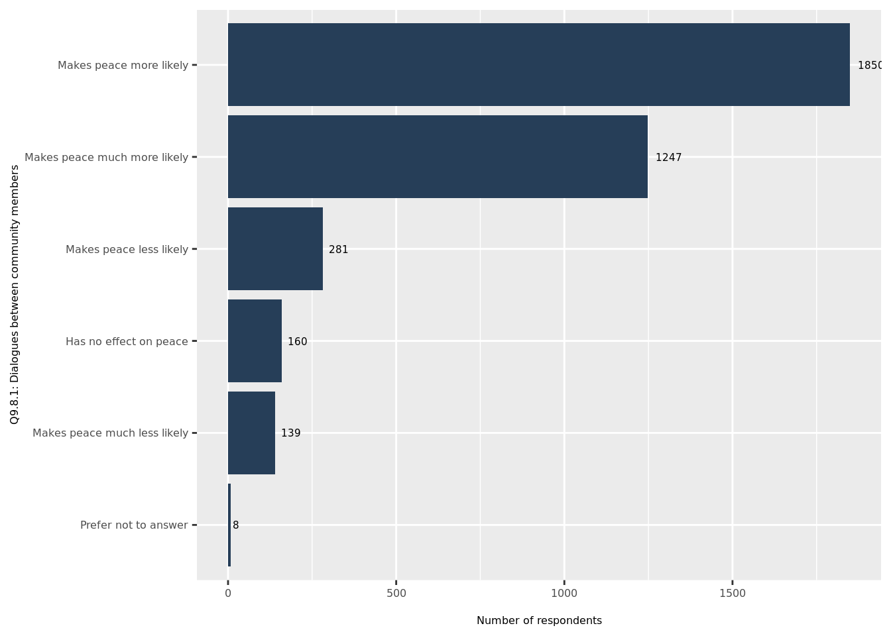

#### By county

<table class="table" style="width: auto !important; ">
 <thead>
  <tr>
   <th style="text-align:left;"> County </th>
   <th style="text-align:center;"> Most Common Response </th>
   <th style="text-align:left;"> Number of Responses </th>
   <th style="text-align:center;"> Percent of Total Responses </th>
  </tr>
 </thead>
<tbody>
  <tr>
   <td style="text-align:left;"> Bor South </td>
   <td style="text-align:center;"> Makes peace much more likely </td>
   <td style="text-align:left;"> 213 </td>
   <td style="text-align:center;"> 100 </td>
  </tr>
  <tr>
   <td style="text-align:left;"> Kajo-keji </td>
   <td style="text-align:center;"> Makes peace more likely </td>
   <td style="text-align:left;"> 194 </td>
   <td style="text-align:center;"> 100 </td>
  </tr>
  <tr>
   <td style="text-align:left;"> Lainya </td>
   <td style="text-align:center;"> Makes peace more likely </td>
   <td style="text-align:left;"> 193 </td>
   <td style="text-align:center;"> 100 </td>
  </tr>
  <tr>
   <td style="text-align:left;"> Malakal </td>
   <td style="text-align:center;"> Makes peace more likely </td>
   <td style="text-align:left;"> 287 </td>
   <td style="text-align:center;"> 100 </td>
  </tr>
  <tr>
   <td style="text-align:left;"> Morobo </td>
   <td style="text-align:center;"> Makes peace more likely </td>
   <td style="text-align:left;"> 172 </td>
   <td style="text-align:center;"> 100 </td>
  </tr>
  <tr>
   <td style="text-align:left;"> Pibor </td>
   <td style="text-align:center;"> Makes peace more likely </td>
   <td style="text-align:left;"> 234 </td>
   <td style="text-align:center;"> 100 </td>
  </tr>
  <tr>
   <td style="text-align:left;"> Rubkona </td>
   <td style="text-align:center;"> Makes peace much more likely </td>
   <td style="text-align:left;"> 204 </td>
   <td style="text-align:center;"> 100 </td>
  </tr>
  <tr>
   <td style="text-align:left;"> Wau </td>
   <td style="text-align:center;"> Makes peace more likely </td>
   <td style="text-align:left;"> 173 </td>
   <td style="text-align:center;"> 100 </td>
  </tr>
  <tr>
   <td style="text-align:left;"> Yei </td>
   <td style="text-align:center;"> Makes peace more likely </td>
   <td style="text-align:left;"> 278 </td>
   <td style="text-align:center;"> 100 </td>
  </tr>
</tbody>
</table>

<table class="table" style="width: auto !important; ">
 <thead>
  <tr>
   <th style="text-align:left;"> County </th>
   <th style="text-align:center;"> Response </th>
   <th style="text-align:left;"> Number of Responses </th>
   <th style="text-align:center;"> Percent of Total Responses </th>
  </tr>
 </thead>
<tbody>
  <tr>
   <td style="text-align:left;"> Yei </td>
   <td style="text-align:center;"> Has no effect on peace </td>
   <td style="text-align:left;"> 19 </td>
   <td style="text-align:center;"> 0.05 </td>
  </tr>
  <tr>
   <td style="text-align:left;"> Yei </td>
   <td style="text-align:center;"> Makes peace less likely </td>
   <td style="text-align:left;"> 44 </td>
   <td style="text-align:center;"> 0.11 </td>
  </tr>
  <tr>
   <td style="text-align:left;"> Yei </td>
   <td style="text-align:center;"> Makes peace more likely </td>
   <td style="text-align:left;"> 278 </td>
   <td style="text-align:center;"> 0.68 </td>
  </tr>
  <tr>
   <td style="text-align:left;"> Yei </td>
   <td style="text-align:center;"> Makes peace much less likely </td>
   <td style="text-align:left;"> 6 </td>
   <td style="text-align:center;"> 0.01 </td>
  </tr>
  <tr>
   <td style="text-align:left;"> Yei </td>
   <td style="text-align:center;"> Makes peace much more likely </td>
   <td style="text-align:left;"> 63 </td>
   <td style="text-align:center;"> 0.15 </td>
  </tr>
  <tr>
   <td style="text-align:left;"> Wau </td>
   <td style="text-align:center;"> Has no effect on peace </td>
   <td style="text-align:left;"> 11 </td>
   <td style="text-align:center;"> 0.03 </td>
  </tr>
  <tr>
   <td style="text-align:left;"> Wau </td>
   <td style="text-align:center;"> Makes peace less likely </td>
   <td style="text-align:left;"> 30 </td>
   <td style="text-align:center;"> 0.07 </td>
  </tr>
  <tr>
   <td style="text-align:left;"> Wau </td>
   <td style="text-align:center;"> Makes peace more likely </td>
   <td style="text-align:left;"> 173 </td>
   <td style="text-align:center;"> 0.43 </td>
  </tr>
  <tr>
   <td style="text-align:left;"> Wau </td>
   <td style="text-align:center;"> Makes peace much less likely </td>
   <td style="text-align:left;"> 30 </td>
   <td style="text-align:center;"> 0.07 </td>
  </tr>
  <tr>
   <td style="text-align:left;"> Wau </td>
   <td style="text-align:center;"> Makes peace much more likely </td>
   <td style="text-align:left;"> 154 </td>
   <td style="text-align:center;"> 0.38 </td>
  </tr>
  <tr>
   <td style="text-align:left;"> Wau </td>
   <td style="text-align:center;"> Prefer not to answer </td>
   <td style="text-align:left;"> 4 </td>
   <td style="text-align:center;"> 0.01 </td>
  </tr>
  <tr>
   <td style="text-align:left;"> Rubkona </td>
   <td style="text-align:center;"> Has no effect on peace </td>
   <td style="text-align:left;"> 4 </td>
   <td style="text-align:center;"> 0.01 </td>
  </tr>
  <tr>
   <td style="text-align:left;"> Rubkona </td>
   <td style="text-align:center;"> Makes peace less likely </td>
   <td style="text-align:left;"> 36 </td>
   <td style="text-align:center;"> 0.09 </td>
  </tr>
  <tr>
   <td style="text-align:left;"> Rubkona </td>
   <td style="text-align:center;"> Makes peace more likely </td>
   <td style="text-align:left;"> 120 </td>
   <td style="text-align:center;"> 0.30 </td>
  </tr>
  <tr>
   <td style="text-align:left;"> Rubkona </td>
   <td style="text-align:center;"> Makes peace much less likely </td>
   <td style="text-align:left;"> 35 </td>
   <td style="text-align:center;"> 0.09 </td>
  </tr>
  <tr>
   <td style="text-align:left;"> Rubkona </td>
   <td style="text-align:center;"> Makes peace much more likely </td>
   <td style="text-align:left;"> 204 </td>
   <td style="text-align:center;"> 0.51 </td>
  </tr>
  <tr>
   <td style="text-align:left;"> Rubkona </td>
   <td style="text-align:center;"> Prefer not to answer </td>
   <td style="text-align:left;"> 1 </td>
   <td style="text-align:center;"> 0.00 </td>
  </tr>
  <tr>
   <td style="text-align:left;"> Pibor </td>
   <td style="text-align:center;"> Has no effect on peace </td>
   <td style="text-align:left;"> 49 </td>
   <td style="text-align:center;"> 0.12 </td>
  </tr>
  <tr>
   <td style="text-align:left;"> Pibor </td>
   <td style="text-align:center;"> Makes peace less likely </td>
   <td style="text-align:left;"> 46 </td>
   <td style="text-align:center;"> 0.11 </td>
  </tr>
  <tr>
   <td style="text-align:left;"> Pibor </td>
   <td style="text-align:center;"> Makes peace more likely </td>
   <td style="text-align:left;"> 234 </td>
   <td style="text-align:center;"> 0.57 </td>
  </tr>
  <tr>
   <td style="text-align:left;"> Pibor </td>
   <td style="text-align:center;"> Makes peace much less likely </td>
   <td style="text-align:left;"> 12 </td>
   <td style="text-align:center;"> 0.03 </td>
  </tr>
  <tr>
   <td style="text-align:left;"> Pibor </td>
   <td style="text-align:center;"> Makes peace much more likely </td>
   <td style="text-align:left;"> 65 </td>
   <td style="text-align:center;"> 0.16 </td>
  </tr>
  <tr>
   <td style="text-align:left;"> Pibor </td>
   <td style="text-align:center;"> Prefer not to answer </td>
   <td style="text-align:left;"> 1 </td>
   <td style="text-align:center;"> 0.00 </td>
  </tr>
  <tr>
   <td style="text-align:left;"> Morobo </td>
   <td style="text-align:center;"> Has no effect on peace </td>
   <td style="text-align:left;"> 15 </td>
   <td style="text-align:center;"> 0.04 </td>
  </tr>
  <tr>
   <td style="text-align:left;"> Morobo </td>
   <td style="text-align:center;"> Makes peace less likely </td>
   <td style="text-align:left;"> 40 </td>
   <td style="text-align:center;"> 0.10 </td>
  </tr>
  <tr>
   <td style="text-align:left;"> Morobo </td>
   <td style="text-align:center;"> Makes peace more likely </td>
   <td style="text-align:left;"> 172 </td>
   <td style="text-align:center;"> 0.43 </td>
  </tr>
  <tr>
   <td style="text-align:left;"> Morobo </td>
   <td style="text-align:center;"> Makes peace much less likely </td>
   <td style="text-align:left;"> 29 </td>
   <td style="text-align:center;"> 0.07 </td>
  </tr>
  <tr>
   <td style="text-align:left;"> Morobo </td>
   <td style="text-align:center;"> Makes peace much more likely </td>
   <td style="text-align:left;"> 148 </td>
   <td style="text-align:center;"> 0.37 </td>
  </tr>
  <tr>
   <td style="text-align:left;"> Malakal </td>
   <td style="text-align:center;"> Has no effect on peace </td>
   <td style="text-align:left;"> 23 </td>
   <td style="text-align:center;"> 0.05 </td>
  </tr>
  <tr>
   <td style="text-align:left;"> Malakal </td>
   <td style="text-align:center;"> Makes peace less likely </td>
   <td style="text-align:left;"> 34 </td>
   <td style="text-align:center;"> 0.08 </td>
  </tr>
  <tr>
   <td style="text-align:left;"> Malakal </td>
   <td style="text-align:center;"> Makes peace more likely </td>
   <td style="text-align:left;"> 287 </td>
   <td style="text-align:center;"> 0.68 </td>
  </tr>
  <tr>
   <td style="text-align:left;"> Malakal </td>
   <td style="text-align:center;"> Makes peace much less likely </td>
   <td style="text-align:left;"> 1 </td>
   <td style="text-align:center;"> 0.00 </td>
  </tr>
  <tr>
   <td style="text-align:left;"> Malakal </td>
   <td style="text-align:center;"> Makes peace much more likely </td>
   <td style="text-align:left;"> 76 </td>
   <td style="text-align:center;"> 0.18 </td>
  </tr>
  <tr>
   <td style="text-align:left;"> Lainya </td>
   <td style="text-align:center;"> Has no effect on peace </td>
   <td style="text-align:left;"> 21 </td>
   <td style="text-align:center;"> 0.05 </td>
  </tr>
  <tr>
   <td style="text-align:left;"> Lainya </td>
   <td style="text-align:center;"> Makes peace less likely </td>
   <td style="text-align:left;"> 41 </td>
   <td style="text-align:center;"> 0.10 </td>
  </tr>
  <tr>
   <td style="text-align:left;"> Lainya </td>
   <td style="text-align:center;"> Makes peace more likely </td>
   <td style="text-align:left;"> 193 </td>
   <td style="text-align:center;"> 0.47 </td>
  </tr>
  <tr>
   <td style="text-align:left;"> Lainya </td>
   <td style="text-align:center;"> Makes peace much less likely </td>
   <td style="text-align:left;"> 12 </td>
   <td style="text-align:center;"> 0.03 </td>
  </tr>
  <tr>
   <td style="text-align:left;"> Lainya </td>
   <td style="text-align:center;"> Makes peace much more likely </td>
   <td style="text-align:left;"> 146 </td>
   <td style="text-align:center;"> 0.35 </td>
  </tr>
  <tr>
   <td style="text-align:left;"> Lainya </td>
   <td style="text-align:center;"> Prefer not to answer </td>
   <td style="text-align:left;"> 1 </td>
   <td style="text-align:center;"> 0.00 </td>
  </tr>
  <tr>
   <td style="text-align:left;"> Kajo-keji </td>
   <td style="text-align:center;"> Has no effect on peace </td>
   <td style="text-align:left;"> 17 </td>
   <td style="text-align:center;"> 0.04 </td>
  </tr>
  <tr>
   <td style="text-align:left;"> Kajo-keji </td>
   <td style="text-align:center;"> Makes peace less likely </td>
   <td style="text-align:left;"> 7 </td>
   <td style="text-align:center;"> 0.02 </td>
  </tr>
  <tr>
   <td style="text-align:left;"> Kajo-keji </td>
   <td style="text-align:center;"> Makes peace more likely </td>
   <td style="text-align:left;"> 194 </td>
   <td style="text-align:center;"> 0.49 </td>
  </tr>
  <tr>
   <td style="text-align:left;"> Kajo-keji </td>
   <td style="text-align:center;"> Makes peace much less likely </td>
   <td style="text-align:left;"> 1 </td>
   <td style="text-align:center;"> 0.00 </td>
  </tr>
  <tr>
   <td style="text-align:left;"> Kajo-keji </td>
   <td style="text-align:center;"> Makes peace much more likely </td>
   <td style="text-align:left;"> 178 </td>
   <td style="text-align:center;"> 0.45 </td>
  </tr>
  <tr>
   <td style="text-align:left;"> Kajo-keji </td>
   <td style="text-align:center;"> Prefer not to answer </td>
   <td style="text-align:left;"> 1 </td>
   <td style="text-align:center;"> 0.00 </td>
  </tr>
  <tr>
   <td style="text-align:left;"> Bor South </td>
   <td style="text-align:center;"> Has no effect on peace </td>
   <td style="text-align:left;"> 1 </td>
   <td style="text-align:center;"> 0.00 </td>
  </tr>
  <tr>
   <td style="text-align:left;"> Bor South </td>
   <td style="text-align:center;"> Makes peace less likely </td>
   <td style="text-align:left;"> 3 </td>
   <td style="text-align:center;"> 0.01 </td>
  </tr>
  <tr>
   <td style="text-align:left;"> Bor South </td>
   <td style="text-align:center;"> Makes peace more likely </td>
   <td style="text-align:left;"> 199 </td>
   <td style="text-align:center;"> 0.46 </td>
  </tr>
  <tr>
   <td style="text-align:left;"> Bor South </td>
   <td style="text-align:center;"> Makes peace much less likely </td>
   <td style="text-align:left;"> 13 </td>
   <td style="text-align:center;"> 0.03 </td>
  </tr>
  <tr>
   <td style="text-align:left;"> Bor South </td>
   <td style="text-align:center;"> Makes peace much more likely </td>
   <td style="text-align:left;"> 213 </td>
   <td style="text-align:center;"> 0.50 </td>
  </tr>
</tbody>
</table>

### **Q9.8.2 Dialogues between representatives of the military and representatives of non-state armed groups**

#### Entire sample


```
## Warning: There was 1 warning in `summarize()`.
## ℹ In argument: `mean = mean(Q9.8.2, na.rm = TRUE)`.
## Caused by warning in `mean.default()`:
## ! argument is not numeric or logical: returning NA
```

<table class="table" style="width: auto !important; ">
 <thead>
  <tr>
   <th style="text-align:left;"> mean </th>
  </tr>
 </thead>
<tbody>
  <tr>
   <td style="text-align:left;"> NA </td>
  </tr>
</tbody>
</table>

<table class="table" style="width: auto !important; ">
 <thead>
  <tr>
   <th style="text-align:left;"> Most Common Response </th>
   <th style="text-align:center;"> Number of Responses </th>
   <th style="text-align:left;"> Percent of Total Responses </th>
  </tr>
 </thead>
<tbody>
  <tr>
   <td style="text-align:left;"> Makes peace more likely </td>
   <td style="text-align:center;"> 1781 </td>
   <td style="text-align:left;"> 100 </td>
  </tr>
</tbody>
</table>

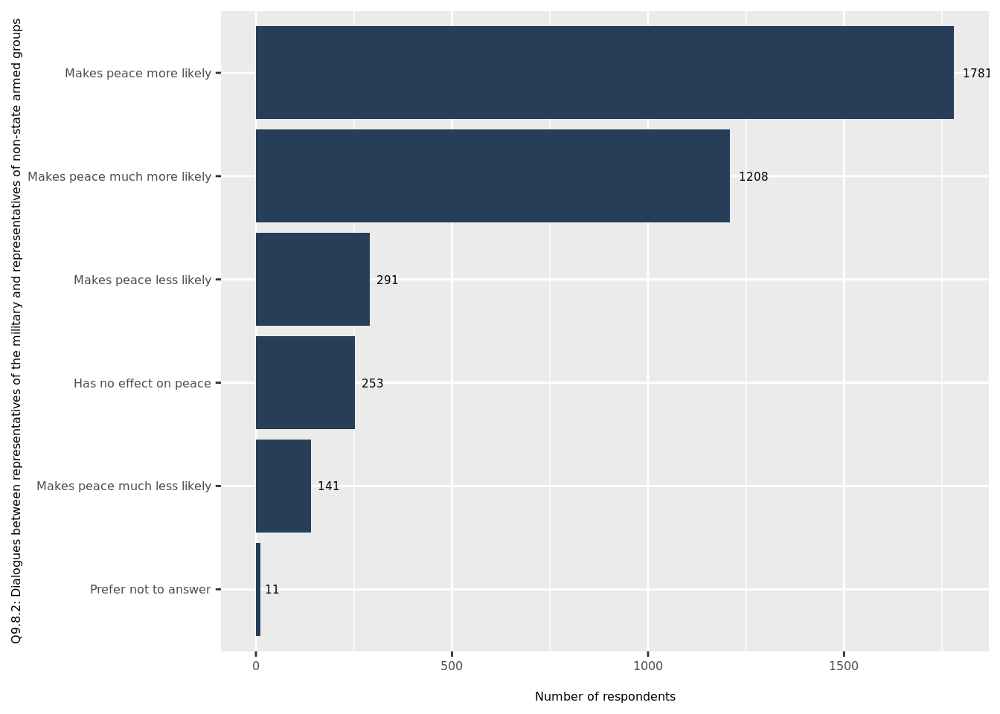

#### By county

<table class="table" style="width: auto !important; ">
 <thead>
  <tr>
   <th style="text-align:left;"> County </th>
   <th style="text-align:center;"> Most Common Response </th>
   <th style="text-align:left;"> Number of Responses </th>
   <th style="text-align:center;"> Percent of Total Responses </th>
  </tr>
 </thead>
<tbody>
  <tr>
   <td style="text-align:left;"> Bor South </td>
   <td style="text-align:center;"> Makes peace much more likely </td>
   <td style="text-align:left;"> 215 </td>
   <td style="text-align:center;"> 100 </td>
  </tr>
  <tr>
   <td style="text-align:left;"> Kajo-keji </td>
   <td style="text-align:center;"> Makes peace much more likely </td>
   <td style="text-align:left;"> 179 </td>
   <td style="text-align:center;"> 100 </td>
  </tr>
  <tr>
   <td style="text-align:left;"> Lainya </td>
   <td style="text-align:center;"> Makes peace more likely </td>
   <td style="text-align:left;"> 188 </td>
   <td style="text-align:center;"> 100 </td>
  </tr>
  <tr>
   <td style="text-align:left;"> Malakal </td>
   <td style="text-align:center;"> Makes peace more likely </td>
   <td style="text-align:left;"> 280 </td>
   <td style="text-align:center;"> 100 </td>
  </tr>
  <tr>
   <td style="text-align:left;"> Morobo </td>
   <td style="text-align:center;"> Makes peace much more likely </td>
   <td style="text-align:left;"> 181 </td>
   <td style="text-align:center;"> 100 </td>
  </tr>
  <tr>
   <td style="text-align:left;"> Pibor </td>
   <td style="text-align:center;"> Makes peace more likely </td>
   <td style="text-align:left;"> 218 </td>
   <td style="text-align:center;"> 100 </td>
  </tr>
  <tr>
   <td style="text-align:left;"> Rubkona </td>
   <td style="text-align:center;"> Makes peace much more likely </td>
   <td style="text-align:left;"> 177 </td>
   <td style="text-align:center;"> 100 </td>
  </tr>
  <tr>
   <td style="text-align:left;"> Wau </td>
   <td style="text-align:center;"> Makes peace more likely </td>
   <td style="text-align:left;"> 207 </td>
   <td style="text-align:center;"> 100 </td>
  </tr>
  <tr>
   <td style="text-align:left;"> Yei </td>
   <td style="text-align:center;"> Makes peace more likely </td>
   <td style="text-align:left;"> 247 </td>
   <td style="text-align:center;"> 100 </td>
  </tr>
</tbody>
</table>

<table class="table" style="width: auto !important; ">
 <thead>
  <tr>
   <th style="text-align:left;"> County </th>
   <th style="text-align:center;"> Response </th>
   <th style="text-align:left;"> Number of Responses </th>
   <th style="text-align:center;"> Percent of Total Responses </th>
  </tr>
 </thead>
<tbody>
  <tr>
   <td style="text-align:left;"> Yei </td>
   <td style="text-align:center;"> Has no effect on peace </td>
   <td style="text-align:left;"> 40 </td>
   <td style="text-align:center;"> 0.10 </td>
  </tr>
  <tr>
   <td style="text-align:left;"> Yei </td>
   <td style="text-align:center;"> Makes peace less likely </td>
   <td style="text-align:left;"> 43 </td>
   <td style="text-align:center;"> 0.10 </td>
  </tr>
  <tr>
   <td style="text-align:left;"> Yei </td>
   <td style="text-align:center;"> Makes peace more likely </td>
   <td style="text-align:left;"> 247 </td>
   <td style="text-align:center;"> 0.60 </td>
  </tr>
  <tr>
   <td style="text-align:left;"> Yei </td>
   <td style="text-align:center;"> Makes peace much less likely </td>
   <td style="text-align:left;"> 11 </td>
   <td style="text-align:center;"> 0.03 </td>
  </tr>
  <tr>
   <td style="text-align:left;"> Yei </td>
   <td style="text-align:center;"> Makes peace much more likely </td>
   <td style="text-align:left;"> 69 </td>
   <td style="text-align:center;"> 0.17 </td>
  </tr>
  <tr>
   <td style="text-align:left;"> Wau </td>
   <td style="text-align:center;"> Has no effect on peace </td>
   <td style="text-align:left;"> 25 </td>
   <td style="text-align:center;"> 0.06 </td>
  </tr>
  <tr>
   <td style="text-align:left;"> Wau </td>
   <td style="text-align:center;"> Makes peace less likely </td>
   <td style="text-align:left;"> 41 </td>
   <td style="text-align:center;"> 0.10 </td>
  </tr>
  <tr>
   <td style="text-align:left;"> Wau </td>
   <td style="text-align:center;"> Makes peace more likely </td>
   <td style="text-align:left;"> 207 </td>
   <td style="text-align:center;"> 0.51 </td>
  </tr>
  <tr>
   <td style="text-align:left;"> Wau </td>
   <td style="text-align:center;"> Makes peace much less likely </td>
   <td style="text-align:left;"> 14 </td>
   <td style="text-align:center;"> 0.03 </td>
  </tr>
  <tr>
   <td style="text-align:left;"> Wau </td>
   <td style="text-align:center;"> Makes peace much more likely </td>
   <td style="text-align:left;"> 111 </td>
   <td style="text-align:center;"> 0.28 </td>
  </tr>
  <tr>
   <td style="text-align:left;"> Wau </td>
   <td style="text-align:center;"> Prefer not to answer </td>
   <td style="text-align:left;"> 4 </td>
   <td style="text-align:center;"> 0.01 </td>
  </tr>
  <tr>
   <td style="text-align:left;"> Rubkona </td>
   <td style="text-align:center;"> Has no effect on peace </td>
   <td style="text-align:left;"> 13 </td>
   <td style="text-align:center;"> 0.03 </td>
  </tr>
  <tr>
   <td style="text-align:left;"> Rubkona </td>
   <td style="text-align:center;"> Makes peace less likely </td>
   <td style="text-align:left;"> 34 </td>
   <td style="text-align:center;"> 0.09 </td>
  </tr>
  <tr>
   <td style="text-align:left;"> Rubkona </td>
   <td style="text-align:center;"> Makes peace more likely </td>
   <td style="text-align:left;"> 141 </td>
   <td style="text-align:center;"> 0.35 </td>
  </tr>
  <tr>
   <td style="text-align:left;"> Rubkona </td>
   <td style="text-align:center;"> Makes peace much less likely </td>
   <td style="text-align:left;"> 34 </td>
   <td style="text-align:center;"> 0.09 </td>
  </tr>
  <tr>
   <td style="text-align:left;"> Rubkona </td>
   <td style="text-align:center;"> Makes peace much more likely </td>
   <td style="text-align:left;"> 177 </td>
   <td style="text-align:center;"> 0.44 </td>
  </tr>
  <tr>
   <td style="text-align:left;"> Rubkona </td>
   <td style="text-align:center;"> Prefer not to answer </td>
   <td style="text-align:left;"> 1 </td>
   <td style="text-align:center;"> 0.00 </td>
  </tr>
  <tr>
   <td style="text-align:left;"> Pibor </td>
   <td style="text-align:center;"> Has no effect on peace </td>
   <td style="text-align:left;"> 65 </td>
   <td style="text-align:center;"> 0.16 </td>
  </tr>
  <tr>
   <td style="text-align:left;"> Pibor </td>
   <td style="text-align:center;"> Makes peace less likely </td>
   <td style="text-align:left;"> 39 </td>
   <td style="text-align:center;"> 0.10 </td>
  </tr>
  <tr>
   <td style="text-align:left;"> Pibor </td>
   <td style="text-align:center;"> Makes peace more likely </td>
   <td style="text-align:left;"> 218 </td>
   <td style="text-align:center;"> 0.54 </td>
  </tr>
  <tr>
   <td style="text-align:left;"> Pibor </td>
   <td style="text-align:center;"> Makes peace much less likely </td>
   <td style="text-align:left;"> 25 </td>
   <td style="text-align:center;"> 0.06 </td>
  </tr>
  <tr>
   <td style="text-align:left;"> Pibor </td>
   <td style="text-align:center;"> Makes peace much more likely </td>
   <td style="text-align:left;"> 59 </td>
   <td style="text-align:center;"> 0.14 </td>
  </tr>
  <tr>
   <td style="text-align:left;"> Pibor </td>
   <td style="text-align:center;"> Prefer not to answer </td>
   <td style="text-align:left;"> 1 </td>
   <td style="text-align:center;"> 0.00 </td>
  </tr>
  <tr>
   <td style="text-align:left;"> Morobo </td>
   <td style="text-align:center;"> Has no effect on peace </td>
   <td style="text-align:left;"> 34 </td>
   <td style="text-align:center;"> 0.08 </td>
  </tr>
  <tr>
   <td style="text-align:left;"> Morobo </td>
   <td style="text-align:center;"> Makes peace less likely </td>
   <td style="text-align:left;"> 31 </td>
   <td style="text-align:center;"> 0.08 </td>
  </tr>
  <tr>
   <td style="text-align:left;"> Morobo </td>
   <td style="text-align:center;"> Makes peace more likely </td>
   <td style="text-align:left;"> 140 </td>
   <td style="text-align:center;"> 0.35 </td>
  </tr>
  <tr>
   <td style="text-align:left;"> Morobo </td>
   <td style="text-align:center;"> Makes peace much less likely </td>
   <td style="text-align:left;"> 17 </td>
   <td style="text-align:center;"> 0.04 </td>
  </tr>
  <tr>
   <td style="text-align:left;"> Morobo </td>
   <td style="text-align:center;"> Makes peace much more likely </td>
   <td style="text-align:left;"> 181 </td>
   <td style="text-align:center;"> 0.45 </td>
  </tr>
  <tr>
   <td style="text-align:left;"> Morobo </td>
   <td style="text-align:center;"> Prefer not to answer </td>
   <td style="text-align:left;"> 1 </td>
   <td style="text-align:center;"> 0.00 </td>
  </tr>
  <tr>
   <td style="text-align:left;"> Malakal </td>
   <td style="text-align:center;"> Has no effect on peace </td>
   <td style="text-align:left;"> 18 </td>
   <td style="text-align:center;"> 0.04 </td>
  </tr>
  <tr>
   <td style="text-align:left;"> Malakal </td>
   <td style="text-align:center;"> Makes peace less likely </td>
   <td style="text-align:left;"> 44 </td>
   <td style="text-align:center;"> 0.10 </td>
  </tr>
  <tr>
   <td style="text-align:left;"> Malakal </td>
   <td style="text-align:center;"> Makes peace more likely </td>
   <td style="text-align:left;"> 280 </td>
   <td style="text-align:center;"> 0.67 </td>
  </tr>
  <tr>
   <td style="text-align:left;"> Malakal </td>
   <td style="text-align:center;"> Makes peace much less likely </td>
   <td style="text-align:left;"> 12 </td>
   <td style="text-align:center;"> 0.03 </td>
  </tr>
  <tr>
   <td style="text-align:left;"> Malakal </td>
   <td style="text-align:center;"> Makes peace much more likely </td>
   <td style="text-align:left;"> 67 </td>
   <td style="text-align:center;"> 0.16 </td>
  </tr>
  <tr>
   <td style="text-align:left;"> Lainya </td>
   <td style="text-align:center;"> Has no effect on peace </td>
   <td style="text-align:left;"> 31 </td>
   <td style="text-align:center;"> 0.07 </td>
  </tr>
  <tr>
   <td style="text-align:left;"> Lainya </td>
   <td style="text-align:center;"> Makes peace less likely </td>
   <td style="text-align:left;"> 33 </td>
   <td style="text-align:center;"> 0.08 </td>
  </tr>
  <tr>
   <td style="text-align:left;"> Lainya </td>
   <td style="text-align:center;"> Makes peace more likely </td>
   <td style="text-align:left;"> 188 </td>
   <td style="text-align:center;"> 0.45 </td>
  </tr>
  <tr>
   <td style="text-align:left;"> Lainya </td>
   <td style="text-align:center;"> Makes peace much less likely </td>
   <td style="text-align:left;"> 12 </td>
   <td style="text-align:center;"> 0.03 </td>
  </tr>
  <tr>
   <td style="text-align:left;"> Lainya </td>
   <td style="text-align:center;"> Makes peace much more likely </td>
   <td style="text-align:left;"> 150 </td>
   <td style="text-align:center;"> 0.36 </td>
  </tr>
  <tr>
   <td style="text-align:left;"> Kajo-keji </td>
   <td style="text-align:center;"> Has no effect on peace </td>
   <td style="text-align:left;"> 19 </td>
   <td style="text-align:center;"> 0.05 </td>
  </tr>
  <tr>
   <td style="text-align:left;"> Kajo-keji </td>
   <td style="text-align:center;"> Makes peace less likely </td>
   <td style="text-align:left;"> 18 </td>
   <td style="text-align:center;"> 0.05 </td>
  </tr>
  <tr>
   <td style="text-align:left;"> Kajo-keji </td>
   <td style="text-align:center;"> Makes peace more likely </td>
   <td style="text-align:left;"> 171 </td>
   <td style="text-align:center;"> 0.43 </td>
  </tr>
  <tr>
   <td style="text-align:left;"> Kajo-keji </td>
   <td style="text-align:center;"> Makes peace much less likely </td>
   <td style="text-align:left;"> 7 </td>
   <td style="text-align:center;"> 0.02 </td>
  </tr>
  <tr>
   <td style="text-align:left;"> Kajo-keji </td>
   <td style="text-align:center;"> Makes peace much more likely </td>
   <td style="text-align:left;"> 179 </td>
   <td style="text-align:center;"> 0.45 </td>
  </tr>
  <tr>
   <td style="text-align:left;"> Kajo-keji </td>
   <td style="text-align:center;"> Prefer not to answer </td>
   <td style="text-align:left;"> 4 </td>
   <td style="text-align:center;"> 0.01 </td>
  </tr>
  <tr>
   <td style="text-align:left;"> Bor South </td>
   <td style="text-align:center;"> Has no effect on peace </td>
   <td style="text-align:left;"> 8 </td>
   <td style="text-align:center;"> 0.02 </td>
  </tr>
  <tr>
   <td style="text-align:left;"> Bor South </td>
   <td style="text-align:center;"> Makes peace less likely </td>
   <td style="text-align:left;"> 8 </td>
   <td style="text-align:center;"> 0.02 </td>
  </tr>
  <tr>
   <td style="text-align:left;"> Bor South </td>
   <td style="text-align:center;"> Makes peace more likely </td>
   <td style="text-align:left;"> 189 </td>
   <td style="text-align:center;"> 0.44 </td>
  </tr>
  <tr>
   <td style="text-align:left;"> Bor South </td>
   <td style="text-align:center;"> Makes peace much less likely </td>
   <td style="text-align:left;"> 9 </td>
   <td style="text-align:center;"> 0.02 </td>
  </tr>
  <tr>
   <td style="text-align:left;"> Bor South </td>
   <td style="text-align:center;"> Makes peace much more likely </td>
   <td style="text-align:left;"> 215 </td>
   <td style="text-align:center;"> 0.50 </td>
  </tr>
</tbody>
</table>

### **Q9.8.3 Inclusion of more WOMEN in dialogues, community leadership, or resource management committees**

#### Entire sample


```
## Warning: There was 1 warning in `summarize()`.
## ℹ In argument: `mean = mean(Q9.8.3, na.rm = TRUE)`.
## Caused by warning in `mean.default()`:
## ! argument is not numeric or logical: returning NA
```

<table class="table" style="width: auto !important; ">
 <thead>
  <tr>
   <th style="text-align:left;"> mean </th>
  </tr>
 </thead>
<tbody>
  <tr>
   <td style="text-align:left;"> NA </td>
  </tr>
</tbody>
</table>

<table class="table" style="width: auto !important; ">
 <thead>
  <tr>
   <th style="text-align:left;"> Most Common Response </th>
   <th style="text-align:center;"> Number of Responses </th>
   <th style="text-align:left;"> Percent of Total Responses </th>
  </tr>
 </thead>
<tbody>
  <tr>
   <td style="text-align:left;"> Makes peace more likely </td>
   <td style="text-align:center;"> 1707 </td>
   <td style="text-align:left;"> 100 </td>
  </tr>
</tbody>
</table>

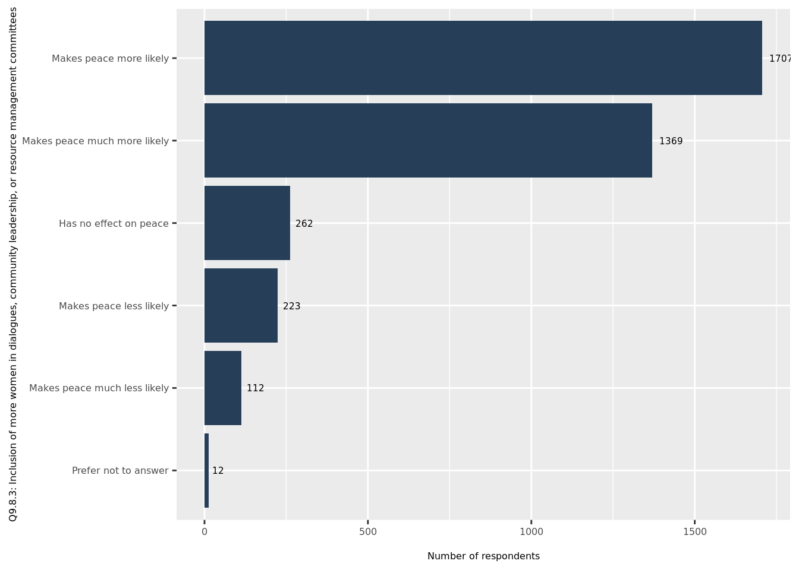

#### By county

<table class="table" style="width: auto !important; ">
 <thead>
  <tr>
   <th style="text-align:left;"> County </th>
   <th style="text-align:center;"> Most Common Response </th>
   <th style="text-align:left;"> Number of Responses </th>
   <th style="text-align:center;"> Percent of Total Responses </th>
  </tr>
 </thead>
<tbody>
  <tr>
   <td style="text-align:left;"> Bor South </td>
   <td style="text-align:center;"> Makes peace much more likely </td>
   <td style="text-align:left;"> 249 </td>
   <td style="text-align:center;"> 100 </td>
  </tr>
  <tr>
   <td style="text-align:left;"> Kajo-keji </td>
   <td style="text-align:center;"> Makes peace more likely </td>
   <td style="text-align:left;"> 179 </td>
   <td style="text-align:center;"> 100 </td>
  </tr>
  <tr>
   <td style="text-align:left;"> Lainya </td>
   <td style="text-align:center;"> Makes peace more likely </td>
   <td style="text-align:left;"> 231 </td>
   <td style="text-align:center;"> 100 </td>
  </tr>
  <tr>
   <td style="text-align:left;"> Malakal </td>
   <td style="text-align:center;"> Makes peace more likely </td>
   <td style="text-align:left;"> 255 </td>
   <td style="text-align:center;"> 100 </td>
  </tr>
  <tr>
   <td style="text-align:left;"> Morobo </td>
   <td style="text-align:center;"> Makes peace more likely </td>
   <td style="text-align:left;"> 146 </td>
   <td style="text-align:center;"> 100 </td>
  </tr>
  <tr>
   <td style="text-align:left;"> Pibor </td>
   <td style="text-align:center;"> Makes peace more likely </td>
   <td style="text-align:left;"> 211 </td>
   <td style="text-align:center;"> 100 </td>
  </tr>
  <tr>
   <td style="text-align:left;"> Rubkona </td>
   <td style="text-align:center;"> Makes peace much more likely </td>
   <td style="text-align:left;"> 204 </td>
   <td style="text-align:center;"> 100 </td>
  </tr>
  <tr>
   <td style="text-align:left;"> Wau </td>
   <td style="text-align:center;"> Makes peace much more likely </td>
   <td style="text-align:left;"> 184 </td>
   <td style="text-align:center;"> 100 </td>
  </tr>
  <tr>
   <td style="text-align:left;"> Yei </td>
   <td style="text-align:center;"> Makes peace more likely </td>
   <td style="text-align:left;"> 245 </td>
   <td style="text-align:center;"> 100 </td>
  </tr>
</tbody>
</table>

<table class="table" style="width: auto !important; ">
 <thead>
  <tr>
   <th style="text-align:left;"> County </th>
   <th style="text-align:center;"> Response </th>
   <th style="text-align:left;"> Number of Responses </th>
   <th style="text-align:center;"> Percent of Total Responses </th>
  </tr>
 </thead>
<tbody>
  <tr>
   <td style="text-align:left;"> Yei </td>
   <td style="text-align:center;"> Has no effect on peace </td>
   <td style="text-align:left;"> 26 </td>
   <td style="text-align:center;"> 0.06 </td>
  </tr>
  <tr>
   <td style="text-align:left;"> Yei </td>
   <td style="text-align:center;"> Makes peace less likely </td>
   <td style="text-align:left;"> 34 </td>
   <td style="text-align:center;"> 0.08 </td>
  </tr>
  <tr>
   <td style="text-align:left;"> Yei </td>
   <td style="text-align:center;"> Makes peace more likely </td>
   <td style="text-align:left;"> 245 </td>
   <td style="text-align:center;"> 0.60 </td>
  </tr>
  <tr>
   <td style="text-align:left;"> Yei </td>
   <td style="text-align:center;"> Makes peace much less likely </td>
   <td style="text-align:left;"> 4 </td>
   <td style="text-align:center;"> 0.01 </td>
  </tr>
  <tr>
   <td style="text-align:left;"> Yei </td>
   <td style="text-align:center;"> Makes peace much more likely </td>
   <td style="text-align:left;"> 101 </td>
   <td style="text-align:center;"> 0.25 </td>
  </tr>
  <tr>
   <td style="text-align:left;"> Wau </td>
   <td style="text-align:center;"> Has no effect on peace </td>
   <td style="text-align:left;"> 7 </td>
   <td style="text-align:center;"> 0.02 </td>
  </tr>
  <tr>
   <td style="text-align:left;"> Wau </td>
   <td style="text-align:center;"> Makes peace less likely </td>
   <td style="text-align:left;"> 28 </td>
   <td style="text-align:center;"> 0.07 </td>
  </tr>
  <tr>
   <td style="text-align:left;"> Wau </td>
   <td style="text-align:center;"> Makes peace more likely </td>
   <td style="text-align:left;"> 159 </td>
   <td style="text-align:center;"> 0.40 </td>
  </tr>
  <tr>
   <td style="text-align:left;"> Wau </td>
   <td style="text-align:center;"> Makes peace much less likely </td>
   <td style="text-align:left;"> 18 </td>
   <td style="text-align:center;"> 0.04 </td>
  </tr>
  <tr>
   <td style="text-align:left;"> Wau </td>
   <td style="text-align:center;"> Makes peace much more likely </td>
   <td style="text-align:left;"> 184 </td>
   <td style="text-align:center;"> 0.46 </td>
  </tr>
  <tr>
   <td style="text-align:left;"> Wau </td>
   <td style="text-align:center;"> Prefer not to answer </td>
   <td style="text-align:left;"> 6 </td>
   <td style="text-align:center;"> 0.01 </td>
  </tr>
  <tr>
   <td style="text-align:left;"> Rubkona </td>
   <td style="text-align:center;"> Has no effect on peace </td>
   <td style="text-align:left;"> 12 </td>
   <td style="text-align:center;"> 0.03 </td>
  </tr>
  <tr>
   <td style="text-align:left;"> Rubkona </td>
   <td style="text-align:center;"> Makes peace less likely </td>
   <td style="text-align:left;"> 43 </td>
   <td style="text-align:center;"> 0.11 </td>
  </tr>
  <tr>
   <td style="text-align:left;"> Rubkona </td>
   <td style="text-align:center;"> Makes peace more likely </td>
   <td style="text-align:left;"> 118 </td>
   <td style="text-align:center;"> 0.30 </td>
  </tr>
  <tr>
   <td style="text-align:left;"> Rubkona </td>
   <td style="text-align:center;"> Makes peace much less likely </td>
   <td style="text-align:left;"> 22 </td>
   <td style="text-align:center;"> 0.06 </td>
  </tr>
  <tr>
   <td style="text-align:left;"> Rubkona </td>
   <td style="text-align:center;"> Makes peace much more likely </td>
   <td style="text-align:left;"> 204 </td>
   <td style="text-align:center;"> 0.51 </td>
  </tr>
  <tr>
   <td style="text-align:left;"> Rubkona </td>
   <td style="text-align:center;"> Prefer not to answer </td>
   <td style="text-align:left;"> 1 </td>
   <td style="text-align:center;"> 0.00 </td>
  </tr>
  <tr>
   <td style="text-align:left;"> Pibor </td>
   <td style="text-align:center;"> Has no effect on peace </td>
   <td style="text-align:left;"> 55 </td>
   <td style="text-align:center;"> 0.14 </td>
  </tr>
  <tr>
   <td style="text-align:left;"> Pibor </td>
   <td style="text-align:center;"> Makes peace less likely </td>
   <td style="text-align:left;"> 28 </td>
   <td style="text-align:center;"> 0.07 </td>
  </tr>
  <tr>
   <td style="text-align:left;"> Pibor </td>
   <td style="text-align:center;"> Makes peace more likely </td>
   <td style="text-align:left;"> 211 </td>
   <td style="text-align:center;"> 0.52 </td>
  </tr>
  <tr>
   <td style="text-align:left;"> Pibor </td>
   <td style="text-align:center;"> Makes peace much less likely </td>
   <td style="text-align:left;"> 27 </td>
   <td style="text-align:center;"> 0.07 </td>
  </tr>
  <tr>
   <td style="text-align:left;"> Pibor </td>
   <td style="text-align:center;"> Makes peace much more likely </td>
   <td style="text-align:left;"> 86 </td>
   <td style="text-align:center;"> 0.21 </td>
  </tr>
  <tr>
   <td style="text-align:left;"> Morobo </td>
   <td style="text-align:center;"> Has no effect on peace </td>
   <td style="text-align:left;"> 60 </td>
   <td style="text-align:center;"> 0.15 </td>
  </tr>
  <tr>
   <td style="text-align:left;"> Morobo </td>
   <td style="text-align:center;"> Makes peace less likely </td>
   <td style="text-align:left;"> 28 </td>
   <td style="text-align:center;"> 0.07 </td>
  </tr>
  <tr>
   <td style="text-align:left;"> Morobo </td>
   <td style="text-align:center;"> Makes peace more likely </td>
   <td style="text-align:left;"> 146 </td>
   <td style="text-align:center;"> 0.36 </td>
  </tr>
  <tr>
   <td style="text-align:left;"> Morobo </td>
   <td style="text-align:center;"> Makes peace much less likely </td>
   <td style="text-align:left;"> 24 </td>
   <td style="text-align:center;"> 0.06 </td>
  </tr>
  <tr>
   <td style="text-align:left;"> Morobo </td>
   <td style="text-align:center;"> Makes peace much more likely </td>
   <td style="text-align:left;"> 146 </td>
   <td style="text-align:center;"> 0.36 </td>
  </tr>
  <tr>
   <td style="text-align:left;"> Malakal </td>
   <td style="text-align:center;"> Has no effect on peace </td>
   <td style="text-align:left;"> 21 </td>
   <td style="text-align:center;"> 0.05 </td>
  </tr>
  <tr>
   <td style="text-align:left;"> Malakal </td>
   <td style="text-align:center;"> Makes peace less likely </td>
   <td style="text-align:left;"> 4 </td>
   <td style="text-align:center;"> 0.01 </td>
  </tr>
  <tr>
   <td style="text-align:left;"> Malakal </td>
   <td style="text-align:center;"> Makes peace more likely </td>
   <td style="text-align:left;"> 255 </td>
   <td style="text-align:center;"> 0.61 </td>
  </tr>
  <tr>
   <td style="text-align:left;"> Malakal </td>
   <td style="text-align:center;"> Makes peace much more likely </td>
   <td style="text-align:left;"> 141 </td>
   <td style="text-align:center;"> 0.33 </td>
  </tr>
  <tr>
   <td style="text-align:left;"> Lainya </td>
   <td style="text-align:center;"> Has no effect on peace </td>
   <td style="text-align:left;"> 29 </td>
   <td style="text-align:center;"> 0.07 </td>
  </tr>
  <tr>
   <td style="text-align:left;"> Lainya </td>
   <td style="text-align:center;"> Makes peace less likely </td>
   <td style="text-align:left;"> 26 </td>
   <td style="text-align:center;"> 0.06 </td>
  </tr>
  <tr>
   <td style="text-align:left;"> Lainya </td>
   <td style="text-align:center;"> Makes peace more likely </td>
   <td style="text-align:left;"> 231 </td>
   <td style="text-align:center;"> 0.56 </td>
  </tr>
  <tr>
   <td style="text-align:left;"> Lainya </td>
   <td style="text-align:center;"> Makes peace much less likely </td>
   <td style="text-align:left;"> 6 </td>
   <td style="text-align:center;"> 0.01 </td>
  </tr>
  <tr>
   <td style="text-align:left;"> Lainya </td>
   <td style="text-align:center;"> Makes peace much more likely </td>
   <td style="text-align:left;"> 122 </td>
   <td style="text-align:center;"> 0.29 </td>
  </tr>
  <tr>
   <td style="text-align:left;"> Kajo-keji </td>
   <td style="text-align:center;"> Has no effect on peace </td>
   <td style="text-align:left;"> 50 </td>
   <td style="text-align:center;"> 0.13 </td>
  </tr>
  <tr>
   <td style="text-align:left;"> Kajo-keji </td>
   <td style="text-align:center;"> Makes peace less likely </td>
   <td style="text-align:left;"> 28 </td>
   <td style="text-align:center;"> 0.07 </td>
  </tr>
  <tr>
   <td style="text-align:left;"> Kajo-keji </td>
   <td style="text-align:center;"> Makes peace more likely </td>
   <td style="text-align:left;"> 179 </td>
   <td style="text-align:center;"> 0.45 </td>
  </tr>
  <tr>
   <td style="text-align:left;"> Kajo-keji </td>
   <td style="text-align:center;"> Makes peace much less likely </td>
   <td style="text-align:left;"> 1 </td>
   <td style="text-align:center;"> 0.00 </td>
  </tr>
  <tr>
   <td style="text-align:left;"> Kajo-keji </td>
   <td style="text-align:center;"> Makes peace much more likely </td>
   <td style="text-align:left;"> 136 </td>
   <td style="text-align:center;"> 0.34 </td>
  </tr>
  <tr>
   <td style="text-align:left;"> Kajo-keji </td>
   <td style="text-align:center;"> Prefer not to answer </td>
   <td style="text-align:left;"> 4 </td>
   <td style="text-align:center;"> 0.01 </td>
  </tr>
  <tr>
   <td style="text-align:left;"> Bor South </td>
   <td style="text-align:center;"> Has no effect on peace </td>
   <td style="text-align:left;"> 2 </td>
   <td style="text-align:center;"> 0.00 </td>
  </tr>
  <tr>
   <td style="text-align:left;"> Bor South </td>
   <td style="text-align:center;"> Makes peace less likely </td>
   <td style="text-align:left;"> 4 </td>
   <td style="text-align:center;"> 0.01 </td>
  </tr>
  <tr>
   <td style="text-align:left;"> Bor South </td>
   <td style="text-align:center;"> Makes peace more likely </td>
   <td style="text-align:left;"> 163 </td>
   <td style="text-align:center;"> 0.38 </td>
  </tr>
  <tr>
   <td style="text-align:left;"> Bor South </td>
   <td style="text-align:center;"> Makes peace much less likely </td>
   <td style="text-align:left;"> 10 </td>
   <td style="text-align:center;"> 0.02 </td>
  </tr>
  <tr>
   <td style="text-align:left;"> Bor South </td>
   <td style="text-align:center;"> Makes peace much more likely </td>
   <td style="text-align:left;"> 249 </td>
   <td style="text-align:center;"> 0.58 </td>
  </tr>
  <tr>
   <td style="text-align:left;"> Bor South </td>
   <td style="text-align:center;"> Prefer not to answer </td>
   <td style="text-align:left;"> 1 </td>
   <td style="text-align:center;"> 0.00 </td>
  </tr>
</tbody>
</table>

### **Q9.8.4 Inclusion of more YOUTH in dialogues, community leadership, or resource management committees**

#### Entire sample


```
## Warning: There was 1 warning in `summarize()`.
## ℹ In argument: `mean = mean(Q9.8.4, na.rm = TRUE)`.
## Caused by warning in `mean.default()`:
## ! argument is not numeric or logical: returning NA
```

<table class="table" style="width: auto !important; ">
 <thead>
  <tr>
   <th style="text-align:left;"> mean </th>
  </tr>
 </thead>
<tbody>
  <tr>
   <td style="text-align:left;"> NA </td>
  </tr>
</tbody>
</table>

<table class="table" style="width: auto !important; ">
 <thead>
  <tr>
   <th style="text-align:left;"> Most Common Response </th>
   <th style="text-align:center;"> Number of Responses </th>
   <th style="text-align:left;"> Percent of Total Responses </th>
  </tr>
 </thead>
<tbody>
  <tr>
   <td style="text-align:left;"> Makes peace more likely </td>
   <td style="text-align:center;"> 1703 </td>
   <td style="text-align:left;"> 100 </td>
  </tr>
</tbody>
</table>

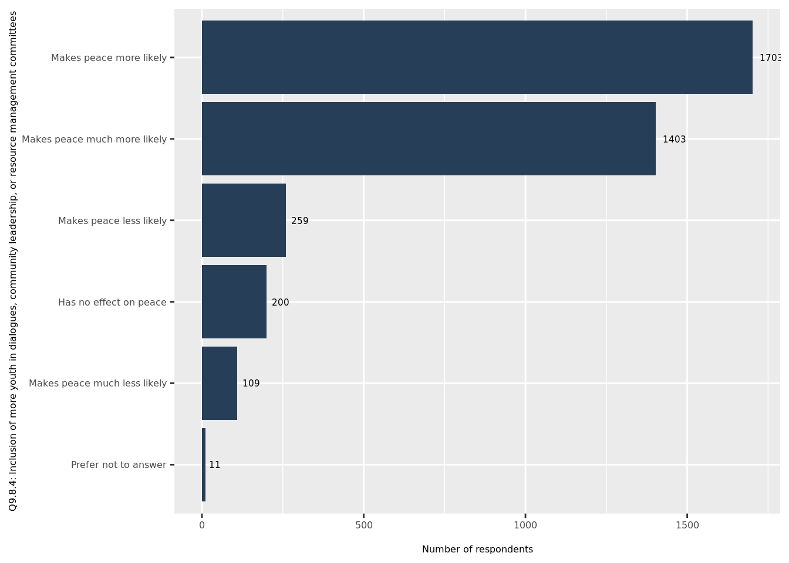

#### By county

<table class="table" style="width: auto !important; ">
 <thead>
  <tr>
   <th style="text-align:left;"> County </th>
   <th style="text-align:center;"> Most Common Response </th>
   <th style="text-align:left;"> Number of Responses </th>
   <th style="text-align:center;"> Percent of Total Responses </th>
  </tr>
 </thead>
<tbody>
  <tr>
   <td style="text-align:left;"> Bor South </td>
   <td style="text-align:center;"> Makes peace much more likely </td>
   <td style="text-align:left;"> 259 </td>
   <td style="text-align:center;"> 100 </td>
  </tr>
  <tr>
   <td style="text-align:left;"> Kajo-keji </td>
   <td style="text-align:center;"> Makes peace more likely </td>
   <td style="text-align:left;"> 184 </td>
   <td style="text-align:center;"> 100 </td>
  </tr>
  <tr>
   <td style="text-align:left;"> Lainya </td>
   <td style="text-align:center;"> Makes peace more likely </td>
   <td style="text-align:left;"> 217 </td>
   <td style="text-align:center;"> 100 </td>
  </tr>
  <tr>
   <td style="text-align:left;"> Malakal </td>
   <td style="text-align:center;"> Makes peace more likely </td>
   <td style="text-align:left;"> 239 </td>
   <td style="text-align:center;"> 100 </td>
  </tr>
  <tr>
   <td style="text-align:left;"> Morobo </td>
   <td style="text-align:center;"> Makes peace much more likely </td>
   <td style="text-align:left;"> 170 </td>
   <td style="text-align:center;"> 100 </td>
  </tr>
  <tr>
   <td style="text-align:left;"> Pibor </td>
   <td style="text-align:center;"> Makes peace more likely </td>
   <td style="text-align:left;"> 220 </td>
   <td style="text-align:center;"> 100 </td>
  </tr>
  <tr>
   <td style="text-align:left;"> Rubkona </td>
   <td style="text-align:center;"> Makes peace much more likely </td>
   <td style="text-align:left;"> 215 </td>
   <td style="text-align:center;"> 100 </td>
  </tr>
  <tr>
   <td style="text-align:left;"> Wau </td>
   <td style="text-align:center;"> Makes peace more likely </td>
   <td style="text-align:left;"> 180 </td>
   <td style="text-align:center;"> 100 </td>
  </tr>
  <tr>
   <td style="text-align:left;"> Yei </td>
   <td style="text-align:center;"> Makes peace more likely </td>
   <td style="text-align:left;"> 239 </td>
   <td style="text-align:center;"> 100 </td>
  </tr>
</tbody>
</table>

<table class="table" style="width: auto !important; ">
 <thead>
  <tr>
   <th style="text-align:left;"> County </th>
   <th style="text-align:center;"> Response </th>
   <th style="text-align:left;"> Number of Responses </th>
   <th style="text-align:center;"> Percent of Total Responses </th>
  </tr>
 </thead>
<tbody>
  <tr>
   <td style="text-align:left;"> Yei </td>
   <td style="text-align:center;"> Has no effect on peace </td>
   <td style="text-align:left;"> 17 </td>
   <td style="text-align:center;"> 0.04 </td>
  </tr>
  <tr>
   <td style="text-align:left;"> Yei </td>
   <td style="text-align:center;"> Makes peace less likely </td>
   <td style="text-align:left;"> 36 </td>
   <td style="text-align:center;"> 0.09 </td>
  </tr>
  <tr>
   <td style="text-align:left;"> Yei </td>
   <td style="text-align:center;"> Makes peace more likely </td>
   <td style="text-align:left;"> 239 </td>
   <td style="text-align:center;"> 0.58 </td>
  </tr>
  <tr>
   <td style="text-align:left;"> Yei </td>
   <td style="text-align:center;"> Makes peace much less likely </td>
   <td style="text-align:left;"> 8 </td>
   <td style="text-align:center;"> 0.02 </td>
  </tr>
  <tr>
   <td style="text-align:left;"> Yei </td>
   <td style="text-align:center;"> Makes peace much more likely </td>
   <td style="text-align:left;"> 110 </td>
   <td style="text-align:center;"> 0.27 </td>
  </tr>
  <tr>
   <td style="text-align:left;"> Wau </td>
   <td style="text-align:center;"> Has no effect on peace </td>
   <td style="text-align:left;"> 9 </td>
   <td style="text-align:center;"> 0.02 </td>
  </tr>
  <tr>
   <td style="text-align:left;"> Wau </td>
   <td style="text-align:center;"> Makes peace less likely </td>
   <td style="text-align:left;"> 37 </td>
   <td style="text-align:center;"> 0.09 </td>
  </tr>
  <tr>
   <td style="text-align:left;"> Wau </td>
   <td style="text-align:center;"> Makes peace more likely </td>
   <td style="text-align:left;"> 180 </td>
   <td style="text-align:center;"> 0.45 </td>
  </tr>
  <tr>
   <td style="text-align:left;"> Wau </td>
   <td style="text-align:center;"> Makes peace much less likely </td>
   <td style="text-align:left;"> 17 </td>
   <td style="text-align:center;"> 0.04 </td>
  </tr>
  <tr>
   <td style="text-align:left;"> Wau </td>
   <td style="text-align:center;"> Makes peace much more likely </td>
   <td style="text-align:left;"> 154 </td>
   <td style="text-align:center;"> 0.38 </td>
  </tr>
  <tr>
   <td style="text-align:left;"> Wau </td>
   <td style="text-align:center;"> Prefer not to answer </td>
   <td style="text-align:left;"> 5 </td>
   <td style="text-align:center;"> 0.01 </td>
  </tr>
  <tr>
   <td style="text-align:left;"> Rubkona </td>
   <td style="text-align:center;"> Has no effect on peace </td>
   <td style="text-align:left;"> 5 </td>
   <td style="text-align:center;"> 0.01 </td>
  </tr>
  <tr>
   <td style="text-align:left;"> Rubkona </td>
   <td style="text-align:center;"> Makes peace less likely </td>
   <td style="text-align:left;"> 39 </td>
   <td style="text-align:center;"> 0.10 </td>
  </tr>
  <tr>
   <td style="text-align:left;"> Rubkona </td>
   <td style="text-align:center;"> Makes peace more likely </td>
   <td style="text-align:left;"> 121 </td>
   <td style="text-align:center;"> 0.30 </td>
  </tr>
  <tr>
   <td style="text-align:left;"> Rubkona </td>
   <td style="text-align:center;"> Makes peace much less likely </td>
   <td style="text-align:left;"> 19 </td>
   <td style="text-align:center;"> 0.05 </td>
  </tr>
  <tr>
   <td style="text-align:left;"> Rubkona </td>
   <td style="text-align:center;"> Makes peace much more likely </td>
   <td style="text-align:left;"> 215 </td>
   <td style="text-align:center;"> 0.54 </td>
  </tr>
  <tr>
   <td style="text-align:left;"> Rubkona </td>
   <td style="text-align:center;"> Prefer not to answer </td>
   <td style="text-align:left;"> 1 </td>
   <td style="text-align:center;"> 0.00 </td>
  </tr>
  <tr>
   <td style="text-align:left;"> Pibor </td>
   <td style="text-align:center;"> Has no effect on peace </td>
   <td style="text-align:left;"> 41 </td>
   <td style="text-align:center;"> 0.10 </td>
  </tr>
  <tr>
   <td style="text-align:left;"> Pibor </td>
   <td style="text-align:center;"> Makes peace less likely </td>
   <td style="text-align:left;"> 29 </td>
   <td style="text-align:center;"> 0.07 </td>
  </tr>
  <tr>
   <td style="text-align:left;"> Pibor </td>
   <td style="text-align:center;"> Makes peace more likely </td>
   <td style="text-align:left;"> 220 </td>
   <td style="text-align:center;"> 0.54 </td>
  </tr>
  <tr>
   <td style="text-align:left;"> Pibor </td>
   <td style="text-align:center;"> Makes peace much less likely </td>
   <td style="text-align:left;"> 18 </td>
   <td style="text-align:center;"> 0.04 </td>
  </tr>
  <tr>
   <td style="text-align:left;"> Pibor </td>
   <td style="text-align:center;"> Makes peace much more likely </td>
   <td style="text-align:left;"> 99 </td>
   <td style="text-align:center;"> 0.24 </td>
  </tr>
  <tr>
   <td style="text-align:left;"> Morobo </td>
   <td style="text-align:center;"> Has no effect on peace </td>
   <td style="text-align:left;"> 26 </td>
   <td style="text-align:center;"> 0.06 </td>
  </tr>
  <tr>
   <td style="text-align:left;"> Morobo </td>
   <td style="text-align:center;"> Makes peace less likely </td>
   <td style="text-align:left;"> 30 </td>
   <td style="text-align:center;"> 0.07 </td>
  </tr>
  <tr>
   <td style="text-align:left;"> Morobo </td>
   <td style="text-align:center;"> Makes peace more likely </td>
   <td style="text-align:left;"> 149 </td>
   <td style="text-align:center;"> 0.37 </td>
  </tr>
  <tr>
   <td style="text-align:left;"> Morobo </td>
   <td style="text-align:center;"> Makes peace much less likely </td>
   <td style="text-align:left;"> 29 </td>
   <td style="text-align:center;"> 0.07 </td>
  </tr>
  <tr>
   <td style="text-align:left;"> Morobo </td>
   <td style="text-align:center;"> Makes peace much more likely </td>
   <td style="text-align:left;"> 170 </td>
   <td style="text-align:center;"> 0.42 </td>
  </tr>
  <tr>
   <td style="text-align:left;"> Malakal </td>
   <td style="text-align:center;"> Has no effect on peace </td>
   <td style="text-align:left;"> 19 </td>
   <td style="text-align:center;"> 0.05 </td>
  </tr>
  <tr>
   <td style="text-align:left;"> Malakal </td>
   <td style="text-align:center;"> Makes peace less likely </td>
   <td style="text-align:left;"> 26 </td>
   <td style="text-align:center;"> 0.06 </td>
  </tr>
  <tr>
   <td style="text-align:left;"> Malakal </td>
   <td style="text-align:center;"> Makes peace more likely </td>
   <td style="text-align:left;"> 239 </td>
   <td style="text-align:center;"> 0.57 </td>
  </tr>
  <tr>
   <td style="text-align:left;"> Malakal </td>
   <td style="text-align:center;"> Makes peace much less likely </td>
   <td style="text-align:left;"> 1 </td>
   <td style="text-align:center;"> 0.00 </td>
  </tr>
  <tr>
   <td style="text-align:left;"> Malakal </td>
   <td style="text-align:center;"> Makes peace much more likely </td>
   <td style="text-align:left;"> 136 </td>
   <td style="text-align:center;"> 0.32 </td>
  </tr>
  <tr>
   <td style="text-align:left;"> Lainya </td>
   <td style="text-align:center;"> Has no effect on peace </td>
   <td style="text-align:left;"> 33 </td>
   <td style="text-align:center;"> 0.08 </td>
  </tr>
  <tr>
   <td style="text-align:left;"> Lainya </td>
   <td style="text-align:center;"> Makes peace less likely </td>
   <td style="text-align:left;"> 27 </td>
   <td style="text-align:center;"> 0.07 </td>
  </tr>
  <tr>
   <td style="text-align:left;"> Lainya </td>
   <td style="text-align:center;"> Makes peace more likely </td>
   <td style="text-align:left;"> 217 </td>
   <td style="text-align:center;"> 0.52 </td>
  </tr>
  <tr>
   <td style="text-align:left;"> Lainya </td>
   <td style="text-align:center;"> Makes peace much less likely </td>
   <td style="text-align:left;"> 8 </td>
   <td style="text-align:center;"> 0.02 </td>
  </tr>
  <tr>
   <td style="text-align:left;"> Lainya </td>
   <td style="text-align:center;"> Makes peace much more likely </td>
   <td style="text-align:left;"> 129 </td>
   <td style="text-align:center;"> 0.31 </td>
  </tr>
  <tr>
   <td style="text-align:left;"> Kajo-keji </td>
   <td style="text-align:center;"> Has no effect on peace </td>
   <td style="text-align:left;"> 47 </td>
   <td style="text-align:center;"> 0.12 </td>
  </tr>
  <tr>
   <td style="text-align:left;"> Kajo-keji </td>
   <td style="text-align:center;"> Makes peace less likely </td>
   <td style="text-align:left;"> 29 </td>
   <td style="text-align:center;"> 0.07 </td>
  </tr>
  <tr>
   <td style="text-align:left;"> Kajo-keji </td>
   <td style="text-align:center;"> Makes peace more likely </td>
   <td style="text-align:left;"> 184 </td>
   <td style="text-align:center;"> 0.46 </td>
  </tr>
  <tr>
   <td style="text-align:left;"> Kajo-keji </td>
   <td style="text-align:center;"> Makes peace much less likely </td>
   <td style="text-align:left;"> 2 </td>
   <td style="text-align:center;"> 0.01 </td>
  </tr>
  <tr>
   <td style="text-align:left;"> Kajo-keji </td>
   <td style="text-align:center;"> Makes peace much more likely </td>
   <td style="text-align:left;"> 131 </td>
   <td style="text-align:center;"> 0.33 </td>
  </tr>
  <tr>
   <td style="text-align:left;"> Kajo-keji </td>
   <td style="text-align:center;"> Prefer not to answer </td>
   <td style="text-align:left;"> 5 </td>
   <td style="text-align:center;"> 0.01 </td>
  </tr>
  <tr>
   <td style="text-align:left;"> Bor South </td>
   <td style="text-align:center;"> Has no effect on peace </td>
   <td style="text-align:left;"> 3 </td>
   <td style="text-align:center;"> 0.01 </td>
  </tr>
  <tr>
   <td style="text-align:left;"> Bor South </td>
   <td style="text-align:center;"> Makes peace less likely </td>
   <td style="text-align:left;"> 6 </td>
   <td style="text-align:center;"> 0.01 </td>
  </tr>
  <tr>
   <td style="text-align:left;"> Bor South </td>
   <td style="text-align:center;"> Makes peace more likely </td>
   <td style="text-align:left;"> 154 </td>
   <td style="text-align:center;"> 0.36 </td>
  </tr>
  <tr>
   <td style="text-align:left;"> Bor South </td>
   <td style="text-align:center;"> Makes peace much less likely </td>
   <td style="text-align:left;"> 7 </td>
   <td style="text-align:center;"> 0.02 </td>
  </tr>
  <tr>
   <td style="text-align:left;"> Bor South </td>
   <td style="text-align:center;"> Makes peace much more likely </td>
   <td style="text-align:left;"> 259 </td>
   <td style="text-align:center;"> 0.60 </td>
  </tr>
</tbody>
</table>

### **Q9.8.5 Confessions by perpetrators of violence or crimes**

#### Entire sample


```
## Warning: There was 1 warning in `summarize()`.
## ℹ In argument: `mean = mean(Q9.8.5, na.rm = TRUE)`.
## Caused by warning in `mean.default()`:
## ! argument is not numeric or logical: returning NA
```

<table class="table" style="width: auto !important; ">
 <thead>
  <tr>
   <th style="text-align:left;"> mean </th>
  </tr>
 </thead>
<tbody>
  <tr>
   <td style="text-align:left;"> NA </td>
  </tr>
</tbody>
</table>

<table class="table" style="width: auto !important; ">
 <thead>
  <tr>
   <th style="text-align:left;"> Most Common Response </th>
   <th style="text-align:center;"> Number of Responses </th>
   <th style="text-align:left;"> Percent of Total Responses </th>
  </tr>
 </thead>
<tbody>
  <tr>
   <td style="text-align:left;"> Makes peace more likely </td>
   <td style="text-align:center;"> 1487 </td>
   <td style="text-align:left;"> 100 </td>
  </tr>
</tbody>
</table>

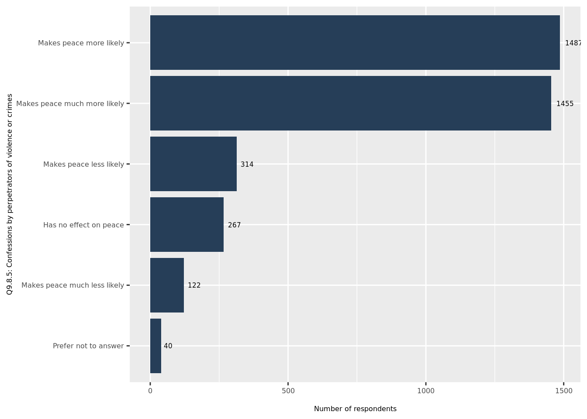

#### By county

<table class="table" style="width: auto !important; ">
 <thead>
  <tr>
   <th style="text-align:left;"> County </th>
   <th style="text-align:center;"> Most Common Response </th>
   <th style="text-align:left;"> Number of Responses </th>
   <th style="text-align:center;"> Percent of Total Responses </th>
  </tr>
 </thead>
<tbody>
  <tr>
   <td style="text-align:left;"> Bor South </td>
   <td style="text-align:center;"> Makes peace much more likely </td>
   <td style="text-align:left;"> 206 </td>
   <td style="text-align:center;"> 100 </td>
  </tr>
  <tr>
   <td style="text-align:left;"> Kajo-keji </td>
   <td style="text-align:center;"> Makes peace much more likely </td>
   <td style="text-align:left;"> 166 </td>
   <td style="text-align:center;"> 100 </td>
  </tr>
  <tr>
   <td style="text-align:left;"> Lainya </td>
   <td style="text-align:center;"> Makes peace more likely </td>
   <td style="text-align:left;"> 180 </td>
   <td style="text-align:center;"> 100 </td>
  </tr>
  <tr>
   <td style="text-align:left;"> Malakal </td>
   <td style="text-align:center;"> Makes peace more likely </td>
   <td style="text-align:left;"> 238 </td>
   <td style="text-align:center;"> 100 </td>
  </tr>
  <tr>
   <td style="text-align:left;"> Morobo </td>
   <td style="text-align:center;"> Makes peace much more likely </td>
   <td style="text-align:left;"> 190 </td>
   <td style="text-align:center;"> 100 </td>
  </tr>
  <tr>
   <td style="text-align:left;"> Pibor </td>
   <td style="text-align:center;"> Makes peace more likely </td>
   <td style="text-align:left;"> 176 </td>
   <td style="text-align:center;"> 100 </td>
  </tr>
  <tr>
   <td style="text-align:left;"> Rubkona </td>
   <td style="text-align:center;"> Makes peace much more likely </td>
   <td style="text-align:left;"> 229 </td>
   <td style="text-align:center;"> 100 </td>
  </tr>
  <tr>
   <td style="text-align:left;"> Wau </td>
   <td style="text-align:center;"> Makes peace much more likely </td>
   <td style="text-align:left;"> 162 </td>
   <td style="text-align:center;"> 100 </td>
  </tr>
  <tr>
   <td style="text-align:left;"> Yei </td>
   <td style="text-align:center;"> Makes peace more likely </td>
   <td style="text-align:left;"> 201 </td>
   <td style="text-align:center;"> 100 </td>
  </tr>
</tbody>
</table>

<table class="table" style="width: auto !important; ">
 <thead>
  <tr>
   <th style="text-align:left;"> County </th>
   <th style="text-align:center;"> Response </th>
   <th style="text-align:left;"> Number of Responses </th>
   <th style="text-align:center;"> Percent of Total Responses </th>
  </tr>
 </thead>
<tbody>
  <tr>
   <td style="text-align:left;"> Yei </td>
   <td style="text-align:center;"> Has no effect on peace </td>
   <td style="text-align:left;"> 31 </td>
   <td style="text-align:center;"> 0.08 </td>
  </tr>
  <tr>
   <td style="text-align:left;"> Yei </td>
   <td style="text-align:center;"> Makes peace less likely </td>
   <td style="text-align:left;"> 21 </td>
   <td style="text-align:center;"> 0.05 </td>
  </tr>
  <tr>
   <td style="text-align:left;"> Yei </td>
   <td style="text-align:center;"> Makes peace more likely </td>
   <td style="text-align:left;"> 201 </td>
   <td style="text-align:center;"> 0.49 </td>
  </tr>
  <tr>
   <td style="text-align:left;"> Yei </td>
   <td style="text-align:center;"> Makes peace much less likely </td>
   <td style="text-align:left;"> 3 </td>
   <td style="text-align:center;"> 0.01 </td>
  </tr>
  <tr>
   <td style="text-align:left;"> Yei </td>
   <td style="text-align:center;"> Makes peace much more likely </td>
   <td style="text-align:left;"> 153 </td>
   <td style="text-align:center;"> 0.37 </td>
  </tr>
  <tr>
   <td style="text-align:left;"> Yei </td>
   <td style="text-align:center;"> Prefer not to answer </td>
   <td style="text-align:left;"> 1 </td>
   <td style="text-align:center;"> 0.00 </td>
  </tr>
  <tr>
   <td style="text-align:left;"> Wau </td>
   <td style="text-align:center;"> Has no effect on peace </td>
   <td style="text-align:left;"> 12 </td>
   <td style="text-align:center;"> 0.03 </td>
  </tr>
  <tr>
   <td style="text-align:left;"> Wau </td>
   <td style="text-align:center;"> Makes peace less likely </td>
   <td style="text-align:left;"> 41 </td>
   <td style="text-align:center;"> 0.10 </td>
  </tr>
  <tr>
   <td style="text-align:left;"> Wau </td>
   <td style="text-align:center;"> Makes peace more likely </td>
   <td style="text-align:left;"> 150 </td>
   <td style="text-align:center;"> 0.37 </td>
  </tr>
  <tr>
   <td style="text-align:left;"> Wau </td>
   <td style="text-align:center;"> Makes peace much less likely </td>
   <td style="text-align:left;"> 24 </td>
   <td style="text-align:center;"> 0.06 </td>
  </tr>
  <tr>
   <td style="text-align:left;"> Wau </td>
   <td style="text-align:center;"> Makes peace much more likely </td>
   <td style="text-align:left;"> 162 </td>
   <td style="text-align:center;"> 0.40 </td>
  </tr>
  <tr>
   <td style="text-align:left;"> Wau </td>
   <td style="text-align:center;"> Prefer not to answer </td>
   <td style="text-align:left;"> 13 </td>
   <td style="text-align:center;"> 0.03 </td>
  </tr>
  <tr>
   <td style="text-align:left;"> Rubkona </td>
   <td style="text-align:center;"> Has no effect on peace </td>
   <td style="text-align:left;"> 27 </td>
   <td style="text-align:center;"> 0.07 </td>
  </tr>
  <tr>
   <td style="text-align:left;"> Rubkona </td>
   <td style="text-align:center;"> Makes peace less likely </td>
   <td style="text-align:left;"> 30 </td>
   <td style="text-align:center;"> 0.07 </td>
  </tr>
  <tr>
   <td style="text-align:left;"> Rubkona </td>
   <td style="text-align:center;"> Makes peace more likely </td>
   <td style="text-align:left;"> 92 </td>
   <td style="text-align:center;"> 0.23 </td>
  </tr>
  <tr>
   <td style="text-align:left;"> Rubkona </td>
   <td style="text-align:center;"> Makes peace much less likely </td>
   <td style="text-align:left;"> 21 </td>
   <td style="text-align:center;"> 0.05 </td>
  </tr>
  <tr>
   <td style="text-align:left;"> Rubkona </td>
   <td style="text-align:center;"> Makes peace much more likely </td>
   <td style="text-align:left;"> 229 </td>
   <td style="text-align:center;"> 0.57 </td>
  </tr>
  <tr>
   <td style="text-align:left;"> Rubkona </td>
   <td style="text-align:center;"> Prefer not to answer </td>
   <td style="text-align:left;"> 1 </td>
   <td style="text-align:center;"> 0.00 </td>
  </tr>
  <tr>
   <td style="text-align:left;"> Pibor </td>
   <td style="text-align:center;"> Has no effect on peace </td>
   <td style="text-align:left;"> 52 </td>
   <td style="text-align:center;"> 0.13 </td>
  </tr>
  <tr>
   <td style="text-align:left;"> Pibor </td>
   <td style="text-align:center;"> Makes peace less likely </td>
   <td style="text-align:left;"> 47 </td>
   <td style="text-align:center;"> 0.12 </td>
  </tr>
  <tr>
   <td style="text-align:left;"> Pibor </td>
   <td style="text-align:center;"> Makes peace more likely </td>
   <td style="text-align:left;"> 176 </td>
   <td style="text-align:center;"> 0.43 </td>
  </tr>
  <tr>
   <td style="text-align:left;"> Pibor </td>
   <td style="text-align:center;"> Makes peace much less likely </td>
   <td style="text-align:left;"> 28 </td>
   <td style="text-align:center;"> 0.07 </td>
  </tr>
  <tr>
   <td style="text-align:left;"> Pibor </td>
   <td style="text-align:center;"> Makes peace much more likely </td>
   <td style="text-align:left;"> 102 </td>
   <td style="text-align:center;"> 0.25 </td>
  </tr>
  <tr>
   <td style="text-align:left;"> Pibor </td>
   <td style="text-align:center;"> Prefer not to answer </td>
   <td style="text-align:left;"> 2 </td>
   <td style="text-align:center;"> 0.00 </td>
  </tr>
  <tr>
   <td style="text-align:left;"> Morobo </td>
   <td style="text-align:center;"> Has no effect on peace </td>
   <td style="text-align:left;"> 38 </td>
   <td style="text-align:center;"> 0.09 </td>
  </tr>
  <tr>
   <td style="text-align:left;"> Morobo </td>
   <td style="text-align:center;"> Makes peace less likely </td>
   <td style="text-align:left;"> 35 </td>
   <td style="text-align:center;"> 0.09 </td>
  </tr>
  <tr>
   <td style="text-align:left;"> Morobo </td>
   <td style="text-align:center;"> Makes peace more likely </td>
   <td style="text-align:left;"> 129 </td>
   <td style="text-align:center;"> 0.32 </td>
  </tr>
  <tr>
   <td style="text-align:left;"> Morobo </td>
   <td style="text-align:center;"> Makes peace much less likely </td>
   <td style="text-align:left;"> 12 </td>
   <td style="text-align:center;"> 0.03 </td>
  </tr>
  <tr>
   <td style="text-align:left;"> Morobo </td>
   <td style="text-align:center;"> Makes peace much more likely </td>
   <td style="text-align:left;"> 190 </td>
   <td style="text-align:center;"> 0.47 </td>
  </tr>
  <tr>
   <td style="text-align:left;"> Malakal </td>
   <td style="text-align:center;"> Has no effect on peace </td>
   <td style="text-align:left;"> 26 </td>
   <td style="text-align:center;"> 0.06 </td>
  </tr>
  <tr>
   <td style="text-align:left;"> Malakal </td>
   <td style="text-align:center;"> Makes peace less likely </td>
   <td style="text-align:left;"> 64 </td>
   <td style="text-align:center;"> 0.15 </td>
  </tr>
  <tr>
   <td style="text-align:left;"> Malakal </td>
   <td style="text-align:center;"> Makes peace more likely </td>
   <td style="text-align:left;"> 238 </td>
   <td style="text-align:center;"> 0.57 </td>
  </tr>
  <tr>
   <td style="text-align:left;"> Malakal </td>
   <td style="text-align:center;"> Makes peace much more likely </td>
   <td style="text-align:left;"> 93 </td>
   <td style="text-align:center;"> 0.22 </td>
  </tr>
  <tr>
   <td style="text-align:left;"> Lainya </td>
   <td style="text-align:center;"> Has no effect on peace </td>
   <td style="text-align:left;"> 45 </td>
   <td style="text-align:center;"> 0.11 </td>
  </tr>
  <tr>
   <td style="text-align:left;"> Lainya </td>
   <td style="text-align:center;"> Makes peace less likely </td>
   <td style="text-align:left;"> 23 </td>
   <td style="text-align:center;"> 0.06 </td>
  </tr>
  <tr>
   <td style="text-align:left;"> Lainya </td>
   <td style="text-align:center;"> Makes peace more likely </td>
   <td style="text-align:left;"> 180 </td>
   <td style="text-align:center;"> 0.43 </td>
  </tr>
  <tr>
   <td style="text-align:left;"> Lainya </td>
   <td style="text-align:center;"> Makes peace much less likely </td>
   <td style="text-align:left;"> 9 </td>
   <td style="text-align:center;"> 0.02 </td>
  </tr>
  <tr>
   <td style="text-align:left;"> Lainya </td>
   <td style="text-align:center;"> Makes peace much more likely </td>
   <td style="text-align:left;"> 154 </td>
   <td style="text-align:center;"> 0.37 </td>
  </tr>
  <tr>
   <td style="text-align:left;"> Lainya </td>
   <td style="text-align:center;"> Prefer not to answer </td>
   <td style="text-align:left;"> 3 </td>
   <td style="text-align:center;"> 0.01 </td>
  </tr>
  <tr>
   <td style="text-align:left;"> Kajo-keji </td>
   <td style="text-align:center;"> Has no effect on peace </td>
   <td style="text-align:left;"> 20 </td>
   <td style="text-align:center;"> 0.05 </td>
  </tr>
  <tr>
   <td style="text-align:left;"> Kajo-keji </td>
   <td style="text-align:center;"> Makes peace less likely </td>
   <td style="text-align:left;"> 27 </td>
   <td style="text-align:center;"> 0.07 </td>
  </tr>
  <tr>
   <td style="text-align:left;"> Kajo-keji </td>
   <td style="text-align:center;"> Makes peace more likely </td>
   <td style="text-align:left;"> 160 </td>
   <td style="text-align:center;"> 0.40 </td>
  </tr>
  <tr>
   <td style="text-align:left;"> Kajo-keji </td>
   <td style="text-align:center;"> Makes peace much less likely </td>
   <td style="text-align:left;"> 7 </td>
   <td style="text-align:center;"> 0.02 </td>
  </tr>
  <tr>
   <td style="text-align:left;"> Kajo-keji </td>
   <td style="text-align:center;"> Makes peace much more likely </td>
   <td style="text-align:left;"> 166 </td>
   <td style="text-align:center;"> 0.42 </td>
  </tr>
  <tr>
   <td style="text-align:left;"> Kajo-keji </td>
   <td style="text-align:center;"> Prefer not to answer </td>
   <td style="text-align:left;"> 18 </td>
   <td style="text-align:center;"> 0.05 </td>
  </tr>
  <tr>
   <td style="text-align:left;"> Bor South </td>
   <td style="text-align:center;"> Has no effect on peace </td>
   <td style="text-align:left;"> 16 </td>
   <td style="text-align:center;"> 0.04 </td>
  </tr>
  <tr>
   <td style="text-align:left;"> Bor South </td>
   <td style="text-align:center;"> Makes peace less likely </td>
   <td style="text-align:left;"> 26 </td>
   <td style="text-align:center;"> 0.06 </td>
  </tr>
  <tr>
   <td style="text-align:left;"> Bor South </td>
   <td style="text-align:center;"> Makes peace more likely </td>
   <td style="text-align:left;"> 161 </td>
   <td style="text-align:center;"> 0.38 </td>
  </tr>
  <tr>
   <td style="text-align:left;"> Bor South </td>
   <td style="text-align:center;"> Makes peace much less likely </td>
   <td style="text-align:left;"> 18 </td>
   <td style="text-align:center;"> 0.04 </td>
  </tr>
  <tr>
   <td style="text-align:left;"> Bor South </td>
   <td style="text-align:center;"> Makes peace much more likely </td>
   <td style="text-align:left;"> 206 </td>
   <td style="text-align:center;"> 0.48 </td>
  </tr>
  <tr>
   <td style="text-align:left;"> Bor South </td>
   <td style="text-align:center;"> Prefer not to answer </td>
   <td style="text-align:left;"> 2 </td>
   <td style="text-align:center;"> 0.00 </td>
  </tr>
</tbody>
</table>

### **Q9.8.6 Apologies by perpetrators of violence or crimes**

#### Entire sample


```
## Warning: There was 1 warning in `summarize()`.
## ℹ In argument: `mean = mean(Q9.8.6, na.rm = TRUE)`.
## Caused by warning in `mean.default()`:
## ! argument is not numeric or logical: returning NA
```

<table class="table" style="width: auto !important; ">
 <thead>
  <tr>
   <th style="text-align:left;"> mean </th>
  </tr>
 </thead>
<tbody>
  <tr>
   <td style="text-align:left;"> NA </td>
  </tr>
</tbody>
</table>

<table class="table" style="width: auto !important; ">
 <thead>
  <tr>
   <th style="text-align:left;"> Most Common Response </th>
   <th style="text-align:center;"> Number of Responses </th>
   <th style="text-align:left;"> Percent of Total Responses </th>
  </tr>
 </thead>
<tbody>
  <tr>
   <td style="text-align:left;"> Makes peace more likely </td>
   <td style="text-align:center;"> 1689 </td>
   <td style="text-align:left;"> 100 </td>
  </tr>
</tbody>
</table>

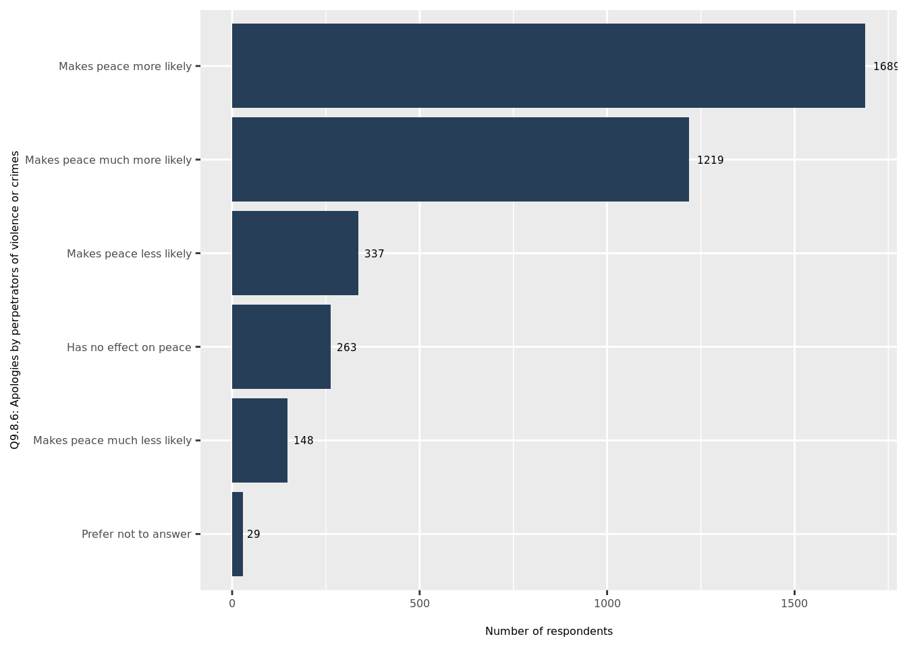

#### By county

<table class="table" style="width: auto !important; ">
 <thead>
  <tr>
   <th style="text-align:left;"> County </th>
   <th style="text-align:center;"> Most Common Response </th>
   <th style="text-align:left;"> Number of Responses </th>
   <th style="text-align:center;"> Percent of Total Responses </th>
  </tr>
 </thead>
<tbody>
  <tr>
   <td style="text-align:left;"> Bor South </td>
   <td style="text-align:center;"> Makes peace more likely </td>
   <td style="text-align:left;"> 186 </td>
   <td style="text-align:center;"> 100 </td>
  </tr>
  <tr>
   <td style="text-align:left;"> Kajo-keji </td>
   <td style="text-align:center;"> Makes peace more likely </td>
   <td style="text-align:left;"> 174 </td>
   <td style="text-align:center;"> 100 </td>
  </tr>
  <tr>
   <td style="text-align:left;"> Lainya </td>
   <td style="text-align:center;"> Makes peace more likely </td>
   <td style="text-align:left;"> 199 </td>
   <td style="text-align:center;"> 100 </td>
  </tr>
  <tr>
   <td style="text-align:left;"> Malakal </td>
   <td style="text-align:center;"> Makes peace more likely </td>
   <td style="text-align:left;"> 281 </td>
   <td style="text-align:center;"> 100 </td>
  </tr>
  <tr>
   <td style="text-align:left;"> Morobo </td>
   <td style="text-align:center;"> Makes peace much more likely </td>
   <td style="text-align:left;"> 168 </td>
   <td style="text-align:center;"> 100 </td>
  </tr>
  <tr>
   <td style="text-align:left;"> Pibor </td>
   <td style="text-align:center;"> Makes peace more likely </td>
   <td style="text-align:left;"> 183 </td>
   <td style="text-align:center;"> 100 </td>
  </tr>
  <tr>
   <td style="text-align:left;"> Rubkona </td>
   <td style="text-align:center;"> Makes peace much more likely </td>
   <td style="text-align:left;"> 195 </td>
   <td style="text-align:center;"> 100 </td>
  </tr>
  <tr>
   <td style="text-align:left;"> Wau </td>
   <td style="text-align:center;"> Makes peace more likely </td>
   <td style="text-align:left;"> 173 </td>
   <td style="text-align:center;"> 100 </td>
  </tr>
  <tr>
   <td style="text-align:left;"> Yei </td>
   <td style="text-align:center;"> Makes peace more likely </td>
   <td style="text-align:left;"> 243 </td>
   <td style="text-align:center;"> 100 </td>
  </tr>
</tbody>
</table>

<table class="table" style="width: auto !important; ">
 <thead>
  <tr>
   <th style="text-align:left;"> County </th>
   <th style="text-align:center;"> Response </th>
   <th style="text-align:left;"> Number of Responses </th>
   <th style="text-align:center;"> Percent of Total Responses </th>
  </tr>
 </thead>
<tbody>
  <tr>
   <td style="text-align:left;"> Yei </td>
   <td style="text-align:center;"> Has no effect on peace </td>
   <td style="text-align:left;"> 28 </td>
   <td style="text-align:center;"> 0.07 </td>
  </tr>
  <tr>
   <td style="text-align:left;"> Yei </td>
   <td style="text-align:center;"> Makes peace less likely </td>
   <td style="text-align:left;"> 24 </td>
   <td style="text-align:center;"> 0.06 </td>
  </tr>
  <tr>
   <td style="text-align:left;"> Yei </td>
   <td style="text-align:center;"> Makes peace more likely </td>
   <td style="text-align:left;"> 243 </td>
   <td style="text-align:center;"> 0.59 </td>
  </tr>
  <tr>
   <td style="text-align:left;"> Yei </td>
   <td style="text-align:center;"> Makes peace much less likely </td>
   <td style="text-align:left;"> 5 </td>
   <td style="text-align:center;"> 0.01 </td>
  </tr>
  <tr>
   <td style="text-align:left;"> Yei </td>
   <td style="text-align:center;"> Makes peace much more likely </td>
   <td style="text-align:left;"> 110 </td>
   <td style="text-align:center;"> 0.27 </td>
  </tr>
  <tr>
   <td style="text-align:left;"> Wau </td>
   <td style="text-align:center;"> Has no effect on peace </td>
   <td style="text-align:left;"> 16 </td>
   <td style="text-align:center;"> 0.04 </td>
  </tr>
  <tr>
   <td style="text-align:left;"> Wau </td>
   <td style="text-align:center;"> Makes peace less likely </td>
   <td style="text-align:left;"> 49 </td>
   <td style="text-align:center;"> 0.12 </td>
  </tr>
  <tr>
   <td style="text-align:left;"> Wau </td>
   <td style="text-align:center;"> Makes peace more likely </td>
   <td style="text-align:left;"> 173 </td>
   <td style="text-align:center;"> 0.43 </td>
  </tr>
  <tr>
   <td style="text-align:left;"> Wau </td>
   <td style="text-align:center;"> Makes peace much less likely </td>
   <td style="text-align:left;"> 19 </td>
   <td style="text-align:center;"> 0.05 </td>
  </tr>
  <tr>
   <td style="text-align:left;"> Wau </td>
   <td style="text-align:center;"> Makes peace much more likely </td>
   <td style="text-align:left;"> 136 </td>
   <td style="text-align:center;"> 0.34 </td>
  </tr>
  <tr>
   <td style="text-align:left;"> Wau </td>
   <td style="text-align:center;"> Prefer not to answer </td>
   <td style="text-align:left;"> 9 </td>
   <td style="text-align:center;"> 0.02 </td>
  </tr>
  <tr>
   <td style="text-align:left;"> Rubkona </td>
   <td style="text-align:center;"> Has no effect on peace </td>
   <td style="text-align:left;"> 13 </td>
   <td style="text-align:center;"> 0.03 </td>
  </tr>
  <tr>
   <td style="text-align:left;"> Rubkona </td>
   <td style="text-align:center;"> Makes peace less likely </td>
   <td style="text-align:left;"> 42 </td>
   <td style="text-align:center;"> 0.10 </td>
  </tr>
  <tr>
   <td style="text-align:left;"> Rubkona </td>
   <td style="text-align:center;"> Makes peace more likely </td>
   <td style="text-align:left;"> 120 </td>
   <td style="text-align:center;"> 0.30 </td>
  </tr>
  <tr>
   <td style="text-align:left;"> Rubkona </td>
   <td style="text-align:center;"> Makes peace much less likely </td>
   <td style="text-align:left;"> 29 </td>
   <td style="text-align:center;"> 0.07 </td>
  </tr>
  <tr>
   <td style="text-align:left;"> Rubkona </td>
   <td style="text-align:center;"> Makes peace much more likely </td>
   <td style="text-align:left;"> 195 </td>
   <td style="text-align:center;"> 0.49 </td>
  </tr>
  <tr>
   <td style="text-align:left;"> Rubkona </td>
   <td style="text-align:center;"> Prefer not to answer </td>
   <td style="text-align:left;"> 1 </td>
   <td style="text-align:center;"> 0.00 </td>
  </tr>
  <tr>
   <td style="text-align:left;"> Pibor </td>
   <td style="text-align:center;"> Has no effect on peace </td>
   <td style="text-align:left;"> 57 </td>
   <td style="text-align:center;"> 0.14 </td>
  </tr>
  <tr>
   <td style="text-align:left;"> Pibor </td>
   <td style="text-align:center;"> Makes peace less likely </td>
   <td style="text-align:left;"> 50 </td>
   <td style="text-align:center;"> 0.12 </td>
  </tr>
  <tr>
   <td style="text-align:left;"> Pibor </td>
   <td style="text-align:center;"> Makes peace more likely </td>
   <td style="text-align:left;"> 183 </td>
   <td style="text-align:center;"> 0.45 </td>
  </tr>
  <tr>
   <td style="text-align:left;"> Pibor </td>
   <td style="text-align:center;"> Makes peace much less likely </td>
   <td style="text-align:left;"> 36 </td>
   <td style="text-align:center;"> 0.09 </td>
  </tr>
  <tr>
   <td style="text-align:left;"> Pibor </td>
   <td style="text-align:center;"> Makes peace much more likely </td>
   <td style="text-align:left;"> 79 </td>
   <td style="text-align:center;"> 0.19 </td>
  </tr>
  <tr>
   <td style="text-align:left;"> Pibor </td>
   <td style="text-align:center;"> Prefer not to answer </td>
   <td style="text-align:left;"> 2 </td>
   <td style="text-align:center;"> 0.00 </td>
  </tr>
  <tr>
   <td style="text-align:left;"> Morobo </td>
   <td style="text-align:center;"> Has no effect on peace </td>
   <td style="text-align:left;"> 37 </td>
   <td style="text-align:center;"> 0.09 </td>
  </tr>
  <tr>
   <td style="text-align:left;"> Morobo </td>
   <td style="text-align:center;"> Makes peace less likely </td>
   <td style="text-align:left;"> 46 </td>
   <td style="text-align:center;"> 0.11 </td>
  </tr>
  <tr>
   <td style="text-align:left;"> Morobo </td>
   <td style="text-align:center;"> Makes peace more likely </td>
   <td style="text-align:left;"> 130 </td>
   <td style="text-align:center;"> 0.32 </td>
  </tr>
  <tr>
   <td style="text-align:left;"> Morobo </td>
   <td style="text-align:center;"> Makes peace much less likely </td>
   <td style="text-align:left;"> 23 </td>
   <td style="text-align:center;"> 0.06 </td>
  </tr>
  <tr>
   <td style="text-align:left;"> Morobo </td>
   <td style="text-align:center;"> Makes peace much more likely </td>
   <td style="text-align:left;"> 168 </td>
   <td style="text-align:center;"> 0.42 </td>
  </tr>
  <tr>
   <td style="text-align:left;"> Malakal </td>
   <td style="text-align:center;"> Has no effect on peace </td>
   <td style="text-align:left;"> 18 </td>
   <td style="text-align:center;"> 0.04 </td>
  </tr>
  <tr>
   <td style="text-align:left;"> Malakal </td>
   <td style="text-align:center;"> Makes peace less likely </td>
   <td style="text-align:left;"> 54 </td>
   <td style="text-align:center;"> 0.13 </td>
  </tr>
  <tr>
   <td style="text-align:left;"> Malakal </td>
   <td style="text-align:center;"> Makes peace more likely </td>
   <td style="text-align:left;"> 281 </td>
   <td style="text-align:center;"> 0.67 </td>
  </tr>
  <tr>
   <td style="text-align:left;"> Malakal </td>
   <td style="text-align:center;"> Makes peace much less likely </td>
   <td style="text-align:left;"> 2 </td>
   <td style="text-align:center;"> 0.00 </td>
  </tr>
  <tr>
   <td style="text-align:left;"> Malakal </td>
   <td style="text-align:center;"> Makes peace much more likely </td>
   <td style="text-align:left;"> 66 </td>
   <td style="text-align:center;"> 0.16 </td>
  </tr>
  <tr>
   <td style="text-align:left;"> Lainya </td>
   <td style="text-align:center;"> Has no effect on peace </td>
   <td style="text-align:left;"> 34 </td>
   <td style="text-align:center;"> 0.08 </td>
  </tr>
  <tr>
   <td style="text-align:left;"> Lainya </td>
   <td style="text-align:center;"> Makes peace less likely </td>
   <td style="text-align:left;"> 22 </td>
   <td style="text-align:center;"> 0.05 </td>
  </tr>
  <tr>
   <td style="text-align:left;"> Lainya </td>
   <td style="text-align:center;"> Makes peace more likely </td>
   <td style="text-align:left;"> 199 </td>
   <td style="text-align:center;"> 0.48 </td>
  </tr>
  <tr>
   <td style="text-align:left;"> Lainya </td>
   <td style="text-align:center;"> Makes peace much less likely </td>
   <td style="text-align:left;"> 12 </td>
   <td style="text-align:center;"> 0.03 </td>
  </tr>
  <tr>
   <td style="text-align:left;"> Lainya </td>
   <td style="text-align:center;"> Makes peace much more likely </td>
   <td style="text-align:left;"> 144 </td>
   <td style="text-align:center;"> 0.35 </td>
  </tr>
  <tr>
   <td style="text-align:left;"> Lainya </td>
   <td style="text-align:center;"> Prefer not to answer </td>
   <td style="text-align:left;"> 3 </td>
   <td style="text-align:center;"> 0.01 </td>
  </tr>
  <tr>
   <td style="text-align:left;"> Kajo-keji </td>
   <td style="text-align:center;"> Has no effect on peace </td>
   <td style="text-align:left;"> 29 </td>
   <td style="text-align:center;"> 0.07 </td>
  </tr>
  <tr>
   <td style="text-align:left;"> Kajo-keji </td>
   <td style="text-align:center;"> Makes peace less likely </td>
   <td style="text-align:left;"> 28 </td>
   <td style="text-align:center;"> 0.07 </td>
  </tr>
  <tr>
   <td style="text-align:left;"> Kajo-keji </td>
   <td style="text-align:center;"> Makes peace more likely </td>
   <td style="text-align:left;"> 174 </td>
   <td style="text-align:center;"> 0.44 </td>
  </tr>
  <tr>
   <td style="text-align:left;"> Kajo-keji </td>
   <td style="text-align:center;"> Makes peace much less likely </td>
   <td style="text-align:left;"> 7 </td>
   <td style="text-align:center;"> 0.02 </td>
  </tr>
  <tr>
   <td style="text-align:left;"> Kajo-keji </td>
   <td style="text-align:center;"> Makes peace much more likely </td>
   <td style="text-align:left;"> 146 </td>
   <td style="text-align:center;"> 0.37 </td>
  </tr>
  <tr>
   <td style="text-align:left;"> Kajo-keji </td>
   <td style="text-align:center;"> Prefer not to answer </td>
   <td style="text-align:left;"> 14 </td>
   <td style="text-align:center;"> 0.04 </td>
  </tr>
  <tr>
   <td style="text-align:left;"> Bor South </td>
   <td style="text-align:center;"> Has no effect on peace </td>
   <td style="text-align:left;"> 31 </td>
   <td style="text-align:center;"> 0.07 </td>
  </tr>
  <tr>
   <td style="text-align:left;"> Bor South </td>
   <td style="text-align:center;"> Makes peace less likely </td>
   <td style="text-align:left;"> 22 </td>
   <td style="text-align:center;"> 0.05 </td>
  </tr>
  <tr>
   <td style="text-align:left;"> Bor South </td>
   <td style="text-align:center;"> Makes peace more likely </td>
   <td style="text-align:left;"> 186 </td>
   <td style="text-align:center;"> 0.43 </td>
  </tr>
  <tr>
   <td style="text-align:left;"> Bor South </td>
   <td style="text-align:center;"> Makes peace much less likely </td>
   <td style="text-align:left;"> 15 </td>
   <td style="text-align:center;"> 0.03 </td>
  </tr>
  <tr>
   <td style="text-align:left;"> Bor South </td>
   <td style="text-align:center;"> Makes peace much more likely </td>
   <td style="text-align:left;"> 175 </td>
   <td style="text-align:center;"> 0.41 </td>
  </tr>
</tbody>
</table>

### **Q9.8.7 Rehabilitation programs for perpetrators of violence or crimes**

#### Entire sample


```
## Warning: There was 1 warning in `summarize()`.
## ℹ In argument: `mean = mean(Q9.8.7, na.rm = TRUE)`.
## Caused by warning in `mean.default()`:
## ! argument is not numeric or logical: returning NA
```

<table class="table" style="width: auto !important; ">
 <thead>
  <tr>
   <th style="text-align:left;"> mean </th>
  </tr>
 </thead>
<tbody>
  <tr>
   <td style="text-align:left;"> NA </td>
  </tr>
</tbody>
</table>

<table class="table" style="width: auto !important; ">
 <thead>
  <tr>
   <th style="text-align:left;"> Most Common Response </th>
   <th style="text-align:center;"> Number of Responses </th>
   <th style="text-align:left;"> Percent of Total Responses </th>
  </tr>
 </thead>
<tbody>
  <tr>
   <td style="text-align:left;"> Makes peace more likely </td>
   <td style="text-align:center;"> 1764 </td>
   <td style="text-align:left;"> 100 </td>
  </tr>
</tbody>
</table>

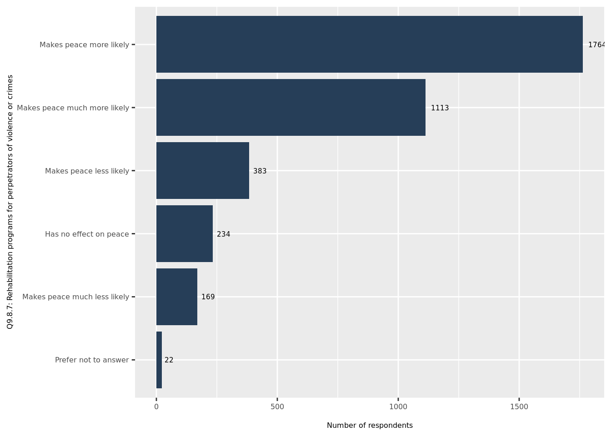

#### By county

<table class="table" style="width: auto !important; ">
 <thead>
  <tr>
   <th style="text-align:left;"> County </th>
   <th style="text-align:center;"> Most Common Response </th>
   <th style="text-align:left;"> Number of Responses </th>
   <th style="text-align:center;"> Percent of Total Responses </th>
  </tr>
 </thead>
<tbody>
  <tr>
   <td style="text-align:left;"> Bor South </td>
   <td style="text-align:center;"> Makes peace more likely </td>
   <td style="text-align:left;"> 209 </td>
   <td style="text-align:center;"> 100 </td>
  </tr>
  <tr>
   <td style="text-align:left;"> Kajo-keji </td>
   <td style="text-align:center;"> Makes peace more likely </td>
   <td style="text-align:left;"> 191 </td>
   <td style="text-align:center;"> 100 </td>
  </tr>
  <tr>
   <td style="text-align:left;"> Lainya </td>
   <td style="text-align:center;"> Makes peace more likely </td>
   <td style="text-align:left;"> 214 </td>
   <td style="text-align:center;"> 100 </td>
  </tr>
  <tr>
   <td style="text-align:left;"> Malakal </td>
   <td style="text-align:center;"> Makes peace more likely </td>
   <td style="text-align:left;"> 259 </td>
   <td style="text-align:center;"> 100 </td>
  </tr>
  <tr>
   <td style="text-align:left;"> Morobo </td>
   <td style="text-align:center;"> Makes peace much more likely </td>
   <td style="text-align:left;"> 158 </td>
   <td style="text-align:center;"> 100 </td>
  </tr>
  <tr>
   <td style="text-align:left;"> Pibor </td>
   <td style="text-align:center;"> Makes peace more likely </td>
   <td style="text-align:left;"> 187 </td>
   <td style="text-align:center;"> 100 </td>
  </tr>
  <tr>
   <td style="text-align:left;"> Rubkona </td>
   <td style="text-align:center;"> Makes peace much more likely </td>
   <td style="text-align:left;"> 177 </td>
   <td style="text-align:center;"> 100 </td>
  </tr>
  <tr>
   <td style="text-align:left;"> Wau </td>
   <td style="text-align:center;"> Makes peace more likely </td>
   <td style="text-align:left;"> 184 </td>
   <td style="text-align:center;"> 100 </td>
  </tr>
  <tr>
   <td style="text-align:left;"> Yei </td>
   <td style="text-align:center;"> Makes peace more likely </td>
   <td style="text-align:left;"> 257 </td>
   <td style="text-align:center;"> 100 </td>
  </tr>
</tbody>
</table>

<table class="table" style="width: auto !important; ">
 <thead>
  <tr>
   <th style="text-align:left;"> County </th>
   <th style="text-align:center;"> Response </th>
   <th style="text-align:left;"> Number of Responses </th>
   <th style="text-align:center;"> Percent of Total Responses </th>
  </tr>
 </thead>
<tbody>
  <tr>
   <td style="text-align:left;"> Yei </td>
   <td style="text-align:center;"> Has no effect on peace </td>
   <td style="text-align:left;"> 23 </td>
   <td style="text-align:center;"> 0.06 </td>
  </tr>
  <tr>
   <td style="text-align:left;"> Yei </td>
   <td style="text-align:center;"> Makes peace less likely </td>
   <td style="text-align:left;"> 37 </td>
   <td style="text-align:center;"> 0.09 </td>
  </tr>
  <tr>
   <td style="text-align:left;"> Yei </td>
   <td style="text-align:center;"> Makes peace more likely </td>
   <td style="text-align:left;"> 257 </td>
   <td style="text-align:center;"> 0.63 </td>
  </tr>
  <tr>
   <td style="text-align:left;"> Yei </td>
   <td style="text-align:center;"> Makes peace much less likely </td>
   <td style="text-align:left;"> 5 </td>
   <td style="text-align:center;"> 0.01 </td>
  </tr>
  <tr>
   <td style="text-align:left;"> Yei </td>
   <td style="text-align:center;"> Makes peace much more likely </td>
   <td style="text-align:left;"> 88 </td>
   <td style="text-align:center;"> 0.21 </td>
  </tr>
  <tr>
   <td style="text-align:left;"> Wau </td>
   <td style="text-align:center;"> Has no effect on peace </td>
   <td style="text-align:left;"> 17 </td>
   <td style="text-align:center;"> 0.04 </td>
  </tr>
  <tr>
   <td style="text-align:left;"> Wau </td>
   <td style="text-align:center;"> Makes peace less likely </td>
   <td style="text-align:left;"> 36 </td>
   <td style="text-align:center;"> 0.09 </td>
  </tr>
  <tr>
   <td style="text-align:left;"> Wau </td>
   <td style="text-align:center;"> Makes peace more likely </td>
   <td style="text-align:left;"> 184 </td>
   <td style="text-align:center;"> 0.46 </td>
  </tr>
  <tr>
   <td style="text-align:left;"> Wau </td>
   <td style="text-align:center;"> Makes peace much less likely </td>
   <td style="text-align:left;"> 23 </td>
   <td style="text-align:center;"> 0.06 </td>
  </tr>
  <tr>
   <td style="text-align:left;"> Wau </td>
   <td style="text-align:center;"> Makes peace much more likely </td>
   <td style="text-align:left;"> 135 </td>
   <td style="text-align:center;"> 0.34 </td>
  </tr>
  <tr>
   <td style="text-align:left;"> Wau </td>
   <td style="text-align:center;"> Prefer not to answer </td>
   <td style="text-align:left;"> 7 </td>
   <td style="text-align:center;"> 0.02 </td>
  </tr>
  <tr>
   <td style="text-align:left;"> Rubkona </td>
   <td style="text-align:center;"> Has no effect on peace </td>
   <td style="text-align:left;"> 9 </td>
   <td style="text-align:center;"> 0.02 </td>
  </tr>
  <tr>
   <td style="text-align:left;"> Rubkona </td>
   <td style="text-align:center;"> Makes peace less likely </td>
   <td style="text-align:left;"> 59 </td>
   <td style="text-align:center;"> 0.15 </td>
  </tr>
  <tr>
   <td style="text-align:left;"> Rubkona </td>
   <td style="text-align:center;"> Makes peace more likely </td>
   <td style="text-align:left;"> 123 </td>
   <td style="text-align:center;"> 0.31 </td>
  </tr>
  <tr>
   <td style="text-align:left;"> Rubkona </td>
   <td style="text-align:center;"> Makes peace much less likely </td>
   <td style="text-align:left;"> 31 </td>
   <td style="text-align:center;"> 0.08 </td>
  </tr>
  <tr>
   <td style="text-align:left;"> Rubkona </td>
   <td style="text-align:center;"> Makes peace much more likely </td>
   <td style="text-align:left;"> 177 </td>
   <td style="text-align:center;"> 0.44 </td>
  </tr>
  <tr>
   <td style="text-align:left;"> Rubkona </td>
   <td style="text-align:center;"> Prefer not to answer </td>
   <td style="text-align:left;"> 1 </td>
   <td style="text-align:center;"> 0.00 </td>
  </tr>
  <tr>
   <td style="text-align:left;"> Pibor </td>
   <td style="text-align:center;"> Has no effect on peace </td>
   <td style="text-align:left;"> 65 </td>
   <td style="text-align:center;"> 0.16 </td>
  </tr>
  <tr>
   <td style="text-align:left;"> Pibor </td>
   <td style="text-align:center;"> Makes peace less likely </td>
   <td style="text-align:left;"> 53 </td>
   <td style="text-align:center;"> 0.13 </td>
  </tr>
  <tr>
   <td style="text-align:left;"> Pibor </td>
   <td style="text-align:center;"> Makes peace more likely </td>
   <td style="text-align:left;"> 187 </td>
   <td style="text-align:center;"> 0.46 </td>
  </tr>
  <tr>
   <td style="text-align:left;"> Pibor </td>
   <td style="text-align:center;"> Makes peace much less likely </td>
   <td style="text-align:left;"> 34 </td>
   <td style="text-align:center;"> 0.08 </td>
  </tr>
  <tr>
   <td style="text-align:left;"> Pibor </td>
   <td style="text-align:center;"> Makes peace much more likely </td>
   <td style="text-align:left;"> 67 </td>
   <td style="text-align:center;"> 0.16 </td>
  </tr>
  <tr>
   <td style="text-align:left;"> Pibor </td>
   <td style="text-align:center;"> Prefer not to answer </td>
   <td style="text-align:left;"> 1 </td>
   <td style="text-align:center;"> 0.00 </td>
  </tr>
  <tr>
   <td style="text-align:left;"> Morobo </td>
   <td style="text-align:center;"> Has no effect on peace </td>
   <td style="text-align:left;"> 25 </td>
   <td style="text-align:center;"> 0.06 </td>
  </tr>
  <tr>
   <td style="text-align:left;"> Morobo </td>
   <td style="text-align:center;"> Makes peace less likely </td>
   <td style="text-align:left;"> 48 </td>
   <td style="text-align:center;"> 0.12 </td>
  </tr>
  <tr>
   <td style="text-align:left;"> Morobo </td>
   <td style="text-align:center;"> Makes peace more likely </td>
   <td style="text-align:left;"> 140 </td>
   <td style="text-align:center;"> 0.35 </td>
  </tr>
  <tr>
   <td style="text-align:left;"> Morobo </td>
   <td style="text-align:center;"> Makes peace much less likely </td>
   <td style="text-align:left;"> 33 </td>
   <td style="text-align:center;"> 0.08 </td>
  </tr>
  <tr>
   <td style="text-align:left;"> Morobo </td>
   <td style="text-align:center;"> Makes peace much more likely </td>
   <td style="text-align:left;"> 158 </td>
   <td style="text-align:center;"> 0.39 </td>
  </tr>
  <tr>
   <td style="text-align:left;"> Malakal </td>
   <td style="text-align:center;"> Has no effect on peace </td>
   <td style="text-align:left;"> 21 </td>
   <td style="text-align:center;"> 0.05 </td>
  </tr>
  <tr>
   <td style="text-align:left;"> Malakal </td>
   <td style="text-align:center;"> Makes peace less likely </td>
   <td style="text-align:left;"> 63 </td>
   <td style="text-align:center;"> 0.15 </td>
  </tr>
  <tr>
   <td style="text-align:left;"> Malakal </td>
   <td style="text-align:center;"> Makes peace more likely </td>
   <td style="text-align:left;"> 259 </td>
   <td style="text-align:center;"> 0.62 </td>
  </tr>
  <tr>
   <td style="text-align:left;"> Malakal </td>
   <td style="text-align:center;"> Makes peace much less likely </td>
   <td style="text-align:left;"> 3 </td>
   <td style="text-align:center;"> 0.01 </td>
  </tr>
  <tr>
   <td style="text-align:left;"> Malakal </td>
   <td style="text-align:center;"> Makes peace much more likely </td>
   <td style="text-align:left;"> 75 </td>
   <td style="text-align:center;"> 0.18 </td>
  </tr>
  <tr>
   <td style="text-align:left;"> Lainya </td>
   <td style="text-align:center;"> Has no effect on peace </td>
   <td style="text-align:left;"> 32 </td>
   <td style="text-align:center;"> 0.08 </td>
  </tr>
  <tr>
   <td style="text-align:left;"> Lainya </td>
   <td style="text-align:center;"> Makes peace less likely </td>
   <td style="text-align:left;"> 33 </td>
   <td style="text-align:center;"> 0.08 </td>
  </tr>
  <tr>
   <td style="text-align:left;"> Lainya </td>
   <td style="text-align:center;"> Makes peace more likely </td>
   <td style="text-align:left;"> 214 </td>
   <td style="text-align:center;"> 0.52 </td>
  </tr>
  <tr>
   <td style="text-align:left;"> Lainya </td>
   <td style="text-align:center;"> Makes peace much less likely </td>
   <td style="text-align:left;"> 12 </td>
   <td style="text-align:center;"> 0.03 </td>
  </tr>
  <tr>
   <td style="text-align:left;"> Lainya </td>
   <td style="text-align:center;"> Makes peace much more likely </td>
   <td style="text-align:left;"> 122 </td>
   <td style="text-align:center;"> 0.29 </td>
  </tr>
  <tr>
   <td style="text-align:left;"> Lainya </td>
   <td style="text-align:center;"> Prefer not to answer </td>
   <td style="text-align:left;"> 1 </td>
   <td style="text-align:center;"> 0.00 </td>
  </tr>
  <tr>
   <td style="text-align:left;"> Kajo-keji </td>
   <td style="text-align:center;"> Has no effect on peace </td>
   <td style="text-align:left;"> 20 </td>
   <td style="text-align:center;"> 0.05 </td>
  </tr>
  <tr>
   <td style="text-align:left;"> Kajo-keji </td>
   <td style="text-align:center;"> Makes peace less likely </td>
   <td style="text-align:left;"> 34 </td>
   <td style="text-align:center;"> 0.09 </td>
  </tr>
  <tr>
   <td style="text-align:left;"> Kajo-keji </td>
   <td style="text-align:center;"> Makes peace more likely </td>
   <td style="text-align:left;"> 191 </td>
   <td style="text-align:center;"> 0.48 </td>
  </tr>
  <tr>
   <td style="text-align:left;"> Kajo-keji </td>
   <td style="text-align:center;"> Makes peace much less likely </td>
   <td style="text-align:left;"> 8 </td>
   <td style="text-align:center;"> 0.02 </td>
  </tr>
  <tr>
   <td style="text-align:left;"> Kajo-keji </td>
   <td style="text-align:center;"> Makes peace much more likely </td>
   <td style="text-align:left;"> 133 </td>
   <td style="text-align:center;"> 0.33 </td>
  </tr>
  <tr>
   <td style="text-align:left;"> Kajo-keji </td>
   <td style="text-align:center;"> Prefer not to answer </td>
   <td style="text-align:left;"> 12 </td>
   <td style="text-align:center;"> 0.03 </td>
  </tr>
  <tr>
   <td style="text-align:left;"> Bor South </td>
   <td style="text-align:center;"> Has no effect on peace </td>
   <td style="text-align:left;"> 22 </td>
   <td style="text-align:center;"> 0.05 </td>
  </tr>
  <tr>
   <td style="text-align:left;"> Bor South </td>
   <td style="text-align:center;"> Makes peace less likely </td>
   <td style="text-align:left;"> 20 </td>
   <td style="text-align:center;"> 0.05 </td>
  </tr>
  <tr>
   <td style="text-align:left;"> Bor South </td>
   <td style="text-align:center;"> Makes peace more likely </td>
   <td style="text-align:left;"> 209 </td>
   <td style="text-align:center;"> 0.49 </td>
  </tr>
  <tr>
   <td style="text-align:left;"> Bor South </td>
   <td style="text-align:center;"> Makes peace much less likely </td>
   <td style="text-align:left;"> 20 </td>
   <td style="text-align:center;"> 0.05 </td>
  </tr>
  <tr>
   <td style="text-align:left;"> Bor South </td>
   <td style="text-align:center;"> Makes peace much more likely </td>
   <td style="text-align:left;"> 158 </td>
   <td style="text-align:center;"> 0.37 </td>
  </tr>
</tbody>
</table>

### **Q9.8.8 Criminal prosecutions for perpetrators of violence or crimes**

#### Entire sample


```
## Warning: There was 1 warning in `summarize()`.
## ℹ In argument: `mean = mean(Q9.8.8, na.rm = TRUE)`.
## Caused by warning in `mean.default()`:
## ! argument is not numeric or logical: returning NA
```

<table class="table" style="width: auto !important; ">
 <thead>
  <tr>
   <th style="text-align:left;"> mean </th>
  </tr>
 </thead>
<tbody>
  <tr>
   <td style="text-align:left;"> NA </td>
  </tr>
</tbody>
</table>

<table class="table" style="width: auto !important; ">
 <thead>
  <tr>
   <th style="text-align:left;"> Most Common Response </th>
   <th style="text-align:center;"> Number of Responses </th>
   <th style="text-align:left;"> Percent of Total Responses </th>
  </tr>
 </thead>
<tbody>
  <tr>
   <td style="text-align:left;"> Makes peace more likely </td>
   <td style="text-align:center;"> 1534 </td>
   <td style="text-align:left;"> 100 </td>
  </tr>
</tbody>
</table>

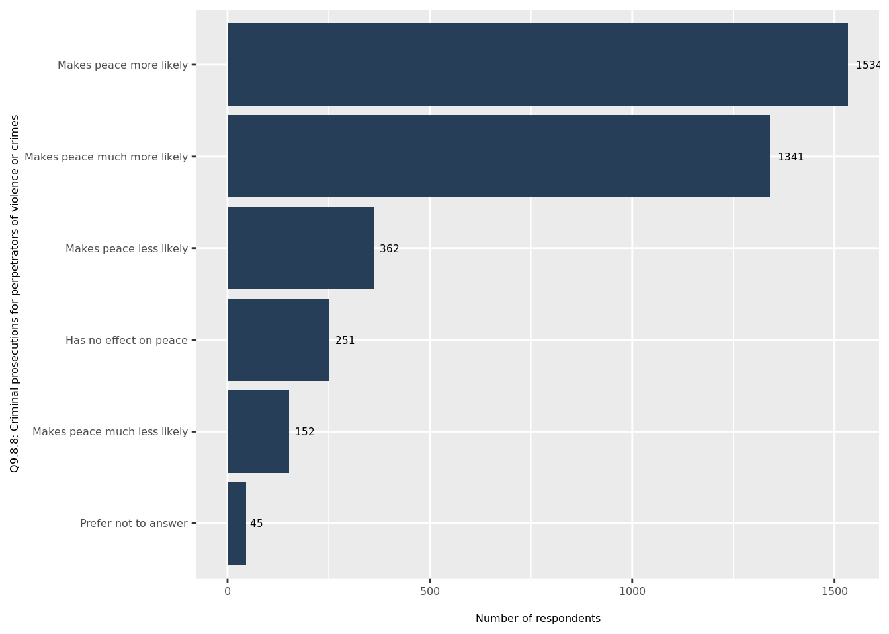

#### By county

<table class="table" style="width: auto !important; ">
 <thead>
  <tr>
   <th style="text-align:left;"> County </th>
   <th style="text-align:center;"> Most Common Response </th>
   <th style="text-align:left;"> Number of Responses </th>
   <th style="text-align:center;"> Percent of Total Responses </th>
  </tr>
 </thead>
<tbody>
  <tr>
   <td style="text-align:left;"> Bor South </td>
   <td style="text-align:center;"> Makes peace much more likely </td>
   <td style="text-align:left;"> 236 </td>
   <td style="text-align:center;"> 100 </td>
  </tr>
  <tr>
   <td style="text-align:left;"> Kajo-keji </td>
   <td style="text-align:center;"> Makes peace more likely </td>
   <td style="text-align:left;"> 163 </td>
   <td style="text-align:center;"> 100 </td>
  </tr>
  <tr>
   <td style="text-align:left;"> Lainya </td>
   <td style="text-align:center;"> Makes peace more likely </td>
   <td style="text-align:left;"> 184 </td>
   <td style="text-align:center;"> 100 </td>
  </tr>
  <tr>
   <td style="text-align:left;"> Malakal </td>
   <td style="text-align:center;"> Makes peace more likely </td>
   <td style="text-align:left;"> 248 </td>
   <td style="text-align:center;"> 100 </td>
  </tr>
  <tr>
   <td style="text-align:left;"> Morobo </td>
   <td style="text-align:center;"> Makes peace much more likely </td>
   <td style="text-align:left;"> 187 </td>
   <td style="text-align:center;"> 100 </td>
  </tr>
  <tr>
   <td style="text-align:left;"> Pibor </td>
   <td style="text-align:center;"> Makes peace more likely </td>
   <td style="text-align:left;"> 186 </td>
   <td style="text-align:center;"> 100 </td>
  </tr>
  <tr>
   <td style="text-align:left;"> Rubkona </td>
   <td style="text-align:center;"> Makes peace much more likely </td>
   <td style="text-align:left;"> 207 </td>
   <td style="text-align:center;"> 100 </td>
  </tr>
  <tr>
   <td style="text-align:left;"> Wau </td>
   <td style="text-align:center;"> Makes peace more likely </td>
   <td style="text-align:left;"> 164 </td>
   <td style="text-align:center;"> 100 </td>
  </tr>
  <tr>
   <td style="text-align:left;"> Yei </td>
   <td style="text-align:center;"> Makes peace more likely </td>
   <td style="text-align:left;"> 212 </td>
   <td style="text-align:center;"> 100 </td>
  </tr>
</tbody>
</table>

<table class="table" style="width: auto !important; ">
 <thead>
  <tr>
   <th style="text-align:left;"> County </th>
   <th style="text-align:center;"> Response </th>
   <th style="text-align:left;"> Number of Responses </th>
   <th style="text-align:center;"> Percent of Total Responses </th>
  </tr>
 </thead>
<tbody>
  <tr>
   <td style="text-align:left;"> Yei </td>
   <td style="text-align:center;"> Has no effect on peace </td>
   <td style="text-align:left;"> 29 </td>
   <td style="text-align:center;"> 0.07 </td>
  </tr>
  <tr>
   <td style="text-align:left;"> Yei </td>
   <td style="text-align:center;"> Makes peace less likely </td>
   <td style="text-align:left;"> 24 </td>
   <td style="text-align:center;"> 0.06 </td>
  </tr>
  <tr>
   <td style="text-align:left;"> Yei </td>
   <td style="text-align:center;"> Makes peace more likely </td>
   <td style="text-align:left;"> 212 </td>
   <td style="text-align:center;"> 0.52 </td>
  </tr>
  <tr>
   <td style="text-align:left;"> Yei </td>
   <td style="text-align:center;"> Makes peace much less likely </td>
   <td style="text-align:left;"> 6 </td>
   <td style="text-align:center;"> 0.01 </td>
  </tr>
  <tr>
   <td style="text-align:left;"> Yei </td>
   <td style="text-align:center;"> Makes peace much more likely </td>
   <td style="text-align:left;"> 139 </td>
   <td style="text-align:center;"> 0.34 </td>
  </tr>
  <tr>
   <td style="text-align:left;"> Wau </td>
   <td style="text-align:center;"> Has no effect on peace </td>
   <td style="text-align:left;"> 18 </td>
   <td style="text-align:center;"> 0.04 </td>
  </tr>
  <tr>
   <td style="text-align:left;"> Wau </td>
   <td style="text-align:center;"> Makes peace less likely </td>
   <td style="text-align:left;"> 46 </td>
   <td style="text-align:center;"> 0.11 </td>
  </tr>
  <tr>
   <td style="text-align:left;"> Wau </td>
   <td style="text-align:center;"> Makes peace more likely </td>
   <td style="text-align:left;"> 164 </td>
   <td style="text-align:center;"> 0.41 </td>
  </tr>
  <tr>
   <td style="text-align:left;"> Wau </td>
   <td style="text-align:center;"> Makes peace much less likely </td>
   <td style="text-align:left;"> 24 </td>
   <td style="text-align:center;"> 0.06 </td>
  </tr>
  <tr>
   <td style="text-align:left;"> Wau </td>
   <td style="text-align:center;"> Makes peace much more likely </td>
   <td style="text-align:left;"> 125 </td>
   <td style="text-align:center;"> 0.31 </td>
  </tr>
  <tr>
   <td style="text-align:left;"> Wau </td>
   <td style="text-align:center;"> Prefer not to answer </td>
   <td style="text-align:left;"> 25 </td>
   <td style="text-align:center;"> 0.06 </td>
  </tr>
  <tr>
   <td style="text-align:left;"> Rubkona </td>
   <td style="text-align:center;"> Has no effect on peace </td>
   <td style="text-align:left;"> 12 </td>
   <td style="text-align:center;"> 0.03 </td>
  </tr>
  <tr>
   <td style="text-align:left;"> Rubkona </td>
   <td style="text-align:center;"> Makes peace less likely </td>
   <td style="text-align:left;"> 53 </td>
   <td style="text-align:center;"> 0.13 </td>
  </tr>
  <tr>
   <td style="text-align:left;"> Rubkona </td>
   <td style="text-align:center;"> Makes peace more likely </td>
   <td style="text-align:left;"> 100 </td>
   <td style="text-align:center;"> 0.25 </td>
  </tr>
  <tr>
   <td style="text-align:left;"> Rubkona </td>
   <td style="text-align:center;"> Makes peace much less likely </td>
   <td style="text-align:left;"> 27 </td>
   <td style="text-align:center;"> 0.07 </td>
  </tr>
  <tr>
   <td style="text-align:left;"> Rubkona </td>
   <td style="text-align:center;"> Makes peace much more likely </td>
   <td style="text-align:left;"> 207 </td>
   <td style="text-align:center;"> 0.52 </td>
  </tr>
  <tr>
   <td style="text-align:left;"> Rubkona </td>
   <td style="text-align:center;"> Prefer not to answer </td>
   <td style="text-align:left;"> 1 </td>
   <td style="text-align:center;"> 0.00 </td>
  </tr>
  <tr>
   <td style="text-align:left;"> Pibor </td>
   <td style="text-align:center;"> Has no effect on peace </td>
   <td style="text-align:left;"> 68 </td>
   <td style="text-align:center;"> 0.17 </td>
  </tr>
  <tr>
   <td style="text-align:left;"> Pibor </td>
   <td style="text-align:center;"> Makes peace less likely </td>
   <td style="text-align:left;"> 47 </td>
   <td style="text-align:center;"> 0.12 </td>
  </tr>
  <tr>
   <td style="text-align:left;"> Pibor </td>
   <td style="text-align:center;"> Makes peace more likely </td>
   <td style="text-align:left;"> 186 </td>
   <td style="text-align:center;"> 0.46 </td>
  </tr>
  <tr>
   <td style="text-align:left;"> Pibor </td>
   <td style="text-align:center;"> Makes peace much less likely </td>
   <td style="text-align:left;"> 25 </td>
   <td style="text-align:center;"> 0.06 </td>
  </tr>
  <tr>
   <td style="text-align:left;"> Pibor </td>
   <td style="text-align:center;"> Makes peace much more likely </td>
   <td style="text-align:left;"> 80 </td>
   <td style="text-align:center;"> 0.20 </td>
  </tr>
  <tr>
   <td style="text-align:left;"> Pibor </td>
   <td style="text-align:center;"> Prefer not to answer </td>
   <td style="text-align:left;"> 1 </td>
   <td style="text-align:center;"> 0.00 </td>
  </tr>
  <tr>
   <td style="text-align:left;"> Morobo </td>
   <td style="text-align:center;"> Has no effect on peace </td>
   <td style="text-align:left;"> 36 </td>
   <td style="text-align:center;"> 0.09 </td>
  </tr>
  <tr>
   <td style="text-align:left;"> Morobo </td>
   <td style="text-align:center;"> Makes peace less likely </td>
   <td style="text-align:left;"> 36 </td>
   <td style="text-align:center;"> 0.09 </td>
  </tr>
  <tr>
   <td style="text-align:left;"> Morobo </td>
   <td style="text-align:center;"> Makes peace more likely </td>
   <td style="text-align:left;"> 121 </td>
   <td style="text-align:center;"> 0.30 </td>
  </tr>
  <tr>
   <td style="text-align:left;"> Morobo </td>
   <td style="text-align:center;"> Makes peace much less likely </td>
   <td style="text-align:left;"> 24 </td>
   <td style="text-align:center;"> 0.06 </td>
  </tr>
  <tr>
   <td style="text-align:left;"> Morobo </td>
   <td style="text-align:center;"> Makes peace much more likely </td>
   <td style="text-align:left;"> 187 </td>
   <td style="text-align:center;"> 0.46 </td>
  </tr>
  <tr>
   <td style="text-align:left;"> Malakal </td>
   <td style="text-align:center;"> Has no effect on peace </td>
   <td style="text-align:left;"> 32 </td>
   <td style="text-align:center;"> 0.08 </td>
  </tr>
  <tr>
   <td style="text-align:left;"> Malakal </td>
   <td style="text-align:center;"> Makes peace less likely </td>
   <td style="text-align:left;"> 56 </td>
   <td style="text-align:center;"> 0.13 </td>
  </tr>
  <tr>
   <td style="text-align:left;"> Malakal </td>
   <td style="text-align:center;"> Makes peace more likely </td>
   <td style="text-align:left;"> 248 </td>
   <td style="text-align:center;"> 0.59 </td>
  </tr>
  <tr>
   <td style="text-align:left;"> Malakal </td>
   <td style="text-align:center;"> Makes peace much less likely </td>
   <td style="text-align:left;"> 7 </td>
   <td style="text-align:center;"> 0.02 </td>
  </tr>
  <tr>
   <td style="text-align:left;"> Malakal </td>
   <td style="text-align:center;"> Makes peace much more likely </td>
   <td style="text-align:left;"> 78 </td>
   <td style="text-align:center;"> 0.19 </td>
  </tr>
  <tr>
   <td style="text-align:left;"> Lainya </td>
   <td style="text-align:center;"> Has no effect on peace </td>
   <td style="text-align:left;"> 35 </td>
   <td style="text-align:center;"> 0.08 </td>
  </tr>
  <tr>
   <td style="text-align:left;"> Lainya </td>
   <td style="text-align:center;"> Makes peace less likely </td>
   <td style="text-align:left;"> 29 </td>
   <td style="text-align:center;"> 0.07 </td>
  </tr>
  <tr>
   <td style="text-align:left;"> Lainya </td>
   <td style="text-align:center;"> Makes peace more likely </td>
   <td style="text-align:left;"> 184 </td>
   <td style="text-align:center;"> 0.44 </td>
  </tr>
  <tr>
   <td style="text-align:left;"> Lainya </td>
   <td style="text-align:center;"> Makes peace much less likely </td>
   <td style="text-align:left;"> 15 </td>
   <td style="text-align:center;"> 0.04 </td>
  </tr>
  <tr>
   <td style="text-align:left;"> Lainya </td>
   <td style="text-align:center;"> Makes peace much more likely </td>
   <td style="text-align:left;"> 147 </td>
   <td style="text-align:center;"> 0.36 </td>
  </tr>
  <tr>
   <td style="text-align:left;"> Lainya </td>
   <td style="text-align:center;"> Prefer not to answer </td>
   <td style="text-align:left;"> 4 </td>
   <td style="text-align:center;"> 0.01 </td>
  </tr>
  <tr>
   <td style="text-align:left;"> Kajo-keji </td>
   <td style="text-align:center;"> Has no effect on peace </td>
   <td style="text-align:left;"> 20 </td>
   <td style="text-align:center;"> 0.05 </td>
  </tr>
  <tr>
   <td style="text-align:left;"> Kajo-keji </td>
   <td style="text-align:center;"> Makes peace less likely </td>
   <td style="text-align:left;"> 49 </td>
   <td style="text-align:center;"> 0.12 </td>
  </tr>
  <tr>
   <td style="text-align:left;"> Kajo-keji </td>
   <td style="text-align:center;"> Makes peace more likely </td>
   <td style="text-align:left;"> 163 </td>
   <td style="text-align:center;"> 0.41 </td>
  </tr>
  <tr>
   <td style="text-align:left;"> Kajo-keji </td>
   <td style="text-align:center;"> Makes peace much less likely </td>
   <td style="text-align:left;"> 10 </td>
   <td style="text-align:center;"> 0.03 </td>
  </tr>
  <tr>
   <td style="text-align:left;"> Kajo-keji </td>
   <td style="text-align:center;"> Makes peace much more likely </td>
   <td style="text-align:left;"> 142 </td>
   <td style="text-align:center;"> 0.36 </td>
  </tr>
  <tr>
   <td style="text-align:left;"> Kajo-keji </td>
   <td style="text-align:center;"> Prefer not to answer </td>
   <td style="text-align:left;"> 14 </td>
   <td style="text-align:center;"> 0.04 </td>
  </tr>
  <tr>
   <td style="text-align:left;"> Bor South </td>
   <td style="text-align:center;"> Has no effect on peace </td>
   <td style="text-align:left;"> 1 </td>
   <td style="text-align:center;"> 0.00 </td>
  </tr>
  <tr>
   <td style="text-align:left;"> Bor South </td>
   <td style="text-align:center;"> Makes peace less likely </td>
   <td style="text-align:left;"> 22 </td>
   <td style="text-align:center;"> 0.05 </td>
  </tr>
  <tr>
   <td style="text-align:left;"> Bor South </td>
   <td style="text-align:center;"> Makes peace more likely </td>
   <td style="text-align:left;"> 156 </td>
   <td style="text-align:center;"> 0.36 </td>
  </tr>
  <tr>
   <td style="text-align:left;"> Bor South </td>
   <td style="text-align:center;"> Makes peace much less likely </td>
   <td style="text-align:left;"> 14 </td>
   <td style="text-align:center;"> 0.03 </td>
  </tr>
  <tr>
   <td style="text-align:left;"> Bor South </td>
   <td style="text-align:center;"> Makes peace much more likely </td>
   <td style="text-align:left;"> 236 </td>
   <td style="text-align:center;"> 0.55 </td>
  </tr>
</tbody>
</table>

### **Q9.8.9 A commission to discover the truth about the conflict**

#### Entire sample


```
## Warning: There was 1 warning in `summarize()`.
## ℹ In argument: `mean = mean(Q9.8.9, na.rm = TRUE)`.
## Caused by warning in `mean.default()`:
## ! argument is not numeric or logical: returning NA
```

<table class="table" style="width: auto !important; ">
 <thead>
  <tr>
   <th style="text-align:left;"> mean </th>
  </tr>
 </thead>
<tbody>
  <tr>
   <td style="text-align:left;"> NA </td>
  </tr>
</tbody>
</table>

<table class="table" style="width: auto !important; ">
 <thead>
  <tr>
   <th style="text-align:left;"> Most Common Response </th>
   <th style="text-align:center;"> Number of Responses </th>
   <th style="text-align:left;"> Percent of Total Responses </th>
  </tr>
 </thead>
<tbody>
  <tr>
   <td style="text-align:left;"> Makes peace more likely </td>
   <td style="text-align:center;"> 1626 </td>
   <td style="text-align:left;"> 100 </td>
  </tr>
</tbody>
</table>

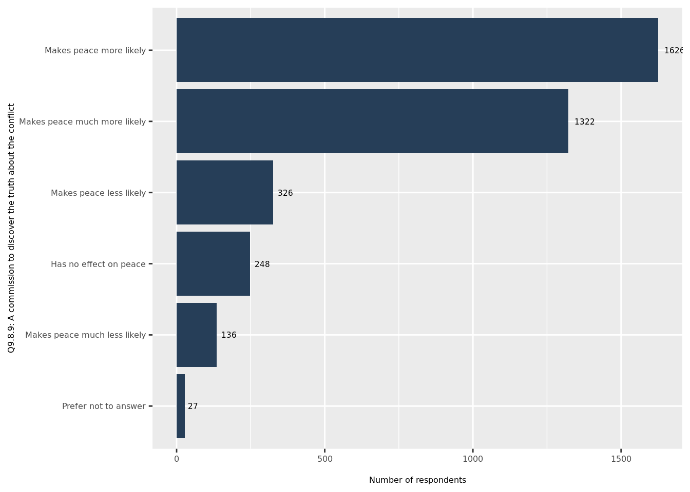

#### By county

<table class="table" style="width: auto !important; ">
 <thead>
  <tr>
   <th style="text-align:left;"> County </th>
   <th style="text-align:center;"> Most Common Response </th>
   <th style="text-align:left;"> Number of Responses </th>
   <th style="text-align:center;"> Percent of Total Responses </th>
  </tr>
 </thead>
<tbody>
  <tr>
   <td style="text-align:left;"> Bor South </td>
   <td style="text-align:center;"> Makes peace much more likely </td>
   <td style="text-align:left;"> 204 </td>
   <td style="text-align:center;"> 100 </td>
  </tr>
  <tr>
   <td style="text-align:left;"> Kajo-keji </td>
   <td style="text-align:center;"> Makes peace much more likely </td>
   <td style="text-align:left;"> 177 </td>
   <td style="text-align:center;"> 100 </td>
  </tr>
  <tr>
   <td style="text-align:left;"> Lainya </td>
   <td style="text-align:center;"> Makes peace more likely </td>
   <td style="text-align:left;"> 195 </td>
   <td style="text-align:center;"> 100 </td>
  </tr>
  <tr>
   <td style="text-align:left;"> Malakal </td>
   <td style="text-align:center;"> Makes peace more likely </td>
   <td style="text-align:left;"> 230 </td>
   <td style="text-align:center;"> 100 </td>
  </tr>
  <tr>
   <td style="text-align:left;"> Morobo </td>
   <td style="text-align:center;"> Makes peace much more likely </td>
   <td style="text-align:left;"> 153 </td>
   <td style="text-align:center;"> 100 </td>
  </tr>
  <tr>
   <td style="text-align:left;"> Pibor </td>
   <td style="text-align:center;"> Makes peace more likely </td>
   <td style="text-align:left;"> 183 </td>
   <td style="text-align:center;"> 100 </td>
  </tr>
  <tr>
   <td style="text-align:left;"> Rubkona </td>
   <td style="text-align:center;"> Makes peace much more likely </td>
   <td style="text-align:left;"> 232 </td>
   <td style="text-align:center;"> 100 </td>
  </tr>
  <tr>
   <td style="text-align:left;"> Wau </td>
   <td style="text-align:center;"> Makes peace more likely </td>
   <td style="text-align:left;"> 188 </td>
   <td style="text-align:center;"> 100 </td>
  </tr>
  <tr>
   <td style="text-align:left;"> Yei </td>
   <td style="text-align:center;"> Makes peace more likely </td>
   <td style="text-align:left;"> 259 </td>
   <td style="text-align:center;"> 100 </td>
  </tr>
</tbody>
</table>

<table class="table" style="width: auto !important; ">
 <thead>
  <tr>
   <th style="text-align:left;"> County </th>
   <th style="text-align:center;"> Response </th>
   <th style="text-align:left;"> Number of Responses </th>
   <th style="text-align:center;"> Percent of Total Responses </th>
  </tr>
 </thead>
<tbody>
  <tr>
   <td style="text-align:left;"> Yei </td>
   <td style="text-align:center;"> Has no effect on peace </td>
   <td style="text-align:left;"> 22 </td>
   <td style="text-align:center;"> 0.05 </td>
  </tr>
  <tr>
   <td style="text-align:left;"> Yei </td>
   <td style="text-align:center;"> Makes peace less likely </td>
   <td style="text-align:left;"> 30 </td>
   <td style="text-align:center;"> 0.07 </td>
  </tr>
  <tr>
   <td style="text-align:left;"> Yei </td>
   <td style="text-align:center;"> Makes peace more likely </td>
   <td style="text-align:left;"> 259 </td>
   <td style="text-align:center;"> 0.63 </td>
  </tr>
  <tr>
   <td style="text-align:left;"> Yei </td>
   <td style="text-align:center;"> Makes peace much less likely </td>
   <td style="text-align:left;"> 6 </td>
   <td style="text-align:center;"> 0.01 </td>
  </tr>
  <tr>
   <td style="text-align:left;"> Yei </td>
   <td style="text-align:center;"> Makes peace much more likely </td>
   <td style="text-align:left;"> 93 </td>
   <td style="text-align:center;"> 0.23 </td>
  </tr>
  <tr>
   <td style="text-align:left;"> Wau </td>
   <td style="text-align:center;"> Has no effect on peace </td>
   <td style="text-align:left;"> 17 </td>
   <td style="text-align:center;"> 0.04 </td>
  </tr>
  <tr>
   <td style="text-align:left;"> Wau </td>
   <td style="text-align:center;"> Makes peace less likely </td>
   <td style="text-align:left;"> 47 </td>
   <td style="text-align:center;"> 0.12 </td>
  </tr>
  <tr>
   <td style="text-align:left;"> Wau </td>
   <td style="text-align:center;"> Makes peace more likely </td>
   <td style="text-align:left;"> 188 </td>
   <td style="text-align:center;"> 0.47 </td>
  </tr>
  <tr>
   <td style="text-align:left;"> Wau </td>
   <td style="text-align:center;"> Makes peace much less likely </td>
   <td style="text-align:left;"> 27 </td>
   <td style="text-align:center;"> 0.07 </td>
  </tr>
  <tr>
   <td style="text-align:left;"> Wau </td>
   <td style="text-align:center;"> Makes peace much more likely </td>
   <td style="text-align:left;"> 115 </td>
   <td style="text-align:center;"> 0.29 </td>
  </tr>
  <tr>
   <td style="text-align:left;"> Wau </td>
   <td style="text-align:center;"> Prefer not to answer </td>
   <td style="text-align:left;"> 8 </td>
   <td style="text-align:center;"> 0.02 </td>
  </tr>
  <tr>
   <td style="text-align:left;"> Rubkona </td>
   <td style="text-align:center;"> Has no effect on peace </td>
   <td style="text-align:left;"> 4 </td>
   <td style="text-align:center;"> 0.01 </td>
  </tr>
  <tr>
   <td style="text-align:left;"> Rubkona </td>
   <td style="text-align:center;"> Makes peace less likely </td>
   <td style="text-align:left;"> 44 </td>
   <td style="text-align:center;"> 0.11 </td>
  </tr>
  <tr>
   <td style="text-align:left;"> Rubkona </td>
   <td style="text-align:center;"> Makes peace more likely </td>
   <td style="text-align:left;"> 92 </td>
   <td style="text-align:center;"> 0.23 </td>
  </tr>
  <tr>
   <td style="text-align:left;"> Rubkona </td>
   <td style="text-align:center;"> Makes peace much less likely </td>
   <td style="text-align:left;"> 28 </td>
   <td style="text-align:center;"> 0.07 </td>
  </tr>
  <tr>
   <td style="text-align:left;"> Rubkona </td>
   <td style="text-align:center;"> Makes peace much more likely </td>
   <td style="text-align:left;"> 232 </td>
   <td style="text-align:center;"> 0.58 </td>
  </tr>
  <tr>
   <td style="text-align:left;"> Pibor </td>
   <td style="text-align:center;"> Has no effect on peace </td>
   <td style="text-align:left;"> 62 </td>
   <td style="text-align:center;"> 0.15 </td>
  </tr>
  <tr>
   <td style="text-align:left;"> Pibor </td>
   <td style="text-align:center;"> Makes peace less likely </td>
   <td style="text-align:left;"> 33 </td>
   <td style="text-align:center;"> 0.08 </td>
  </tr>
  <tr>
   <td style="text-align:left;"> Pibor </td>
   <td style="text-align:center;"> Makes peace more likely </td>
   <td style="text-align:left;"> 183 </td>
   <td style="text-align:center;"> 0.45 </td>
  </tr>
  <tr>
   <td style="text-align:left;"> Pibor </td>
   <td style="text-align:center;"> Makes peace much less likely </td>
   <td style="text-align:left;"> 17 </td>
   <td style="text-align:center;"> 0.04 </td>
  </tr>
  <tr>
   <td style="text-align:left;"> Pibor </td>
   <td style="text-align:center;"> Makes peace much more likely </td>
   <td style="text-align:left;"> 111 </td>
   <td style="text-align:center;"> 0.27 </td>
  </tr>
  <tr>
   <td style="text-align:left;"> Pibor </td>
   <td style="text-align:center;"> Prefer not to answer </td>
   <td style="text-align:left;"> 1 </td>
   <td style="text-align:center;"> 0.00 </td>
  </tr>
  <tr>
   <td style="text-align:left;"> Morobo </td>
   <td style="text-align:center;"> Has no effect on peace </td>
   <td style="text-align:left;"> 45 </td>
   <td style="text-align:center;"> 0.11 </td>
  </tr>
  <tr>
   <td style="text-align:left;"> Morobo </td>
   <td style="text-align:center;"> Makes peace less likely </td>
   <td style="text-align:left;"> 38 </td>
   <td style="text-align:center;"> 0.09 </td>
  </tr>
  <tr>
   <td style="text-align:left;"> Morobo </td>
   <td style="text-align:center;"> Makes peace more likely </td>
   <td style="text-align:left;"> 142 </td>
   <td style="text-align:center;"> 0.35 </td>
  </tr>
  <tr>
   <td style="text-align:left;"> Morobo </td>
   <td style="text-align:center;"> Makes peace much less likely </td>
   <td style="text-align:left;"> 26 </td>
   <td style="text-align:center;"> 0.06 </td>
  </tr>
  <tr>
   <td style="text-align:left;"> Morobo </td>
   <td style="text-align:center;"> Makes peace much more likely </td>
   <td style="text-align:left;"> 153 </td>
   <td style="text-align:center;"> 0.38 </td>
  </tr>
  <tr>
   <td style="text-align:left;"> Malakal </td>
   <td style="text-align:center;"> Has no effect on peace </td>
   <td style="text-align:left;"> 17 </td>
   <td style="text-align:center;"> 0.04 </td>
  </tr>
  <tr>
   <td style="text-align:left;"> Malakal </td>
   <td style="text-align:center;"> Makes peace less likely </td>
   <td style="text-align:left;"> 62 </td>
   <td style="text-align:center;"> 0.15 </td>
  </tr>
  <tr>
   <td style="text-align:left;"> Malakal </td>
   <td style="text-align:center;"> Makes peace more likely </td>
   <td style="text-align:left;"> 230 </td>
   <td style="text-align:center;"> 0.55 </td>
  </tr>
  <tr>
   <td style="text-align:left;"> Malakal </td>
   <td style="text-align:center;"> Makes peace much less likely </td>
   <td style="text-align:left;"> 7 </td>
   <td style="text-align:center;"> 0.02 </td>
  </tr>
  <tr>
   <td style="text-align:left;"> Malakal </td>
   <td style="text-align:center;"> Makes peace much more likely </td>
   <td style="text-align:left;"> 105 </td>
   <td style="text-align:center;"> 0.25 </td>
  </tr>
  <tr>
   <td style="text-align:left;"> Lainya </td>
   <td style="text-align:center;"> Has no effect on peace </td>
   <td style="text-align:left;"> 50 </td>
   <td style="text-align:center;"> 0.12 </td>
  </tr>
  <tr>
   <td style="text-align:left;"> Lainya </td>
   <td style="text-align:center;"> Makes peace less likely </td>
   <td style="text-align:left;"> 30 </td>
   <td style="text-align:center;"> 0.07 </td>
  </tr>
  <tr>
   <td style="text-align:left;"> Lainya </td>
   <td style="text-align:center;"> Makes peace more likely </td>
   <td style="text-align:left;"> 195 </td>
   <td style="text-align:center;"> 0.47 </td>
  </tr>
  <tr>
   <td style="text-align:left;"> Lainya </td>
   <td style="text-align:center;"> Makes peace much less likely </td>
   <td style="text-align:left;"> 6 </td>
   <td style="text-align:center;"> 0.01 </td>
  </tr>
  <tr>
   <td style="text-align:left;"> Lainya </td>
   <td style="text-align:center;"> Makes peace much more likely </td>
   <td style="text-align:left;"> 132 </td>
   <td style="text-align:center;"> 0.32 </td>
  </tr>
  <tr>
   <td style="text-align:left;"> Lainya </td>
   <td style="text-align:center;"> Prefer not to answer </td>
   <td style="text-align:left;"> 1 </td>
   <td style="text-align:center;"> 0.00 </td>
  </tr>
  <tr>
   <td style="text-align:left;"> Kajo-keji </td>
   <td style="text-align:center;"> Has no effect on peace </td>
   <td style="text-align:left;"> 23 </td>
   <td style="text-align:center;"> 0.06 </td>
  </tr>
  <tr>
   <td style="text-align:left;"> Kajo-keji </td>
   <td style="text-align:center;"> Makes peace less likely </td>
   <td style="text-align:left;"> 34 </td>
   <td style="text-align:center;"> 0.09 </td>
  </tr>
  <tr>
   <td style="text-align:left;"> Kajo-keji </td>
   <td style="text-align:center;"> Makes peace more likely </td>
   <td style="text-align:left;"> 144 </td>
   <td style="text-align:center;"> 0.36 </td>
  </tr>
  <tr>
   <td style="text-align:left;"> Kajo-keji </td>
   <td style="text-align:center;"> Makes peace much less likely </td>
   <td style="text-align:left;"> 3 </td>
   <td style="text-align:center;"> 0.01 </td>
  </tr>
  <tr>
   <td style="text-align:left;"> Kajo-keji </td>
   <td style="text-align:center;"> Makes peace much more likely </td>
   <td style="text-align:left;"> 177 </td>
   <td style="text-align:center;"> 0.44 </td>
  </tr>
  <tr>
   <td style="text-align:left;"> Kajo-keji </td>
   <td style="text-align:center;"> Prefer not to answer </td>
   <td style="text-align:left;"> 17 </td>
   <td style="text-align:center;"> 0.04 </td>
  </tr>
  <tr>
   <td style="text-align:left;"> Bor South </td>
   <td style="text-align:center;"> Has no effect on peace </td>
   <td style="text-align:left;"> 8 </td>
   <td style="text-align:center;"> 0.02 </td>
  </tr>
  <tr>
   <td style="text-align:left;"> Bor South </td>
   <td style="text-align:center;"> Makes peace less likely </td>
   <td style="text-align:left;"> 8 </td>
   <td style="text-align:center;"> 0.02 </td>
  </tr>
  <tr>
   <td style="text-align:left;"> Bor South </td>
   <td style="text-align:center;"> Makes peace more likely </td>
   <td style="text-align:left;"> 193 </td>
   <td style="text-align:center;"> 0.45 </td>
  </tr>
  <tr>
   <td style="text-align:left;"> Bor South </td>
   <td style="text-align:center;"> Makes peace much less likely </td>
   <td style="text-align:left;"> 16 </td>
   <td style="text-align:center;"> 0.04 </td>
  </tr>
  <tr>
   <td style="text-align:left;"> Bor South </td>
   <td style="text-align:center;"> Makes peace much more likely </td>
   <td style="text-align:left;"> 204 </td>
   <td style="text-align:center;"> 0.48 </td>
  </tr>
</tbody>
</table>

### **Q9.8.10 A museum about the conflict**

#### Entire sample


```
## Warning: There was 1 warning in `summarize()`.
## ℹ In argument: `mean = mean(Q9.8.10, na.rm = TRUE)`.
## Caused by warning in `mean.default()`:
## ! argument is not numeric or logical: returning NA
```

<table class="table" style="width: auto !important; ">
 <thead>
  <tr>
   <th style="text-align:left;"> mean </th>
  </tr>
 </thead>
<tbody>
  <tr>
   <td style="text-align:left;"> NA </td>
  </tr>
</tbody>
</table>

<table class="table" style="width: auto !important; ">
 <thead>
  <tr>
   <th style="text-align:left;"> Most Common Response </th>
   <th style="text-align:center;"> Number of Responses </th>
   <th style="text-align:left;"> Percent of Total Responses </th>
  </tr>
 </thead>
<tbody>
  <tr>
   <td style="text-align:left;"> Makes peace more likely </td>
   <td style="text-align:center;"> 1524 </td>
   <td style="text-align:left;"> 100 </td>
  </tr>
</tbody>
</table>

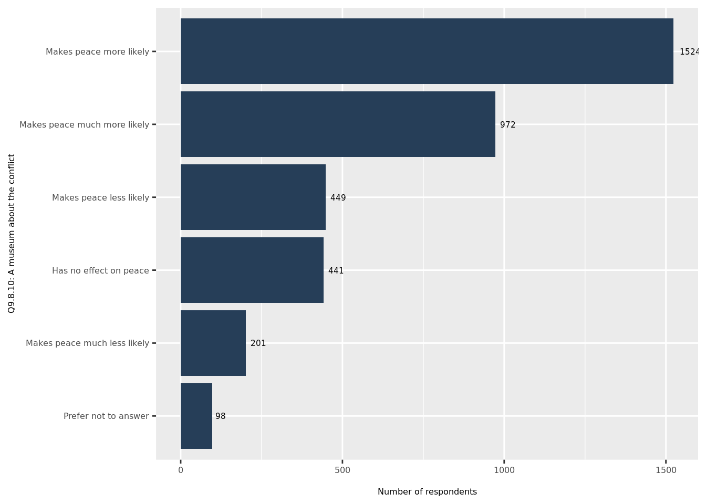

#### By county

<table class="table" style="width: auto !important; ">
 <thead>
  <tr>
   <th style="text-align:left;"> County </th>
   <th style="text-align:center;"> Most Common Response </th>
   <th style="text-align:left;"> Number of Responses </th>
   <th style="text-align:center;"> Percent of Total Responses </th>
  </tr>
 </thead>
<tbody>
  <tr>
   <td style="text-align:left;"> Bor South </td>
   <td style="text-align:center;"> Makes peace more likely </td>
   <td style="text-align:left;"> 182 </td>
   <td style="text-align:center;"> 100 </td>
  </tr>
  <tr>
   <td style="text-align:left;"> Kajo-keji </td>
   <td style="text-align:center;"> Makes peace more likely </td>
   <td style="text-align:left;"> 161 </td>
   <td style="text-align:center;"> 100 </td>
  </tr>
  <tr>
   <td style="text-align:left;"> Lainya </td>
   <td style="text-align:center;"> Makes peace more likely </td>
   <td style="text-align:left;"> 167 </td>
   <td style="text-align:center;"> 100 </td>
  </tr>
  <tr>
   <td style="text-align:left;"> Malakal </td>
   <td style="text-align:center;"> Makes peace more likely </td>
   <td style="text-align:left;"> 246 </td>
   <td style="text-align:center;"> 100 </td>
  </tr>
  <tr>
   <td style="text-align:left;"> Morobo </td>
   <td style="text-align:center;"> Makes peace much more likely </td>
   <td style="text-align:left;"> 108 </td>
   <td style="text-align:center;"> 100 </td>
  </tr>
  <tr>
   <td style="text-align:left;"> Pibor </td>
   <td style="text-align:center;"> Makes peace more likely </td>
   <td style="text-align:left;"> 171 </td>
   <td style="text-align:center;"> 100 </td>
  </tr>
  <tr>
   <td style="text-align:left;"> Rubkona </td>
   <td style="text-align:center;"> Makes peace much more likely </td>
   <td style="text-align:left;"> 176 </td>
   <td style="text-align:center;"> 100 </td>
  </tr>
  <tr>
   <td style="text-align:left;"> Wau </td>
   <td style="text-align:center;"> Makes peace more likely </td>
   <td style="text-align:left;"> 141 </td>
   <td style="text-align:center;"> 100 </td>
  </tr>
  <tr>
   <td style="text-align:left;"> Yei </td>
   <td style="text-align:center;"> Makes peace more likely </td>
   <td style="text-align:left;"> 235 </td>
   <td style="text-align:center;"> 100 </td>
  </tr>
</tbody>
</table>

<table class="table" style="width: auto !important; ">
 <thead>
  <tr>
   <th style="text-align:left;"> County </th>
   <th style="text-align:center;"> Response </th>
   <th style="text-align:left;"> Number of Responses </th>
   <th style="text-align:center;"> Percent of Total Responses </th>
  </tr>
 </thead>
<tbody>
  <tr>
   <td style="text-align:left;"> Yei </td>
   <td style="text-align:center;"> Has no effect on peace </td>
   <td style="text-align:left;"> 39 </td>
   <td style="text-align:center;"> 0.10 </td>
  </tr>
  <tr>
   <td style="text-align:left;"> Yei </td>
   <td style="text-align:center;"> Makes peace less likely </td>
   <td style="text-align:left;"> 49 </td>
   <td style="text-align:center;"> 0.12 </td>
  </tr>
  <tr>
   <td style="text-align:left;"> Yei </td>
   <td style="text-align:center;"> Makes peace more likely </td>
   <td style="text-align:left;"> 235 </td>
   <td style="text-align:center;"> 0.57 </td>
  </tr>
  <tr>
   <td style="text-align:left;"> Yei </td>
   <td style="text-align:center;"> Makes peace much less likely </td>
   <td style="text-align:left;"> 10 </td>
   <td style="text-align:center;"> 0.02 </td>
  </tr>
  <tr>
   <td style="text-align:left;"> Yei </td>
   <td style="text-align:center;"> Makes peace much more likely </td>
   <td style="text-align:left;"> 76 </td>
   <td style="text-align:center;"> 0.19 </td>
  </tr>
  <tr>
   <td style="text-align:left;"> Yei </td>
   <td style="text-align:center;"> Prefer not to answer </td>
   <td style="text-align:left;"> 1 </td>
   <td style="text-align:center;"> 0.00 </td>
  </tr>
  <tr>
   <td style="text-align:left;"> Wau </td>
   <td style="text-align:center;"> Has no effect on peace </td>
   <td style="text-align:left;"> 18 </td>
   <td style="text-align:center;"> 0.04 </td>
  </tr>
  <tr>
   <td style="text-align:left;"> Wau </td>
   <td style="text-align:center;"> Makes peace less likely </td>
   <td style="text-align:left;"> 31 </td>
   <td style="text-align:center;"> 0.08 </td>
  </tr>
  <tr>
   <td style="text-align:left;"> Wau </td>
   <td style="text-align:center;"> Makes peace more likely </td>
   <td style="text-align:left;"> 141 </td>
   <td style="text-align:center;"> 0.35 </td>
  </tr>
  <tr>
   <td style="text-align:left;"> Wau </td>
   <td style="text-align:center;"> Makes peace much less likely </td>
   <td style="text-align:left;"> 34 </td>
   <td style="text-align:center;"> 0.08 </td>
  </tr>
  <tr>
   <td style="text-align:left;"> Wau </td>
   <td style="text-align:center;"> Makes peace much more likely </td>
   <td style="text-align:left;"> 119 </td>
   <td style="text-align:center;"> 0.30 </td>
  </tr>
  <tr>
   <td style="text-align:left;"> Wau </td>
   <td style="text-align:center;"> Prefer not to answer </td>
   <td style="text-align:left;"> 59 </td>
   <td style="text-align:center;"> 0.15 </td>
  </tr>
  <tr>
   <td style="text-align:left;"> Rubkona </td>
   <td style="text-align:center;"> Has no effect on peace </td>
   <td style="text-align:left;"> 9 </td>
   <td style="text-align:center;"> 0.02 </td>
  </tr>
  <tr>
   <td style="text-align:left;"> Rubkona </td>
   <td style="text-align:center;"> Makes peace less likely </td>
   <td style="text-align:left;"> 58 </td>
   <td style="text-align:center;"> 0.14 </td>
  </tr>
  <tr>
   <td style="text-align:left;"> Rubkona </td>
   <td style="text-align:center;"> Makes peace more likely </td>
   <td style="text-align:left;"> 123 </td>
   <td style="text-align:center;"> 0.31 </td>
  </tr>
  <tr>
   <td style="text-align:left;"> Rubkona </td>
   <td style="text-align:center;"> Makes peace much less likely </td>
   <td style="text-align:left;"> 33 </td>
   <td style="text-align:center;"> 0.08 </td>
  </tr>
  <tr>
   <td style="text-align:left;"> Rubkona </td>
   <td style="text-align:center;"> Makes peace much more likely </td>
   <td style="text-align:left;"> 176 </td>
   <td style="text-align:center;"> 0.44 </td>
  </tr>
  <tr>
   <td style="text-align:left;"> Rubkona </td>
   <td style="text-align:center;"> Prefer not to answer </td>
   <td style="text-align:left;"> 1 </td>
   <td style="text-align:center;"> 0.00 </td>
  </tr>
  <tr>
   <td style="text-align:left;"> Pibor </td>
   <td style="text-align:center;"> Has no effect on peace </td>
   <td style="text-align:left;"> 78 </td>
   <td style="text-align:center;"> 0.19 </td>
  </tr>
  <tr>
   <td style="text-align:left;"> Pibor </td>
   <td style="text-align:center;"> Makes peace less likely </td>
   <td style="text-align:left;"> 44 </td>
   <td style="text-align:center;"> 0.11 </td>
  </tr>
  <tr>
   <td style="text-align:left;"> Pibor </td>
   <td style="text-align:center;"> Makes peace more likely </td>
   <td style="text-align:left;"> 171 </td>
   <td style="text-align:center;"> 0.42 </td>
  </tr>
  <tr>
   <td style="text-align:left;"> Pibor </td>
   <td style="text-align:center;"> Makes peace much less likely </td>
   <td style="text-align:left;"> 32 </td>
   <td style="text-align:center;"> 0.08 </td>
  </tr>
  <tr>
   <td style="text-align:left;"> Pibor </td>
   <td style="text-align:center;"> Makes peace much more likely </td>
   <td style="text-align:left;"> 74 </td>
   <td style="text-align:center;"> 0.18 </td>
  </tr>
  <tr>
   <td style="text-align:left;"> Pibor </td>
   <td style="text-align:center;"> Prefer not to answer </td>
   <td style="text-align:left;"> 8 </td>
   <td style="text-align:center;"> 0.02 </td>
  </tr>
  <tr>
   <td style="text-align:left;"> Morobo </td>
   <td style="text-align:center;"> Has no effect on peace </td>
   <td style="text-align:left;"> 77 </td>
   <td style="text-align:center;"> 0.19 </td>
  </tr>
  <tr>
   <td style="text-align:left;"> Morobo </td>
   <td style="text-align:center;"> Makes peace less likely </td>
   <td style="text-align:left;"> 80 </td>
   <td style="text-align:center;"> 0.20 </td>
  </tr>
  <tr>
   <td style="text-align:left;"> Morobo </td>
   <td style="text-align:center;"> Makes peace more likely </td>
   <td style="text-align:left;"> 98 </td>
   <td style="text-align:center;"> 0.24 </td>
  </tr>
  <tr>
   <td style="text-align:left;"> Morobo </td>
   <td style="text-align:center;"> Makes peace much less likely </td>
   <td style="text-align:left;"> 38 </td>
   <td style="text-align:center;"> 0.09 </td>
  </tr>
  <tr>
   <td style="text-align:left;"> Morobo </td>
   <td style="text-align:center;"> Makes peace much more likely </td>
   <td style="text-align:left;"> 108 </td>
   <td style="text-align:center;"> 0.27 </td>
  </tr>
  <tr>
   <td style="text-align:left;"> Morobo </td>
   <td style="text-align:center;"> Prefer not to answer </td>
   <td style="text-align:left;"> 3 </td>
   <td style="text-align:center;"> 0.01 </td>
  </tr>
  <tr>
   <td style="text-align:left;"> Malakal </td>
   <td style="text-align:center;"> Has no effect on peace </td>
   <td style="text-align:left;"> 34 </td>
   <td style="text-align:center;"> 0.08 </td>
  </tr>
  <tr>
   <td style="text-align:left;"> Malakal </td>
   <td style="text-align:center;"> Makes peace less likely </td>
   <td style="text-align:left;"> 66 </td>
   <td style="text-align:center;"> 0.16 </td>
  </tr>
  <tr>
   <td style="text-align:left;"> Malakal </td>
   <td style="text-align:center;"> Makes peace more likely </td>
   <td style="text-align:left;"> 246 </td>
   <td style="text-align:center;"> 0.58 </td>
  </tr>
  <tr>
   <td style="text-align:left;"> Malakal </td>
   <td style="text-align:center;"> Makes peace much less likely </td>
   <td style="text-align:left;"> 5 </td>
   <td style="text-align:center;"> 0.01 </td>
  </tr>
  <tr>
   <td style="text-align:left;"> Malakal </td>
   <td style="text-align:center;"> Makes peace much more likely </td>
   <td style="text-align:left;"> 70 </td>
   <td style="text-align:center;"> 0.17 </td>
  </tr>
  <tr>
   <td style="text-align:left;"> Lainya </td>
   <td style="text-align:center;"> Has no effect on peace </td>
   <td style="text-align:left;"> 75 </td>
   <td style="text-align:center;"> 0.18 </td>
  </tr>
  <tr>
   <td style="text-align:left;"> Lainya </td>
   <td style="text-align:center;"> Makes peace less likely </td>
   <td style="text-align:left;"> 48 </td>
   <td style="text-align:center;"> 0.12 </td>
  </tr>
  <tr>
   <td style="text-align:left;"> Lainya </td>
   <td style="text-align:center;"> Makes peace more likely </td>
   <td style="text-align:left;"> 167 </td>
   <td style="text-align:center;"> 0.40 </td>
  </tr>
  <tr>
   <td style="text-align:left;"> Lainya </td>
   <td style="text-align:center;"> Makes peace much less likely </td>
   <td style="text-align:left;"> 18 </td>
   <td style="text-align:center;"> 0.04 </td>
  </tr>
  <tr>
   <td style="text-align:left;"> Lainya </td>
   <td style="text-align:center;"> Makes peace much more likely </td>
   <td style="text-align:left;"> 101 </td>
   <td style="text-align:center;"> 0.24 </td>
  </tr>
  <tr>
   <td style="text-align:left;"> Lainya </td>
   <td style="text-align:center;"> Prefer not to answer </td>
   <td style="text-align:left;"> 5 </td>
   <td style="text-align:center;"> 0.01 </td>
  </tr>
  <tr>
   <td style="text-align:left;"> Kajo-keji </td>
   <td style="text-align:center;"> Has no effect on peace </td>
   <td style="text-align:left;"> 48 </td>
   <td style="text-align:center;"> 0.12 </td>
  </tr>
  <tr>
   <td style="text-align:left;"> Kajo-keji </td>
   <td style="text-align:center;"> Makes peace less likely </td>
   <td style="text-align:left;"> 41 </td>
   <td style="text-align:center;"> 0.10 </td>
  </tr>
  <tr>
   <td style="text-align:left;"> Kajo-keji </td>
   <td style="text-align:center;"> Makes peace more likely </td>
   <td style="text-align:left;"> 161 </td>
   <td style="text-align:center;"> 0.40 </td>
  </tr>
  <tr>
   <td style="text-align:left;"> Kajo-keji </td>
   <td style="text-align:center;"> Makes peace much less likely </td>
   <td style="text-align:left;"> 16 </td>
   <td style="text-align:center;"> 0.04 </td>
  </tr>
  <tr>
   <td style="text-align:left;"> Kajo-keji </td>
   <td style="text-align:center;"> Makes peace much more likely </td>
   <td style="text-align:left;"> 111 </td>
   <td style="text-align:center;"> 0.28 </td>
  </tr>
  <tr>
   <td style="text-align:left;"> Kajo-keji </td>
   <td style="text-align:center;"> Prefer not to answer </td>
   <td style="text-align:left;"> 21 </td>
   <td style="text-align:center;"> 0.05 </td>
  </tr>
  <tr>
   <td style="text-align:left;"> Bor South </td>
   <td style="text-align:center;"> Has no effect on peace </td>
   <td style="text-align:left;"> 63 </td>
   <td style="text-align:center;"> 0.15 </td>
  </tr>
  <tr>
   <td style="text-align:left;"> Bor South </td>
   <td style="text-align:center;"> Makes peace less likely </td>
   <td style="text-align:left;"> 32 </td>
   <td style="text-align:center;"> 0.07 </td>
  </tr>
  <tr>
   <td style="text-align:left;"> Bor South </td>
   <td style="text-align:center;"> Makes peace more likely </td>
   <td style="text-align:left;"> 182 </td>
   <td style="text-align:center;"> 0.42 </td>
  </tr>
  <tr>
   <td style="text-align:left;"> Bor South </td>
   <td style="text-align:center;"> Makes peace much less likely </td>
   <td style="text-align:left;"> 15 </td>
   <td style="text-align:center;"> 0.03 </td>
  </tr>
  <tr>
   <td style="text-align:left;"> Bor South </td>
   <td style="text-align:center;"> Makes peace much more likely </td>
   <td style="text-align:left;"> 137 </td>
   <td style="text-align:center;"> 0.32 </td>
  </tr>
</tbody>
</table>

### **Q9.8.11 Compensation or other reparations for victims**

#### Entire sample


```
## Warning: There was 1 warning in `summarize()`.
## ℹ In argument: `mean = mean(Q9.8.11, na.rm = TRUE)`.
## Caused by warning in `mean.default()`:
## ! argument is not numeric or logical: returning NA
```

<table class="table" style="width: auto !important; ">
 <thead>
  <tr>
   <th style="text-align:left;"> mean </th>
  </tr>
 </thead>
<tbody>
  <tr>
   <td style="text-align:left;"> NA </td>
  </tr>
</tbody>
</table>

<table class="table" style="width: auto !important; ">
 <thead>
  <tr>
   <th style="text-align:left;"> Most Common Response </th>
   <th style="text-align:center;"> Number of Responses </th>
   <th style="text-align:left;"> Percent of Total Responses </th>
  </tr>
 </thead>
<tbody>
  <tr>
   <td style="text-align:left;"> Makes peace more likely </td>
   <td style="text-align:center;"> 1633 </td>
   <td style="text-align:left;"> 100 </td>
  </tr>
</tbody>
</table>

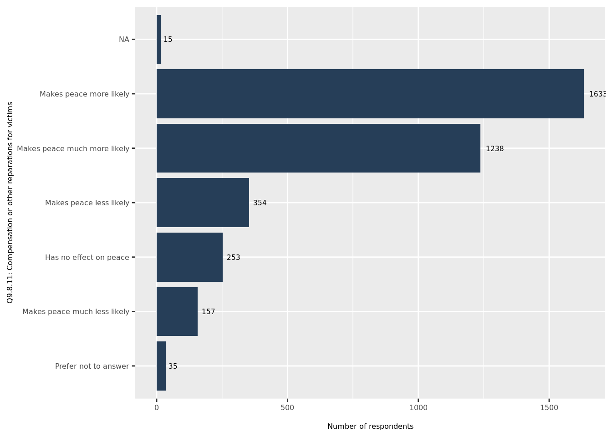

#### By county

<table class="table" style="width: auto !important; ">
 <thead>
  <tr>
   <th style="text-align:left;"> County </th>
   <th style="text-align:center;"> Most Common Response </th>
   <th style="text-align:left;"> Number of Responses </th>
   <th style="text-align:center;"> Percent of Total Responses </th>
  </tr>
 </thead>
<tbody>
  <tr>
   <td style="text-align:left;"> Bor South </td>
   <td style="text-align:center;"> Makes peace much more likely </td>
   <td style="text-align:left;"> 206 </td>
   <td style="text-align:center;"> 100 </td>
  </tr>
  <tr>
   <td style="text-align:left;"> Kajo-keji </td>
   <td style="text-align:center;"> Makes peace more likely </td>
   <td style="text-align:left;"> 154 </td>
   <td style="text-align:center;"> 100 </td>
  </tr>
  <tr>
   <td style="text-align:left;"> Lainya </td>
   <td style="text-align:center;"> Makes peace more likely </td>
   <td style="text-align:left;"> 180 </td>
   <td style="text-align:center;"> 100 </td>
  </tr>
  <tr>
   <td style="text-align:left;"> Malakal </td>
   <td style="text-align:center;"> Makes peace more likely </td>
   <td style="text-align:left;"> 261 </td>
   <td style="text-align:center;"> 100 </td>
  </tr>
  <tr>
   <td style="text-align:left;"> Morobo </td>
   <td style="text-align:center;"> Makes peace much more likely </td>
   <td style="text-align:left;"> 170 </td>
   <td style="text-align:center;"> 100 </td>
  </tr>
  <tr>
   <td style="text-align:left;"> Pibor </td>
   <td style="text-align:center;"> Makes peace more likely </td>
   <td style="text-align:left;"> 197 </td>
   <td style="text-align:center;"> 100 </td>
  </tr>
  <tr>
   <td style="text-align:left;"> Rubkona </td>
   <td style="text-align:center;"> Makes peace much more likely </td>
   <td style="text-align:left;"> 211 </td>
   <td style="text-align:center;"> 100 </td>
  </tr>
  <tr>
   <td style="text-align:left;"> Wau </td>
   <td style="text-align:center;"> Makes peace more likely </td>
   <td style="text-align:left;"> 162 </td>
   <td style="text-align:center;"> 100 </td>
  </tr>
  <tr>
   <td style="text-align:left;"> Yei </td>
   <td style="text-align:center;"> Makes peace more likely </td>
   <td style="text-align:left;"> 241 </td>
   <td style="text-align:center;"> 100 </td>
  </tr>
</tbody>
</table>

<table class="table" style="width: auto !important; ">
 <thead>
  <tr>
   <th style="text-align:left;"> County </th>
   <th style="text-align:center;"> Response </th>
   <th style="text-align:left;"> Number of Responses </th>
   <th style="text-align:center;"> Percent of Total Responses </th>
  </tr>
 </thead>
<tbody>
  <tr>
   <td style="text-align:left;"> Yei </td>
   <td style="text-align:center;"> Has no effect on peace </td>
   <td style="text-align:left;"> 34 </td>
   <td style="text-align:center;"> 0.08 </td>
  </tr>
  <tr>
   <td style="text-align:left;"> Yei </td>
   <td style="text-align:center;"> Makes peace less likely </td>
   <td style="text-align:left;"> 31 </td>
   <td style="text-align:center;"> 0.08 </td>
  </tr>
  <tr>
   <td style="text-align:left;"> Yei </td>
   <td style="text-align:center;"> Makes peace more likely </td>
   <td style="text-align:left;"> 241 </td>
   <td style="text-align:center;"> 0.59 </td>
  </tr>
  <tr>
   <td style="text-align:left;"> Yei </td>
   <td style="text-align:center;"> Makes peace much less likely </td>
   <td style="text-align:left;"> 5 </td>
   <td style="text-align:center;"> 0.01 </td>
  </tr>
  <tr>
   <td style="text-align:left;"> Yei </td>
   <td style="text-align:center;"> Makes peace much more likely </td>
   <td style="text-align:left;"> 98 </td>
   <td style="text-align:center;"> 0.24 </td>
  </tr>
  <tr>
   <td style="text-align:left;"> Yei </td>
   <td style="text-align:center;"> Prefer not to answer </td>
   <td style="text-align:left;"> 1 </td>
   <td style="text-align:center;"> 0.00 </td>
  </tr>
  <tr>
   <td style="text-align:left;"> Wau </td>
   <td style="text-align:center;"> Has no effect on peace </td>
   <td style="text-align:left;"> 12 </td>
   <td style="text-align:center;"> 0.03 </td>
  </tr>
  <tr>
   <td style="text-align:left;"> Wau </td>
   <td style="text-align:center;"> Makes peace less likely </td>
   <td style="text-align:left;"> 60 </td>
   <td style="text-align:center;"> 0.15 </td>
  </tr>
  <tr>
   <td style="text-align:left;"> Wau </td>
   <td style="text-align:center;"> Makes peace more likely </td>
   <td style="text-align:left;"> 162 </td>
   <td style="text-align:center;"> 0.40 </td>
  </tr>
  <tr>
   <td style="text-align:left;"> Wau </td>
   <td style="text-align:center;"> Makes peace much less likely </td>
   <td style="text-align:left;"> 29 </td>
   <td style="text-align:center;"> 0.07 </td>
  </tr>
  <tr>
   <td style="text-align:left;"> Wau </td>
   <td style="text-align:center;"> Makes peace much more likely </td>
   <td style="text-align:left;"> 129 </td>
   <td style="text-align:center;"> 0.32 </td>
  </tr>
  <tr>
   <td style="text-align:left;"> Wau </td>
   <td style="text-align:center;"> Prefer not to answer </td>
   <td style="text-align:left;"> 7 </td>
   <td style="text-align:center;"> 0.02 </td>
  </tr>
  <tr>
   <td style="text-align:left;"> Wau </td>
   <td style="text-align:center;"> NA </td>
   <td style="text-align:left;"> 3 </td>
   <td style="text-align:center;"> 0.01 </td>
  </tr>
  <tr>
   <td style="text-align:left;"> Rubkona </td>
   <td style="text-align:center;"> Has no effect on peace </td>
   <td style="text-align:left;"> 4 </td>
   <td style="text-align:center;"> 0.01 </td>
  </tr>
  <tr>
   <td style="text-align:left;"> Rubkona </td>
   <td style="text-align:center;"> Makes peace less likely </td>
   <td style="text-align:left;"> 35 </td>
   <td style="text-align:center;"> 0.09 </td>
  </tr>
  <tr>
   <td style="text-align:left;"> Rubkona </td>
   <td style="text-align:center;"> Makes peace more likely </td>
   <td style="text-align:left;"> 116 </td>
   <td style="text-align:center;"> 0.29 </td>
  </tr>
  <tr>
   <td style="text-align:left;"> Rubkona </td>
   <td style="text-align:center;"> Makes peace much less likely </td>
   <td style="text-align:left;"> 32 </td>
   <td style="text-align:center;"> 0.08 </td>
  </tr>
  <tr>
   <td style="text-align:left;"> Rubkona </td>
   <td style="text-align:center;"> Makes peace much more likely </td>
   <td style="text-align:left;"> 211 </td>
   <td style="text-align:center;"> 0.53 </td>
  </tr>
  <tr>
   <td style="text-align:left;"> Rubkona </td>
   <td style="text-align:center;"> Prefer not to answer </td>
   <td style="text-align:left;"> 1 </td>
   <td style="text-align:center;"> 0.00 </td>
  </tr>
  <tr>
   <td style="text-align:left;"> Rubkona </td>
   <td style="text-align:center;"> NA </td>
   <td style="text-align:left;"> 1 </td>
   <td style="text-align:center;"> 0.00 </td>
  </tr>
  <tr>
   <td style="text-align:left;"> Pibor </td>
   <td style="text-align:center;"> Has no effect on peace </td>
   <td style="text-align:left;"> 66 </td>
   <td style="text-align:center;"> 0.16 </td>
  </tr>
  <tr>
   <td style="text-align:left;"> Pibor </td>
   <td style="text-align:center;"> Makes peace less likely </td>
   <td style="text-align:left;"> 46 </td>
   <td style="text-align:center;"> 0.11 </td>
  </tr>
  <tr>
   <td style="text-align:left;"> Pibor </td>
   <td style="text-align:center;"> Makes peace more likely </td>
   <td style="text-align:left;"> 197 </td>
   <td style="text-align:center;"> 0.48 </td>
  </tr>
  <tr>
   <td style="text-align:left;"> Pibor </td>
   <td style="text-align:center;"> Makes peace much less likely </td>
   <td style="text-align:left;"> 19 </td>
   <td style="text-align:center;"> 0.05 </td>
  </tr>
  <tr>
   <td style="text-align:left;"> Pibor </td>
   <td style="text-align:center;"> Makes peace much more likely </td>
   <td style="text-align:left;"> 77 </td>
   <td style="text-align:center;"> 0.19 </td>
  </tr>
  <tr>
   <td style="text-align:left;"> Pibor </td>
   <td style="text-align:center;"> Prefer not to answer </td>
   <td style="text-align:left;"> 2 </td>
   <td style="text-align:center;"> 0.00 </td>
  </tr>
  <tr>
   <td style="text-align:left;"> Morobo </td>
   <td style="text-align:center;"> Has no effect on peace </td>
   <td style="text-align:left;"> 42 </td>
   <td style="text-align:center;"> 0.10 </td>
  </tr>
  <tr>
   <td style="text-align:left;"> Morobo </td>
   <td style="text-align:center;"> Makes peace less likely </td>
   <td style="text-align:left;"> 37 </td>
   <td style="text-align:center;"> 0.09 </td>
  </tr>
  <tr>
   <td style="text-align:left;"> Morobo </td>
   <td style="text-align:center;"> Makes peace more likely </td>
   <td style="text-align:left;"> 126 </td>
   <td style="text-align:center;"> 0.31 </td>
  </tr>
  <tr>
   <td style="text-align:left;"> Morobo </td>
   <td style="text-align:center;"> Makes peace much less likely </td>
   <td style="text-align:left;"> 26 </td>
   <td style="text-align:center;"> 0.06 </td>
  </tr>
  <tr>
   <td style="text-align:left;"> Morobo </td>
   <td style="text-align:center;"> Makes peace much more likely </td>
   <td style="text-align:left;"> 170 </td>
   <td style="text-align:center;"> 0.42 </td>
  </tr>
  <tr>
   <td style="text-align:left;"> Morobo </td>
   <td style="text-align:center;"> NA </td>
   <td style="text-align:left;"> 3 </td>
   <td style="text-align:center;"> 0.01 </td>
  </tr>
  <tr>
   <td style="text-align:left;"> Malakal </td>
   <td style="text-align:center;"> Has no effect on peace </td>
   <td style="text-align:left;"> 24 </td>
   <td style="text-align:center;"> 0.06 </td>
  </tr>
  <tr>
   <td style="text-align:left;"> Malakal </td>
   <td style="text-align:center;"> Makes peace less likely </td>
   <td style="text-align:left;"> 63 </td>
   <td style="text-align:center;"> 0.15 </td>
  </tr>
  <tr>
   <td style="text-align:left;"> Malakal </td>
   <td style="text-align:center;"> Makes peace more likely </td>
   <td style="text-align:left;"> 261 </td>
   <td style="text-align:center;"> 0.62 </td>
  </tr>
  <tr>
   <td style="text-align:left;"> Malakal </td>
   <td style="text-align:center;"> Makes peace much less likely </td>
   <td style="text-align:left;"> 1 </td>
   <td style="text-align:center;"> 0.00 </td>
  </tr>
  <tr>
   <td style="text-align:left;"> Malakal </td>
   <td style="text-align:center;"> Makes peace much more likely </td>
   <td style="text-align:left;"> 72 </td>
   <td style="text-align:center;"> 0.17 </td>
  </tr>
  <tr>
   <td style="text-align:left;"> Lainya </td>
   <td style="text-align:center;"> Has no effect on peace </td>
   <td style="text-align:left;"> 45 </td>
   <td style="text-align:center;"> 0.11 </td>
  </tr>
  <tr>
   <td style="text-align:left;"> Lainya </td>
   <td style="text-align:center;"> Makes peace less likely </td>
   <td style="text-align:left;"> 32 </td>
   <td style="text-align:center;"> 0.08 </td>
  </tr>
  <tr>
   <td style="text-align:left;"> Lainya </td>
   <td style="text-align:center;"> Makes peace more likely </td>
   <td style="text-align:left;"> 180 </td>
   <td style="text-align:center;"> 0.43 </td>
  </tr>
  <tr>
   <td style="text-align:left;"> Lainya </td>
   <td style="text-align:center;"> Makes peace much less likely </td>
   <td style="text-align:left;"> 14 </td>
   <td style="text-align:center;"> 0.03 </td>
  </tr>
  <tr>
   <td style="text-align:left;"> Lainya </td>
   <td style="text-align:center;"> Makes peace much more likely </td>
   <td style="text-align:left;"> 142 </td>
   <td style="text-align:center;"> 0.34 </td>
  </tr>
  <tr>
   <td style="text-align:left;"> Lainya </td>
   <td style="text-align:center;"> Prefer not to answer </td>
   <td style="text-align:left;"> 1 </td>
   <td style="text-align:center;"> 0.00 </td>
  </tr>
  <tr>
   <td style="text-align:left;"> Kajo-keji </td>
   <td style="text-align:center;"> Has no effect on peace </td>
   <td style="text-align:left;"> 24 </td>
   <td style="text-align:center;"> 0.06 </td>
  </tr>
  <tr>
   <td style="text-align:left;"> Kajo-keji </td>
   <td style="text-align:center;"> Makes peace less likely </td>
   <td style="text-align:left;"> 41 </td>
   <td style="text-align:center;"> 0.10 </td>
  </tr>
  <tr>
   <td style="text-align:left;"> Kajo-keji </td>
   <td style="text-align:center;"> Makes peace more likely </td>
   <td style="text-align:left;"> 154 </td>
   <td style="text-align:center;"> 0.39 </td>
  </tr>
  <tr>
   <td style="text-align:left;"> Kajo-keji </td>
   <td style="text-align:center;"> Makes peace much less likely </td>
   <td style="text-align:left;"> 16 </td>
   <td style="text-align:center;"> 0.04 </td>
  </tr>
  <tr>
   <td style="text-align:left;"> Kajo-keji </td>
   <td style="text-align:center;"> Makes peace much more likely </td>
   <td style="text-align:left;"> 133 </td>
   <td style="text-align:center;"> 0.33 </td>
  </tr>
  <tr>
   <td style="text-align:left;"> Kajo-keji </td>
   <td style="text-align:center;"> Prefer not to answer </td>
   <td style="text-align:left;"> 23 </td>
   <td style="text-align:center;"> 0.06 </td>
  </tr>
  <tr>
   <td style="text-align:left;"> Kajo-keji </td>
   <td style="text-align:center;"> NA </td>
   <td style="text-align:left;"> 7 </td>
   <td style="text-align:center;"> 0.02 </td>
  </tr>
  <tr>
   <td style="text-align:left;"> Bor South </td>
   <td style="text-align:center;"> Has no effect on peace </td>
   <td style="text-align:left;"> 2 </td>
   <td style="text-align:center;"> 0.00 </td>
  </tr>
  <tr>
   <td style="text-align:left;"> Bor South </td>
   <td style="text-align:center;"> Makes peace less likely </td>
   <td style="text-align:left;"> 9 </td>
   <td style="text-align:center;"> 0.02 </td>
  </tr>
  <tr>
   <td style="text-align:left;"> Bor South </td>
   <td style="text-align:center;"> Makes peace more likely </td>
   <td style="text-align:left;"> 196 </td>
   <td style="text-align:center;"> 0.46 </td>
  </tr>
  <tr>
   <td style="text-align:left;"> Bor South </td>
   <td style="text-align:center;"> Makes peace much less likely </td>
   <td style="text-align:left;"> 15 </td>
   <td style="text-align:center;"> 0.03 </td>
  </tr>
  <tr>
   <td style="text-align:left;"> Bor South </td>
   <td style="text-align:center;"> Makes peace much more likely </td>
   <td style="text-align:left;"> 206 </td>
   <td style="text-align:center;"> 0.48 </td>
  </tr>
  <tr>
   <td style="text-align:left;"> Bor South </td>
   <td style="text-align:center;"> NA </td>
   <td style="text-align:left;"> 1 </td>
   <td style="text-align:center;"> 0.00 </td>
  </tr>
</tbody>
</table>

### **Q9.8.12 Draft a new permanent constitution**

#### Entire sample


```
## Warning: There was 1 warning in `summarize()`.
## ℹ In argument: `mean = mean(Q9.8.12, na.rm = TRUE)`.
## Caused by warning in `mean.default()`:
## ! argument is not numeric or logical: returning NA
```

<table class="table" style="width: auto !important; ">
 <thead>
  <tr>
   <th style="text-align:left;"> mean </th>
  </tr>
 </thead>
<tbody>
  <tr>
   <td style="text-align:left;"> NA </td>
  </tr>
</tbody>
</table>

<table class="table" style="width: auto !important; ">
 <thead>
  <tr>
   <th style="text-align:left;"> Most Common Response </th>
   <th style="text-align:center;"> Number of Responses </th>
   <th style="text-align:left;"> Percent of Total Responses </th>
  </tr>
 </thead>
<tbody>
  <tr>
   <td style="text-align:left;"> Makes peace more likely </td>
   <td style="text-align:center;"> 1466 </td>
   <td style="text-align:left;"> 100 </td>
  </tr>
</tbody>
</table>

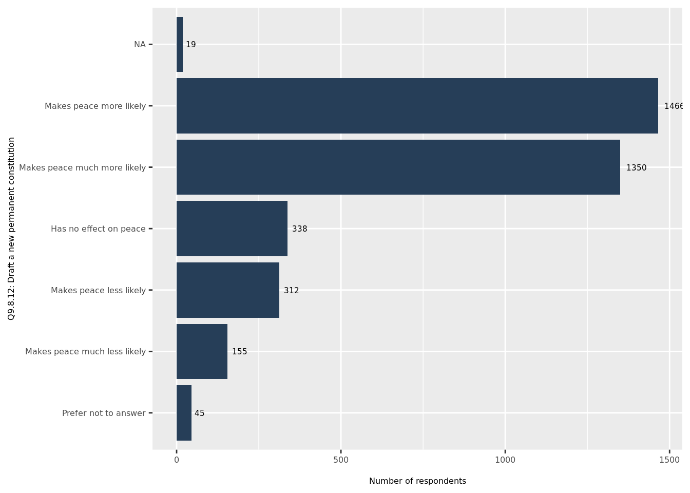

#### By county

<table class="table" style="width: auto !important; ">
 <thead>
  <tr>
   <th style="text-align:left;"> County </th>
   <th style="text-align:center;"> Most Common Response </th>
   <th style="text-align:left;"> Number of Responses </th>
   <th style="text-align:center;"> Percent of Total Responses </th>
  </tr>
 </thead>
<tbody>
  <tr>
   <td style="text-align:left;"> Bor South </td>
   <td style="text-align:center;"> Makes peace much more likely </td>
   <td style="text-align:left;"> 203 </td>
   <td style="text-align:center;"> 100 </td>
  </tr>
  <tr>
   <td style="text-align:left;"> Kajo-keji </td>
   <td style="text-align:center;"> Makes peace much more likely </td>
   <td style="text-align:left;"> 183 </td>
   <td style="text-align:center;"> 100 </td>
  </tr>
  <tr>
   <td style="text-align:left;"> Lainya </td>
   <td style="text-align:center;"> Makes peace more likely </td>
   <td style="text-align:left;"> 169 </td>
   <td style="text-align:center;"> 100 </td>
  </tr>
  <tr>
   <td style="text-align:left;"> Malakal </td>
   <td style="text-align:center;"> Makes peace more likely </td>
   <td style="text-align:left;"> 280 </td>
   <td style="text-align:center;"> 100 </td>
  </tr>
  <tr>
   <td style="text-align:left;"> Morobo </td>
   <td style="text-align:center;"> Makes peace much more likely </td>
   <td style="text-align:left;"> 149 </td>
   <td style="text-align:center;"> 100 </td>
  </tr>
  <tr>
   <td style="text-align:left;"> Pibor </td>
   <td style="text-align:center;"> Makes peace more likely </td>
   <td style="text-align:left;"> 176 </td>
   <td style="text-align:center;"> 100 </td>
  </tr>
  <tr>
   <td style="text-align:left;"> Rubkona </td>
   <td style="text-align:center;"> Makes peace much more likely </td>
   <td style="text-align:left;"> 247 </td>
   <td style="text-align:center;"> 100 </td>
  </tr>
  <tr>
   <td style="text-align:left;"> Wau </td>
   <td style="text-align:center;"> Makes peace more likely </td>
   <td style="text-align:left;"> 157 </td>
   <td style="text-align:center;"> 100 </td>
  </tr>
  <tr>
   <td style="text-align:left;"> Yei </td>
   <td style="text-align:center;"> Makes peace more likely </td>
   <td style="text-align:left;"> 206 </td>
   <td style="text-align:center;"> 100 </td>
  </tr>
</tbody>
</table>

<table class="table" style="width: auto !important; ">
 <thead>
  <tr>
   <th style="text-align:left;"> County </th>
   <th style="text-align:center;"> Response </th>
   <th style="text-align:left;"> Number of Responses </th>
   <th style="text-align:center;"> Percent of Total Responses </th>
  </tr>
 </thead>
<tbody>
  <tr>
   <td style="text-align:left;"> Yei </td>
   <td style="text-align:center;"> Has no effect on peace </td>
   <td style="text-align:left;"> 35 </td>
   <td style="text-align:center;"> 0.09 </td>
  </tr>
  <tr>
   <td style="text-align:left;"> Yei </td>
   <td style="text-align:center;"> Makes peace less likely </td>
   <td style="text-align:left;"> 26 </td>
   <td style="text-align:center;"> 0.06 </td>
  </tr>
  <tr>
   <td style="text-align:left;"> Yei </td>
   <td style="text-align:center;"> Makes peace more likely </td>
   <td style="text-align:left;"> 206 </td>
   <td style="text-align:center;"> 0.50 </td>
  </tr>
  <tr>
   <td style="text-align:left;"> Yei </td>
   <td style="text-align:center;"> Makes peace much less likely </td>
   <td style="text-align:left;"> 6 </td>
   <td style="text-align:center;"> 0.01 </td>
  </tr>
  <tr>
   <td style="text-align:left;"> Yei </td>
   <td style="text-align:center;"> Makes peace much more likely </td>
   <td style="text-align:left;"> 132 </td>
   <td style="text-align:center;"> 0.32 </td>
  </tr>
  <tr>
   <td style="text-align:left;"> Yei </td>
   <td style="text-align:center;"> Prefer not to answer </td>
   <td style="text-align:left;"> 1 </td>
   <td style="text-align:center;"> 0.00 </td>
  </tr>
  <tr>
   <td style="text-align:left;"> Yei </td>
   <td style="text-align:center;"> NA </td>
   <td style="text-align:left;"> 4 </td>
   <td style="text-align:center;"> 0.01 </td>
  </tr>
  <tr>
   <td style="text-align:left;"> Wau </td>
   <td style="text-align:center;"> Has no effect on peace </td>
   <td style="text-align:left;"> 19 </td>
   <td style="text-align:center;"> 0.05 </td>
  </tr>
  <tr>
   <td style="text-align:left;"> Wau </td>
   <td style="text-align:center;"> Makes peace less likely </td>
   <td style="text-align:left;"> 22 </td>
   <td style="text-align:center;"> 0.05 </td>
  </tr>
  <tr>
   <td style="text-align:left;"> Wau </td>
   <td style="text-align:center;"> Makes peace more likely </td>
   <td style="text-align:left;"> 157 </td>
   <td style="text-align:center;"> 0.39 </td>
  </tr>
  <tr>
   <td style="text-align:left;"> Wau </td>
   <td style="text-align:center;"> Makes peace much less likely </td>
   <td style="text-align:left;"> 35 </td>
   <td style="text-align:center;"> 0.09 </td>
  </tr>
  <tr>
   <td style="text-align:left;"> Wau </td>
   <td style="text-align:center;"> Makes peace much more likely </td>
   <td style="text-align:left;"> 139 </td>
   <td style="text-align:center;"> 0.35 </td>
  </tr>
  <tr>
   <td style="text-align:left;"> Wau </td>
   <td style="text-align:center;"> Prefer not to answer </td>
   <td style="text-align:left;"> 25 </td>
   <td style="text-align:center;"> 0.06 </td>
  </tr>
  <tr>
   <td style="text-align:left;"> Wau </td>
   <td style="text-align:center;"> NA </td>
   <td style="text-align:left;"> 5 </td>
   <td style="text-align:center;"> 0.01 </td>
  </tr>
  <tr>
   <td style="text-align:left;"> Rubkona </td>
   <td style="text-align:center;"> Has no effect on peace </td>
   <td style="text-align:left;"> 10 </td>
   <td style="text-align:center;"> 0.03 </td>
  </tr>
  <tr>
   <td style="text-align:left;"> Rubkona </td>
   <td style="text-align:center;"> Makes peace less likely </td>
   <td style="text-align:left;"> 40 </td>
   <td style="text-align:center;"> 0.10 </td>
  </tr>
  <tr>
   <td style="text-align:left;"> Rubkona </td>
   <td style="text-align:center;"> Makes peace more likely </td>
   <td style="text-align:left;"> 74 </td>
   <td style="text-align:center;"> 0.18 </td>
  </tr>
  <tr>
   <td style="text-align:left;"> Rubkona </td>
   <td style="text-align:center;"> Makes peace much less likely </td>
   <td style="text-align:left;"> 28 </td>
   <td style="text-align:center;"> 0.07 </td>
  </tr>
  <tr>
   <td style="text-align:left;"> Rubkona </td>
   <td style="text-align:center;"> Makes peace much more likely </td>
   <td style="text-align:left;"> 247 </td>
   <td style="text-align:center;"> 0.62 </td>
  </tr>
  <tr>
   <td style="text-align:left;"> Rubkona </td>
   <td style="text-align:center;"> Prefer not to answer </td>
   <td style="text-align:left;"> 1 </td>
   <td style="text-align:center;"> 0.00 </td>
  </tr>
  <tr>
   <td style="text-align:left;"> Pibor </td>
   <td style="text-align:center;"> Has no effect on peace </td>
   <td style="text-align:left;"> 60 </td>
   <td style="text-align:center;"> 0.15 </td>
  </tr>
  <tr>
   <td style="text-align:left;"> Pibor </td>
   <td style="text-align:center;"> Makes peace less likely </td>
   <td style="text-align:left;"> 37 </td>
   <td style="text-align:center;"> 0.09 </td>
  </tr>
  <tr>
   <td style="text-align:left;"> Pibor </td>
   <td style="text-align:center;"> Makes peace more likely </td>
   <td style="text-align:left;"> 176 </td>
   <td style="text-align:center;"> 0.43 </td>
  </tr>
  <tr>
   <td style="text-align:left;"> Pibor </td>
   <td style="text-align:center;"> Makes peace much less likely </td>
   <td style="text-align:left;"> 24 </td>
   <td style="text-align:center;"> 0.06 </td>
  </tr>
  <tr>
   <td style="text-align:left;"> Pibor </td>
   <td style="text-align:center;"> Makes peace much more likely </td>
   <td style="text-align:left;"> 106 </td>
   <td style="text-align:center;"> 0.26 </td>
  </tr>
  <tr>
   <td style="text-align:left;"> Pibor </td>
   <td style="text-align:center;"> Prefer not to answer </td>
   <td style="text-align:left;"> 1 </td>
   <td style="text-align:center;"> 0.00 </td>
  </tr>
  <tr>
   <td style="text-align:left;"> Pibor </td>
   <td style="text-align:center;"> NA </td>
   <td style="text-align:left;"> 3 </td>
   <td style="text-align:center;"> 0.01 </td>
  </tr>
  <tr>
   <td style="text-align:left;"> Morobo </td>
   <td style="text-align:center;"> Has no effect on peace </td>
   <td style="text-align:left;"> 67 </td>
   <td style="text-align:center;"> 0.17 </td>
  </tr>
  <tr>
   <td style="text-align:left;"> Morobo </td>
   <td style="text-align:center;"> Makes peace less likely </td>
   <td style="text-align:left;"> 51 </td>
   <td style="text-align:center;"> 0.13 </td>
  </tr>
  <tr>
   <td style="text-align:left;"> Morobo </td>
   <td style="text-align:center;"> Makes peace more likely </td>
   <td style="text-align:left;"> 115 </td>
   <td style="text-align:center;"> 0.28 </td>
  </tr>
  <tr>
   <td style="text-align:left;"> Morobo </td>
   <td style="text-align:center;"> Makes peace much less likely </td>
   <td style="text-align:left;"> 20 </td>
   <td style="text-align:center;"> 0.05 </td>
  </tr>
  <tr>
   <td style="text-align:left;"> Morobo </td>
   <td style="text-align:center;"> Makes peace much more likely </td>
   <td style="text-align:left;"> 149 </td>
   <td style="text-align:center;"> 0.37 </td>
  </tr>
  <tr>
   <td style="text-align:left;"> Morobo </td>
   <td style="text-align:center;"> NA </td>
   <td style="text-align:left;"> 2 </td>
   <td style="text-align:center;"> 0.00 </td>
  </tr>
  <tr>
   <td style="text-align:left;"> Malakal </td>
   <td style="text-align:center;"> Has no effect on peace </td>
   <td style="text-align:left;"> 45 </td>
   <td style="text-align:center;"> 0.11 </td>
  </tr>
  <tr>
   <td style="text-align:left;"> Malakal </td>
   <td style="text-align:center;"> Makes peace less likely </td>
   <td style="text-align:left;"> 19 </td>
   <td style="text-align:center;"> 0.05 </td>
  </tr>
  <tr>
   <td style="text-align:left;"> Malakal </td>
   <td style="text-align:center;"> Makes peace more likely </td>
   <td style="text-align:left;"> 280 </td>
   <td style="text-align:center;"> 0.67 </td>
  </tr>
  <tr>
   <td style="text-align:left;"> Malakal </td>
   <td style="text-align:center;"> Makes peace much more likely </td>
   <td style="text-align:left;"> 75 </td>
   <td style="text-align:center;"> 0.18 </td>
  </tr>
  <tr>
   <td style="text-align:left;"> Malakal </td>
   <td style="text-align:center;"> NA </td>
   <td style="text-align:left;"> 2 </td>
   <td style="text-align:center;"> 0.00 </td>
  </tr>
  <tr>
   <td style="text-align:left;"> Lainya </td>
   <td style="text-align:center;"> Has no effect on peace </td>
   <td style="text-align:left;"> 62 </td>
   <td style="text-align:center;"> 0.15 </td>
  </tr>
  <tr>
   <td style="text-align:left;"> Lainya </td>
   <td style="text-align:center;"> Makes peace less likely </td>
   <td style="text-align:left;"> 42 </td>
   <td style="text-align:center;"> 0.10 </td>
  </tr>
  <tr>
   <td style="text-align:left;"> Lainya </td>
   <td style="text-align:center;"> Makes peace more likely </td>
   <td style="text-align:left;"> 169 </td>
   <td style="text-align:center;"> 0.41 </td>
  </tr>
  <tr>
   <td style="text-align:left;"> Lainya </td>
   <td style="text-align:center;"> Makes peace much less likely </td>
   <td style="text-align:left;"> 20 </td>
   <td style="text-align:center;"> 0.05 </td>
  </tr>
  <tr>
   <td style="text-align:left;"> Lainya </td>
   <td style="text-align:center;"> Makes peace much more likely </td>
   <td style="text-align:left;"> 116 </td>
   <td style="text-align:center;"> 0.28 </td>
  </tr>
  <tr>
   <td style="text-align:left;"> Lainya </td>
   <td style="text-align:center;"> Prefer not to answer </td>
   <td style="text-align:left;"> 4 </td>
   <td style="text-align:center;"> 0.01 </td>
  </tr>
  <tr>
   <td style="text-align:left;"> Lainya </td>
   <td style="text-align:center;"> NA </td>
   <td style="text-align:left;"> 1 </td>
   <td style="text-align:center;"> 0.00 </td>
  </tr>
  <tr>
   <td style="text-align:left;"> Kajo-keji </td>
   <td style="text-align:center;"> Has no effect on peace </td>
   <td style="text-align:left;"> 33 </td>
   <td style="text-align:center;"> 0.08 </td>
  </tr>
  <tr>
   <td style="text-align:left;"> Kajo-keji </td>
   <td style="text-align:center;"> Makes peace less likely </td>
   <td style="text-align:left;"> 45 </td>
   <td style="text-align:center;"> 0.11 </td>
  </tr>
  <tr>
   <td style="text-align:left;"> Kajo-keji </td>
   <td style="text-align:center;"> Makes peace more likely </td>
   <td style="text-align:left;"> 117 </td>
   <td style="text-align:center;"> 0.29 </td>
  </tr>
  <tr>
   <td style="text-align:left;"> Kajo-keji </td>
   <td style="text-align:center;"> Makes peace much less likely </td>
   <td style="text-align:left;"> 7 </td>
   <td style="text-align:center;"> 0.02 </td>
  </tr>
  <tr>
   <td style="text-align:left;"> Kajo-keji </td>
   <td style="text-align:center;"> Makes peace much more likely </td>
   <td style="text-align:left;"> 183 </td>
   <td style="text-align:center;"> 0.46 </td>
  </tr>
  <tr>
   <td style="text-align:left;"> Kajo-keji </td>
   <td style="text-align:center;"> Prefer not to answer </td>
   <td style="text-align:left;"> 12 </td>
   <td style="text-align:center;"> 0.03 </td>
  </tr>
  <tr>
   <td style="text-align:left;"> Kajo-keji </td>
   <td style="text-align:center;"> NA </td>
   <td style="text-align:left;"> 1 </td>
   <td style="text-align:center;"> 0.00 </td>
  </tr>
  <tr>
   <td style="text-align:left;"> Bor South </td>
   <td style="text-align:center;"> Has no effect on peace </td>
   <td style="text-align:left;"> 7 </td>
   <td style="text-align:center;"> 0.02 </td>
  </tr>
  <tr>
   <td style="text-align:left;"> Bor South </td>
   <td style="text-align:center;"> Makes peace less likely </td>
   <td style="text-align:left;"> 30 </td>
   <td style="text-align:center;"> 0.07 </td>
  </tr>
  <tr>
   <td style="text-align:left;"> Bor South </td>
   <td style="text-align:center;"> Makes peace more likely </td>
   <td style="text-align:left;"> 172 </td>
   <td style="text-align:center;"> 0.40 </td>
  </tr>
  <tr>
   <td style="text-align:left;"> Bor South </td>
   <td style="text-align:center;"> Makes peace much less likely </td>
   <td style="text-align:left;"> 15 </td>
   <td style="text-align:center;"> 0.03 </td>
  </tr>
  <tr>
   <td style="text-align:left;"> Bor South </td>
   <td style="text-align:center;"> Makes peace much more likely </td>
   <td style="text-align:left;"> 203 </td>
   <td style="text-align:center;"> 0.47 </td>
  </tr>
  <tr>
   <td style="text-align:left;"> Bor South </td>
   <td style="text-align:center;"> Prefer not to answer </td>
   <td style="text-align:left;"> 1 </td>
   <td style="text-align:center;"> 0.00 </td>
  </tr>
  <tr>
   <td style="text-align:left;"> Bor South </td>
   <td style="text-align:center;"> NA </td>
   <td style="text-align:left;"> 1 </td>
   <td style="text-align:center;"> 0.00 </td>
  </tr>
</tbody>
</table>

**Q9.9 Which actors should be involved in efforts to bring peace to the communities? (Do not read the answers; mark all that apply) - BAD WILL DEBUG LATER**

1.  Community members

2.  Religious leaders

3.  Government authorities (at county, payam level)

4.  Army

5.  Community leaders

6.  NGOs / UN

7.  Others: \_\_\_\_\_\_\_

       -2. Prefer not to answer

#### Entire sample


```
## Warning: There was 1 warning in `summarize()`.
## ℹ In argument: `mean = mean(Q9.9, na.rm = TRUE)`.
## Caused by warning in `mean.default()`:
## ! argument is not numeric or logical: returning NA
```

<table class="table" style="width: auto !important; ">
 <thead>
  <tr>
   <th style="text-align:left;"> mean </th>
  </tr>
 </thead>
<tbody>
  <tr>
   <td style="text-align:left;"> NA </td>
  </tr>
</tbody>
</table>

<table class="table" style="width: auto !important; ">
 <thead>
  <tr>
   <th style="text-align:left;"> Response </th>
   <th style="text-align:center;"> Number of Responses </th>
   <th style="text-align:left;"> Percent of Total Responses in the county </th>
  </tr>
 </thead>
<tbody>
  <tr>
   <td style="text-align:left;"> 1. Community members 2. Religious leaders 3. Government authorities (at county, payam level) 4. Army 5. Community leaders 6. NGOs / UN </td>
   <td style="text-align:center;"> 400 </td>
   <td style="text-align:left;"> 0.11 </td>
  </tr>
  <tr>
   <td style="text-align:left;"> 1. Community members 2. Religious leaders 3. Government authorities (at county, payam level) 5. Community leaders 6. NGOs / UN </td>
   <td style="text-align:center;"> 150 </td>
   <td style="text-align:left;"> 0.04 </td>
  </tr>
  <tr>
   <td style="text-align:left;"> 6. NGOs / UN </td>
   <td style="text-align:center;"> 131 </td>
   <td style="text-align:left;"> 0.04 </td>
  </tr>
  <tr>
   <td style="text-align:left;"> 2. Religious leaders </td>
   <td style="text-align:center;"> 110 </td>
   <td style="text-align:left;"> 0.03 </td>
  </tr>
  <tr>
   <td style="text-align:left;"> 1. Community members </td>
   <td style="text-align:center;"> 107 </td>
   <td style="text-align:left;"> 0.03 </td>
  </tr>
  <tr>
   <td style="text-align:left;"> 1. Community members 2. Religious leaders 5. Community leaders </td>
   <td style="text-align:center;"> 89 </td>
   <td style="text-align:left;"> 0.02 </td>
  </tr>
  <tr>
   <td style="text-align:left;"> 3. Government authorities (at county, payam level) </td>
   <td style="text-align:center;"> 73 </td>
   <td style="text-align:left;"> 0.02 </td>
  </tr>
  <tr>
   <td style="text-align:left;"> 1. Community members 2. Religious leaders 3. Government authorities (at county, payam level) 5. Community leaders </td>
   <td style="text-align:center;"> 68 </td>
   <td style="text-align:left;"> 0.02 </td>
  </tr>
  <tr>
   <td style="text-align:left;"> 1. Community members 2. Religious leaders 4. Army 5. Community leaders </td>
   <td style="text-align:center;"> 49 </td>
   <td style="text-align:left;"> 0.01 </td>
  </tr>
  <tr>
   <td style="text-align:left;"> 1. Community members 2. Religious leaders 3. Government authorities (at county, payam level) 4. Army 5. Community leaders </td>
   <td style="text-align:center;"> 43 </td>
   <td style="text-align:left;"> 0.01 </td>
  </tr>
  <tr>
   <td style="text-align:left;"> 6. NGOs / UN 5. Community leaders 4. Army 3. Government authorities (at county, payam level) 2. Religious leaders 1. Community members </td>
   <td style="text-align:center;"> 43 </td>
   <td style="text-align:left;"> 0.01 </td>
  </tr>
  <tr>
   <td style="text-align:left;"> 5. Community leaders </td>
   <td style="text-align:center;"> 33 </td>
   <td style="text-align:left;"> 0.01 </td>
  </tr>
  <tr>
   <td style="text-align:left;"> 1. Community members 2. Religious leaders 3. Government authorities (at county, payam level) </td>
   <td style="text-align:center;"> 30 </td>
   <td style="text-align:left;"> 0.01 </td>
  </tr>
  <tr>
   <td style="text-align:left;"> 2. Religious leaders 3. Government authorities (at county, payam level) 4. Army 5. Community leaders 6. NGOs / UN </td>
   <td style="text-align:center;"> 29 </td>
   <td style="text-align:left;"> 0.01 </td>
  </tr>
  <tr>
   <td style="text-align:left;"> 2. Religious leaders 3. Government authorities (at county, payam level) 6. NGOs / UN </td>
   <td style="text-align:center;"> 29 </td>
   <td style="text-align:left;"> 0.01 </td>
  </tr>
  <tr>
   <td style="text-align:left;"> 2. Religious leaders 1. Community members 3. Government authorities (at county, payam level) 4. Army 5. Community leaders 6. NGOs / UN </td>
   <td style="text-align:center;"> 27 </td>
   <td style="text-align:left;"> 0.01 </td>
  </tr>
  <tr>
   <td style="text-align:left;"> 2. Religious leaders 6. NGOs / UN </td>
   <td style="text-align:center;"> 27 </td>
   <td style="text-align:left;"> 0.01 </td>
  </tr>
  <tr>
   <td style="text-align:left;"> 1. Community members 2. Religious leaders 5. Community leaders 6. NGOs / UN </td>
   <td style="text-align:center;"> 26 </td>
   <td style="text-align:left;"> 0.01 </td>
  </tr>
  <tr>
   <td style="text-align:left;"> 1. Community members 3. Government authorities (at county, payam level) 5. Community leaders </td>
   <td style="text-align:center;"> 26 </td>
   <td style="text-align:left;"> 0.01 </td>
  </tr>
  <tr>
   <td style="text-align:left;"> 1. Community members 2. Religious leaders </td>
   <td style="text-align:center;"> 25 </td>
   <td style="text-align:left;"> 0.01 </td>
  </tr>
  <tr>
   <td style="text-align:left;"> 1. Community members 2. Religious leaders 3. Government authorities (at county, payam level) 4. Army 6. NGOs / UN 5. Community leaders </td>
   <td style="text-align:center;"> 25 </td>
   <td style="text-align:left;"> 0.01 </td>
  </tr>
  <tr>
   <td style="text-align:left;"> 1. Community members 5. Community leaders </td>
   <td style="text-align:center;"> 25 </td>
   <td style="text-align:left;"> 0.01 </td>
  </tr>
  <tr>
   <td style="text-align:left;"> 2. Religious leaders 5. Community leaders 6. NGOs / UN </td>
   <td style="text-align:center;"> 25 </td>
   <td style="text-align:left;"> 0.01 </td>
  </tr>
  <tr>
   <td style="text-align:left;"> 2. Religious leaders 1. Community members 5. Community leaders </td>
   <td style="text-align:center;"> 24 </td>
   <td style="text-align:left;"> 0.01 </td>
  </tr>
  <tr>
   <td style="text-align:left;"> 2. Religious leaders 5. Community leaders </td>
   <td style="text-align:center;"> 22 </td>
   <td style="text-align:left;"> 0.01 </td>
  </tr>
  <tr>
   <td style="text-align:left;"> 1. Community members 2. Religious leaders 3. Government authorities (at county, payam level) 6. NGOs / UN 5. Community leaders </td>
   <td style="text-align:center;"> 21 </td>
   <td style="text-align:left;"> 0.01 </td>
  </tr>
  <tr>
   <td style="text-align:left;"> 2. Religious leaders 1. Community members </td>
   <td style="text-align:center;"> 21 </td>
   <td style="text-align:left;"> 0.01 </td>
  </tr>
  <tr>
   <td style="text-align:left;"> 2. Religious leaders 3. Government authorities (at county, payam level) 4. Army 5. Community leaders </td>
   <td style="text-align:center;"> 21 </td>
   <td style="text-align:left;"> 0.01 </td>
  </tr>
  <tr>
   <td style="text-align:left;"> 1. Community members 2. Religious leaders 3. Government authorities (at county, payam level) 4. Army 6. NGOs / UN </td>
   <td style="text-align:center;"> 20 </td>
   <td style="text-align:left;"> 0.01 </td>
  </tr>
  <tr>
   <td style="text-align:left;"> 1. Community members 2. Religious leaders 4. Army 5. Community leaders 6. NGOs / UN </td>
   <td style="text-align:center;"> 20 </td>
   <td style="text-align:left;"> 0.01 </td>
  </tr>
  <tr>
   <td style="text-align:left;"> 1. Community members 2. Religious leaders 5. Community leaders 3. Government authorities (at county, payam level) </td>
   <td style="text-align:center;"> 20 </td>
   <td style="text-align:left;"> 0.01 </td>
  </tr>
  <tr>
   <td style="text-align:left;"> 2. Religious leaders 3. Government authorities (at county, payam level) 5. Community leaders </td>
   <td style="text-align:center;"> 20 </td>
   <td style="text-align:left;"> 0.01 </td>
  </tr>
  <tr>
   <td style="text-align:left;"> 6. NGOs / UN 3. Government authorities (at county, payam level) </td>
   <td style="text-align:center;"> 20 </td>
   <td style="text-align:left;"> 0.01 </td>
  </tr>
  <tr>
   <td style="text-align:left;"> 6. NGOs / UN 5. Community leaders 3. Government authorities (at county, payam level) </td>
   <td style="text-align:center;"> 20 </td>
   <td style="text-align:left;"> 0.01 </td>
  </tr>
  <tr>
   <td style="text-align:left;"> 1. Community members 5. Community leaders 6. NGOs / UN </td>
   <td style="text-align:center;"> 19 </td>
   <td style="text-align:left;"> 0.01 </td>
  </tr>
  <tr>
   <td style="text-align:left;"> 2. Religious leaders 3. Government authorities (at county, payam level) </td>
   <td style="text-align:center;"> 19 </td>
   <td style="text-align:left;"> 0.01 </td>
  </tr>
  <tr>
   <td style="text-align:left;"> 1. Community members 2. Religious leaders 3. Government authorities (at county, payam level) 5. Community leaders 4. Army 6. NGOs / UN </td>
   <td style="text-align:center;"> 18 </td>
   <td style="text-align:left;"> 0.00 </td>
  </tr>
  <tr>
   <td style="text-align:left;"> 1. Community members 2. Religious leaders 6. NGOs / UN 5. Community leaders </td>
   <td style="text-align:center;"> 18 </td>
   <td style="text-align:left;"> 0.00 </td>
  </tr>
  <tr>
   <td style="text-align:left;"> 1. Community members 3. Government authorities (at county, payam level) 6. NGOs / UN </td>
   <td style="text-align:center;"> 18 </td>
   <td style="text-align:left;"> 0.00 </td>
  </tr>
  <tr>
   <td style="text-align:left;"> 1. Community members 2. Religious leaders 4. Army </td>
   <td style="text-align:center;"> 17 </td>
   <td style="text-align:left;"> 0.00 </td>
  </tr>
  <tr>
   <td style="text-align:left;"> 2. Religious leaders 3. Government authorities (at county, payam level) 5. Community leaders 6. NGOs / UN </td>
   <td style="text-align:center;"> 17 </td>
   <td style="text-align:left;"> 0.00 </td>
  </tr>
  <tr>
   <td style="text-align:left;"> 1. Community members 2. Religious leaders 4. Army 6. NGOs / UN </td>
   <td style="text-align:center;"> 16 </td>
   <td style="text-align:left;"> 0.00 </td>
  </tr>
  <tr>
   <td style="text-align:left;"> 3. Government authorities (at county, payam level) 6. NGOs / UN </td>
   <td style="text-align:center;"> 16 </td>
   <td style="text-align:left;"> 0.00 </td>
  </tr>
  <tr>
   <td style="text-align:left;"> 6. NGOs / UN 2. Religious leaders </td>
   <td style="text-align:center;"> 16 </td>
   <td style="text-align:left;"> 0.00 </td>
  </tr>
  <tr>
   <td style="text-align:left;"> 1. Community members 2. Religious leaders 3. Government authorities (at county, payam level) 5. Community leaders 6. NGOs / UN 4. Army </td>
   <td style="text-align:center;"> 14 </td>
   <td style="text-align:left;"> 0.00 </td>
  </tr>
  <tr>
   <td style="text-align:left;"> 1. Community members 2. Religious leaders 6. NGOs / UN </td>
   <td style="text-align:center;"> 14 </td>
   <td style="text-align:left;"> 0.00 </td>
  </tr>
  <tr>
   <td style="text-align:left;"> 2. Religious leaders 1. Community members 6. NGOs / UN </td>
   <td style="text-align:center;"> 14 </td>
   <td style="text-align:left;"> 0.00 </td>
  </tr>
  <tr>
   <td style="text-align:left;"> 3. Government authorities (at county, payam level) 2. Religious leaders 1. Community members 4. Army 5. Community leaders 6. NGOs / UN </td>
   <td style="text-align:center;"> 14 </td>
   <td style="text-align:left;"> 0.00 </td>
  </tr>
  <tr>
   <td style="text-align:left;"> 6. NGOs / UN 2. Religious leaders 3. Government authorities (at county, payam level) </td>
   <td style="text-align:center;"> 14 </td>
   <td style="text-align:left;"> 0.00 </td>
  </tr>
  <tr>
   <td style="text-align:left;"> 6. NGOs / UN 5. Community leaders 3. Government authorities (at county, payam level) 2. Religious leaders 1. Community members </td>
   <td style="text-align:center;"> 14 </td>
   <td style="text-align:left;"> 0.00 </td>
  </tr>
  <tr>
   <td style="text-align:left;"> 1. Community members 6. NGOs / UN </td>
   <td style="text-align:center;"> 13 </td>
   <td style="text-align:left;"> 0.00 </td>
  </tr>
  <tr>
   <td style="text-align:left;"> 6. NGOs / UN 3. Government authorities (at county, payam level) 1. Community members </td>
   <td style="text-align:center;"> 13 </td>
   <td style="text-align:left;"> 0.00 </td>
  </tr>
  <tr>
   <td style="text-align:left;"> 1. Community members 2. Religious leaders 3. Government authorities (at county, payam level) 4. Army 5. Community leaders 6. NGOs / UN 7. Others: _______ </td>
   <td style="text-align:center;"> 12 </td>
   <td style="text-align:left;"> 0.00 </td>
  </tr>
  <tr>
   <td style="text-align:left;"> 1. Community members 2. Religious leaders 3. Government authorities (at county, payam level) 6. NGOs / UN </td>
   <td style="text-align:center;"> 12 </td>
   <td style="text-align:left;"> 0.00 </td>
  </tr>
  <tr>
   <td style="text-align:left;"> 1. Community members 3. Government authorities (at county, payam level) 5. Community leaders 6. NGOs / UN </td>
   <td style="text-align:center;"> 12 </td>
   <td style="text-align:left;"> 0.00 </td>
  </tr>
  <tr>
   <td style="text-align:left;"> 2. Religious leaders 6. NGOs / UN 5. Community leaders </td>
   <td style="text-align:center;"> 12 </td>
   <td style="text-align:left;"> 0.00 </td>
  </tr>
  <tr>
   <td style="text-align:left;"> 3. Government authorities (at county, payam level) 4. Army </td>
   <td style="text-align:center;"> 12 </td>
   <td style="text-align:left;"> 0.00 </td>
  </tr>
  <tr>
   <td style="text-align:left;"> 5. Community leaders 2. Religious leaders 1. Community members </td>
   <td style="text-align:center;"> 12 </td>
   <td style="text-align:left;"> 0.00 </td>
  </tr>
  <tr>
   <td style="text-align:left;"> 1. Community members 3. Government authorities (at county, payam level) </td>
   <td style="text-align:center;"> 11 </td>
   <td style="text-align:left;"> 0.00 </td>
  </tr>
  <tr>
   <td style="text-align:left;"> 2. Religious leaders 1. Community members 3. Government authorities (at county, payam level) 5. Community leaders 6. NGOs / UN </td>
   <td style="text-align:center;"> 11 </td>
   <td style="text-align:left;"> 0.00 </td>
  </tr>
  <tr>
   <td style="text-align:left;"> 2. Religious leaders 3. Government authorities (at county, payam level) 4. Army 5. Community leaders 6. NGOs / UN 1. Community members </td>
   <td style="text-align:center;"> 11 </td>
   <td style="text-align:left;"> 0.00 </td>
  </tr>
  <tr>
   <td style="text-align:left;"> 3. Government authorities (at county, payam level) 2. Religious leaders </td>
   <td style="text-align:center;"> 11 </td>
   <td style="text-align:left;"> 0.00 </td>
  </tr>
  <tr>
   <td style="text-align:left;"> 1. Community members 2. Religious leaders 3. Government authorities (at county, payam level) 4. Army </td>
   <td style="text-align:center;"> 10 </td>
   <td style="text-align:left;"> 0.00 </td>
  </tr>
  <tr>
   <td style="text-align:left;"> 5. Community leaders 1. Community members </td>
   <td style="text-align:center;"> 10 </td>
   <td style="text-align:left;"> 0.00 </td>
  </tr>
  <tr>
   <td style="text-align:left;"> 1. Community members 3. Government authorities (at county, payam level) 4. Army 5. Community leaders </td>
   <td style="text-align:center;"> 9 </td>
   <td style="text-align:left;"> 0.00 </td>
  </tr>
  <tr>
   <td style="text-align:left;"> 1. Community members 6. NGOs / UN 5. Community leaders </td>
   <td style="text-align:center;"> 9 </td>
   <td style="text-align:left;"> 0.00 </td>
  </tr>
  <tr>
   <td style="text-align:left;"> 2. Religious leaders 1. Community members 3. Government authorities (at county, payam level) 5. Community leaders </td>
   <td style="text-align:center;"> 9 </td>
   <td style="text-align:left;"> 0.00 </td>
  </tr>
  <tr>
   <td style="text-align:left;"> 2. Religious leaders 1. Community members 5. Community leaders 6. NGOs / UN </td>
   <td style="text-align:center;"> 9 </td>
   <td style="text-align:left;"> 0.00 </td>
  </tr>
  <tr>
   <td style="text-align:left;"> 2. Religious leaders 3. Government authorities (at county, payam level) 4. Army </td>
   <td style="text-align:center;"> 9 </td>
   <td style="text-align:left;"> 0.00 </td>
  </tr>
  <tr>
   <td style="text-align:left;"> 3. Government authorities (at county, payam level) 4. Army 5. Community leaders </td>
   <td style="text-align:center;"> 9 </td>
   <td style="text-align:left;"> 0.00 </td>
  </tr>
  <tr>
   <td style="text-align:left;"> 3. Government authorities (at county, payam level) 4. Army 6. NGOs / UN </td>
   <td style="text-align:center;"> 9 </td>
   <td style="text-align:left;"> 0.00 </td>
  </tr>
  <tr>
   <td style="text-align:left;"> 3. Government authorities (at county, payam level) 5. Community leaders 6. NGOs / UN </td>
   <td style="text-align:center;"> 9 </td>
   <td style="text-align:left;"> 0.00 </td>
  </tr>
  <tr>
   <td style="text-align:left;"> 3. Government authorities (at county, payam level) 6. NGOs / UN 2. Religious leaders </td>
   <td style="text-align:center;"> 9 </td>
   <td style="text-align:left;"> 0.00 </td>
  </tr>
  <tr>
   <td style="text-align:left;"> 6. NGOs / UN 3. Government authorities (at county, payam level) 2. Religious leaders </td>
   <td style="text-align:center;"> 9 </td>
   <td style="text-align:left;"> 0.00 </td>
  </tr>
  <tr>
   <td style="text-align:left;"> 1. Community members 2. Religious leaders 4. Army 5. Community leaders 6. NGOs / UN 3. Government authorities (at county, payam level) </td>
   <td style="text-align:center;"> 8 </td>
   <td style="text-align:left;"> 0.00 </td>
  </tr>
  <tr>
   <td style="text-align:left;"> 1. Community members 2. Religious leaders 5. Community leaders 6. NGOs / UN 3. Government authorities (at county, payam level) </td>
   <td style="text-align:center;"> 8 </td>
   <td style="text-align:left;"> 0.00 </td>
  </tr>
  <tr>
   <td style="text-align:left;"> 2. Religious leaders 1. Community members 3. Government authorities (at county, payam level) </td>
   <td style="text-align:center;"> 8 </td>
   <td style="text-align:left;"> 0.00 </td>
  </tr>
  <tr>
   <td style="text-align:left;"> 2. Religious leaders 3. Government authorities (at county, payam level) 1. Community members 5. Community leaders 6. NGOs / UN </td>
   <td style="text-align:center;"> 8 </td>
   <td style="text-align:left;"> 0.00 </td>
  </tr>
  <tr>
   <td style="text-align:left;"> 2. Religious leaders 3. Government authorities (at county, payam level) 4. Army 6. NGOs / UN </td>
   <td style="text-align:center;"> 8 </td>
   <td style="text-align:left;"> 0.00 </td>
  </tr>
  <tr>
   <td style="text-align:left;"> 2. Religious leaders 3. Government authorities (at county, payam level) 6. NGOs / UN 5. Community leaders </td>
   <td style="text-align:center;"> 8 </td>
   <td style="text-align:left;"> 0.00 </td>
  </tr>
  <tr>
   <td style="text-align:left;"> 2. Religious leaders 5. Community leaders 1. Community members </td>
   <td style="text-align:center;"> 8 </td>
   <td style="text-align:left;"> 0.00 </td>
  </tr>
  <tr>
   <td style="text-align:left;"> 2. Religious leaders 6. NGOs / UN 3. Government authorities (at county, payam level) </td>
   <td style="text-align:center;"> 8 </td>
   <td style="text-align:left;"> 0.00 </td>
  </tr>
  <tr>
   <td style="text-align:left;"> 3. Government authorities (at county, payam level) 1. Community members 2. Religious leaders 4. Army 5. Community leaders 6. NGOs / UN </td>
   <td style="text-align:center;"> 8 </td>
   <td style="text-align:left;"> 0.00 </td>
  </tr>
  <tr>
   <td style="text-align:left;"> 3. Government authorities (at county, payam level) 2. Religious leaders 6. NGOs / UN </td>
   <td style="text-align:center;"> 8 </td>
   <td style="text-align:left;"> 0.00 </td>
  </tr>
  <tr>
   <td style="text-align:left;"> 4. Army 5. Community leaders 6. NGOs / UN 3. Government authorities (at county, payam level) 2. Religious leaders 1. Community members </td>
   <td style="text-align:center;"> 8 </td>
   <td style="text-align:left;"> 0.00 </td>
  </tr>
  <tr>
   <td style="text-align:left;"> 5. Community leaders 3. Government authorities (at county, payam level) </td>
   <td style="text-align:center;"> 8 </td>
   <td style="text-align:left;"> 0.00 </td>
  </tr>
  <tr>
   <td style="text-align:left;"> 6. NGOs / UN 1. Community members </td>
   <td style="text-align:center;"> 8 </td>
   <td style="text-align:left;"> 0.00 </td>
  </tr>
  <tr>
   <td style="text-align:left;"> 6. NGOs / UN 1. Community members 2. Religious leaders 3. Government authorities (at county, payam level) </td>
   <td style="text-align:center;"> 8 </td>
   <td style="text-align:left;"> 0.00 </td>
  </tr>
  <tr>
   <td style="text-align:left;"> 1. Community members 2. Religious leaders 4. Army 3. Government authorities (at county, payam level) 5. Community leaders 6. NGOs / UN </td>
   <td style="text-align:center;"> 7 </td>
   <td style="text-align:left;"> 0.00 </td>
  </tr>
  <tr>
   <td style="text-align:left;"> 1. Community members 3. Government authorities (at county, payam level) 6. NGOs / UN 5. Community leaders </td>
   <td style="text-align:center;"> 7 </td>
   <td style="text-align:left;"> 0.00 </td>
  </tr>
  <tr>
   <td style="text-align:left;"> 1. Community members 4. Army 5. Community leaders 6. NGOs / UN </td>
   <td style="text-align:center;"> 7 </td>
   <td style="text-align:left;"> 0.00 </td>
  </tr>
  <tr>
   <td style="text-align:left;"> 2. Religious leaders 1. Community members 3. Government authorities (at county, payam level) 4. Army 5. Community leaders </td>
   <td style="text-align:center;"> 7 </td>
   <td style="text-align:left;"> 0.00 </td>
  </tr>
  <tr>
   <td style="text-align:left;"> 2. Religious leaders 5. Community leaders 6. NGOs / UN 3. Government authorities (at county, payam level) </td>
   <td style="text-align:center;"> 7 </td>
   <td style="text-align:left;"> 0.00 </td>
  </tr>
  <tr>
   <td style="text-align:left;"> 3. Government authorities (at county, payam level) 2. Religious leaders 1. Community members </td>
   <td style="text-align:center;"> 7 </td>
   <td style="text-align:left;"> 0.00 </td>
  </tr>
  <tr>
   <td style="text-align:left;"> 5. Community leaders 2. Religious leaders </td>
   <td style="text-align:center;"> 7 </td>
   <td style="text-align:left;"> 0.00 </td>
  </tr>
  <tr>
   <td style="text-align:left;"> 6. NGOs / UN 1. Community members 2. Religious leaders 5. Community leaders </td>
   <td style="text-align:center;"> 7 </td>
   <td style="text-align:left;"> 0.00 </td>
  </tr>
  <tr>
   <td style="text-align:left;"> 1. Community members 2. Religious leaders 5. Community leaders 4. Army 3. Government authorities (at county, payam level) 6. NGOs / UN </td>
   <td style="text-align:center;"> 6 </td>
   <td style="text-align:left;"> 0.00 </td>
  </tr>
  <tr>
   <td style="text-align:left;"> 1. Community members 2. Religious leaders 6. NGOs / UN 3. Government authorities (at county, payam level) </td>
   <td style="text-align:center;"> 6 </td>
   <td style="text-align:left;"> 0.00 </td>
  </tr>
  <tr>
   <td style="text-align:left;"> 1. Community members 3. Government authorities (at county, payam level) 4. Army 5. Community leaders 6. NGOs / UN </td>
   <td style="text-align:center;"> 6 </td>
   <td style="text-align:left;"> 0.00 </td>
  </tr>
  <tr>
   <td style="text-align:left;"> 1. Community members 5. Community leaders 3. Government authorities (at county, payam level) </td>
   <td style="text-align:center;"> 6 </td>
   <td style="text-align:left;"> 0.00 </td>
  </tr>
  <tr>
   <td style="text-align:left;"> 1. Community members 5. Community leaders 6. NGOs / UN 3. Government authorities (at county, payam level) </td>
   <td style="text-align:center;"> 6 </td>
   <td style="text-align:left;"> 0.00 </td>
  </tr>
  <tr>
   <td style="text-align:left;"> 2. Religious leaders 1. Community members 4. Army 5. Community leaders </td>
   <td style="text-align:center;"> 6 </td>
   <td style="text-align:left;"> 0.00 </td>
  </tr>
  <tr>
   <td style="text-align:left;"> 2. Religious leaders 5. Community leaders 6. NGOs / UN 1. Community members </td>
   <td style="text-align:center;"> 6 </td>
   <td style="text-align:left;"> 0.00 </td>
  </tr>
  <tr>
   <td style="text-align:left;"> 2. Religious leaders 6. NGOs / UN 1. Community members </td>
   <td style="text-align:center;"> 6 </td>
   <td style="text-align:left;"> 0.00 </td>
  </tr>
  <tr>
   <td style="text-align:left;"> 2. Religious leaders 6. NGOs / UN 4. Army </td>
   <td style="text-align:center;"> 6 </td>
   <td style="text-align:left;"> 0.00 </td>
  </tr>
  <tr>
   <td style="text-align:left;"> 3. Government authorities (at county, payam level) 1. Community members 6. NGOs / UN 5. Community leaders </td>
   <td style="text-align:center;"> 6 </td>
   <td style="text-align:left;"> 0.00 </td>
  </tr>
  <tr>
   <td style="text-align:left;"> 3. Government authorities (at county, payam level) 4. Army 5. Community leaders 6. NGOs / UN </td>
   <td style="text-align:center;"> 6 </td>
   <td style="text-align:left;"> 0.00 </td>
  </tr>
  <tr>
   <td style="text-align:left;"> 4. Army 3. Government authorities (at county, payam level) </td>
   <td style="text-align:center;"> 6 </td>
   <td style="text-align:left;"> 0.00 </td>
  </tr>
  <tr>
   <td style="text-align:left;"> 5. Community leaders 1. Community members 2. Religious leaders </td>
   <td style="text-align:center;"> 6 </td>
   <td style="text-align:left;"> 0.00 </td>
  </tr>
  <tr>
   <td style="text-align:left;"> 5. Community leaders 3. Government authorities (at county, payam level) 2. Religious leaders </td>
   <td style="text-align:center;"> 6 </td>
   <td style="text-align:left;"> 0.00 </td>
  </tr>
  <tr>
   <td style="text-align:left;"> 5. Community leaders 3. Government authorities (at county, payam level) 2. Religious leaders 1. Community members </td>
   <td style="text-align:center;"> 6 </td>
   <td style="text-align:left;"> 0.00 </td>
  </tr>
  <tr>
   <td style="text-align:left;"> 5. Community leaders 3. Government authorities (at county, payam level) 6. NGOs / UN </td>
   <td style="text-align:center;"> 6 </td>
   <td style="text-align:left;"> 0.00 </td>
  </tr>
  <tr>
   <td style="text-align:left;"> 5. Community leaders 6. NGOs / UN </td>
   <td style="text-align:center;"> 6 </td>
   <td style="text-align:left;"> 0.00 </td>
  </tr>
  <tr>
   <td style="text-align:left;"> 6. NGOs / UN 1. Community members 5. Community leaders </td>
   <td style="text-align:center;"> 6 </td>
   <td style="text-align:left;"> 0.00 </td>
  </tr>
  <tr>
   <td style="text-align:left;"> 6. NGOs / UN 5. Community leaders </td>
   <td style="text-align:center;"> 6 </td>
   <td style="text-align:left;"> 0.00 </td>
  </tr>
  <tr>
   <td style="text-align:left;"> 6. NGOs / UN 5. Community leaders 2. Religious leaders </td>
   <td style="text-align:center;"> 6 </td>
   <td style="text-align:left;"> 0.00 </td>
  </tr>
  <tr>
   <td style="text-align:left;"> 6. NGOs / UN 5. Community leaders 4. Army 2. Religious leaders 1. Community members 3. Government authorities (at county, payam level) </td>
   <td style="text-align:center;"> 6 </td>
   <td style="text-align:left;"> 0.00 </td>
  </tr>
  <tr>
   <td style="text-align:left;"> 7. Others: _______ </td>
   <td style="text-align:center;"> 6 </td>
   <td style="text-align:left;"> 0.00 </td>
  </tr>
  <tr>
   <td style="text-align:left;"> _2. Prefer not to answer </td>
   <td style="text-align:center;"> 6 </td>
   <td style="text-align:left;"> 0.00 </td>
  </tr>
  <tr>
   <td style="text-align:left;"> 1. Community members 2. Religious leaders 3. Government authorities (at county, payam level) 5. Community leaders 4. Army </td>
   <td style="text-align:center;"> 5 </td>
   <td style="text-align:left;"> 0.00 </td>
  </tr>
  <tr>
   <td style="text-align:left;"> 1. Community members 2. Religious leaders 4. Army 3. Government authorities (at county, payam level) 5. Community leaders </td>
   <td style="text-align:center;"> 5 </td>
   <td style="text-align:left;"> 0.00 </td>
  </tr>
  <tr>
   <td style="text-align:left;"> 1. Community members 2. Religious leaders 4. Army 6. NGOs / UN 5. Community leaders </td>
   <td style="text-align:center;"> 5 </td>
   <td style="text-align:left;"> 0.00 </td>
  </tr>
  <tr>
   <td style="text-align:left;"> 1. Community members 2. Religious leaders 6. NGOs / UN 4. Army </td>
   <td style="text-align:center;"> 5 </td>
   <td style="text-align:left;"> 0.00 </td>
  </tr>
  <tr>
   <td style="text-align:left;"> 1. Community members 3. Government authorities (at county, payam level) 5. Community leaders 4. Army </td>
   <td style="text-align:center;"> 5 </td>
   <td style="text-align:left;"> 0.00 </td>
  </tr>
  <tr>
   <td style="text-align:left;"> 1. Community members 5. Community leaders 2. Religious leaders </td>
   <td style="text-align:center;"> 5 </td>
   <td style="text-align:left;"> 0.00 </td>
  </tr>
  <tr>
   <td style="text-align:left;"> 2. Religious leaders 1. Community members 4. Army 5. Community leaders 6. NGOs / UN </td>
   <td style="text-align:center;"> 5 </td>
   <td style="text-align:left;"> 0.00 </td>
  </tr>
  <tr>
   <td style="text-align:left;"> 2. Religious leaders 3. Government authorities (at county, payam level) 1. Community members 4. Army 5. Community leaders 6. NGOs / UN </td>
   <td style="text-align:center;"> 5 </td>
   <td style="text-align:left;"> 0.00 </td>
  </tr>
  <tr>
   <td style="text-align:left;"> 2. Religious leaders 3. Government authorities (at county, payam level) 4. Army 5. Community leaders 1. Community members 6. NGOs / UN </td>
   <td style="text-align:center;"> 5 </td>
   <td style="text-align:left;"> 0.00 </td>
  </tr>
  <tr>
   <td style="text-align:left;"> 2. Religious leaders 4. Army 5. Community leaders </td>
   <td style="text-align:center;"> 5 </td>
   <td style="text-align:left;"> 0.00 </td>
  </tr>
  <tr>
   <td style="text-align:left;"> 3. Government authorities (at county, payam level) 1. Community members 2. Religious leaders 5. Community leaders 6. NGOs / UN </td>
   <td style="text-align:center;"> 5 </td>
   <td style="text-align:left;"> 0.00 </td>
  </tr>
  <tr>
   <td style="text-align:left;"> 3. Government authorities (at county, payam level) 2. Religious leaders 4. Army </td>
   <td style="text-align:center;"> 5 </td>
   <td style="text-align:left;"> 0.00 </td>
  </tr>
  <tr>
   <td style="text-align:left;"> 3. Government authorities (at county, payam level) 4. Army 2. Religious leaders </td>
   <td style="text-align:center;"> 5 </td>
   <td style="text-align:left;"> 0.00 </td>
  </tr>
  <tr>
   <td style="text-align:left;"> 3. Government authorities (at county, payam level) 5. Community leaders 1. Community members </td>
   <td style="text-align:center;"> 5 </td>
   <td style="text-align:left;"> 0.00 </td>
  </tr>
  <tr>
   <td style="text-align:left;"> 4. Army 3. Government authorities (at county, payam level) 2. Religious leaders 1. Community members 5. Community leaders 6. NGOs / UN </td>
   <td style="text-align:center;"> 5 </td>
   <td style="text-align:left;"> 0.00 </td>
  </tr>
  <tr>
   <td style="text-align:left;"> 4. Army 3. Government authorities (at county, payam level) 2. Religious leaders 1. Community members 6. NGOs / UN 5. Community leaders </td>
   <td style="text-align:center;"> 5 </td>
   <td style="text-align:left;"> 0.00 </td>
  </tr>
  <tr>
   <td style="text-align:left;"> 4. Army 6. NGOs / UN 3. Government authorities (at county, payam level) 2. Religious leaders </td>
   <td style="text-align:center;"> 5 </td>
   <td style="text-align:left;"> 0.00 </td>
  </tr>
  <tr>
   <td style="text-align:left;"> 5. Community leaders 4. Army 2. Religious leaders 1. Community members </td>
   <td style="text-align:center;"> 5 </td>
   <td style="text-align:left;"> 0.00 </td>
  </tr>
  <tr>
   <td style="text-align:left;"> 5. Community leaders 6. NGOs / UN 4. Army 3. Government authorities (at county, payam level) 2. Religious leaders 1. Community members </td>
   <td style="text-align:center;"> 5 </td>
   <td style="text-align:left;"> 0.00 </td>
  </tr>
  <tr>
   <td style="text-align:left;"> 6. NGOs / UN 1. Community members 2. Religious leaders </td>
   <td style="text-align:center;"> 5 </td>
   <td style="text-align:left;"> 0.00 </td>
  </tr>
  <tr>
   <td style="text-align:left;"> 6. NGOs / UN 2. Religious leaders 1. Community members </td>
   <td style="text-align:center;"> 5 </td>
   <td style="text-align:left;"> 0.00 </td>
  </tr>
  <tr>
   <td style="text-align:left;"> 6. NGOs / UN 2. Religious leaders 1. Community members 5. Community leaders </td>
   <td style="text-align:center;"> 5 </td>
   <td style="text-align:left;"> 0.00 </td>
  </tr>
  <tr>
   <td style="text-align:left;"> 6. NGOs / UN 2. Religious leaders 5. Community leaders 1. Community members </td>
   <td style="text-align:center;"> 5 </td>
   <td style="text-align:left;"> 0.00 </td>
  </tr>
  <tr>
   <td style="text-align:left;"> 6. NGOs / UN 4. Army 2. Religious leaders 3. Government authorities (at county, payam level) </td>
   <td style="text-align:center;"> 5 </td>
   <td style="text-align:left;"> 0.00 </td>
  </tr>
  <tr>
   <td style="text-align:left;"> 6. NGOs / UN 5. Community leaders 1. Community members </td>
   <td style="text-align:center;"> 5 </td>
   <td style="text-align:left;"> 0.00 </td>
  </tr>
  <tr>
   <td style="text-align:left;"> 6. NGOs / UN 5. Community leaders 3. Government authorities (at county, payam level) 1. Community members </td>
   <td style="text-align:center;"> 5 </td>
   <td style="text-align:left;"> 0.00 </td>
  </tr>
  <tr>
   <td style="text-align:left;"> 6. NGOs / UN 5. Community leaders 4. Army 3. Government authorities (at county, payam level) </td>
   <td style="text-align:center;"> 5 </td>
   <td style="text-align:left;"> 0.00 </td>
  </tr>
  <tr>
   <td style="text-align:left;"> 6. NGOs / UN 5. Community leaders 4. Army 3. Government authorities (at county, payam level) 2. Religious leaders </td>
   <td style="text-align:center;"> 5 </td>
   <td style="text-align:left;"> 0.00 </td>
  </tr>
  <tr>
   <td style="text-align:left;"> 1. Community members 2. Religious leaders 3. Government authorities (at county, payam level) 5. Community leaders 6. NGOs / UN 7. Others: _______ </td>
   <td style="text-align:center;"> 4 </td>
   <td style="text-align:left;"> 0.00 </td>
  </tr>
  <tr>
   <td style="text-align:left;"> 1. Community members 2. Religious leaders 5. Community leaders 4. Army </td>
   <td style="text-align:center;"> 4 </td>
   <td style="text-align:left;"> 0.00 </td>
  </tr>
  <tr>
   <td style="text-align:left;"> 1. Community members 2. Religious leaders 6. NGOs / UN 5. Community leaders 3. Government authorities (at county, payam level) </td>
   <td style="text-align:center;"> 4 </td>
   <td style="text-align:left;"> 0.00 </td>
  </tr>
  <tr>
   <td style="text-align:left;"> 1. Community members 3. Government authorities (at county, payam level) 2. Religious leaders 4. Army 5. Community leaders 6. NGOs / UN </td>
   <td style="text-align:center;"> 4 </td>
   <td style="text-align:left;"> 0.00 </td>
  </tr>
  <tr>
   <td style="text-align:left;"> 1. Community members 3. Government authorities (at county, payam level) 2. Religious leaders 5. Community leaders 6. NGOs / UN </td>
   <td style="text-align:center;"> 4 </td>
   <td style="text-align:left;"> 0.00 </td>
  </tr>
  <tr>
   <td style="text-align:left;"> 1. Community members 3. Government authorities (at county, payam level) 4. Army 5. Community leaders 6. NGOs / UN 2. Religious leaders </td>
   <td style="text-align:center;"> 4 </td>
   <td style="text-align:left;"> 0.00 </td>
  </tr>
  <tr>
   <td style="text-align:left;"> 1. Community members 3. Government authorities (at county, payam level) 4. Army 6. NGOs / UN </td>
   <td style="text-align:center;"> 4 </td>
   <td style="text-align:left;"> 0.00 </td>
  </tr>
  <tr>
   <td style="text-align:left;"> 1. Community members 4. Army 2. Religious leaders 5. Community leaders </td>
   <td style="text-align:center;"> 4 </td>
   <td style="text-align:left;"> 0.00 </td>
  </tr>
  <tr>
   <td style="text-align:left;"> 1. Community members 4. Army 6. NGOs / UN </td>
   <td style="text-align:center;"> 4 </td>
   <td style="text-align:left;"> 0.00 </td>
  </tr>
  <tr>
   <td style="text-align:left;"> 1. Community members 5. Community leaders 7. Others: _______ </td>
   <td style="text-align:center;"> 4 </td>
   <td style="text-align:left;"> 0.00 </td>
  </tr>
  <tr>
   <td style="text-align:left;"> 1. Community members 6. NGOs / UN 3. Government authorities (at county, payam level) </td>
   <td style="text-align:center;"> 4 </td>
   <td style="text-align:left;"> 0.00 </td>
  </tr>
  <tr>
   <td style="text-align:left;"> 1. Community members 6. NGOs / UN 3. Government authorities (at county, payam level) 2. Religious leaders </td>
   <td style="text-align:center;"> 4 </td>
   <td style="text-align:left;"> 0.00 </td>
  </tr>
  <tr>
   <td style="text-align:left;"> 2. Religious leaders 1. Community members 4. Army 6. NGOs / UN </td>
   <td style="text-align:center;"> 4 </td>
   <td style="text-align:left;"> 0.00 </td>
  </tr>
  <tr>
   <td style="text-align:left;"> 2. Religious leaders 3. Government authorities (at county, payam level) 1. Community members </td>
   <td style="text-align:center;"> 4 </td>
   <td style="text-align:left;"> 0.00 </td>
  </tr>
  <tr>
   <td style="text-align:left;"> 2. Religious leaders 3. Government authorities (at county, payam level) 4. Army 5. Community leaders 1. Community members </td>
   <td style="text-align:center;"> 4 </td>
   <td style="text-align:left;"> 0.00 </td>
  </tr>
  <tr>
   <td style="text-align:left;"> 2. Religious leaders 4. Army </td>
   <td style="text-align:center;"> 4 </td>
   <td style="text-align:left;"> 0.00 </td>
  </tr>
  <tr>
   <td style="text-align:left;"> 2. Religious leaders 4. Army 6. NGOs / UN 5. Community leaders </td>
   <td style="text-align:center;"> 4 </td>
   <td style="text-align:left;"> 0.00 </td>
  </tr>
  <tr>
   <td style="text-align:left;"> 2. Religious leaders 5. Community leaders 3. Government authorities (at county, payam level) </td>
   <td style="text-align:center;"> 4 </td>
   <td style="text-align:left;"> 0.00 </td>
  </tr>
  <tr>
   <td style="text-align:left;"> 3. Government authorities (at county, payam level) 1. Community members 2. Religious leaders 6. NGOs / UN </td>
   <td style="text-align:center;"> 4 </td>
   <td style="text-align:left;"> 0.00 </td>
  </tr>
  <tr>
   <td style="text-align:left;"> 3. Government authorities (at county, payam level) 1. Community members 5. Community leaders </td>
   <td style="text-align:center;"> 4 </td>
   <td style="text-align:left;"> 0.00 </td>
  </tr>
  <tr>
   <td style="text-align:left;"> 3. Government authorities (at county, payam level) 1. Community members 5. Community leaders 6. NGOs / UN </td>
   <td style="text-align:center;"> 4 </td>
   <td style="text-align:left;"> 0.00 </td>
  </tr>
  <tr>
   <td style="text-align:left;"> 3. Government authorities (at county, payam level) 2. Religious leaders 5. Community leaders 6. NGOs / UN </td>
   <td style="text-align:center;"> 4 </td>
   <td style="text-align:left;"> 0.00 </td>
  </tr>
  <tr>
   <td style="text-align:left;"> 3. Government authorities (at county, payam level) 4. Army 6. NGOs / UN 1. Community members </td>
   <td style="text-align:center;"> 4 </td>
   <td style="text-align:left;"> 0.00 </td>
  </tr>
  <tr>
   <td style="text-align:left;"> 3. Government authorities (at county, payam level) 5. Community leaders 2. Religious leaders </td>
   <td style="text-align:center;"> 4 </td>
   <td style="text-align:left;"> 0.00 </td>
  </tr>
  <tr>
   <td style="text-align:left;"> 3. Government authorities (at county, payam level) 5. Community leaders 6. NGOs / UN 2. Religious leaders </td>
   <td style="text-align:center;"> 4 </td>
   <td style="text-align:left;"> 0.00 </td>
  </tr>
  <tr>
   <td style="text-align:left;"> 3. Government authorities (at county, payam level) 6. NGOs / UN 5. Community leaders </td>
   <td style="text-align:center;"> 4 </td>
   <td style="text-align:left;"> 0.00 </td>
  </tr>
  <tr>
   <td style="text-align:left;"> 4. Army </td>
   <td style="text-align:center;"> 4 </td>
   <td style="text-align:left;"> 0.00 </td>
  </tr>
  <tr>
   <td style="text-align:left;"> 4. Army 1. Community members 2. Religious leaders 3. Government authorities (at county, payam level) 5. Community leaders 6. NGOs / UN </td>
   <td style="text-align:center;"> 4 </td>
   <td style="text-align:left;"> 0.00 </td>
  </tr>
  <tr>
   <td style="text-align:left;"> 4. Army 1. Community members 2. Religious leaders 5. Community leaders </td>
   <td style="text-align:center;"> 4 </td>
   <td style="text-align:left;"> 0.00 </td>
  </tr>
  <tr>
   <td style="text-align:left;"> 4. Army 3. Government authorities (at county, payam level) 2. Religious leaders </td>
   <td style="text-align:center;"> 4 </td>
   <td style="text-align:left;"> 0.00 </td>
  </tr>
  <tr>
   <td style="text-align:left;"> 4. Army 5. Community leaders 3. Government authorities (at county, payam level) 2. Religious leaders 1. Community members 6. NGOs / UN </td>
   <td style="text-align:center;"> 4 </td>
   <td style="text-align:left;"> 0.00 </td>
  </tr>
  <tr>
   <td style="text-align:left;"> 4. Army 6. NGOs / UN </td>
   <td style="text-align:center;"> 4 </td>
   <td style="text-align:left;"> 0.00 </td>
  </tr>
  <tr>
   <td style="text-align:left;"> 5. Community leaders 1. Community members 3. Government authorities (at county, payam level) </td>
   <td style="text-align:center;"> 4 </td>
   <td style="text-align:left;"> 0.00 </td>
  </tr>
  <tr>
   <td style="text-align:left;"> 6. NGOs / UN 2. Religious leaders 5. Community leaders </td>
   <td style="text-align:center;"> 4 </td>
   <td style="text-align:left;"> 0.00 </td>
  </tr>
  <tr>
   <td style="text-align:left;"> 6. NGOs / UN 3. Government authorities (at county, payam level) 2. Religious leaders 1. Community members </td>
   <td style="text-align:center;"> 4 </td>
   <td style="text-align:left;"> 0.00 </td>
  </tr>
  <tr>
   <td style="text-align:left;"> 6. NGOs / UN 3. Government authorities (at county, payam level) 5. Community leaders </td>
   <td style="text-align:center;"> 4 </td>
   <td style="text-align:left;"> 0.00 </td>
  </tr>
  <tr>
   <td style="text-align:left;"> 6. NGOs / UN 4. Army </td>
   <td style="text-align:center;"> 4 </td>
   <td style="text-align:left;"> 0.00 </td>
  </tr>
  <tr>
   <td style="text-align:left;"> 6. NGOs / UN 5. Community leaders 2. Religious leaders 1. Community members </td>
   <td style="text-align:center;"> 4 </td>
   <td style="text-align:left;"> 0.00 </td>
  </tr>
  <tr>
   <td style="text-align:left;"> 6. NGOs / UN 5. Community leaders 4. Army 2. Religious leaders </td>
   <td style="text-align:center;"> 4 </td>
   <td style="text-align:left;"> 0.00 </td>
  </tr>
  <tr>
   <td style="text-align:left;"> 6. NGOs / UN 5. Community leaders 4. Army 2. Religious leaders 1. Community members </td>
   <td style="text-align:center;"> 4 </td>
   <td style="text-align:left;"> 0.00 </td>
  </tr>
  <tr>
   <td style="text-align:left;"> 1. Community members 2. Religious leaders 3. Government authorities (at county, payam level) 6. NGOs / UN 4. Army 5. Community leaders </td>
   <td style="text-align:center;"> 3 </td>
   <td style="text-align:left;"> 0.00 </td>
  </tr>
  <tr>
   <td style="text-align:left;"> 1. Community members 2. Religious leaders 3. Government authorities (at county, payam level) 6. NGOs / UN 5. Community leaders 4. Army </td>
   <td style="text-align:center;"> 3 </td>
   <td style="text-align:left;"> 0.00 </td>
  </tr>
  <tr>
   <td style="text-align:left;"> 1. Community members 2. Religious leaders 4. Army 3. Government authorities (at county, payam level) 6. NGOs / UN 5. Community leaders </td>
   <td style="text-align:center;"> 3 </td>
   <td style="text-align:left;"> 0.00 </td>
  </tr>
  <tr>
   <td style="text-align:left;"> 1. Community members 2. Religious leaders 4. Army 5. Community leaders 3. Government authorities (at county, payam level) </td>
   <td style="text-align:center;"> 3 </td>
   <td style="text-align:left;"> 0.00 </td>
  </tr>
  <tr>
   <td style="text-align:left;"> 1. Community members 2. Religious leaders 5. Community leaders 6. NGOs / UN 3. Government authorities (at county, payam level) 4. Army </td>
   <td style="text-align:center;"> 3 </td>
   <td style="text-align:left;"> 0.00 </td>
  </tr>
  <tr>
   <td style="text-align:left;"> 1. Community members 2. Religious leaders 6. NGOs / UN 3. Government authorities (at county, payam level) 5. Community leaders </td>
   <td style="text-align:center;"> 3 </td>
   <td style="text-align:left;"> 0.00 </td>
  </tr>
  <tr>
   <td style="text-align:left;"> 1. Community members 3. Government authorities (at county, payam level) 2. Religious leaders 5. Community leaders </td>
   <td style="text-align:center;"> 3 </td>
   <td style="text-align:left;"> 0.00 </td>
  </tr>
  <tr>
   <td style="text-align:left;"> 1. Community members 3. Government authorities (at county, payam level) 4. Army 2. Religious leaders 5. Community leaders 6. NGOs / UN </td>
   <td style="text-align:center;"> 3 </td>
   <td style="text-align:left;"> 0.00 </td>
  </tr>
  <tr>
   <td style="text-align:left;"> 1. Community members 3. Government authorities (at county, payam level) 4. Army 6. NGOs / UN 5. Community leaders </td>
   <td style="text-align:center;"> 3 </td>
   <td style="text-align:left;"> 0.00 </td>
  </tr>
  <tr>
   <td style="text-align:left;"> 1. Community members 3. Government authorities (at county, payam level) 6. NGOs / UN 4. Army </td>
   <td style="text-align:center;"> 3 </td>
   <td style="text-align:left;"> 0.00 </td>
  </tr>
  <tr>
   <td style="text-align:left;"> 1. Community members 4. Army 3. Government authorities (at county, payam level) 5. Community leaders </td>
   <td style="text-align:center;"> 3 </td>
   <td style="text-align:left;"> 0.00 </td>
  </tr>
  <tr>
   <td style="text-align:left;"> 1. Community members 4. Army 5. Community leaders </td>
   <td style="text-align:center;"> 3 </td>
   <td style="text-align:left;"> 0.00 </td>
  </tr>
  <tr>
   <td style="text-align:left;"> 1. Community members 5. Community leaders 3. Government authorities (at county, payam level) 6. NGOs / UN </td>
   <td style="text-align:center;"> 3 </td>
   <td style="text-align:left;"> 0.00 </td>
  </tr>
  <tr>
   <td style="text-align:left;"> 1. Community members 5. Community leaders 3. Government authorities (at county, payam level) 7. Others: _______ </td>
   <td style="text-align:center;"> 3 </td>
   <td style="text-align:left;"> 0.00 </td>
  </tr>
  <tr>
   <td style="text-align:left;"> 1. Community members 6. NGOs / UN 5. Community leaders 4. Army 3. Government authorities (at county, payam level) 2. Religious leaders </td>
   <td style="text-align:center;"> 3 </td>
   <td style="text-align:left;"> 0.00 </td>
  </tr>
  <tr>
   <td style="text-align:left;"> 2. Religious leaders 1. Community members 3. Government authorities (at county, payam level) 4. Army </td>
   <td style="text-align:center;"> 3 </td>
   <td style="text-align:left;"> 0.00 </td>
  </tr>
  <tr>
   <td style="text-align:left;"> 2. Religious leaders 1. Community members 3. Government authorities (at county, payam level) 4. Army 6. NGOs / UN 5. Community leaders </td>
   <td style="text-align:center;"> 3 </td>
   <td style="text-align:left;"> 0.00 </td>
  </tr>
  <tr>
   <td style="text-align:left;"> 2. Religious leaders 1. Community members 3. Government authorities (at county, payam level) 5. Community leaders 4. Army 6. NGOs / UN </td>
   <td style="text-align:center;"> 3 </td>
   <td style="text-align:left;"> 0.00 </td>
  </tr>
  <tr>
   <td style="text-align:left;"> 2. Religious leaders 1. Community members 4. Army </td>
   <td style="text-align:center;"> 3 </td>
   <td style="text-align:left;"> 0.00 </td>
  </tr>
  <tr>
   <td style="text-align:left;"> 2. Religious leaders 1. Community members 5. Community leaders 3. Government authorities (at county, payam level) </td>
   <td style="text-align:center;"> 3 </td>
   <td style="text-align:left;"> 0.00 </td>
  </tr>
  <tr>
   <td style="text-align:left;"> 2. Religious leaders 1. Community members 5. Community leaders 6. NGOs / UN 3. Government authorities (at county, payam level) </td>
   <td style="text-align:center;"> 3 </td>
   <td style="text-align:left;"> 0.00 </td>
  </tr>
  <tr>
   <td style="text-align:left;"> 2. Religious leaders 1. Community members 6. NGOs / UN 5. Community leaders 3. Government authorities (at county, payam level) </td>
   <td style="text-align:center;"> 3 </td>
   <td style="text-align:left;"> 0.00 </td>
  </tr>
  <tr>
   <td style="text-align:left;"> 2. Religious leaders 3. Government authorities (at county, payam level) 1. Community members 4. Army 5. Community leaders </td>
   <td style="text-align:center;"> 3 </td>
   <td style="text-align:left;"> 0.00 </td>
  </tr>
  <tr>
   <td style="text-align:left;"> 2. Religious leaders 3. Government authorities (at county, payam level) 4. Army 6. NGOs / UN 5. Community leaders </td>
   <td style="text-align:center;"> 3 </td>
   <td style="text-align:left;"> 0.00 </td>
  </tr>
  <tr>
   <td style="text-align:left;"> 2. Religious leaders 3. Government authorities (at county, payam level) 5. Community leaders 4. Army </td>
   <td style="text-align:center;"> 3 </td>
   <td style="text-align:left;"> 0.00 </td>
  </tr>
  <tr>
   <td style="text-align:left;"> 2. Religious leaders 4. Army 6. NGOs / UN </td>
   <td style="text-align:center;"> 3 </td>
   <td style="text-align:left;"> 0.00 </td>
  </tr>
  <tr>
   <td style="text-align:left;"> 2. Religious leaders 6. NGOs / UN 1. Community members 5. Community leaders </td>
   <td style="text-align:center;"> 3 </td>
   <td style="text-align:left;"> 0.00 </td>
  </tr>
  <tr>
   <td style="text-align:left;"> 2. Religious leaders 6. NGOs / UN 4. Army 1. Community members </td>
   <td style="text-align:center;"> 3 </td>
   <td style="text-align:left;"> 0.00 </td>
  </tr>
  <tr>
   <td style="text-align:left;"> 3. Government authorities (at county, payam level) 1. Community members 2. Religious leaders </td>
   <td style="text-align:center;"> 3 </td>
   <td style="text-align:left;"> 0.00 </td>
  </tr>
  <tr>
   <td style="text-align:left;"> 3. Government authorities (at county, payam level) 1. Community members 4. Army 6. NGOs / UN </td>
   <td style="text-align:center;"> 3 </td>
   <td style="text-align:left;"> 0.00 </td>
  </tr>
  <tr>
   <td style="text-align:left;"> 3. Government authorities (at county, payam level) 2. Religious leaders 1. Community members 5. Community leaders 6. NGOs / UN </td>
   <td style="text-align:center;"> 3 </td>
   <td style="text-align:left;"> 0.00 </td>
  </tr>
  <tr>
   <td style="text-align:left;"> 3. Government authorities (at county, payam level) 2. Religious leaders 4. Army 5. Community leaders </td>
   <td style="text-align:center;"> 3 </td>
   <td style="text-align:left;"> 0.00 </td>
  </tr>
  <tr>
   <td style="text-align:left;"> 3. Government authorities (at county, payam level) 2. Religious leaders 5. Community leaders </td>
   <td style="text-align:center;"> 3 </td>
   <td style="text-align:left;"> 0.00 </td>
  </tr>
  <tr>
   <td style="text-align:left;"> 3. Government authorities (at county, payam level) 4. Army 1. Community members </td>
   <td style="text-align:center;"> 3 </td>
   <td style="text-align:left;"> 0.00 </td>
  </tr>
  <tr>
   <td style="text-align:left;"> 3. Government authorities (at county, payam level) 4. Army 2. Religious leaders 5. Community leaders </td>
   <td style="text-align:center;"> 3 </td>
   <td style="text-align:left;"> 0.00 </td>
  </tr>
  <tr>
   <td style="text-align:left;"> 3. Government authorities (at county, payam level) 4. Army 6. NGOs / UN 5. Community leaders 2. Religious leaders </td>
   <td style="text-align:center;"> 3 </td>
   <td style="text-align:left;"> 0.00 </td>
  </tr>
  <tr>
   <td style="text-align:left;"> 3. Government authorities (at county, payam level) 5. Community leaders </td>
   <td style="text-align:center;"> 3 </td>
   <td style="text-align:left;"> 0.00 </td>
  </tr>
  <tr>
   <td style="text-align:left;"> 3. Government authorities (at county, payam level) 5. Community leaders 4. Army 2. Religious leaders 1. Community members </td>
   <td style="text-align:center;"> 3 </td>
   <td style="text-align:left;"> 0.00 </td>
  </tr>
  <tr>
   <td style="text-align:left;"> 3. Government authorities (at county, payam level) 6. NGOs / UN 4. Army </td>
   <td style="text-align:center;"> 3 </td>
   <td style="text-align:left;"> 0.00 </td>
  </tr>
  <tr>
   <td style="text-align:left;"> 4. Army 1. Community members </td>
   <td style="text-align:center;"> 3 </td>
   <td style="text-align:left;"> 0.00 </td>
  </tr>
  <tr>
   <td style="text-align:left;"> 4. Army 2. Religious leaders 1. Community members 5. Community leaders </td>
   <td style="text-align:center;"> 3 </td>
   <td style="text-align:left;"> 0.00 </td>
  </tr>
  <tr>
   <td style="text-align:left;"> 4. Army 2. Religious leaders 6. NGOs / UN </td>
   <td style="text-align:center;"> 3 </td>
   <td style="text-align:left;"> 0.00 </td>
  </tr>
  <tr>
   <td style="text-align:left;"> 4. Army 3. Government authorities (at county, payam level) 2. Religious leaders 1. Community members 5. Community leaders </td>
   <td style="text-align:center;"> 3 </td>
   <td style="text-align:left;"> 0.00 </td>
  </tr>
  <tr>
   <td style="text-align:left;"> 4. Army 5. Community leaders 3. Government authorities (at county, payam level) </td>
   <td style="text-align:center;"> 3 </td>
   <td style="text-align:left;"> 0.00 </td>
  </tr>
  <tr>
   <td style="text-align:left;"> 4. Army 5. Community leaders 3. Government authorities (at county, payam level) 2. Religious leaders 1. Community members </td>
   <td style="text-align:center;"> 3 </td>
   <td style="text-align:left;"> 0.00 </td>
  </tr>
  <tr>
   <td style="text-align:left;"> 4. Army 6. NGOs / UN 2. Religious leaders 1. Community members </td>
   <td style="text-align:center;"> 3 </td>
   <td style="text-align:left;"> 0.00 </td>
  </tr>
  <tr>
   <td style="text-align:left;"> 5. Community leaders 1. Community members 2. Religious leaders 3. Government authorities (at county, payam level) </td>
   <td style="text-align:center;"> 3 </td>
   <td style="text-align:left;"> 0.00 </td>
  </tr>
  <tr>
   <td style="text-align:left;"> 5. Community leaders 2. Religious leaders 3. Government authorities (at county, payam level) </td>
   <td style="text-align:center;"> 3 </td>
   <td style="text-align:left;"> 0.00 </td>
  </tr>
  <tr>
   <td style="text-align:left;"> 5. Community leaders 3. Government authorities (at county, payam level) 1. Community members </td>
   <td style="text-align:center;"> 3 </td>
   <td style="text-align:left;"> 0.00 </td>
  </tr>
  <tr>
   <td style="text-align:left;"> 5. Community leaders 3. Government authorities (at county, payam level) 1. Community members 2. Religious leaders 6. NGOs / UN </td>
   <td style="text-align:center;"> 3 </td>
   <td style="text-align:left;"> 0.00 </td>
  </tr>
  <tr>
   <td style="text-align:left;"> 5. Community leaders 4. Army 3. Government authorities (at county, payam level) </td>
   <td style="text-align:center;"> 3 </td>
   <td style="text-align:left;"> 0.00 </td>
  </tr>
  <tr>
   <td style="text-align:left;"> 5. Community leaders 4. Army 3. Government authorities (at county, payam level) 2. Religious leaders </td>
   <td style="text-align:center;"> 3 </td>
   <td style="text-align:left;"> 0.00 </td>
  </tr>
  <tr>
   <td style="text-align:left;"> 5. Community leaders 4. Army 3. Government authorities (at county, payam level) 2. Religious leaders 1. Community members </td>
   <td style="text-align:center;"> 3 </td>
   <td style="text-align:left;"> 0.00 </td>
  </tr>
  <tr>
   <td style="text-align:left;"> 5. Community leaders 6. NGOs / UN 1. Community members </td>
   <td style="text-align:center;"> 3 </td>
   <td style="text-align:left;"> 0.00 </td>
  </tr>
  <tr>
   <td style="text-align:left;"> 5. Community leaders 6. NGOs / UN 2. Religious leaders 1. Community members </td>
   <td style="text-align:center;"> 3 </td>
   <td style="text-align:left;"> 0.00 </td>
  </tr>
  <tr>
   <td style="text-align:left;"> 5. Community leaders 6. NGOs / UN 3. Government authorities (at county, payam level) </td>
   <td style="text-align:center;"> 3 </td>
   <td style="text-align:left;"> 0.00 </td>
  </tr>
  <tr>
   <td style="text-align:left;"> 5. Community leaders 6. NGOs / UN 4. Army 3. Government authorities (at county, payam level) 2. Religious leaders </td>
   <td style="text-align:center;"> 3 </td>
   <td style="text-align:left;"> 0.00 </td>
  </tr>
  <tr>
   <td style="text-align:left;"> 6. NGOs / UN 1. Community members 2. Religious leaders 3. Government authorities (at county, payam level) 5. Community leaders </td>
   <td style="text-align:center;"> 3 </td>
   <td style="text-align:left;"> 0.00 </td>
  </tr>
  <tr>
   <td style="text-align:left;"> 6. NGOs / UN 2. Religious leaders 1. Community members 3. Government authorities (at county, payam level) 5. Community leaders 4. Army </td>
   <td style="text-align:center;"> 3 </td>
   <td style="text-align:left;"> 0.00 </td>
  </tr>
  <tr>
   <td style="text-align:left;"> 6. NGOs / UN 3. Government authorities (at county, payam level) 1. Community members 4. Army </td>
   <td style="text-align:center;"> 3 </td>
   <td style="text-align:left;"> 0.00 </td>
  </tr>
  <tr>
   <td style="text-align:left;"> 6. NGOs / UN 3. Government authorities (at county, payam level) 5. Community leaders 2. Religious leaders </td>
   <td style="text-align:center;"> 3 </td>
   <td style="text-align:left;"> 0.00 </td>
  </tr>
  <tr>
   <td style="text-align:left;"> 6. NGOs / UN 4. Army 2. Religious leaders 1. Community members </td>
   <td style="text-align:center;"> 3 </td>
   <td style="text-align:left;"> 0.00 </td>
  </tr>
  <tr>
   <td style="text-align:left;"> 6. NGOs / UN 4. Army 3. Government authorities (at county, payam level) 2. Religious leaders </td>
   <td style="text-align:center;"> 3 </td>
   <td style="text-align:left;"> 0.00 </td>
  </tr>
  <tr>
   <td style="text-align:left;"> 6. NGOs / UN 4. Army 3. Government authorities (at county, payam level) 2. Religious leaders 5. Community leaders </td>
   <td style="text-align:center;"> 3 </td>
   <td style="text-align:left;"> 0.00 </td>
  </tr>
  <tr>
   <td style="text-align:left;"> 6. NGOs / UN 5. Community leaders 1. Community members 3. Government authorities (at county, payam level) </td>
   <td style="text-align:center;"> 3 </td>
   <td style="text-align:left;"> 0.00 </td>
  </tr>
  <tr>
   <td style="text-align:left;"> 6. NGOs / UN 5. Community leaders 2. Religious leaders 1. Community members 3. Government authorities (at county, payam level) </td>
   <td style="text-align:center;"> 3 </td>
   <td style="text-align:left;"> 0.00 </td>
  </tr>
  <tr>
   <td style="text-align:left;"> 6. NGOs / UN 5. Community leaders 3. Government authorities (at county, payam level) 1. Community members 2. Religious leaders </td>
   <td style="text-align:center;"> 3 </td>
   <td style="text-align:left;"> 0.00 </td>
  </tr>
  <tr>
   <td style="text-align:left;"> 1. Community members 2. Religious leaders 3. Government authorities (at county, payam level) 6. NGOs / UN 4. Army </td>
   <td style="text-align:center;"> 2 </td>
   <td style="text-align:left;"> 0.00 </td>
  </tr>
  <tr>
   <td style="text-align:left;"> 1. Community members 2. Religious leaders 4. Army 5. Community leaders 3. Government authorities (at county, payam level) 6. NGOs / UN </td>
   <td style="text-align:center;"> 2 </td>
   <td style="text-align:left;"> 0.00 </td>
  </tr>
  <tr>
   <td style="text-align:left;"> 1. Community members 2. Religious leaders 4. Army 6. NGOs / UN 3. Government authorities (at county, payam level) </td>
   <td style="text-align:center;"> 2 </td>
   <td style="text-align:left;"> 0.00 </td>
  </tr>
  <tr>
   <td style="text-align:left;"> 1. Community members 2. Religious leaders 5. Community leaders 3. Government authorities (at county, payam level) 6. NGOs / UN </td>
   <td style="text-align:center;"> 2 </td>
   <td style="text-align:left;"> 0.00 </td>
  </tr>
  <tr>
   <td style="text-align:left;"> 1. Community members 2. Religious leaders 5. Community leaders 4. Army 6. NGOs / UN </td>
   <td style="text-align:center;"> 2 </td>
   <td style="text-align:left;"> 0.00 </td>
  </tr>
  <tr>
   <td style="text-align:left;"> 1. Community members 2. Religious leaders 5. Community leaders 6. NGOs / UN 4. Army 3. Government authorities (at county, payam level) </td>
   <td style="text-align:center;"> 2 </td>
   <td style="text-align:left;"> 0.00 </td>
  </tr>
  <tr>
   <td style="text-align:left;"> 1. Community members 3. Government authorities (at county, payam level) 4. Army </td>
   <td style="text-align:center;"> 2 </td>
   <td style="text-align:left;"> 0.00 </td>
  </tr>
  <tr>
   <td style="text-align:left;"> 1. Community members 3. Government authorities (at county, payam level) 5. Community leaders 6. NGOs / UN 2. Religious leaders </td>
   <td style="text-align:center;"> 2 </td>
   <td style="text-align:left;"> 0.00 </td>
  </tr>
  <tr>
   <td style="text-align:left;"> 1. Community members 3. Government authorities (at county, payam level) 6. NGOs / UN 2. Religious leaders </td>
   <td style="text-align:center;"> 2 </td>
   <td style="text-align:left;"> 0.00 </td>
  </tr>
  <tr>
   <td style="text-align:left;"> 1. Community members 3. Government authorities (at county, payam level) 6. NGOs / UN 2. Religious leaders 5. Community leaders </td>
   <td style="text-align:center;"> 2 </td>
   <td style="text-align:left;"> 0.00 </td>
  </tr>
  <tr>
   <td style="text-align:left;"> 1. Community members 4. Army </td>
   <td style="text-align:center;"> 2 </td>
   <td style="text-align:left;"> 0.00 </td>
  </tr>
  <tr>
   <td style="text-align:left;"> 1. Community members 4. Army 2. Religious leaders 6. NGOs / UN 5. Community leaders </td>
   <td style="text-align:center;"> 2 </td>
   <td style="text-align:left;"> 0.00 </td>
  </tr>
  <tr>
   <td style="text-align:left;"> 1. Community members 4. Army 3. Government authorities (at county, payam level) 5. Community leaders 6. NGOs / UN 2. Religious leaders </td>
   <td style="text-align:center;"> 2 </td>
   <td style="text-align:left;"> 0.00 </td>
  </tr>
  <tr>
   <td style="text-align:left;"> 1. Community members 4. Army 5. Community leaders 2. Religious leaders </td>
   <td style="text-align:center;"> 2 </td>
   <td style="text-align:left;"> 0.00 </td>
  </tr>
  <tr>
   <td style="text-align:left;"> 1. Community members 4. Army 5. Community leaders 6. NGOs / UN 2. Religious leaders 3. Government authorities (at county, payam level) </td>
   <td style="text-align:center;"> 2 </td>
   <td style="text-align:left;"> 0.00 </td>
  </tr>
  <tr>
   <td style="text-align:left;"> 1. Community members 4. Army 6. NGOs / UN 3. Government authorities (at county, payam level) </td>
   <td style="text-align:center;"> 2 </td>
   <td style="text-align:left;"> 0.00 </td>
  </tr>
  <tr>
   <td style="text-align:left;"> 1. Community members 5. Community leaders 2. Religious leaders 6. NGOs / UN </td>
   <td style="text-align:center;"> 2 </td>
   <td style="text-align:left;"> 0.00 </td>
  </tr>
  <tr>
   <td style="text-align:left;"> 1. Community members 5. Community leaders 3. Government authorities (at county, payam level) 2. Religious leaders </td>
   <td style="text-align:center;"> 2 </td>
   <td style="text-align:left;"> 0.00 </td>
  </tr>
  <tr>
   <td style="text-align:left;"> 1. Community members 5. Community leaders 3. Government authorities (at county, payam level) 4. Army 6. NGOs / UN </td>
   <td style="text-align:center;"> 2 </td>
   <td style="text-align:left;"> 0.00 </td>
  </tr>
  <tr>
   <td style="text-align:left;"> 1. Community members 5. Community leaders 4. Army 3. Government authorities (at county, payam level) </td>
   <td style="text-align:center;"> 2 </td>
   <td style="text-align:left;"> 0.00 </td>
  </tr>
  <tr>
   <td style="text-align:left;"> 1. Community members 5. Community leaders 6. NGOs / UN 3. Government authorities (at county, payam level) 2. Religious leaders 4. Army </td>
   <td style="text-align:center;"> 2 </td>
   <td style="text-align:left;"> 0.00 </td>
  </tr>
  <tr>
   <td style="text-align:left;"> 1. Community members 6. NGOs / UN 2. Religious leaders </td>
   <td style="text-align:center;"> 2 </td>
   <td style="text-align:left;"> 0.00 </td>
  </tr>
  <tr>
   <td style="text-align:left;"> 1. Community members 6. NGOs / UN 4. Army </td>
   <td style="text-align:center;"> 2 </td>
   <td style="text-align:left;"> 0.00 </td>
  </tr>
  <tr>
   <td style="text-align:left;"> 1. Community members 6. NGOs / UN 5. Community leaders 2. Religious leaders </td>
   <td style="text-align:center;"> 2 </td>
   <td style="text-align:left;"> 0.00 </td>
  </tr>
  <tr>
   <td style="text-align:left;"> 1. Community members 6. NGOs / UN 5. Community leaders 4. Army 3. Government authorities (at county, payam level) </td>
   <td style="text-align:center;"> 2 </td>
   <td style="text-align:left;"> 0.00 </td>
  </tr>
  <tr>
   <td style="text-align:left;"> 1. Community members 6. NGOs / UN 7. Others: _______ </td>
   <td style="text-align:center;"> 2 </td>
   <td style="text-align:left;"> 0.00 </td>
  </tr>
  <tr>
   <td style="text-align:left;"> 2. Religious leaders 1. Community members 3. Government authorities (at county, payam level) 5. Community leaders 4. Army </td>
   <td style="text-align:center;"> 2 </td>
   <td style="text-align:left;"> 0.00 </td>
  </tr>
  <tr>
   <td style="text-align:left;"> 2. Religious leaders 1. Community members 3. Government authorities (at county, payam level) 5. Community leaders 6. NGOs / UN 4. Army </td>
   <td style="text-align:center;"> 2 </td>
   <td style="text-align:left;"> 0.00 </td>
  </tr>
  <tr>
   <td style="text-align:left;"> 2. Religious leaders 1. Community members 3. Government authorities (at county, payam level) 6. NGOs / UN 5. Community leaders </td>
   <td style="text-align:center;"> 2 </td>
   <td style="text-align:left;"> 0.00 </td>
  </tr>
  <tr>
   <td style="text-align:left;"> 2. Religious leaders 1. Community members 4. Army 5. Community leaders 6. NGOs / UN 3. Government authorities (at county, payam level) </td>
   <td style="text-align:center;"> 2 </td>
   <td style="text-align:left;"> 0.00 </td>
  </tr>
  <tr>
   <td style="text-align:left;"> 2. Religious leaders 1. Community members 5. Community leaders 6. NGOs / UN 3. Government authorities (at county, payam level) 4. Army </td>
   <td style="text-align:center;"> 2 </td>
   <td style="text-align:left;"> 0.00 </td>
  </tr>
  <tr>
   <td style="text-align:left;"> 2. Religious leaders 1. Community members 6. NGOs / UN 3. Government authorities (at county, payam level) </td>
   <td style="text-align:center;"> 2 </td>
   <td style="text-align:left;"> 0.00 </td>
  </tr>
  <tr>
   <td style="text-align:left;"> 2. Religious leaders 1. Community members 6. NGOs / UN 5. Community leaders </td>
   <td style="text-align:center;"> 2 </td>
   <td style="text-align:left;"> 0.00 </td>
  </tr>
  <tr>
   <td style="text-align:left;"> 2. Religious leaders 3. Government authorities (at county, payam level) 4. Army 6. NGOs / UN 5. Community leaders 1. Community members </td>
   <td style="text-align:center;"> 2 </td>
   <td style="text-align:left;"> 0.00 </td>
  </tr>
  <tr>
   <td style="text-align:left;"> 2. Religious leaders 3. Government authorities (at county, payam level) 5. Community leaders 4. Army 6. NGOs / UN </td>
   <td style="text-align:center;"> 2 </td>
   <td style="text-align:left;"> 0.00 </td>
  </tr>
  <tr>
   <td style="text-align:left;"> 2. Religious leaders 3. Government authorities (at county, payam level) 6. NGOs / UN 5. Community leaders 1. Community members </td>
   <td style="text-align:center;"> 2 </td>
   <td style="text-align:left;"> 0.00 </td>
  </tr>
  <tr>
   <td style="text-align:left;"> 2. Religious leaders 4. Army 3. Government authorities (at county, payam level) </td>
   <td style="text-align:center;"> 2 </td>
   <td style="text-align:left;"> 0.00 </td>
  </tr>
  <tr>
   <td style="text-align:left;"> 2. Religious leaders 4. Army 5. Community leaders 1. Community members </td>
   <td style="text-align:center;"> 2 </td>
   <td style="text-align:left;"> 0.00 </td>
  </tr>
  <tr>
   <td style="text-align:left;"> 2. Religious leaders 4. Army 5. Community leaders 6. NGOs / UN </td>
   <td style="text-align:center;"> 2 </td>
   <td style="text-align:left;"> 0.00 </td>
  </tr>
  <tr>
   <td style="text-align:left;"> 2. Religious leaders 5. Community leaders 1. Community members 6. NGOs / UN </td>
   <td style="text-align:center;"> 2 </td>
   <td style="text-align:left;"> 0.00 </td>
  </tr>
  <tr>
   <td style="text-align:left;"> 2. Religious leaders 5. Community leaders 6. NGOs / UN 4. Army </td>
   <td style="text-align:center;"> 2 </td>
   <td style="text-align:left;"> 0.00 </td>
  </tr>
  <tr>
   <td style="text-align:left;"> 2. Religious leaders 6. NGOs / UN 3. Government authorities (at county, payam level) 5. Community leaders </td>
   <td style="text-align:center;"> 2 </td>
   <td style="text-align:left;"> 0.00 </td>
  </tr>
  <tr>
   <td style="text-align:left;"> 2. Religious leaders 6. NGOs / UN 5. Community leaders 1. Community members </td>
   <td style="text-align:center;"> 2 </td>
   <td style="text-align:left;"> 0.00 </td>
  </tr>
  <tr>
   <td style="text-align:left;"> 2. Religious leaders 6. NGOs / UN 5. Community leaders 3. Government authorities (at county, payam level) </td>
   <td style="text-align:center;"> 2 </td>
   <td style="text-align:left;"> 0.00 </td>
  </tr>
  <tr>
   <td style="text-align:left;"> 3. Government authorities (at county, payam level) 1. Community members </td>
   <td style="text-align:center;"> 2 </td>
   <td style="text-align:left;"> 0.00 </td>
  </tr>
  <tr>
   <td style="text-align:left;"> 3. Government authorities (at county, payam level) 1. Community members 2. Religious leaders 4. Army 5. Community leaders </td>
   <td style="text-align:center;"> 2 </td>
   <td style="text-align:left;"> 0.00 </td>
  </tr>
  <tr>
   <td style="text-align:left;"> 3. Government authorities (at county, payam level) 1. Community members 2. Religious leaders 5. Community leaders </td>
   <td style="text-align:center;"> 2 </td>
   <td style="text-align:left;"> 0.00 </td>
  </tr>
  <tr>
   <td style="text-align:left;"> 3. Government authorities (at county, payam level) 1. Community members 2. Religious leaders 5. Community leaders 4. Army 6. NGOs / UN </td>
   <td style="text-align:center;"> 2 </td>
   <td style="text-align:left;"> 0.00 </td>
  </tr>
  <tr>
   <td style="text-align:left;"> 3. Government authorities (at county, payam level) 1. Community members 4. Army 5. Community leaders 6. NGOs / UN </td>
   <td style="text-align:center;"> 2 </td>
   <td style="text-align:left;"> 0.00 </td>
  </tr>
  <tr>
   <td style="text-align:left;"> 3. Government authorities (at county, payam level) 1. Community members 5. Community leaders 6. NGOs / UN 4. Army </td>
   <td style="text-align:center;"> 2 </td>
   <td style="text-align:left;"> 0.00 </td>
  </tr>
  <tr>
   <td style="text-align:left;"> 3. Government authorities (at county, payam level) 1. Community members 6. NGOs / UN </td>
   <td style="text-align:center;"> 2 </td>
   <td style="text-align:left;"> 0.00 </td>
  </tr>
  <tr>
   <td style="text-align:left;"> 3. Government authorities (at county, payam level) 2. Religious leaders 1. Community members 4. Army 5. Community leaders </td>
   <td style="text-align:center;"> 2 </td>
   <td style="text-align:left;"> 0.00 </td>
  </tr>
  <tr>
   <td style="text-align:left;"> 3. Government authorities (at county, payam level) 2. Religious leaders 1. Community members 4. Army 6. NGOs / UN </td>
   <td style="text-align:center;"> 2 </td>
   <td style="text-align:left;"> 0.00 </td>
  </tr>
  <tr>
   <td style="text-align:left;"> 3. Government authorities (at county, payam level) 2. Religious leaders 1. Community members 4. Army 6. NGOs / UN 5. Community leaders </td>
   <td style="text-align:center;"> 2 </td>
   <td style="text-align:left;"> 0.00 </td>
  </tr>
  <tr>
   <td style="text-align:left;"> 3. Government authorities (at county, payam level) 2. Religious leaders 1. Community members 5. Community leaders 4. Army 6. NGOs / UN </td>
   <td style="text-align:center;"> 2 </td>
   <td style="text-align:left;"> 0.00 </td>
  </tr>
  <tr>
   <td style="text-align:left;"> 3. Government authorities (at county, payam level) 2. Religious leaders 1. Community members 6. NGOs / UN </td>
   <td style="text-align:center;"> 2 </td>
   <td style="text-align:left;"> 0.00 </td>
  </tr>
  <tr>
   <td style="text-align:left;"> 3. Government authorities (at county, payam level) 2. Religious leaders 4. Army 5. Community leaders 6. NGOs / UN </td>
   <td style="text-align:center;"> 2 </td>
   <td style="text-align:left;"> 0.00 </td>
  </tr>
  <tr>
   <td style="text-align:left;"> 3. Government authorities (at county, payam level) 2. Religious leaders 4. Army 6. NGOs / UN </td>
   <td style="text-align:center;"> 2 </td>
   <td style="text-align:left;"> 0.00 </td>
  </tr>
  <tr>
   <td style="text-align:left;"> 3. Government authorities (at county, payam level) 2. Religious leaders 6. NGOs / UN 4. Army </td>
   <td style="text-align:center;"> 2 </td>
   <td style="text-align:left;"> 0.00 </td>
  </tr>
  <tr>
   <td style="text-align:left;"> 3. Government authorities (at county, payam level) 4. Army 2. Religious leaders 1. Community members 5. Community leaders </td>
   <td style="text-align:center;"> 2 </td>
   <td style="text-align:left;"> 0.00 </td>
  </tr>
  <tr>
   <td style="text-align:left;"> 3. Government authorities (at county, payam level) 4. Army 2. Religious leaders 5. Community leaders 6. NGOs / UN </td>
   <td style="text-align:center;"> 2 </td>
   <td style="text-align:left;"> 0.00 </td>
  </tr>
  <tr>
   <td style="text-align:left;"> 3. Government authorities (at county, payam level) 4. Army 5. Community leaders 1. Community members 2. Religious leaders </td>
   <td style="text-align:center;"> 2 </td>
   <td style="text-align:left;"> 0.00 </td>
  </tr>
  <tr>
   <td style="text-align:left;"> 3. Government authorities (at county, payam level) 4. Army 6. NGOs / UN 5. Community leaders </td>
   <td style="text-align:center;"> 2 </td>
   <td style="text-align:left;"> 0.00 </td>
  </tr>
  <tr>
   <td style="text-align:left;"> 3. Government authorities (at county, payam level) 4. Army 6. NGOs / UN 5. Community leaders 2. Religious leaders 1. Community members </td>
   <td style="text-align:center;"> 2 </td>
   <td style="text-align:left;"> 0.00 </td>
  </tr>
  <tr>
   <td style="text-align:left;"> 3. Government authorities (at county, payam level) 5. Community leaders 6. NGOs / UN 1. Community members </td>
   <td style="text-align:center;"> 2 </td>
   <td style="text-align:left;"> 0.00 </td>
  </tr>
  <tr>
   <td style="text-align:left;"> 3. Government authorities (at county, payam level) 5. Community leaders 6. NGOs / UN 1. Community members 2. Religious leaders </td>
   <td style="text-align:center;"> 2 </td>
   <td style="text-align:left;"> 0.00 </td>
  </tr>
  <tr>
   <td style="text-align:left;"> 3. Government authorities (at county, payam level) 5. Community leaders 6. NGOs / UN 4. Army </td>
   <td style="text-align:center;"> 2 </td>
   <td style="text-align:left;"> 0.00 </td>
  </tr>
  <tr>
   <td style="text-align:left;"> 3. Government authorities (at county, payam level) 6. NGOs / UN 1. Community members </td>
   <td style="text-align:center;"> 2 </td>
   <td style="text-align:left;"> 0.00 </td>
  </tr>
  <tr>
   <td style="text-align:left;"> 3. Government authorities (at county, payam level) 6. NGOs / UN 2. Religious leaders 4. Army </td>
   <td style="text-align:center;"> 2 </td>
   <td style="text-align:left;"> 0.00 </td>
  </tr>
  <tr>
   <td style="text-align:left;"> 3. Government authorities (at county, payam level) 6. NGOs / UN 5. Community leaders 1. Community members </td>
   <td style="text-align:center;"> 2 </td>
   <td style="text-align:left;"> 0.00 </td>
  </tr>
  <tr>
   <td style="text-align:left;"> 3. Government authorities (at county, payam level) 6. NGOs / UN 5. Community leaders 2. Religious leaders </td>
   <td style="text-align:center;"> 2 </td>
   <td style="text-align:left;"> 0.00 </td>
  </tr>
  <tr>
   <td style="text-align:left;"> 4. Army 1. Community members 2. Religious leaders 3. Government authorities (at county, payam level) 6. NGOs / UN 5. Community leaders </td>
   <td style="text-align:center;"> 2 </td>
   <td style="text-align:left;"> 0.00 </td>
  </tr>
  <tr>
   <td style="text-align:left;"> 4. Army 1. Community members 2. Religious leaders 6. NGOs / UN 5. Community leaders </td>
   <td style="text-align:center;"> 2 </td>
   <td style="text-align:left;"> 0.00 </td>
  </tr>
  <tr>
   <td style="text-align:left;"> 4. Army 1. Community members 5. Community leaders 6. NGOs / UN </td>
   <td style="text-align:center;"> 2 </td>
   <td style="text-align:left;"> 0.00 </td>
  </tr>
  <tr>
   <td style="text-align:left;"> 4. Army 2. Religious leaders </td>
   <td style="text-align:center;"> 2 </td>
   <td style="text-align:left;"> 0.00 </td>
  </tr>
  <tr>
   <td style="text-align:left;"> 4. Army 2. Religious leaders 1. Community members </td>
   <td style="text-align:center;"> 2 </td>
   <td style="text-align:left;"> 0.00 </td>
  </tr>
  <tr>
   <td style="text-align:left;"> 4. Army 2. Religious leaders 1. Community members 3. Government authorities (at county, payam level) 5. Community leaders 6. NGOs / UN </td>
   <td style="text-align:center;"> 2 </td>
   <td style="text-align:left;"> 0.00 </td>
  </tr>
  <tr>
   <td style="text-align:left;"> 4. Army 2. Religious leaders 1. Community members 5. Community leaders 6. NGOs / UN </td>
   <td style="text-align:center;"> 2 </td>
   <td style="text-align:left;"> 0.00 </td>
  </tr>
  <tr>
   <td style="text-align:left;"> 4. Army 2. Religious leaders 1. Community members 6. NGOs / UN </td>
   <td style="text-align:center;"> 2 </td>
   <td style="text-align:left;"> 0.00 </td>
  </tr>
  <tr>
   <td style="text-align:left;"> 4. Army 3. Government authorities (at county, payam level) 1. Community members </td>
   <td style="text-align:center;"> 2 </td>
   <td style="text-align:left;"> 0.00 </td>
  </tr>
  <tr>
   <td style="text-align:left;"> 4. Army 3. Government authorities (at county, payam level) 1. Community members 5. Community leaders </td>
   <td style="text-align:center;"> 2 </td>
   <td style="text-align:left;"> 0.00 </td>
  </tr>
  <tr>
   <td style="text-align:left;"> 4. Army 3. Government authorities (at county, payam level) 2. Religious leaders 1. Community members </td>
   <td style="text-align:center;"> 2 </td>
   <td style="text-align:left;"> 0.00 </td>
  </tr>
  <tr>
   <td style="text-align:left;"> 4. Army 3. Government authorities (at county, payam level) 2. Religious leaders 5. Community leaders 6. NGOs / UN </td>
   <td style="text-align:center;"> 2 </td>
   <td style="text-align:left;"> 0.00 </td>
  </tr>
  <tr>
   <td style="text-align:left;"> 4. Army 3. Government authorities (at county, payam level) 5. Community leaders </td>
   <td style="text-align:center;"> 2 </td>
   <td style="text-align:left;"> 0.00 </td>
  </tr>
  <tr>
   <td style="text-align:left;"> 4. Army 3. Government authorities (at county, payam level) 6. NGOs / UN </td>
   <td style="text-align:center;"> 2 </td>
   <td style="text-align:left;"> 0.00 </td>
  </tr>
  <tr>
   <td style="text-align:left;"> 4. Army 5. Community leaders 1. Community members </td>
   <td style="text-align:center;"> 2 </td>
   <td style="text-align:left;"> 0.00 </td>
  </tr>
  <tr>
   <td style="text-align:left;"> 4. Army 5. Community leaders 6. NGOs / UN </td>
   <td style="text-align:center;"> 2 </td>
   <td style="text-align:left;"> 0.00 </td>
  </tr>
  <tr>
   <td style="text-align:left;"> 4. Army 5. Community leaders 6. NGOs / UN 2. Religious leaders </td>
   <td style="text-align:center;"> 2 </td>
   <td style="text-align:left;"> 0.00 </td>
  </tr>
  <tr>
   <td style="text-align:left;"> 4. Army 5. Community leaders 6. NGOs / UN 3. Government authorities (at county, payam level) 1. Community members 2. Religious leaders </td>
   <td style="text-align:center;"> 2 </td>
   <td style="text-align:left;"> 0.00 </td>
  </tr>
  <tr>
   <td style="text-align:left;"> 4. Army 6. NGOs / UN 1. Community members </td>
   <td style="text-align:center;"> 2 </td>
   <td style="text-align:left;"> 0.00 </td>
  </tr>
  <tr>
   <td style="text-align:left;"> 4. Army 6. NGOs / UN 3. Government authorities (at county, payam level) 1. Community members </td>
   <td style="text-align:center;"> 2 </td>
   <td style="text-align:left;"> 0.00 </td>
  </tr>
  <tr>
   <td style="text-align:left;"> 4. Army 6. NGOs / UN 5. Community leaders 1. Community members 2. Religious leaders 3. Government authorities (at county, payam level) </td>
   <td style="text-align:center;"> 2 </td>
   <td style="text-align:left;"> 0.00 </td>
  </tr>
  <tr>
   <td style="text-align:left;"> 5. Community leaders 1. Community members 3. Government authorities (at county, payam level) 6. NGOs / UN </td>
   <td style="text-align:center;"> 2 </td>
   <td style="text-align:left;"> 0.00 </td>
  </tr>
  <tr>
   <td style="text-align:left;"> 5. Community leaders 1. Community members 6. NGOs / UN </td>
   <td style="text-align:center;"> 2 </td>
   <td style="text-align:left;"> 0.00 </td>
  </tr>
  <tr>
   <td style="text-align:left;"> 5. Community leaders 2. Religious leaders 1. Community members 3. Government authorities (at county, payam level) </td>
   <td style="text-align:center;"> 2 </td>
   <td style="text-align:left;"> 0.00 </td>
  </tr>
  <tr>
   <td style="text-align:left;"> 5. Community leaders 2. Religious leaders 1. Community members 3. Government authorities (at county, payam level) 6. NGOs / UN </td>
   <td style="text-align:center;"> 2 </td>
   <td style="text-align:left;"> 0.00 </td>
  </tr>
  <tr>
   <td style="text-align:left;"> 5. Community leaders 2. Religious leaders 1. Community members 4. Army 6. NGOs / UN </td>
   <td style="text-align:center;"> 2 </td>
   <td style="text-align:left;"> 0.00 </td>
  </tr>
  <tr>
   <td style="text-align:left;"> 5. Community leaders 2. Religious leaders 3. Government authorities (at county, payam level) 6. NGOs / UN </td>
   <td style="text-align:center;"> 2 </td>
   <td style="text-align:left;"> 0.00 </td>
  </tr>
  <tr>
   <td style="text-align:left;"> 5. Community leaders 2. Religious leaders 6. NGOs / UN </td>
   <td style="text-align:center;"> 2 </td>
   <td style="text-align:left;"> 0.00 </td>
  </tr>
  <tr>
   <td style="text-align:left;"> 5. Community leaders 3. Government authorities (at county, payam level) 2. Religious leaders 1. Community members 4. Army 6. NGOs / UN </td>
   <td style="text-align:center;"> 2 </td>
   <td style="text-align:left;"> 0.00 </td>
  </tr>
  <tr>
   <td style="text-align:left;"> 5. Community leaders 3. Government authorities (at county, payam level) 2. Religious leaders 4. Army </td>
   <td style="text-align:center;"> 2 </td>
   <td style="text-align:left;"> 0.00 </td>
  </tr>
  <tr>
   <td style="text-align:left;"> 5. Community leaders 3. Government authorities (at county, payam level) 2. Religious leaders 6. NGOs / UN </td>
   <td style="text-align:center;"> 2 </td>
   <td style="text-align:left;"> 0.00 </td>
  </tr>
  <tr>
   <td style="text-align:left;"> 5. Community leaders 4. Army 2. Religious leaders </td>
   <td style="text-align:center;"> 2 </td>
   <td style="text-align:left;"> 0.00 </td>
  </tr>
  <tr>
   <td style="text-align:left;"> 5. Community leaders 6. NGOs / UN 2. Religious leaders </td>
   <td style="text-align:center;"> 2 </td>
   <td style="text-align:left;"> 0.00 </td>
  </tr>
  <tr>
   <td style="text-align:left;"> 5. Community leaders 6. NGOs / UN 2. Religious leaders 3. Government authorities (at county, payam level) </td>
   <td style="text-align:center;"> 2 </td>
   <td style="text-align:left;"> 0.00 </td>
  </tr>
  <tr>
   <td style="text-align:left;"> 5. Community leaders 6. NGOs / UN 3. Government authorities (at county, payam level) 1. Community members </td>
   <td style="text-align:center;"> 2 </td>
   <td style="text-align:left;"> 0.00 </td>
  </tr>
  <tr>
   <td style="text-align:left;"> 5. Community leaders 6. NGOs / UN 3. Government authorities (at county, payam level) 1. Community members 2. Religious leaders 4. Army </td>
   <td style="text-align:center;"> 2 </td>
   <td style="text-align:left;"> 0.00 </td>
  </tr>
  <tr>
   <td style="text-align:left;"> 5. Community leaders 6. NGOs / UN 3. Government authorities (at county, payam level) 2. Religious leaders </td>
   <td style="text-align:center;"> 2 </td>
   <td style="text-align:left;"> 0.00 </td>
  </tr>
  <tr>
   <td style="text-align:left;"> 5. Community leaders 6. NGOs / UN 3. Government authorities (at county, payam level) 2. Religious leaders 1. Community members </td>
   <td style="text-align:center;"> 2 </td>
   <td style="text-align:left;"> 0.00 </td>
  </tr>
  <tr>
   <td style="text-align:left;"> 6. NGOs / UN 1. Community members 2. Religious leaders 3. Government authorities (at county, payam level) 4. Army 5. Community leaders </td>
   <td style="text-align:center;"> 2 </td>
   <td style="text-align:left;"> 0.00 </td>
  </tr>
  <tr>
   <td style="text-align:left;"> 6. NGOs / UN 1. Community members 3. Government authorities (at county, payam level) </td>
   <td style="text-align:center;"> 2 </td>
   <td style="text-align:left;"> 0.00 </td>
  </tr>
  <tr>
   <td style="text-align:left;"> 6. NGOs / UN 1. Community members 3. Government authorities (at county, payam level) 2. Religious leaders 5. Community leaders </td>
   <td style="text-align:center;"> 2 </td>
   <td style="text-align:left;"> 0.00 </td>
  </tr>
  <tr>
   <td style="text-align:left;"> 6. NGOs / UN 1. Community members 3. Government authorities (at county, payam level) 5. Community leaders </td>
   <td style="text-align:center;"> 2 </td>
   <td style="text-align:left;"> 0.00 </td>
  </tr>
  <tr>
   <td style="text-align:left;"> 6. NGOs / UN 1. Community members 5. Community leaders 3. Government authorities (at county, payam level) </td>
   <td style="text-align:center;"> 2 </td>
   <td style="text-align:left;"> 0.00 </td>
  </tr>
  <tr>
   <td style="text-align:left;"> 6. NGOs / UN 2. Religious leaders 1. Community members 3. Government authorities (at county, payam level) </td>
   <td style="text-align:center;"> 2 </td>
   <td style="text-align:left;"> 0.00 </td>
  </tr>
  <tr>
   <td style="text-align:left;"> 6. NGOs / UN 2. Religious leaders 3. Government authorities (at county, payam level) 4. Army </td>
   <td style="text-align:center;"> 2 </td>
   <td style="text-align:left;"> 0.00 </td>
  </tr>
  <tr>
   <td style="text-align:left;"> 6. NGOs / UN 2. Religious leaders 4. Army </td>
   <td style="text-align:center;"> 2 </td>
   <td style="text-align:left;"> 0.00 </td>
  </tr>
  <tr>
   <td style="text-align:left;"> 6. NGOs / UN 2. Religious leaders 5. Community leaders 3. Government authorities (at county, payam level) </td>
   <td style="text-align:center;"> 2 </td>
   <td style="text-align:left;"> 0.00 </td>
  </tr>
  <tr>
   <td style="text-align:left;"> 6. NGOs / UN 3. Government authorities (at county, payam level) 2. Religious leaders 5. Community leaders </td>
   <td style="text-align:center;"> 2 </td>
   <td style="text-align:left;"> 0.00 </td>
  </tr>
  <tr>
   <td style="text-align:left;"> 6. NGOs / UN 4. Army 3. Government authorities (at county, payam level) 1. Community members </td>
   <td style="text-align:center;"> 2 </td>
   <td style="text-align:left;"> 0.00 </td>
  </tr>
  <tr>
   <td style="text-align:left;"> 6. NGOs / UN 4. Army 3. Government authorities (at county, payam level) 2. Religious leaders 1. Community members </td>
   <td style="text-align:center;"> 2 </td>
   <td style="text-align:left;"> 0.00 </td>
  </tr>
  <tr>
   <td style="text-align:left;"> 6. NGOs / UN 5. Community leaders 2. Religious leaders 1. Community members 3. Government authorities (at county, payam level) 4. Army </td>
   <td style="text-align:center;"> 2 </td>
   <td style="text-align:left;"> 0.00 </td>
  </tr>
  <tr>
   <td style="text-align:left;"> 6. NGOs / UN 5. Community leaders 2. Religious leaders 3. Government authorities (at county, payam level) </td>
   <td style="text-align:center;"> 2 </td>
   <td style="text-align:left;"> 0.00 </td>
  </tr>
  <tr>
   <td style="text-align:left;"> 6. NGOs / UN 5. Community leaders 2. Religious leaders 3. Government authorities (at county, payam level) 4. Army </td>
   <td style="text-align:center;"> 2 </td>
   <td style="text-align:left;"> 0.00 </td>
  </tr>
  <tr>
   <td style="text-align:left;"> 6. NGOs / UN 5. Community leaders 3. Government authorities (at county, payam level) 1. Community members 2. Religious leaders 4. Army </td>
   <td style="text-align:center;"> 2 </td>
   <td style="text-align:left;"> 0.00 </td>
  </tr>
  <tr>
   <td style="text-align:left;"> 6. NGOs / UN 5. Community leaders 3. Government authorities (at county, payam level) 2. Religious leaders 1. Community members 4. Army </td>
   <td style="text-align:center;"> 2 </td>
   <td style="text-align:left;"> 0.00 </td>
  </tr>
  <tr>
   <td style="text-align:left;"> 6. NGOs / UN 5. Community leaders 4. Army 1. Community members 2. Religious leaders 3. Government authorities (at county, payam level) </td>
   <td style="text-align:center;"> 2 </td>
   <td style="text-align:left;"> 0.00 </td>
  </tr>
  <tr>
   <td style="text-align:left;"> 7. Others: _______ 1. Community members 3. Government authorities (at county, payam level) 5. Community leaders 6. NGOs / UN </td>
   <td style="text-align:center;"> 2 </td>
   <td style="text-align:left;"> 0.00 </td>
  </tr>
  <tr>
   <td style="text-align:left;"> 1. Community members 2. Religious leaders 3. Government authorities (at county, payam level) 4. Army 5. Community leaders 6. NGOs / UN _2. Prefer not to answer </td>
   <td style="text-align:center;"> 1 </td>
   <td style="text-align:left;"> 0.00 </td>
  </tr>
  <tr>
   <td style="text-align:left;"> 1. Community members 2. Religious leaders 3. Government authorities (at county, payam level) 5. Community leaders 7. Others: _______ </td>
   <td style="text-align:center;"> 1 </td>
   <td style="text-align:left;"> 0.00 </td>
  </tr>
  <tr>
   <td style="text-align:left;"> 1. Community members 2. Religious leaders 4. Army 3. Government authorities (at county, payam level) </td>
   <td style="text-align:center;"> 1 </td>
   <td style="text-align:left;"> 0.00 </td>
  </tr>
  <tr>
   <td style="text-align:left;"> 1. Community members 2. Religious leaders 4. Army 3. Government authorities (at county, payam level) 6. NGOs / UN </td>
   <td style="text-align:center;"> 1 </td>
   <td style="text-align:left;"> 0.00 </td>
  </tr>
  <tr>
   <td style="text-align:left;"> 1. Community members 2. Religious leaders 5. Community leaders 4. Army 6. NGOs / UN 7. Others: _______ </td>
   <td style="text-align:center;"> 1 </td>
   <td style="text-align:left;"> 0.00 </td>
  </tr>
  <tr>
   <td style="text-align:left;"> 1. Community members 2. Religious leaders 5. Community leaders 6. NGOs / UN 4. Army </td>
   <td style="text-align:center;"> 1 </td>
   <td style="text-align:left;"> 0.00 </td>
  </tr>
  <tr>
   <td style="text-align:left;"> 1. Community members 2. Religious leaders 5. Community leaders 7. Others: _______ </td>
   <td style="text-align:center;"> 1 </td>
   <td style="text-align:left;"> 0.00 </td>
  </tr>
  <tr>
   <td style="text-align:left;"> 1. Community members 2. Religious leaders 6. NGOs / UN 5. Community leaders 3. Government authorities (at county, payam level) 4. Army </td>
   <td style="text-align:center;"> 1 </td>
   <td style="text-align:left;"> 0.00 </td>
  </tr>
  <tr>
   <td style="text-align:left;"> 1. Community members 2. Religious leaders 6. NGOs / UN 5. Community leaders 4. Army 3. Government authorities (at county, payam level) </td>
   <td style="text-align:center;"> 1 </td>
   <td style="text-align:left;"> 0.00 </td>
  </tr>
  <tr>
   <td style="text-align:left;"> 1. Community members 3. Government authorities (at county, payam level) 2. Religious leaders </td>
   <td style="text-align:center;"> 1 </td>
   <td style="text-align:left;"> 0.00 </td>
  </tr>
  <tr>
   <td style="text-align:left;"> 1. Community members 3. Government authorities (at county, payam level) 2. Religious leaders 4. Army 5. Community leaders </td>
   <td style="text-align:center;"> 1 </td>
   <td style="text-align:left;"> 0.00 </td>
  </tr>
  <tr>
   <td style="text-align:left;"> 1. Community members 3. Government authorities (at county, payam level) 2. Religious leaders 4. Army 6. NGOs / UN 5. Community leaders </td>
   <td style="text-align:center;"> 1 </td>
   <td style="text-align:left;"> 0.00 </td>
  </tr>
  <tr>
   <td style="text-align:left;"> 1. Community members 3. Government authorities (at county, payam level) 2. Religious leaders 5. Community leaders 4. Army 6. NGOs / UN </td>
   <td style="text-align:center;"> 1 </td>
   <td style="text-align:left;"> 0.00 </td>
  </tr>
  <tr>
   <td style="text-align:left;"> 1. Community members 3. Government authorities (at county, payam level) 2. Religious leaders 6. NGOs / UN </td>
   <td style="text-align:center;"> 1 </td>
   <td style="text-align:left;"> 0.00 </td>
  </tr>
  <tr>
   <td style="text-align:left;"> 1. Community members 3. Government authorities (at county, payam level) 2. Religious leaders 6. NGOs / UN 5. Community leaders 4. Army </td>
   <td style="text-align:center;"> 1 </td>
   <td style="text-align:left;"> 0.00 </td>
  </tr>
  <tr>
   <td style="text-align:left;"> 1. Community members 3. Government authorities (at county, payam level) 2. Religious leaders 6. NGOs / UN 5. Community leaders 7. Others: _______ </td>
   <td style="text-align:center;"> 1 </td>
   <td style="text-align:left;"> 0.00 </td>
  </tr>
  <tr>
   <td style="text-align:left;"> 1. Community members 3. Government authorities (at county, payam level) 2. Religious leaders 7. Others: _______ 5. Community leaders </td>
   <td style="text-align:center;"> 1 </td>
   <td style="text-align:left;"> 0.00 </td>
  </tr>
  <tr>
   <td style="text-align:left;"> 1. Community members 3. Government authorities (at county, payam level) 4. Army 5. Community leaders 7. Others: _______ </td>
   <td style="text-align:center;"> 1 </td>
   <td style="text-align:left;"> 0.00 </td>
  </tr>
  <tr>
   <td style="text-align:left;"> 1. Community members 3. Government authorities (at county, payam level) 5. Community leaders 2. Religious leaders 4. Army </td>
   <td style="text-align:center;"> 1 </td>
   <td style="text-align:left;"> 0.00 </td>
  </tr>
  <tr>
   <td style="text-align:left;"> 1. Community members 3. Government authorities (at county, payam level) 5. Community leaders 4. Army 2. Religious leaders </td>
   <td style="text-align:center;"> 1 </td>
   <td style="text-align:left;"> 0.00 </td>
  </tr>
  <tr>
   <td style="text-align:left;"> 1. Community members 3. Government authorities (at county, payam level) 5. Community leaders 4. Army 2. Religious leaders 6. NGOs / UN </td>
   <td style="text-align:center;"> 1 </td>
   <td style="text-align:left;"> 0.00 </td>
  </tr>
  <tr>
   <td style="text-align:left;"> 1. Community members 3. Government authorities (at county, payam level) 5. Community leaders 7. Others: _______ </td>
   <td style="text-align:center;"> 1 </td>
   <td style="text-align:left;"> 0.00 </td>
  </tr>
  <tr>
   <td style="text-align:left;"> 1. Community members 3. Government authorities (at county, payam level) 6. NGOs / UN 5. Community leaders 2. Religious leaders </td>
   <td style="text-align:center;"> 1 </td>
   <td style="text-align:left;"> 0.00 </td>
  </tr>
  <tr>
   <td style="text-align:left;"> 1. Community members 3. Government authorities (at county, payam level) 7. Others: _______ </td>
   <td style="text-align:center;"> 1 </td>
   <td style="text-align:left;"> 0.00 </td>
  </tr>
  <tr>
   <td style="text-align:left;"> 1. Community members 4. Army 2. Religious leaders 3. Government authorities (at county, payam level) 5. Community leaders </td>
   <td style="text-align:center;"> 1 </td>
   <td style="text-align:left;"> 0.00 </td>
  </tr>
  <tr>
   <td style="text-align:left;"> 1. Community members 4. Army 2. Religious leaders 3. Government authorities (at county, payam level) 5. Community leaders 6. NGOs / UN </td>
   <td style="text-align:center;"> 1 </td>
   <td style="text-align:left;"> 0.00 </td>
  </tr>
  <tr>
   <td style="text-align:left;"> 1. Community members 4. Army 2. Religious leaders 5. Community leaders 3. Government authorities (at county, payam level) </td>
   <td style="text-align:center;"> 1 </td>
   <td style="text-align:left;"> 0.00 </td>
  </tr>
  <tr>
   <td style="text-align:left;"> 1. Community members 4. Army 2. Religious leaders 5. Community leaders 3. Government authorities (at county, payam level) 6. NGOs / UN </td>
   <td style="text-align:center;"> 1 </td>
   <td style="text-align:left;"> 0.00 </td>
  </tr>
  <tr>
   <td style="text-align:left;"> 1. Community members 4. Army 2. Religious leaders 5. Community leaders 7. Others: _______ </td>
   <td style="text-align:center;"> 1 </td>
   <td style="text-align:left;"> 0.00 </td>
  </tr>
  <tr>
   <td style="text-align:left;"> 1. Community members 4. Army 2. Religious leaders 6. NGOs / UN </td>
   <td style="text-align:center;"> 1 </td>
   <td style="text-align:left;"> 0.00 </td>
  </tr>
  <tr>
   <td style="text-align:left;"> 1. Community members 4. Army 3. Government authorities (at county, payam level) </td>
   <td style="text-align:center;"> 1 </td>
   <td style="text-align:left;"> 0.00 </td>
  </tr>
  <tr>
   <td style="text-align:left;"> 1. Community members 4. Army 3. Government authorities (at county, payam level) 5. Community leaders 6. NGOs / UN </td>
   <td style="text-align:center;"> 1 </td>
   <td style="text-align:left;"> 0.00 </td>
  </tr>
  <tr>
   <td style="text-align:left;"> 1. Community members 4. Army 3. Government authorities (at county, payam level) 6. NGOs / UN 5. Community leaders </td>
   <td style="text-align:center;"> 1 </td>
   <td style="text-align:left;"> 0.00 </td>
  </tr>
  <tr>
   <td style="text-align:left;"> 1. Community members 4. Army 5. Community leaders 2. Religious leaders 3. Government authorities (at county, payam level) </td>
   <td style="text-align:center;"> 1 </td>
   <td style="text-align:left;"> 0.00 </td>
  </tr>
  <tr>
   <td style="text-align:left;"> 1. Community members 4. Army 5. Community leaders 3. Government authorities (at county, payam level) </td>
   <td style="text-align:center;"> 1 </td>
   <td style="text-align:left;"> 0.00 </td>
  </tr>
  <tr>
   <td style="text-align:left;"> 1. Community members 4. Army 5. Community leaders 3. Government authorities (at county, payam level) 2. Religious leaders </td>
   <td style="text-align:center;"> 1 </td>
   <td style="text-align:left;"> 0.00 </td>
  </tr>
  <tr>
   <td style="text-align:left;"> 1. Community members 4. Army 5. Community leaders 6. NGOs / UN 2. Religious leaders </td>
   <td style="text-align:center;"> 1 </td>
   <td style="text-align:left;"> 0.00 </td>
  </tr>
  <tr>
   <td style="text-align:left;"> 1. Community members 4. Army 5. Community leaders 6. NGOs / UN 3. Government authorities (at county, payam level) </td>
   <td style="text-align:center;"> 1 </td>
   <td style="text-align:left;"> 0.00 </td>
  </tr>
  <tr>
   <td style="text-align:left;"> 1. Community members 4. Army 5. Community leaders 6. NGOs / UN 3. Government authorities (at county, payam level) 2. Religious leaders </td>
   <td style="text-align:center;"> 1 </td>
   <td style="text-align:left;"> 0.00 </td>
  </tr>
  <tr>
   <td style="text-align:left;"> 1. Community members 4. Army 5. Community leaders 6. NGOs / UN 3. Government authorities (at county, payam level) 2. Religious leaders 7. Others: _______ </td>
   <td style="text-align:center;"> 1 </td>
   <td style="text-align:left;"> 0.00 </td>
  </tr>
  <tr>
   <td style="text-align:left;"> 1. Community members 4. Army 6. NGOs / UN 2. Religious leaders 3. Government authorities (at county, payam level) </td>
   <td style="text-align:center;"> 1 </td>
   <td style="text-align:left;"> 0.00 </td>
  </tr>
  <tr>
   <td style="text-align:left;"> 1. Community members 4. Army 6. NGOs / UN 5. Community leaders </td>
   <td style="text-align:center;"> 1 </td>
   <td style="text-align:left;"> 0.00 </td>
  </tr>
  <tr>
   <td style="text-align:left;"> 1. Community members 4. Army 6. NGOs / UN 5. Community leaders 2. Religious leaders 3. Government authorities (at county, payam level) 7. Others: _______ </td>
   <td style="text-align:center;"> 1 </td>
   <td style="text-align:left;"> 0.00 </td>
  </tr>
  <tr>
   <td style="text-align:left;"> 1. Community members 4. Army 6. NGOs / UN 5. Community leaders 3. Government authorities (at county, payam level) 2. Religious leaders </td>
   <td style="text-align:center;"> 1 </td>
   <td style="text-align:left;"> 0.00 </td>
  </tr>
  <tr>
   <td style="text-align:left;"> 1. Community members 5. Community leaders 3. Government authorities (at county, payam level) 2. Religious leaders 6. NGOs / UN </td>
   <td style="text-align:center;"> 1 </td>
   <td style="text-align:left;"> 0.00 </td>
  </tr>
  <tr>
   <td style="text-align:left;"> 1. Community members 5. Community leaders 3. Government authorities (at county, payam level) 6. NGOs / UN 7. Others: _______ </td>
   <td style="text-align:center;"> 1 </td>
   <td style="text-align:left;"> 0.00 </td>
  </tr>
  <tr>
   <td style="text-align:left;"> 1. Community members 5. Community leaders 4. Army 3. Government authorities (at county, payam level) 2. Religious leaders </td>
   <td style="text-align:center;"> 1 </td>
   <td style="text-align:left;"> 0.00 </td>
  </tr>
  <tr>
   <td style="text-align:left;"> 1. Community members 5. Community leaders 4. Army 6. NGOs / UN </td>
   <td style="text-align:center;"> 1 </td>
   <td style="text-align:left;"> 0.00 </td>
  </tr>
  <tr>
   <td style="text-align:left;"> 1. Community members 5. Community leaders 4. Army 6. NGOs / UN 3. Government authorities (at county, payam level) 2. Religious leaders </td>
   <td style="text-align:center;"> 1 </td>
   <td style="text-align:left;"> 0.00 </td>
  </tr>
  <tr>
   <td style="text-align:left;"> 1. Community members 5. Community leaders 6. NGOs / UN 2. Religious leaders </td>
   <td style="text-align:center;"> 1 </td>
   <td style="text-align:left;"> 0.00 </td>
  </tr>
  <tr>
   <td style="text-align:left;"> 1. Community members 5. Community leaders 6. NGOs / UN 2. Religious leaders 4. Army 3. Government authorities (at county, payam level) </td>
   <td style="text-align:center;"> 1 </td>
   <td style="text-align:left;"> 0.00 </td>
  </tr>
  <tr>
   <td style="text-align:left;"> 1. Community members 5. Community leaders 6. NGOs / UN 7. Others: _______ </td>
   <td style="text-align:center;"> 1 </td>
   <td style="text-align:left;"> 0.00 </td>
  </tr>
  <tr>
   <td style="text-align:left;"> 1. Community members 6. NGOs / UN 2. Religious leaders 3. Government authorities (at county, payam level) </td>
   <td style="text-align:center;"> 1 </td>
   <td style="text-align:left;"> 0.00 </td>
  </tr>
  <tr>
   <td style="text-align:left;"> 1. Community members 6. NGOs / UN 3. Government authorities (at county, payam level) 2. Religious leaders 5. Community leaders </td>
   <td style="text-align:center;"> 1 </td>
   <td style="text-align:left;"> 0.00 </td>
  </tr>
  <tr>
   <td style="text-align:left;"> 1. Community members 6. NGOs / UN 3. Government authorities (at county, payam level) 5. Community leaders 2. Religious leaders 4. Army </td>
   <td style="text-align:center;"> 1 </td>
   <td style="text-align:left;"> 0.00 </td>
  </tr>
  <tr>
   <td style="text-align:left;"> 1. Community members 6. NGOs / UN 3. Government authorities (at county, payam level) 5. Community leaders 4. Army </td>
   <td style="text-align:center;"> 1 </td>
   <td style="text-align:left;"> 0.00 </td>
  </tr>
  <tr>
   <td style="text-align:left;"> 1. Community members 6. NGOs / UN 5. Community leaders 3. Government authorities (at county, payam level) </td>
   <td style="text-align:center;"> 1 </td>
   <td style="text-align:left;"> 0.00 </td>
  </tr>
  <tr>
   <td style="text-align:left;"> 1. Community members 7. Others: _______ </td>
   <td style="text-align:center;"> 1 </td>
   <td style="text-align:left;"> 0.00 </td>
  </tr>
  <tr>
   <td style="text-align:left;"> 2. Religious leaders 1. Community members 3. Government authorities (at county, payam level) 4. Army 5. Community leaders 6. NGOs / UN 7. Others: _______ </td>
   <td style="text-align:center;"> 1 </td>
   <td style="text-align:left;"> 0.00 </td>
  </tr>
  <tr>
   <td style="text-align:left;"> 2. Religious leaders 1. Community members 3. Government authorities (at county, payam level) 6. NGOs / UN </td>
   <td style="text-align:center;"> 1 </td>
   <td style="text-align:left;"> 0.00 </td>
  </tr>
  <tr>
   <td style="text-align:left;"> 2. Religious leaders 1. Community members 4. Army 3. Government authorities (at county, payam level) 5. Community leaders 6. NGOs / UN </td>
   <td style="text-align:center;"> 1 </td>
   <td style="text-align:left;"> 0.00 </td>
  </tr>
  <tr>
   <td style="text-align:left;"> 2. Religious leaders 1. Community members 4. Army 3. Government authorities (at county, payam level) 6. NGOs / UN </td>
   <td style="text-align:center;"> 1 </td>
   <td style="text-align:left;"> 0.00 </td>
  </tr>
  <tr>
   <td style="text-align:left;"> 2. Religious leaders 1. Community members 4. Army 6. NGOs / UN 5. Community leaders </td>
   <td style="text-align:center;"> 1 </td>
   <td style="text-align:left;"> 0.00 </td>
  </tr>
  <tr>
   <td style="text-align:left;"> 2. Religious leaders 1. Community members 5. Community leaders 3. Government authorities (at county, payam level) 6. NGOs / UN </td>
   <td style="text-align:center;"> 1 </td>
   <td style="text-align:left;"> 0.00 </td>
  </tr>
  <tr>
   <td style="text-align:left;"> 2. Religious leaders 1. Community members 5. Community leaders 6. NGOs / UN 4. Army 3. Government authorities (at county, payam level) </td>
   <td style="text-align:center;"> 1 </td>
   <td style="text-align:left;"> 0.00 </td>
  </tr>
  <tr>
   <td style="text-align:left;"> 2. Religious leaders 1. Community members 6. NGOs / UN 3. Government authorities (at county, payam level) 5. Community leaders </td>
   <td style="text-align:center;"> 1 </td>
   <td style="text-align:left;"> 0.00 </td>
  </tr>
  <tr>
   <td style="text-align:left;"> 2. Religious leaders 3. Government authorities (at county, payam level) 1. Community members 4. Army </td>
   <td style="text-align:center;"> 1 </td>
   <td style="text-align:left;"> 0.00 </td>
  </tr>
  <tr>
   <td style="text-align:left;"> 2. Religious leaders 3. Government authorities (at county, payam level) 1. Community members 6. NGOs / UN 4. Army </td>
   <td style="text-align:center;"> 1 </td>
   <td style="text-align:left;"> 0.00 </td>
  </tr>
  <tr>
   <td style="text-align:left;"> 2. Religious leaders 3. Government authorities (at county, payam level) 1. Community members 6. NGOs / UN 5. Community leaders </td>
   <td style="text-align:center;"> 1 </td>
   <td style="text-align:left;"> 0.00 </td>
  </tr>
  <tr>
   <td style="text-align:left;"> 2. Religious leaders 3. Government authorities (at county, payam level) 4. Army 6. NGOs / UN 1. Community members 5. Community leaders </td>
   <td style="text-align:center;"> 1 </td>
   <td style="text-align:left;"> 0.00 </td>
  </tr>
  <tr>
   <td style="text-align:left;"> 2. Religious leaders 3. Government authorities (at county, payam level) 5. Community leaders 1. Community members </td>
   <td style="text-align:center;"> 1 </td>
   <td style="text-align:left;"> 0.00 </td>
  </tr>
  <tr>
   <td style="text-align:left;"> 2. Religious leaders 3. Government authorities (at county, payam level) 5. Community leaders 1. Community members 6. NGOs / UN 4. Army </td>
   <td style="text-align:center;"> 1 </td>
   <td style="text-align:left;"> 0.00 </td>
  </tr>
  <tr>
   <td style="text-align:left;"> 2. Religious leaders 3. Government authorities (at county, payam level) 5. Community leaders 4. Army 1. Community members 6. NGOs / UN </td>
   <td style="text-align:center;"> 1 </td>
   <td style="text-align:left;"> 0.00 </td>
  </tr>
  <tr>
   <td style="text-align:left;"> 2. Religious leaders 3. Government authorities (at county, payam level) 5. Community leaders 6. NGOs / UN 1. Community members </td>
   <td style="text-align:center;"> 1 </td>
   <td style="text-align:left;"> 0.00 </td>
  </tr>
  <tr>
   <td style="text-align:left;"> 2. Religious leaders 3. Government authorities (at county, payam level) 5. Community leaders 6. NGOs / UN 1. Community members 4. Army </td>
   <td style="text-align:center;"> 1 </td>
   <td style="text-align:left;"> 0.00 </td>
  </tr>
  <tr>
   <td style="text-align:left;"> 2. Religious leaders 3. Government authorities (at county, payam level) 6. NGOs / UN 4. Army 1. Community members </td>
   <td style="text-align:center;"> 1 </td>
   <td style="text-align:left;"> 0.00 </td>
  </tr>
  <tr>
   <td style="text-align:left;"> 2. Religious leaders 3. Government authorities (at county, payam level) 6. NGOs / UN 4. Army 5. Community leaders 1. Community members </td>
   <td style="text-align:center;"> 1 </td>
   <td style="text-align:left;"> 0.00 </td>
  </tr>
  <tr>
   <td style="text-align:left;"> 2. Religious leaders 3. Government authorities (at county, payam level) 6. NGOs / UN 5. Community leaders 7. Others: _______ </td>
   <td style="text-align:center;"> 1 </td>
   <td style="text-align:left;"> 0.00 </td>
  </tr>
  <tr>
   <td style="text-align:left;"> 2. Religious leaders 3. Government authorities (at county, payam level) 7. Others: _______ </td>
   <td style="text-align:center;"> 1 </td>
   <td style="text-align:left;"> 0.00 </td>
  </tr>
  <tr>
   <td style="text-align:left;"> 2. Religious leaders 4. Army 3. Government authorities (at county, payam level) 5. Community leaders </td>
   <td style="text-align:center;"> 1 </td>
   <td style="text-align:left;"> 0.00 </td>
  </tr>
  <tr>
   <td style="text-align:left;"> 2. Religious leaders 4. Army 3. Government authorities (at county, payam level) 5. Community leaders 1. Community members </td>
   <td style="text-align:center;"> 1 </td>
   <td style="text-align:left;"> 0.00 </td>
  </tr>
  <tr>
   <td style="text-align:left;"> 2. Religious leaders 4. Army 3. Government authorities (at county, payam level) 6. NGOs / UN </td>
   <td style="text-align:center;"> 1 </td>
   <td style="text-align:left;"> 0.00 </td>
  </tr>
  <tr>
   <td style="text-align:left;"> 2. Religious leaders 4. Army 5. Community leaders 3. Government authorities (at county, payam level) </td>
   <td style="text-align:center;"> 1 </td>
   <td style="text-align:left;"> 0.00 </td>
  </tr>
  <tr>
   <td style="text-align:left;"> 2. Religious leaders 4. Army 5. Community leaders 3. Government authorities (at county, payam level) 1. Community members </td>
   <td style="text-align:center;"> 1 </td>
   <td style="text-align:left;"> 0.00 </td>
  </tr>
  <tr>
   <td style="text-align:left;"> 2. Religious leaders 4. Army 5. Community leaders 6. NGOs / UN 1. Community members </td>
   <td style="text-align:center;"> 1 </td>
   <td style="text-align:left;"> 0.00 </td>
  </tr>
  <tr>
   <td style="text-align:left;"> 2. Religious leaders 4. Army 5. Community leaders 6. NGOs / UN 1. Community members 3. Government authorities (at county, payam level) </td>
   <td style="text-align:center;"> 1 </td>
   <td style="text-align:left;"> 0.00 </td>
  </tr>
  <tr>
   <td style="text-align:left;"> 2. Religious leaders 4. Army 5. Community leaders 6. NGOs / UN 3. Government authorities (at county, payam level) 1. Community members </td>
   <td style="text-align:center;"> 1 </td>
   <td style="text-align:left;"> 0.00 </td>
  </tr>
  <tr>
   <td style="text-align:left;"> 2. Religious leaders 4. Army 6. NGOs / UN 1. Community members </td>
   <td style="text-align:center;"> 1 </td>
   <td style="text-align:left;"> 0.00 </td>
  </tr>
  <tr>
   <td style="text-align:left;"> 2. Religious leaders 4. Army 6. NGOs / UN 3. Government authorities (at county, payam level) </td>
   <td style="text-align:center;"> 1 </td>
   <td style="text-align:left;"> 0.00 </td>
  </tr>
  <tr>
   <td style="text-align:left;"> 2. Religious leaders 4. Army 6. NGOs / UN 5. Community leaders 1. Community members </td>
   <td style="text-align:center;"> 1 </td>
   <td style="text-align:left;"> 0.00 </td>
  </tr>
  <tr>
   <td style="text-align:left;"> 2. Religious leaders 4. Army 6. NGOs / UN 7. Others: _______ </td>
   <td style="text-align:center;"> 1 </td>
   <td style="text-align:left;"> 0.00 </td>
  </tr>
  <tr>
   <td style="text-align:left;"> 2. Religious leaders 4. Army 7. Others: _______ </td>
   <td style="text-align:center;"> 1 </td>
   <td style="text-align:left;"> 0.00 </td>
  </tr>
  <tr>
   <td style="text-align:left;"> 2. Religious leaders 5. Community leaders 3. Government authorities (at county, payam level) 1. Community members </td>
   <td style="text-align:center;"> 1 </td>
   <td style="text-align:left;"> 0.00 </td>
  </tr>
  <tr>
   <td style="text-align:left;"> 2. Religious leaders 5. Community leaders 3. Government authorities (at county, payam level) 1. Community members 6. NGOs / UN 4. Army </td>
   <td style="text-align:center;"> 1 </td>
   <td style="text-align:left;"> 0.00 </td>
  </tr>
  <tr>
   <td style="text-align:left;"> 2. Religious leaders 5. Community leaders 4. Army </td>
   <td style="text-align:center;"> 1 </td>
   <td style="text-align:left;"> 0.00 </td>
  </tr>
  <tr>
   <td style="text-align:left;"> 2. Religious leaders 5. Community leaders 4. Army 1. Community members </td>
   <td style="text-align:center;"> 1 </td>
   <td style="text-align:left;"> 0.00 </td>
  </tr>
  <tr>
   <td style="text-align:left;"> 2. Religious leaders 5. Community leaders 4. Army 3. Government authorities (at county, payam level) </td>
   <td style="text-align:center;"> 1 </td>
   <td style="text-align:left;"> 0.00 </td>
  </tr>
  <tr>
   <td style="text-align:left;"> 2. Religious leaders 5. Community leaders 4. Army 3. Government authorities (at county, payam level) 6. NGOs / UN </td>
   <td style="text-align:center;"> 1 </td>
   <td style="text-align:left;"> 0.00 </td>
  </tr>
  <tr>
   <td style="text-align:left;"> 2. Religious leaders 5. Community leaders 6. NGOs / UN 1. Community members 3. Government authorities (at county, payam level) </td>
   <td style="text-align:center;"> 1 </td>
   <td style="text-align:left;"> 0.00 </td>
  </tr>
  <tr>
   <td style="text-align:left;"> 2. Religious leaders 5. Community leaders 6. NGOs / UN 3. Government authorities (at county, payam level) 7. Others: _______ </td>
   <td style="text-align:center;"> 1 </td>
   <td style="text-align:left;"> 0.00 </td>
  </tr>
  <tr>
   <td style="text-align:left;"> 2. Religious leaders 5. Community leaders 6. NGOs / UN 4. Army 3. Government authorities (at county, payam level) </td>
   <td style="text-align:center;"> 1 </td>
   <td style="text-align:left;"> 0.00 </td>
  </tr>
  <tr>
   <td style="text-align:left;"> 2. Religious leaders 6. NGOs / UN 1. Community members 3. Government authorities (at county, payam level) </td>
   <td style="text-align:center;"> 1 </td>
   <td style="text-align:left;"> 0.00 </td>
  </tr>
  <tr>
   <td style="text-align:left;"> 2. Religious leaders 6. NGOs / UN 1. Community members 3. Government authorities (at county, payam level) 4. Army </td>
   <td style="text-align:center;"> 1 </td>
   <td style="text-align:left;"> 0.00 </td>
  </tr>
  <tr>
   <td style="text-align:left;"> 2. Religious leaders 6. NGOs / UN 1. Community members 4. Army </td>
   <td style="text-align:center;"> 1 </td>
   <td style="text-align:left;"> 0.00 </td>
  </tr>
  <tr>
   <td style="text-align:left;"> 2. Religious leaders 6. NGOs / UN 1. Community members 4. Army 5. Community leaders </td>
   <td style="text-align:center;"> 1 </td>
   <td style="text-align:left;"> 0.00 </td>
  </tr>
  <tr>
   <td style="text-align:left;"> 2. Religious leaders 6. NGOs / UN 1. Community members 5. Community leaders 3. Government authorities (at county, payam level) </td>
   <td style="text-align:center;"> 1 </td>
   <td style="text-align:left;"> 0.00 </td>
  </tr>
  <tr>
   <td style="text-align:left;"> 2. Religious leaders 6. NGOs / UN 3. Government authorities (at county, payam level) 4. Army </td>
   <td style="text-align:center;"> 1 </td>
   <td style="text-align:left;"> 0.00 </td>
  </tr>
  <tr>
   <td style="text-align:left;"> 2. Religious leaders 6. NGOs / UN 3. Government authorities (at county, payam level) 4. Army 5. Community leaders </td>
   <td style="text-align:center;"> 1 </td>
   <td style="text-align:left;"> 0.00 </td>
  </tr>
  <tr>
   <td style="text-align:left;"> 2. Religious leaders 6. NGOs / UN 4. Army 3. Government authorities (at county, payam level) </td>
   <td style="text-align:center;"> 1 </td>
   <td style="text-align:left;"> 0.00 </td>
  </tr>
  <tr>
   <td style="text-align:left;"> 2. Religious leaders 6. NGOs / UN 4. Army 5. Community leaders </td>
   <td style="text-align:center;"> 1 </td>
   <td style="text-align:left;"> 0.00 </td>
  </tr>
  <tr>
   <td style="text-align:left;"> 2. Religious leaders 6. NGOs / UN 4. Army 5. Community leaders 1. Community members </td>
   <td style="text-align:center;"> 1 </td>
   <td style="text-align:left;"> 0.00 </td>
  </tr>
  <tr>
   <td style="text-align:left;"> 2. Religious leaders 6. NGOs / UN 4. Army 5. Community leaders 3. Government authorities (at county, payam level) </td>
   <td style="text-align:center;"> 1 </td>
   <td style="text-align:left;"> 0.00 </td>
  </tr>
  <tr>
   <td style="text-align:left;"> 2. Religious leaders 6. NGOs / UN 4. Army 5. Community leaders 3. Government authorities (at county, payam level) 1. Community members </td>
   <td style="text-align:center;"> 1 </td>
   <td style="text-align:left;"> 0.00 </td>
  </tr>
  <tr>
   <td style="text-align:left;"> 2. Religious leaders 6. NGOs / UN 5. Community leaders 3. Government authorities (at county, payam level) 4. Army 7. Others: _______ </td>
   <td style="text-align:center;"> 1 </td>
   <td style="text-align:left;"> 0.00 </td>
  </tr>
  <tr>
   <td style="text-align:left;"> 2. Religious leaders 6. NGOs / UN 5. Community leaders 4. Army 3. Government authorities (at county, payam level) </td>
   <td style="text-align:center;"> 1 </td>
   <td style="text-align:left;"> 0.00 </td>
  </tr>
  <tr>
   <td style="text-align:left;"> 2. Religious leaders 6. NGOs / UN 7. Others: _______ </td>
   <td style="text-align:center;"> 1 </td>
   <td style="text-align:left;"> 0.00 </td>
  </tr>
  <tr>
   <td style="text-align:left;"> 3. Government authorities (at county, payam level) 1. Community members 2. Religious leaders 4. Army </td>
   <td style="text-align:center;"> 1 </td>
   <td style="text-align:left;"> 0.00 </td>
  </tr>
  <tr>
   <td style="text-align:left;"> 3. Government authorities (at county, payam level) 1. Community members 2. Religious leaders 4. Army 5. Community leaders 6. NGOs / UN 7. Others: _______ </td>
   <td style="text-align:center;"> 1 </td>
   <td style="text-align:left;"> 0.00 </td>
  </tr>
  <tr>
   <td style="text-align:left;"> 3. Government authorities (at county, payam level) 1. Community members 2. Religious leaders 4. Army 6. NGOs / UN </td>
   <td style="text-align:center;"> 1 </td>
   <td style="text-align:left;"> 0.00 </td>
  </tr>
  <tr>
   <td style="text-align:left;"> 3. Government authorities (at county, payam level) 1. Community members 2. Religious leaders 4. Army 6. NGOs / UN 5. Community leaders </td>
   <td style="text-align:center;"> 1 </td>
   <td style="text-align:left;"> 0.00 </td>
  </tr>
  <tr>
   <td style="text-align:left;"> 3. Government authorities (at county, payam level) 1. Community members 2. Religious leaders 5. Community leaders 6. NGOs / UN 4. Army </td>
   <td style="text-align:center;"> 1 </td>
   <td style="text-align:left;"> 0.00 </td>
  </tr>
  <tr>
   <td style="text-align:left;"> 3. Government authorities (at county, payam level) 1. Community members 2. Religious leaders 6. NGOs / UN 5. Community leaders 4. Army </td>
   <td style="text-align:center;"> 1 </td>
   <td style="text-align:left;"> 0.00 </td>
  </tr>
  <tr>
   <td style="text-align:left;"> 3. Government authorities (at county, payam level) 1. Community members 4. Army 6. NGOs / UN 5. Community leaders </td>
   <td style="text-align:center;"> 1 </td>
   <td style="text-align:left;"> 0.00 </td>
  </tr>
  <tr>
   <td style="text-align:left;"> 3. Government authorities (at county, payam level) 1. Community members 5. Community leaders 2. Religious leaders 4. Army 6. NGOs / UN </td>
   <td style="text-align:center;"> 1 </td>
   <td style="text-align:left;"> 0.00 </td>
  </tr>
  <tr>
   <td style="text-align:left;"> 3. Government authorities (at county, payam level) 1. Community members 5. Community leaders 6. NGOs / UN 2. Religious leaders </td>
   <td style="text-align:center;"> 1 </td>
   <td style="text-align:left;"> 0.00 </td>
  </tr>
  <tr>
   <td style="text-align:left;"> 3. Government authorities (at county, payam level) 1. Community members 5. Community leaders 6. NGOs / UN 2. Religious leaders 4. Army </td>
   <td style="text-align:center;"> 1 </td>
   <td style="text-align:left;"> 0.00 </td>
  </tr>
  <tr>
   <td style="text-align:left;"> 3. Government authorities (at county, payam level) 1. Community members 5. Community leaders 6. NGOs / UN 4. Army 2. Religious leaders </td>
   <td style="text-align:center;"> 1 </td>
   <td style="text-align:left;"> 0.00 </td>
  </tr>
  <tr>
   <td style="text-align:left;"> 3. Government authorities (at county, payam level) 1. Community members 6. NGOs / UN 4. Army </td>
   <td style="text-align:center;"> 1 </td>
   <td style="text-align:left;"> 0.00 </td>
  </tr>
  <tr>
   <td style="text-align:left;"> 3. Government authorities (at county, payam level) 1. Community members 6. NGOs / UN 5. Community leaders 2. Religious leaders </td>
   <td style="text-align:center;"> 1 </td>
   <td style="text-align:left;"> 0.00 </td>
  </tr>
  <tr>
   <td style="text-align:left;"> 3. Government authorities (at county, payam level) 2. Religious leaders 1. Community members 4. Army </td>
   <td style="text-align:center;"> 1 </td>
   <td style="text-align:left;"> 0.00 </td>
  </tr>
  <tr>
   <td style="text-align:left;"> 3. Government authorities (at county, payam level) 2. Religious leaders 1. Community members 4. Army 5. Community leaders 6. NGOs / UN 7. Others: _______ </td>
   <td style="text-align:center;"> 1 </td>
   <td style="text-align:left;"> 0.00 </td>
  </tr>
  <tr>
   <td style="text-align:left;"> 3. Government authorities (at county, payam level) 2. Religious leaders 1. Community members 5. Community leaders </td>
   <td style="text-align:center;"> 1 </td>
   <td style="text-align:left;"> 0.00 </td>
  </tr>
  <tr>
   <td style="text-align:left;"> 3. Government authorities (at county, payam level) 2. Religious leaders 1. Community members 5. Community leaders 6. NGOs / UN 4. Army </td>
   <td style="text-align:center;"> 1 </td>
   <td style="text-align:left;"> 0.00 </td>
  </tr>
  <tr>
   <td style="text-align:left;"> 3. Government authorities (at county, payam level) 2. Religious leaders 1. Community members 6. NGOs / UN 5. Community leaders </td>
   <td style="text-align:center;"> 1 </td>
   <td style="text-align:left;"> 0.00 </td>
  </tr>
  <tr>
   <td style="text-align:left;"> 3. Government authorities (at county, payam level) 2. Religious leaders 4. Army 5. Community leaders 1. Community members 6. NGOs / UN 7. Others: _______ </td>
   <td style="text-align:center;"> 1 </td>
   <td style="text-align:left;"> 0.00 </td>
  </tr>
  <tr>
   <td style="text-align:left;"> 3. Government authorities (at county, payam level) 2. Religious leaders 4. Army 5. Community leaders 6. NGOs / UN 1. Community members </td>
   <td style="text-align:center;"> 1 </td>
   <td style="text-align:left;"> 0.00 </td>
  </tr>
  <tr>
   <td style="text-align:left;"> 3. Government authorities (at county, payam level) 2. Religious leaders 4. Army 6. NGOs / UN 5. Community leaders </td>
   <td style="text-align:center;"> 1 </td>
   <td style="text-align:left;"> 0.00 </td>
  </tr>
  <tr>
   <td style="text-align:left;"> 3. Government authorities (at county, payam level) 2. Religious leaders 5. Community leaders 4. Army </td>
   <td style="text-align:center;"> 1 </td>
   <td style="text-align:left;"> 0.00 </td>
  </tr>
  <tr>
   <td style="text-align:left;"> 3. Government authorities (at county, payam level) 2. Religious leaders 5. Community leaders 4. Army 1. Community members 6. NGOs / UN </td>
   <td style="text-align:center;"> 1 </td>
   <td style="text-align:left;"> 0.00 </td>
  </tr>
  <tr>
   <td style="text-align:left;"> 3. Government authorities (at county, payam level) 2. Religious leaders 5. Community leaders 4. Army 6. NGOs / UN </td>
   <td style="text-align:center;"> 1 </td>
   <td style="text-align:left;"> 0.00 </td>
  </tr>
  <tr>
   <td style="text-align:left;"> 3. Government authorities (at county, payam level) 2. Religious leaders 5. Community leaders 6. NGOs / UN 4. Army </td>
   <td style="text-align:center;"> 1 </td>
   <td style="text-align:left;"> 0.00 </td>
  </tr>
  <tr>
   <td style="text-align:left;"> 3. Government authorities (at county, payam level) 4. Army 1. Community members 5. Community leaders 6. NGOs / UN </td>
   <td style="text-align:center;"> 1 </td>
   <td style="text-align:left;"> 0.00 </td>
  </tr>
  <tr>
   <td style="text-align:left;"> 3. Government authorities (at county, payam level) 4. Army 2. Religious leaders 1. Community members </td>
   <td style="text-align:center;"> 1 </td>
   <td style="text-align:left;"> 0.00 </td>
  </tr>
  <tr>
   <td style="text-align:left;"> 3. Government authorities (at county, payam level) 4. Army 5. Community leaders 6. NGOs / UN 1. Community members </td>
   <td style="text-align:center;"> 1 </td>
   <td style="text-align:left;"> 0.00 </td>
  </tr>
  <tr>
   <td style="text-align:left;"> 3. Government authorities (at county, payam level) 4. Army 5. Community leaders 6. NGOs / UN 2. Religious leaders </td>
   <td style="text-align:center;"> 1 </td>
   <td style="text-align:left;"> 0.00 </td>
  </tr>
  <tr>
   <td style="text-align:left;"> 3. Government authorities (at county, payam level) 4. Army 6. NGOs / UN 1. Community members 5. Community leaders 2. Religious leaders </td>
   <td style="text-align:center;"> 1 </td>
   <td style="text-align:left;"> 0.00 </td>
  </tr>
  <tr>
   <td style="text-align:left;"> 3. Government authorities (at county, payam level) 4. Army 6. NGOs / UN 5. Community leaders 7. Others: _______ </td>
   <td style="text-align:center;"> 1 </td>
   <td style="text-align:left;"> 0.00 </td>
  </tr>
  <tr>
   <td style="text-align:left;"> 3. Government authorities (at county, payam level) 5. Community leaders 2. Religious leaders 1. Community members </td>
   <td style="text-align:center;"> 1 </td>
   <td style="text-align:left;"> 0.00 </td>
  </tr>
  <tr>
   <td style="text-align:left;"> 3. Government authorities (at county, payam level) 5. Community leaders 2. Religious leaders 1. Community members 6. NGOs / UN </td>
   <td style="text-align:center;"> 1 </td>
   <td style="text-align:left;"> 0.00 </td>
  </tr>
  <tr>
   <td style="text-align:left;"> 3. Government authorities (at county, payam level) 5. Community leaders 2. Religious leaders 4. Army 6. NGOs / UN </td>
   <td style="text-align:center;"> 1 </td>
   <td style="text-align:left;"> 0.00 </td>
  </tr>
  <tr>
   <td style="text-align:left;"> 3. Government authorities (at county, payam level) 5. Community leaders 2. Religious leaders 6. NGOs / UN </td>
   <td style="text-align:center;"> 1 </td>
   <td style="text-align:left;"> 0.00 </td>
  </tr>
  <tr>
   <td style="text-align:left;"> 3. Government authorities (at county, payam level) 5. Community leaders 4. Army 2. Religious leaders </td>
   <td style="text-align:center;"> 1 </td>
   <td style="text-align:left;"> 0.00 </td>
  </tr>
  <tr>
   <td style="text-align:left;"> 3. Government authorities (at county, payam level) 5. Community leaders 4. Army 6. NGOs / UN </td>
   <td style="text-align:center;"> 1 </td>
   <td style="text-align:left;"> 0.00 </td>
  </tr>
  <tr>
   <td style="text-align:left;"> 3. Government authorities (at county, payam level) 5. Community leaders 6. NGOs / UN 2. Religious leaders 1. Community members </td>
   <td style="text-align:center;"> 1 </td>
   <td style="text-align:left;"> 0.00 </td>
  </tr>
  <tr>
   <td style="text-align:left;"> 3. Government authorities (at county, payam level) 6. NGOs / UN 1. Community members 2. Religious leaders </td>
   <td style="text-align:center;"> 1 </td>
   <td style="text-align:left;"> 0.00 </td>
  </tr>
  <tr>
   <td style="text-align:left;"> 3. Government authorities (at county, payam level) 6. NGOs / UN 1. Community members 5. Community leaders </td>
   <td style="text-align:center;"> 1 </td>
   <td style="text-align:left;"> 0.00 </td>
  </tr>
  <tr>
   <td style="text-align:left;"> 3. Government authorities (at county, payam level) 6. NGOs / UN 2. Religious leaders 1. Community members </td>
   <td style="text-align:center;"> 1 </td>
   <td style="text-align:left;"> 0.00 </td>
  </tr>
  <tr>
   <td style="text-align:left;"> 3. Government authorities (at county, payam level) 6. NGOs / UN 4. Army 1. Community members </td>
   <td style="text-align:center;"> 1 </td>
   <td style="text-align:left;"> 0.00 </td>
  </tr>
  <tr>
   <td style="text-align:left;"> 3. Government authorities (at county, payam level) 6. NGOs / UN 4. Army 1. Community members 2. Religious leaders </td>
   <td style="text-align:center;"> 1 </td>
   <td style="text-align:left;"> 0.00 </td>
  </tr>
  <tr>
   <td style="text-align:left;"> 3. Government authorities (at county, payam level) 6. NGOs / UN 4. Army 5. Community leaders </td>
   <td style="text-align:center;"> 1 </td>
   <td style="text-align:left;"> 0.00 </td>
  </tr>
  <tr>
   <td style="text-align:left;"> 3. Government authorities (at county, payam level) 6. NGOs / UN 5. Community leaders 4. Army </td>
   <td style="text-align:center;"> 1 </td>
   <td style="text-align:left;"> 0.00 </td>
  </tr>
  <tr>
   <td style="text-align:left;"> 3. Government authorities (at county, payam level) 6. NGOs / UN 5. Community leaders 4. Army 1. Community members 2. Religious leaders </td>
   <td style="text-align:center;"> 1 </td>
   <td style="text-align:left;"> 0.00 </td>
  </tr>
  <tr>
   <td style="text-align:left;"> 3. Government authorities (at county, payam level) 6. NGOs / UN 5. Community leaders 4. Army 2. Religious leaders 1. Community members </td>
   <td style="text-align:center;"> 1 </td>
   <td style="text-align:left;"> 0.00 </td>
  </tr>
  <tr>
   <td style="text-align:left;"> 3. Government authorities (at county, payam level) 7. Others: _______ 2. Religious leaders 1. Community members </td>
   <td style="text-align:center;"> 1 </td>
   <td style="text-align:left;"> 0.00 </td>
  </tr>
  <tr>
   <td style="text-align:left;"> 4. Army 1. Community members 2. Religious leaders 6. NGOs / UN </td>
   <td style="text-align:center;"> 1 </td>
   <td style="text-align:left;"> 0.00 </td>
  </tr>
  <tr>
   <td style="text-align:left;"> 4. Army 1. Community members 3. Government authorities (at county, payam level) 2. Religious leaders </td>
   <td style="text-align:center;"> 1 </td>
   <td style="text-align:left;"> 0.00 </td>
  </tr>
  <tr>
   <td style="text-align:left;"> 4. Army 1. Community members 3. Government authorities (at county, payam level) 2. Religious leaders 5. Community leaders 6. NGOs / UN </td>
   <td style="text-align:center;"> 1 </td>
   <td style="text-align:left;"> 0.00 </td>
  </tr>
  <tr>
   <td style="text-align:left;"> 4. Army 1. Community members 3. Government authorities (at county, payam level) 5. Community leaders 6. NGOs / UN </td>
   <td style="text-align:center;"> 1 </td>
   <td style="text-align:left;"> 0.00 </td>
  </tr>
  <tr>
   <td style="text-align:left;"> 4. Army 1. Community members 5. Community leaders 3. Government authorities (at county, payam level) 2. Religious leaders </td>
   <td style="text-align:center;"> 1 </td>
   <td style="text-align:left;"> 0.00 </td>
  </tr>
  <tr>
   <td style="text-align:left;"> 4. Army 1. Community members 6. NGOs / UN 5. Community leaders </td>
   <td style="text-align:center;"> 1 </td>
   <td style="text-align:left;"> 0.00 </td>
  </tr>
  <tr>
   <td style="text-align:left;"> 4. Army 2. Religious leaders 1. Community members 3. Government authorities (at county, payam level) 6. NGOs / UN 5. Community leaders </td>
   <td style="text-align:center;"> 1 </td>
   <td style="text-align:left;"> 0.00 </td>
  </tr>
  <tr>
   <td style="text-align:left;"> 4. Army 2. Religious leaders 3. Government authorities (at county, payam level) </td>
   <td style="text-align:center;"> 1 </td>
   <td style="text-align:left;"> 0.00 </td>
  </tr>
  <tr>
   <td style="text-align:left;"> 4. Army 2. Religious leaders 3. Government authorities (at county, payam level) 5. Community leaders </td>
   <td style="text-align:center;"> 1 </td>
   <td style="text-align:left;"> 0.00 </td>
  </tr>
  <tr>
   <td style="text-align:left;"> 4. Army 3. Government authorities (at county, payam level) 1. Community members 5. Community leaders 6. NGOs / UN </td>
   <td style="text-align:center;"> 1 </td>
   <td style="text-align:left;"> 0.00 </td>
  </tr>
  <tr>
   <td style="text-align:left;"> 4. Army 3. Government authorities (at county, payam level) 1. Community members 6. NGOs / UN </td>
   <td style="text-align:center;"> 1 </td>
   <td style="text-align:left;"> 0.00 </td>
  </tr>
  <tr>
   <td style="text-align:left;"> 4. Army 3. Government authorities (at county, payam level) 2. Religious leaders 1. Community members 6. NGOs / UN </td>
   <td style="text-align:center;"> 1 </td>
   <td style="text-align:left;"> 0.00 </td>
  </tr>
  <tr>
   <td style="text-align:left;"> 4. Army 3. Government authorities (at county, payam level) 2. Religious leaders 5. Community leaders </td>
   <td style="text-align:center;"> 1 </td>
   <td style="text-align:left;"> 0.00 </td>
  </tr>
  <tr>
   <td style="text-align:left;"> 4. Army 3. Government authorities (at county, payam level) 2. Religious leaders 6. NGOs / UN </td>
   <td style="text-align:center;"> 1 </td>
   <td style="text-align:left;"> 0.00 </td>
  </tr>
  <tr>
   <td style="text-align:left;"> 4. Army 3. Government authorities (at county, payam level) 5. Community leaders 2. Religious leaders </td>
   <td style="text-align:center;"> 1 </td>
   <td style="text-align:left;"> 0.00 </td>
  </tr>
  <tr>
   <td style="text-align:left;"> 4. Army 3. Government authorities (at county, payam level) 5. Community leaders 6. NGOs / UN 1. Community members </td>
   <td style="text-align:center;"> 1 </td>
   <td style="text-align:left;"> 0.00 </td>
  </tr>
  <tr>
   <td style="text-align:left;"> 4. Army 3. Government authorities (at county, payam level) 6. NGOs / UN 2. Religious leaders 1. Community members </td>
   <td style="text-align:center;"> 1 </td>
   <td style="text-align:left;"> 0.00 </td>
  </tr>
  <tr>
   <td style="text-align:left;"> 4. Army 3. Government authorities (at county, payam level) 6. NGOs / UN 5. Community leaders </td>
   <td style="text-align:center;"> 1 </td>
   <td style="text-align:left;"> 0.00 </td>
  </tr>
  <tr>
   <td style="text-align:left;"> 4. Army 3. Government authorities (at county, payam level) 6. NGOs / UN 5. Community leaders 2. Religious leaders </td>
   <td style="text-align:center;"> 1 </td>
   <td style="text-align:left;"> 0.00 </td>
  </tr>
  <tr>
   <td style="text-align:left;"> 4. Army 3. Government authorities (at county, payam level) 6. NGOs / UN 5. Community leaders 7. Others: _______ </td>
   <td style="text-align:center;"> 1 </td>
   <td style="text-align:left;"> 0.00 </td>
  </tr>
  <tr>
   <td style="text-align:left;"> 4. Army 5. Community leaders 2. Religious leaders </td>
   <td style="text-align:center;"> 1 </td>
   <td style="text-align:left;"> 0.00 </td>
  </tr>
  <tr>
   <td style="text-align:left;"> 4. Army 5. Community leaders 2. Religious leaders 3. Government authorities (at county, payam level) </td>
   <td style="text-align:center;"> 1 </td>
   <td style="text-align:left;"> 0.00 </td>
  </tr>
  <tr>
   <td style="text-align:left;"> 4. Army 5. Community leaders 3. Government authorities (at county, payam level) 1. Community members 2. Religious leaders </td>
   <td style="text-align:center;"> 1 </td>
   <td style="text-align:left;"> 0.00 </td>
  </tr>
  <tr>
   <td style="text-align:left;"> 4. Army 5. Community leaders 6. NGOs / UN 1. Community members </td>
   <td style="text-align:center;"> 1 </td>
   <td style="text-align:left;"> 0.00 </td>
  </tr>
  <tr>
   <td style="text-align:left;"> 4. Army 5. Community leaders 6. NGOs / UN 1. Community members 2. Religious leaders 3. Government authorities (at county, payam level) </td>
   <td style="text-align:center;"> 1 </td>
   <td style="text-align:left;"> 0.00 </td>
  </tr>
  <tr>
   <td style="text-align:left;"> 4. Army 5. Community leaders 6. NGOs / UN 1. Community members 3. Government authorities (at county, payam level) </td>
   <td style="text-align:center;"> 1 </td>
   <td style="text-align:left;"> 0.00 </td>
  </tr>
  <tr>
   <td style="text-align:left;"> 4. Army 5. Community leaders 6. NGOs / UN 2. Religious leaders 3. Government authorities (at county, payam level) 1. Community members </td>
   <td style="text-align:center;"> 1 </td>
   <td style="text-align:left;"> 0.00 </td>
  </tr>
  <tr>
   <td style="text-align:left;"> 4. Army 5. Community leaders 6. NGOs / UN 3. Government authorities (at county, payam level) 2. Religious leaders </td>
   <td style="text-align:center;"> 1 </td>
   <td style="text-align:left;"> 0.00 </td>
  </tr>
  <tr>
   <td style="text-align:left;"> 4. Army 5. Community leaders 6. NGOs / UN 3. Government authorities (at county, payam level) 2. Religious leaders 1. Community members 7. Others: _______ </td>
   <td style="text-align:center;"> 1 </td>
   <td style="text-align:left;"> 0.00 </td>
  </tr>
  <tr>
   <td style="text-align:left;"> 4. Army 6. NGOs / UN 1. Community members 2. Religious leaders 3. Government authorities (at county, payam level) 5. Community leaders </td>
   <td style="text-align:center;"> 1 </td>
   <td style="text-align:left;"> 0.00 </td>
  </tr>
  <tr>
   <td style="text-align:left;"> 4. Army 6. NGOs / UN 2. Religious leaders 3. Government authorities (at county, payam level) 5. Community leaders </td>
   <td style="text-align:center;"> 1 </td>
   <td style="text-align:left;"> 0.00 </td>
  </tr>
  <tr>
   <td style="text-align:left;"> 4. Army 6. NGOs / UN 3. Government authorities (at county, payam level) </td>
   <td style="text-align:center;"> 1 </td>
   <td style="text-align:left;"> 0.00 </td>
  </tr>
  <tr>
   <td style="text-align:left;"> 4. Army 6. NGOs / UN 3. Government authorities (at county, payam level) 2. Religious leaders 1. Community members </td>
   <td style="text-align:center;"> 1 </td>
   <td style="text-align:left;"> 0.00 </td>
  </tr>
  <tr>
   <td style="text-align:left;"> 4. Army 6. NGOs / UN 3. Government authorities (at county, payam level) 2. Religious leaders 1. Community members 5. Community leaders </td>
   <td style="text-align:center;"> 1 </td>
   <td style="text-align:left;"> 0.00 </td>
  </tr>
  <tr>
   <td style="text-align:left;"> 4. Army 6. NGOs / UN 5. Community leaders </td>
   <td style="text-align:center;"> 1 </td>
   <td style="text-align:left;"> 0.00 </td>
  </tr>
  <tr>
   <td style="text-align:left;"> 4. Army 6. NGOs / UN 5. Community leaders 1. Community members </td>
   <td style="text-align:center;"> 1 </td>
   <td style="text-align:left;"> 0.00 </td>
  </tr>
  <tr>
   <td style="text-align:left;"> 4. Army 6. NGOs / UN 5. Community leaders 1. Community members 2. Religious leaders </td>
   <td style="text-align:center;"> 1 </td>
   <td style="text-align:left;"> 0.00 </td>
  </tr>
  <tr>
   <td style="text-align:left;"> 4. Army 6. NGOs / UN 5. Community leaders 2. Religious leaders </td>
   <td style="text-align:center;"> 1 </td>
   <td style="text-align:left;"> 0.00 </td>
  </tr>
  <tr>
   <td style="text-align:left;"> 4. Army 6. NGOs / UN 5. Community leaders 3. Government authorities (at county, payam level) 2. Religious leaders </td>
   <td style="text-align:center;"> 1 </td>
   <td style="text-align:left;"> 0.00 </td>
  </tr>
  <tr>
   <td style="text-align:left;"> 4. Army 6. NGOs / UN 5. Community leaders 3. Government authorities (at county, payam level) 2. Religious leaders 1. Community members </td>
   <td style="text-align:center;"> 1 </td>
   <td style="text-align:left;"> 0.00 </td>
  </tr>
  <tr>
   <td style="text-align:left;"> 5. Community leaders 1. Community members 2. Religious leaders 3. Government authorities (at county, payam level) 6. NGOs / UN </td>
   <td style="text-align:center;"> 1 </td>
   <td style="text-align:left;"> 0.00 </td>
  </tr>
  <tr>
   <td style="text-align:left;"> 5. Community leaders 1. Community members 2. Religious leaders 6. NGOs / UN </td>
   <td style="text-align:center;"> 1 </td>
   <td style="text-align:left;"> 0.00 </td>
  </tr>
  <tr>
   <td style="text-align:left;"> 5. Community leaders 1. Community members 6. NGOs / UN 2. Religious leaders </td>
   <td style="text-align:center;"> 1 </td>
   <td style="text-align:left;"> 0.00 </td>
  </tr>
  <tr>
   <td style="text-align:left;"> 5. Community leaders 2. Religious leaders 1. Community members 3. Government authorities (at county, payam level) 4. Army 6. NGOs / UN </td>
   <td style="text-align:center;"> 1 </td>
   <td style="text-align:left;"> 0.00 </td>
  </tr>
  <tr>
   <td style="text-align:left;"> 5. Community leaders 2. Religious leaders 1. Community members 4. Army 3. Government authorities (at county, payam level) 6. NGOs / UN </td>
   <td style="text-align:center;"> 1 </td>
   <td style="text-align:left;"> 0.00 </td>
  </tr>
  <tr>
   <td style="text-align:left;"> 5. Community leaders 2. Religious leaders 1. Community members 6. NGOs / UN </td>
   <td style="text-align:center;"> 1 </td>
   <td style="text-align:left;"> 0.00 </td>
  </tr>
  <tr>
   <td style="text-align:left;"> 5. Community leaders 2. Religious leaders 3. Government authorities (at county, payam level) 4. Army 6. NGOs / UN </td>
   <td style="text-align:center;"> 1 </td>
   <td style="text-align:left;"> 0.00 </td>
  </tr>
  <tr>
   <td style="text-align:left;"> 5. Community leaders 2. Religious leaders 6. NGOs / UN 3. Government authorities (at county, payam level) </td>
   <td style="text-align:center;"> 1 </td>
   <td style="text-align:left;"> 0.00 </td>
  </tr>
  <tr>
   <td style="text-align:left;"> 5. Community leaders 3. Government authorities (at county, payam level) 1. Community members 2. Religious leaders 4. Army </td>
   <td style="text-align:center;"> 1 </td>
   <td style="text-align:left;"> 0.00 </td>
  </tr>
  <tr>
   <td style="text-align:left;"> 5. Community leaders 3. Government authorities (at county, payam level) 1. Community members 2. Religious leaders 6. NGOs / UN 7. Others: _______ </td>
   <td style="text-align:center;"> 1 </td>
   <td style="text-align:left;"> 0.00 </td>
  </tr>
  <tr>
   <td style="text-align:left;"> 5. Community leaders 3. Government authorities (at county, payam level) 1. Community members 4. Army </td>
   <td style="text-align:center;"> 1 </td>
   <td style="text-align:left;"> 0.00 </td>
  </tr>
  <tr>
   <td style="text-align:left;"> 5. Community leaders 3. Government authorities (at county, payam level) 2. Religious leaders 1. Community members 6. NGOs / UN 4. Army </td>
   <td style="text-align:center;"> 1 </td>
   <td style="text-align:left;"> 0.00 </td>
  </tr>
  <tr>
   <td style="text-align:left;"> 5. Community leaders 3. Government authorities (at county, payam level) 2. Religious leaders 4. Army 1. Community members 6. NGOs / UN </td>
   <td style="text-align:center;"> 1 </td>
   <td style="text-align:left;"> 0.00 </td>
  </tr>
  <tr>
   <td style="text-align:left;"> 5. Community leaders 3. Government authorities (at county, payam level) 2. Religious leaders 4. Army 6. NGOs / UN </td>
   <td style="text-align:center;"> 1 </td>
   <td style="text-align:left;"> 0.00 </td>
  </tr>
  <tr>
   <td style="text-align:left;"> 5. Community leaders 3. Government authorities (at county, payam level) 4. Army 2. Religious leaders 6. NGOs / UN 1. Community members </td>
   <td style="text-align:center;"> 1 </td>
   <td style="text-align:left;"> 0.00 </td>
  </tr>
  <tr>
   <td style="text-align:left;"> 5. Community leaders 3. Government authorities (at county, payam level) 6. NGOs / UN 2. Religious leaders 4. Army </td>
   <td style="text-align:center;"> 1 </td>
   <td style="text-align:left;"> 0.00 </td>
  </tr>
  <tr>
   <td style="text-align:left;"> 5. Community leaders 3. Government authorities (at county, payam level) 7. Others: _______ </td>
   <td style="text-align:center;"> 1 </td>
   <td style="text-align:left;"> 0.00 </td>
  </tr>
  <tr>
   <td style="text-align:left;"> 5. Community leaders 4. Army </td>
   <td style="text-align:center;"> 1 </td>
   <td style="text-align:left;"> 0.00 </td>
  </tr>
  <tr>
   <td style="text-align:left;"> 5. Community leaders 4. Army 1. Community members 2. Religious leaders 3. Government authorities (at county, payam level) </td>
   <td style="text-align:center;"> 1 </td>
   <td style="text-align:left;"> 0.00 </td>
  </tr>
  <tr>
   <td style="text-align:left;"> 5. Community leaders 4. Army 1. Community members 3. Government authorities (at county, payam level) </td>
   <td style="text-align:center;"> 1 </td>
   <td style="text-align:left;"> 0.00 </td>
  </tr>
  <tr>
   <td style="text-align:left;"> 5. Community leaders 4. Army 1. Community members 6. NGOs / UN </td>
   <td style="text-align:center;"> 1 </td>
   <td style="text-align:left;"> 0.00 </td>
  </tr>
  <tr>
   <td style="text-align:left;"> 5. Community leaders 4. Army 3. Government authorities (at county, payam level) 1. Community members 2. Religious leaders 6. NGOs / UN </td>
   <td style="text-align:center;"> 1 </td>
   <td style="text-align:left;"> 0.00 </td>
  </tr>
  <tr>
   <td style="text-align:left;"> 5. Community leaders 4. Army 6. NGOs / UN </td>
   <td style="text-align:center;"> 1 </td>
   <td style="text-align:left;"> 0.00 </td>
  </tr>
  <tr>
   <td style="text-align:left;"> 5. Community leaders 4. Army 6. NGOs / UN 2. Religious leaders 1. Community members 3. Government authorities (at county, payam level) </td>
   <td style="text-align:center;"> 1 </td>
   <td style="text-align:left;"> 0.00 </td>
  </tr>
  <tr>
   <td style="text-align:left;"> 5. Community leaders 4. Army 6. NGOs / UN 3. Government authorities (at county, payam level) 1. Community members 2. Religious leaders </td>
   <td style="text-align:center;"> 1 </td>
   <td style="text-align:left;"> 0.00 </td>
  </tr>
  <tr>
   <td style="text-align:left;"> 5. Community leaders 6. NGOs / UN 1. Community members 2. Religious leaders 3. Government authorities (at county, payam level) </td>
   <td style="text-align:center;"> 1 </td>
   <td style="text-align:left;"> 0.00 </td>
  </tr>
  <tr>
   <td style="text-align:left;"> 5. Community leaders 6. NGOs / UN 2. Religious leaders 1. Community members 3. Government authorities (at county, payam level) 4. Army </td>
   <td style="text-align:center;"> 1 </td>
   <td style="text-align:left;"> 0.00 </td>
  </tr>
  <tr>
   <td style="text-align:left;"> 5. Community leaders 6. NGOs / UN 2. Religious leaders 1. Community members 4. Army 3. Government authorities (at county, payam level) </td>
   <td style="text-align:center;"> 1 </td>
   <td style="text-align:left;"> 0.00 </td>
  </tr>
  <tr>
   <td style="text-align:left;"> 5. Community leaders 6. NGOs / UN 2. Religious leaders 3. Government authorities (at county, payam level) 1. Community members </td>
   <td style="text-align:center;"> 1 </td>
   <td style="text-align:left;"> 0.00 </td>
  </tr>
  <tr>
   <td style="text-align:left;"> 5. Community leaders 6. NGOs / UN 3. Government authorities (at county, payam level) 2. Religious leaders 1. Community members 4. Army </td>
   <td style="text-align:center;"> 1 </td>
   <td style="text-align:left;"> 0.00 </td>
  </tr>
  <tr>
   <td style="text-align:left;"> 5. Community leaders 6. NGOs / UN 3. Government authorities (at county, payam level) 2. Religious leaders 4. Army 1. Community members </td>
   <td style="text-align:center;"> 1 </td>
   <td style="text-align:left;"> 0.00 </td>
  </tr>
  <tr>
   <td style="text-align:left;"> 5. Community leaders 6. NGOs / UN 4. Army 2. Religious leaders </td>
   <td style="text-align:center;"> 1 </td>
   <td style="text-align:left;"> 0.00 </td>
  </tr>
  <tr>
   <td style="text-align:left;"> 5. Community leaders 6. NGOs / UN 4. Army 2. Religious leaders 1. Community members 3. Government authorities (at county, payam level) </td>
   <td style="text-align:center;"> 1 </td>
   <td style="text-align:left;"> 0.00 </td>
  </tr>
  <tr>
   <td style="text-align:left;"> 5. Community leaders 7. Others: _______ </td>
   <td style="text-align:center;"> 1 </td>
   <td style="text-align:left;"> 0.00 </td>
  </tr>
  <tr>
   <td style="text-align:left;"> 6. NGOs / UN 1. Community members 2. Religious leaders 4. Army 3. Government authorities (at county, payam level) 5. Community leaders </td>
   <td style="text-align:center;"> 1 </td>
   <td style="text-align:left;"> 0.00 </td>
  </tr>
  <tr>
   <td style="text-align:left;"> 6. NGOs / UN 1. Community members 2. Religious leaders 7. Others: _______ </td>
   <td style="text-align:center;"> 1 </td>
   <td style="text-align:left;"> 0.00 </td>
  </tr>
  <tr>
   <td style="text-align:left;"> 6. NGOs / UN 1. Community members 3. Government authorities (at county, payam level) 4. Army 2. Religious leaders 5. Community leaders </td>
   <td style="text-align:center;"> 1 </td>
   <td style="text-align:left;"> 0.00 </td>
  </tr>
  <tr>
   <td style="text-align:left;"> 6. NGOs / UN 1. Community members 4. Army </td>
   <td style="text-align:center;"> 1 </td>
   <td style="text-align:left;"> 0.00 </td>
  </tr>
  <tr>
   <td style="text-align:left;"> 6. NGOs / UN 1. Community members 5. Community leaders 2. Religious leaders </td>
   <td style="text-align:center;"> 1 </td>
   <td style="text-align:left;"> 0.00 </td>
  </tr>
  <tr>
   <td style="text-align:left;"> 6. NGOs / UN 1. Community members 5. Community leaders 3. Government authorities (at county, payam level) 2. Religious leaders </td>
   <td style="text-align:center;"> 1 </td>
   <td style="text-align:left;"> 0.00 </td>
  </tr>
  <tr>
   <td style="text-align:left;"> 6. NGOs / UN 1. Community members 5. Community leaders 4. Army 3. Government authorities (at county, payam level) 2. Religious leaders </td>
   <td style="text-align:center;"> 1 </td>
   <td style="text-align:left;"> 0.00 </td>
  </tr>
  <tr>
   <td style="text-align:left;"> 6. NGOs / UN 2. Religious leaders 1. Community members 3. Government authorities (at county, payam level) 4. Army </td>
   <td style="text-align:center;"> 1 </td>
   <td style="text-align:left;"> 0.00 </td>
  </tr>
  <tr>
   <td style="text-align:left;"> 6. NGOs / UN 2. Religious leaders 1. Community members 4. Army 5. Community leaders 3. Government authorities (at county, payam level) </td>
   <td style="text-align:center;"> 1 </td>
   <td style="text-align:left;"> 0.00 </td>
  </tr>
  <tr>
   <td style="text-align:left;"> 6. NGOs / UN 2. Religious leaders 1. Community members 5. Community leaders 3. Government authorities (at county, payam level) </td>
   <td style="text-align:center;"> 1 </td>
   <td style="text-align:left;"> 0.00 </td>
  </tr>
  <tr>
   <td style="text-align:left;"> 6. NGOs / UN 2. Religious leaders 1. Community members 5. Community leaders 3. Government authorities (at county, payam level) 4. Army </td>
   <td style="text-align:center;"> 1 </td>
   <td style="text-align:left;"> 0.00 </td>
  </tr>
  <tr>
   <td style="text-align:left;"> 6. NGOs / UN 2. Religious leaders 3. Government authorities (at county, payam level) 1. Community members </td>
   <td style="text-align:center;"> 1 </td>
   <td style="text-align:left;"> 0.00 </td>
  </tr>
  <tr>
   <td style="text-align:left;"> 6. NGOs / UN 2. Religious leaders 3. Government authorities (at county, payam level) 1. Community members 4. Army </td>
   <td style="text-align:center;"> 1 </td>
   <td style="text-align:left;"> 0.00 </td>
  </tr>
  <tr>
   <td style="text-align:left;"> 6. NGOs / UN 2. Religious leaders 3. Government authorities (at county, payam level) 5. Community leaders </td>
   <td style="text-align:center;"> 1 </td>
   <td style="text-align:left;"> 0.00 </td>
  </tr>
  <tr>
   <td style="text-align:left;"> 6. NGOs / UN 2. Religious leaders 4. Army 3. Government authorities (at county, payam level) 1. Community members </td>
   <td style="text-align:center;"> 1 </td>
   <td style="text-align:left;"> 0.00 </td>
  </tr>
  <tr>
   <td style="text-align:left;"> 6. NGOs / UN 2. Religious leaders 5. Community leaders 1. Community members 3. Government authorities (at county, payam level) 4. Army </td>
   <td style="text-align:center;"> 1 </td>
   <td style="text-align:left;"> 0.00 </td>
  </tr>
  <tr>
   <td style="text-align:left;"> 6. NGOs / UN 3. Government authorities (at county, payam level) 1. Community members 2. Religious leaders </td>
   <td style="text-align:center;"> 1 </td>
   <td style="text-align:left;"> 0.00 </td>
  </tr>
  <tr>
   <td style="text-align:left;"> 6. NGOs / UN 3. Government authorities (at county, payam level) 1. Community members 2. Religious leaders 5. Community leaders </td>
   <td style="text-align:center;"> 1 </td>
   <td style="text-align:left;"> 0.00 </td>
  </tr>
  <tr>
   <td style="text-align:left;"> 6. NGOs / UN 3. Government authorities (at county, payam level) 1. Community members 2. Religious leaders 5. Community leaders 7. Others: _______ </td>
   <td style="text-align:center;"> 1 </td>
   <td style="text-align:left;"> 0.00 </td>
  </tr>
  <tr>
   <td style="text-align:left;"> 6. NGOs / UN 3. Government authorities (at county, payam level) 2. Religious leaders 1. Community members 4. Army 5. Community leaders </td>
   <td style="text-align:center;"> 1 </td>
   <td style="text-align:left;"> 0.00 </td>
  </tr>
  <tr>
   <td style="text-align:left;"> 6. NGOs / UN 3. Government authorities (at county, payam level) 2. Religious leaders 1. Community members 5. Community leaders </td>
   <td style="text-align:center;"> 1 </td>
   <td style="text-align:left;"> 0.00 </td>
  </tr>
  <tr>
   <td style="text-align:left;"> 6. NGOs / UN 3. Government authorities (at county, payam level) 2. Religious leaders 4. Army </td>
   <td style="text-align:center;"> 1 </td>
   <td style="text-align:left;"> 0.00 </td>
  </tr>
  <tr>
   <td style="text-align:left;"> 6. NGOs / UN 3. Government authorities (at county, payam level) 2. Religious leaders 4. Army 5. Community leaders </td>
   <td style="text-align:center;"> 1 </td>
   <td style="text-align:left;"> 0.00 </td>
  </tr>
  <tr>
   <td style="text-align:left;"> 6. NGOs / UN 3. Government authorities (at county, payam level) 4. Army 2. Religious leaders </td>
   <td style="text-align:center;"> 1 </td>
   <td style="text-align:left;"> 0.00 </td>
  </tr>
  <tr>
   <td style="text-align:left;"> 6. NGOs / UN 3. Government authorities (at county, payam level) 4. Army 2. Religious leaders 5. Community leaders </td>
   <td style="text-align:center;"> 1 </td>
   <td style="text-align:left;"> 0.00 </td>
  </tr>
  <tr>
   <td style="text-align:left;"> 6. NGOs / UN 3. Government authorities (at county, payam level) 5. Community leaders 2. Religious leaders 1. Community members </td>
   <td style="text-align:center;"> 1 </td>
   <td style="text-align:left;"> 0.00 </td>
  </tr>
  <tr>
   <td style="text-align:left;"> 6. NGOs / UN 4. Army 1. Community members 2. Religious leaders 3. Government authorities (at county, payam level) </td>
   <td style="text-align:center;"> 1 </td>
   <td style="text-align:left;"> 0.00 </td>
  </tr>
  <tr>
   <td style="text-align:left;"> 6. NGOs / UN 4. Army 1. Community members 2. Religious leaders 3. Government authorities (at county, payam level) 5. Community leaders 7. Others: _______ </td>
   <td style="text-align:center;"> 1 </td>
   <td style="text-align:left;"> 0.00 </td>
  </tr>
  <tr>
   <td style="text-align:left;"> 6. NGOs / UN 4. Army 1. Community members 5. Community leaders </td>
   <td style="text-align:center;"> 1 </td>
   <td style="text-align:left;"> 0.00 </td>
  </tr>
  <tr>
   <td style="text-align:left;"> 6. NGOs / UN 4. Army 2. Religious leaders 1. Community members 3. Government authorities (at county, payam level) </td>
   <td style="text-align:center;"> 1 </td>
   <td style="text-align:left;"> 0.00 </td>
  </tr>
  <tr>
   <td style="text-align:left;"> 6. NGOs / UN 4. Army 2. Religious leaders 1. Community members 5. Community leaders 7. Others: _______ </td>
   <td style="text-align:center;"> 1 </td>
   <td style="text-align:left;"> 0.00 </td>
  </tr>
  <tr>
   <td style="text-align:left;"> 6. NGOs / UN 4. Army 3. Government authorities (at county, payam level) </td>
   <td style="text-align:center;"> 1 </td>
   <td style="text-align:left;"> 0.00 </td>
  </tr>
  <tr>
   <td style="text-align:left;"> 6. NGOs / UN 4. Army 3. Government authorities (at county, payam level) 1. Community members 2. Religious leaders </td>
   <td style="text-align:center;"> 1 </td>
   <td style="text-align:left;"> 0.00 </td>
  </tr>
  <tr>
   <td style="text-align:left;"> 6. NGOs / UN 4. Army 3. Government authorities (at county, payam level) 2. Religious leaders 1. Community members 5. Community leaders </td>
   <td style="text-align:center;"> 1 </td>
   <td style="text-align:left;"> 0.00 </td>
  </tr>
  <tr>
   <td style="text-align:left;"> 6. NGOs / UN 4. Army 5. Community leaders </td>
   <td style="text-align:center;"> 1 </td>
   <td style="text-align:left;"> 0.00 </td>
  </tr>
  <tr>
   <td style="text-align:left;"> 6. NGOs / UN 4. Army 5. Community leaders 2. Religious leaders </td>
   <td style="text-align:center;"> 1 </td>
   <td style="text-align:left;"> 0.00 </td>
  </tr>
  <tr>
   <td style="text-align:left;"> 6. NGOs / UN 4. Army 5. Community leaders 2. Religious leaders 1. Community members </td>
   <td style="text-align:center;"> 1 </td>
   <td style="text-align:left;"> 0.00 </td>
  </tr>
  <tr>
   <td style="text-align:left;"> 6. NGOs / UN 5. Community leaders 1. Community members 2. Religious leaders </td>
   <td style="text-align:center;"> 1 </td>
   <td style="text-align:left;"> 0.00 </td>
  </tr>
  <tr>
   <td style="text-align:left;"> 6. NGOs / UN 5. Community leaders 1. Community members 2. Religious leaders 3. Government authorities (at county, payam level) </td>
   <td style="text-align:center;"> 1 </td>
   <td style="text-align:left;"> 0.00 </td>
  </tr>
  <tr>
   <td style="text-align:left;"> 6. NGOs / UN 5. Community leaders 1. Community members 2. Religious leaders 3. Government authorities (at county, payam level) 4. Army </td>
   <td style="text-align:center;"> 1 </td>
   <td style="text-align:left;"> 0.00 </td>
  </tr>
  <tr>
   <td style="text-align:left;"> 6. NGOs / UN 5. Community leaders 2. Religious leaders 1. Community members 4. Army 3. Government authorities (at county, payam level) </td>
   <td style="text-align:center;"> 1 </td>
   <td style="text-align:left;"> 0.00 </td>
  </tr>
  <tr>
   <td style="text-align:left;"> 6. NGOs / UN 5. Community leaders 2. Religious leaders 3. Government authorities (at county, payam level) 1. Community members </td>
   <td style="text-align:center;"> 1 </td>
   <td style="text-align:left;"> 0.00 </td>
  </tr>
  <tr>
   <td style="text-align:left;"> 6. NGOs / UN 5. Community leaders 2. Religious leaders 3. Government authorities (at county, payam level) 1. Community members 4. Army </td>
   <td style="text-align:center;"> 1 </td>
   <td style="text-align:left;"> 0.00 </td>
  </tr>
  <tr>
   <td style="text-align:left;"> 6. NGOs / UN 5. Community leaders 3. Government authorities (at county, payam level) 2. Religious leaders </td>
   <td style="text-align:center;"> 1 </td>
   <td style="text-align:left;"> 0.00 </td>
  </tr>
  <tr>
   <td style="text-align:left;"> 6. NGOs / UN 5. Community leaders 4. Army 1. Community members </td>
   <td style="text-align:center;"> 1 </td>
   <td style="text-align:left;"> 0.00 </td>
  </tr>
  <tr>
   <td style="text-align:left;"> 6. NGOs / UN 5. Community leaders 4. Army 1. Community members 3. Government authorities (at county, payam level) 2. Religious leaders </td>
   <td style="text-align:center;"> 1 </td>
   <td style="text-align:left;"> 0.00 </td>
  </tr>
  <tr>
   <td style="text-align:left;"> 6. NGOs / UN 5. Community leaders 4. Army 2. Religious leaders 3. Government authorities (at county, payam level) 1. Community members </td>
   <td style="text-align:center;"> 1 </td>
   <td style="text-align:left;"> 0.00 </td>
  </tr>
  <tr>
   <td style="text-align:left;"> 6. NGOs / UN 5. Community leaders 4. Army 3. Government authorities (at county, payam level) 1. Community members 2. Religious leaders </td>
   <td style="text-align:center;"> 1 </td>
   <td style="text-align:left;"> 0.00 </td>
  </tr>
  <tr>
   <td style="text-align:left;"> 6. NGOs / UN 5. Community leaders 4. Army 3. Government authorities (at county, payam level) 2. Religious leaders 1. Community members 7. Others: _______ </td>
   <td style="text-align:center;"> 1 </td>
   <td style="text-align:left;"> 0.00 </td>
  </tr>
  <tr>
   <td style="text-align:left;"> 6. NGOs / UN 7. Others: _______ </td>
   <td style="text-align:center;"> 1 </td>
   <td style="text-align:left;"> 0.00 </td>
  </tr>
  <tr>
   <td style="text-align:left;"> 7. Others: _______ 1. Community members 4. Army </td>
   <td style="text-align:center;"> 1 </td>
   <td style="text-align:left;"> 0.00 </td>
  </tr>
  <tr>
   <td style="text-align:left;"> 7. Others: _______ 1. Community members 5. Community leaders 2. Religious leaders </td>
   <td style="text-align:center;"> 1 </td>
   <td style="text-align:left;"> 0.00 </td>
  </tr>
  <tr>
   <td style="text-align:left;"> 7. Others: _______ 1. Community members 5. Community leaders 6. NGOs / UN </td>
   <td style="text-align:center;"> 1 </td>
   <td style="text-align:left;"> 0.00 </td>
  </tr>
  <tr>
   <td style="text-align:left;"> 7. Others: _______ 6. NGOs / UN 5. Community leaders 1. Community members 2. Religious leaders 3. Government authorities (at county, payam level) 4. Army </td>
   <td style="text-align:center;"> 1 </td>
   <td style="text-align:left;"> 0.00 </td>
  </tr>
  <tr>
   <td style="text-align:left;"> _2. Prefer not to answer 3. Government authorities (at county, payam level) 1. Community members 4. Army 6. NGOs / UN </td>
   <td style="text-align:center;"> 1 </td>
   <td style="text-align:left;"> 0.00 </td>
  </tr>
</tbody>
</table>

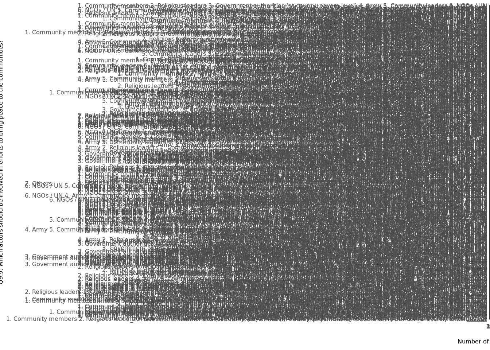

#### By county

<table class="table" style="width: auto !important; ">
 <thead>
  <tr>
   <th style="text-align:left;"> County </th>
   <th style="text-align:center;"> Most Common Response </th>
   <th style="text-align:left;"> Number of Responses </th>
   <th style="text-align:center;"> Percent of Total Responses </th>
  </tr>
 </thead>
<tbody>
  <tr>
   <td style="text-align:left;"> Bor South </td>
   <td style="text-align:center;"> Makes peace much more likely </td>
   <td style="text-align:left;"> 203 </td>
   <td style="text-align:center;"> 100 </td>
  </tr>
  <tr>
   <td style="text-align:left;"> Kajo-keji </td>
   <td style="text-align:center;"> Makes peace much more likely </td>
   <td style="text-align:left;"> 183 </td>
   <td style="text-align:center;"> 100 </td>
  </tr>
  <tr>
   <td style="text-align:left;"> Lainya </td>
   <td style="text-align:center;"> Makes peace more likely </td>
   <td style="text-align:left;"> 169 </td>
   <td style="text-align:center;"> 100 </td>
  </tr>
  <tr>
   <td style="text-align:left;"> Malakal </td>
   <td style="text-align:center;"> Makes peace more likely </td>
   <td style="text-align:left;"> 280 </td>
   <td style="text-align:center;"> 100 </td>
  </tr>
  <tr>
   <td style="text-align:left;"> Morobo </td>
   <td style="text-align:center;"> Makes peace much more likely </td>
   <td style="text-align:left;"> 149 </td>
   <td style="text-align:center;"> 100 </td>
  </tr>
  <tr>
   <td style="text-align:left;"> Pibor </td>
   <td style="text-align:center;"> Makes peace more likely </td>
   <td style="text-align:left;"> 176 </td>
   <td style="text-align:center;"> 100 </td>
  </tr>
  <tr>
   <td style="text-align:left;"> Rubkona </td>
   <td style="text-align:center;"> Makes peace much more likely </td>
   <td style="text-align:left;"> 247 </td>
   <td style="text-align:center;"> 100 </td>
  </tr>
  <tr>
   <td style="text-align:left;"> Wau </td>
   <td style="text-align:center;"> Makes peace more likely </td>
   <td style="text-align:left;"> 157 </td>
   <td style="text-align:center;"> 100 </td>
  </tr>
  <tr>
   <td style="text-align:left;"> Yei </td>
   <td style="text-align:center;"> Makes peace more likely </td>
   <td style="text-align:left;"> 206 </td>
   <td style="text-align:center;"> 100 </td>
  </tr>
</tbody>
</table>

<table class="table" style="width: auto !important; ">
 <thead>
  <tr>
   <th style="text-align:left;"> County </th>
   <th style="text-align:center;"> Response </th>
   <th style="text-align:left;"> Number of Responses </th>
   <th style="text-align:center;"> Percent of Total Responses </th>
  </tr>
 </thead>
<tbody>
  <tr>
   <td style="text-align:left;"> Yei </td>
   <td style="text-align:center;"> Has no effect on peace </td>
   <td style="text-align:left;"> 35 </td>
   <td style="text-align:center;"> 0.09 </td>
  </tr>
  <tr>
   <td style="text-align:left;"> Yei </td>
   <td style="text-align:center;"> Makes peace less likely </td>
   <td style="text-align:left;"> 26 </td>
   <td style="text-align:center;"> 0.06 </td>
  </tr>
  <tr>
   <td style="text-align:left;"> Yei </td>
   <td style="text-align:center;"> Makes peace more likely </td>
   <td style="text-align:left;"> 206 </td>
   <td style="text-align:center;"> 0.50 </td>
  </tr>
  <tr>
   <td style="text-align:left;"> Yei </td>
   <td style="text-align:center;"> Makes peace much less likely </td>
   <td style="text-align:left;"> 6 </td>
   <td style="text-align:center;"> 0.01 </td>
  </tr>
  <tr>
   <td style="text-align:left;"> Yei </td>
   <td style="text-align:center;"> Makes peace much more likely </td>
   <td style="text-align:left;"> 132 </td>
   <td style="text-align:center;"> 0.32 </td>
  </tr>
  <tr>
   <td style="text-align:left;"> Yei </td>
   <td style="text-align:center;"> Prefer not to answer </td>
   <td style="text-align:left;"> 1 </td>
   <td style="text-align:center;"> 0.00 </td>
  </tr>
  <tr>
   <td style="text-align:left;"> Yei </td>
   <td style="text-align:center;"> NA </td>
   <td style="text-align:left;"> 4 </td>
   <td style="text-align:center;"> 0.01 </td>
  </tr>
  <tr>
   <td style="text-align:left;"> Wau </td>
   <td style="text-align:center;"> Has no effect on peace </td>
   <td style="text-align:left;"> 19 </td>
   <td style="text-align:center;"> 0.05 </td>
  </tr>
  <tr>
   <td style="text-align:left;"> Wau </td>
   <td style="text-align:center;"> Makes peace less likely </td>
   <td style="text-align:left;"> 22 </td>
   <td style="text-align:center;"> 0.05 </td>
  </tr>
  <tr>
   <td style="text-align:left;"> Wau </td>
   <td style="text-align:center;"> Makes peace more likely </td>
   <td style="text-align:left;"> 157 </td>
   <td style="text-align:center;"> 0.39 </td>
  </tr>
  <tr>
   <td style="text-align:left;"> Wau </td>
   <td style="text-align:center;"> Makes peace much less likely </td>
   <td style="text-align:left;"> 35 </td>
   <td style="text-align:center;"> 0.09 </td>
  </tr>
  <tr>
   <td style="text-align:left;"> Wau </td>
   <td style="text-align:center;"> Makes peace much more likely </td>
   <td style="text-align:left;"> 139 </td>
   <td style="text-align:center;"> 0.35 </td>
  </tr>
  <tr>
   <td style="text-align:left;"> Wau </td>
   <td style="text-align:center;"> Prefer not to answer </td>
   <td style="text-align:left;"> 25 </td>
   <td style="text-align:center;"> 0.06 </td>
  </tr>
  <tr>
   <td style="text-align:left;"> Wau </td>
   <td style="text-align:center;"> NA </td>
   <td style="text-align:left;"> 5 </td>
   <td style="text-align:center;"> 0.01 </td>
  </tr>
  <tr>
   <td style="text-align:left;"> Rubkona </td>
   <td style="text-align:center;"> Has no effect on peace </td>
   <td style="text-align:left;"> 10 </td>
   <td style="text-align:center;"> 0.03 </td>
  </tr>
  <tr>
   <td style="text-align:left;"> Rubkona </td>
   <td style="text-align:center;"> Makes peace less likely </td>
   <td style="text-align:left;"> 40 </td>
   <td style="text-align:center;"> 0.10 </td>
  </tr>
  <tr>
   <td style="text-align:left;"> Rubkona </td>
   <td style="text-align:center;"> Makes peace more likely </td>
   <td style="text-align:left;"> 74 </td>
   <td style="text-align:center;"> 0.18 </td>
  </tr>
  <tr>
   <td style="text-align:left;"> Rubkona </td>
   <td style="text-align:center;"> Makes peace much less likely </td>
   <td style="text-align:left;"> 28 </td>
   <td style="text-align:center;"> 0.07 </td>
  </tr>
  <tr>
   <td style="text-align:left;"> Rubkona </td>
   <td style="text-align:center;"> Makes peace much more likely </td>
   <td style="text-align:left;"> 247 </td>
   <td style="text-align:center;"> 0.62 </td>
  </tr>
  <tr>
   <td style="text-align:left;"> Rubkona </td>
   <td style="text-align:center;"> Prefer not to answer </td>
   <td style="text-align:left;"> 1 </td>
   <td style="text-align:center;"> 0.00 </td>
  </tr>
  <tr>
   <td style="text-align:left;"> Pibor </td>
   <td style="text-align:center;"> Has no effect on peace </td>
   <td style="text-align:left;"> 60 </td>
   <td style="text-align:center;"> 0.15 </td>
  </tr>
  <tr>
   <td style="text-align:left;"> Pibor </td>
   <td style="text-align:center;"> Makes peace less likely </td>
   <td style="text-align:left;"> 37 </td>
   <td style="text-align:center;"> 0.09 </td>
  </tr>
  <tr>
   <td style="text-align:left;"> Pibor </td>
   <td style="text-align:center;"> Makes peace more likely </td>
   <td style="text-align:left;"> 176 </td>
   <td style="text-align:center;"> 0.43 </td>
  </tr>
  <tr>
   <td style="text-align:left;"> Pibor </td>
   <td style="text-align:center;"> Makes peace much less likely </td>
   <td style="text-align:left;"> 24 </td>
   <td style="text-align:center;"> 0.06 </td>
  </tr>
  <tr>
   <td style="text-align:left;"> Pibor </td>
   <td style="text-align:center;"> Makes peace much more likely </td>
   <td style="text-align:left;"> 106 </td>
   <td style="text-align:center;"> 0.26 </td>
  </tr>
  <tr>
   <td style="text-align:left;"> Pibor </td>
   <td style="text-align:center;"> Prefer not to answer </td>
   <td style="text-align:left;"> 1 </td>
   <td style="text-align:center;"> 0.00 </td>
  </tr>
  <tr>
   <td style="text-align:left;"> Pibor </td>
   <td style="text-align:center;"> NA </td>
   <td style="text-align:left;"> 3 </td>
   <td style="text-align:center;"> 0.01 </td>
  </tr>
  <tr>
   <td style="text-align:left;"> Morobo </td>
   <td style="text-align:center;"> Has no effect on peace </td>
   <td style="text-align:left;"> 67 </td>
   <td style="text-align:center;"> 0.17 </td>
  </tr>
  <tr>
   <td style="text-align:left;"> Morobo </td>
   <td style="text-align:center;"> Makes peace less likely </td>
   <td style="text-align:left;"> 51 </td>
   <td style="text-align:center;"> 0.13 </td>
  </tr>
  <tr>
   <td style="text-align:left;"> Morobo </td>
   <td style="text-align:center;"> Makes peace more likely </td>
   <td style="text-align:left;"> 115 </td>
   <td style="text-align:center;"> 0.28 </td>
  </tr>
  <tr>
   <td style="text-align:left;"> Morobo </td>
   <td style="text-align:center;"> Makes peace much less likely </td>
   <td style="text-align:left;"> 20 </td>
   <td style="text-align:center;"> 0.05 </td>
  </tr>
  <tr>
   <td style="text-align:left;"> Morobo </td>
   <td style="text-align:center;"> Makes peace much more likely </td>
   <td style="text-align:left;"> 149 </td>
   <td style="text-align:center;"> 0.37 </td>
  </tr>
  <tr>
   <td style="text-align:left;"> Morobo </td>
   <td style="text-align:center;"> NA </td>
   <td style="text-align:left;"> 2 </td>
   <td style="text-align:center;"> 0.00 </td>
  </tr>
  <tr>
   <td style="text-align:left;"> Malakal </td>
   <td style="text-align:center;"> Has no effect on peace </td>
   <td style="text-align:left;"> 45 </td>
   <td style="text-align:center;"> 0.11 </td>
  </tr>
  <tr>
   <td style="text-align:left;"> Malakal </td>
   <td style="text-align:center;"> Makes peace less likely </td>
   <td style="text-align:left;"> 19 </td>
   <td style="text-align:center;"> 0.05 </td>
  </tr>
  <tr>
   <td style="text-align:left;"> Malakal </td>
   <td style="text-align:center;"> Makes peace more likely </td>
   <td style="text-align:left;"> 280 </td>
   <td style="text-align:center;"> 0.67 </td>
  </tr>
  <tr>
   <td style="text-align:left;"> Malakal </td>
   <td style="text-align:center;"> Makes peace much more likely </td>
   <td style="text-align:left;"> 75 </td>
   <td style="text-align:center;"> 0.18 </td>
  </tr>
  <tr>
   <td style="text-align:left;"> Malakal </td>
   <td style="text-align:center;"> NA </td>
   <td style="text-align:left;"> 2 </td>
   <td style="text-align:center;"> 0.00 </td>
  </tr>
  <tr>
   <td style="text-align:left;"> Lainya </td>
   <td style="text-align:center;"> Has no effect on peace </td>
   <td style="text-align:left;"> 62 </td>
   <td style="text-align:center;"> 0.15 </td>
  </tr>
  <tr>
   <td style="text-align:left;"> Lainya </td>
   <td style="text-align:center;"> Makes peace less likely </td>
   <td style="text-align:left;"> 42 </td>
   <td style="text-align:center;"> 0.10 </td>
  </tr>
  <tr>
   <td style="text-align:left;"> Lainya </td>
   <td style="text-align:center;"> Makes peace more likely </td>
   <td style="text-align:left;"> 169 </td>
   <td style="text-align:center;"> 0.41 </td>
  </tr>
  <tr>
   <td style="text-align:left;"> Lainya </td>
   <td style="text-align:center;"> Makes peace much less likely </td>
   <td style="text-align:left;"> 20 </td>
   <td style="text-align:center;"> 0.05 </td>
  </tr>
  <tr>
   <td style="text-align:left;"> Lainya </td>
   <td style="text-align:center;"> Makes peace much more likely </td>
   <td style="text-align:left;"> 116 </td>
   <td style="text-align:center;"> 0.28 </td>
  </tr>
  <tr>
   <td style="text-align:left;"> Lainya </td>
   <td style="text-align:center;"> Prefer not to answer </td>
   <td style="text-align:left;"> 4 </td>
   <td style="text-align:center;"> 0.01 </td>
  </tr>
  <tr>
   <td style="text-align:left;"> Lainya </td>
   <td style="text-align:center;"> NA </td>
   <td style="text-align:left;"> 1 </td>
   <td style="text-align:center;"> 0.00 </td>
  </tr>
  <tr>
   <td style="text-align:left;"> Kajo-keji </td>
   <td style="text-align:center;"> Has no effect on peace </td>
   <td style="text-align:left;"> 33 </td>
   <td style="text-align:center;"> 0.08 </td>
  </tr>
  <tr>
   <td style="text-align:left;"> Kajo-keji </td>
   <td style="text-align:center;"> Makes peace less likely </td>
   <td style="text-align:left;"> 45 </td>
   <td style="text-align:center;"> 0.11 </td>
  </tr>
  <tr>
   <td style="text-align:left;"> Kajo-keji </td>
   <td style="text-align:center;"> Makes peace more likely </td>
   <td style="text-align:left;"> 117 </td>
   <td style="text-align:center;"> 0.29 </td>
  </tr>
  <tr>
   <td style="text-align:left;"> Kajo-keji </td>
   <td style="text-align:center;"> Makes peace much less likely </td>
   <td style="text-align:left;"> 7 </td>
   <td style="text-align:center;"> 0.02 </td>
  </tr>
  <tr>
   <td style="text-align:left;"> Kajo-keji </td>
   <td style="text-align:center;"> Makes peace much more likely </td>
   <td style="text-align:left;"> 183 </td>
   <td style="text-align:center;"> 0.46 </td>
  </tr>
  <tr>
   <td style="text-align:left;"> Kajo-keji </td>
   <td style="text-align:center;"> Prefer not to answer </td>
   <td style="text-align:left;"> 12 </td>
   <td style="text-align:center;"> 0.03 </td>
  </tr>
  <tr>
   <td style="text-align:left;"> Kajo-keji </td>
   <td style="text-align:center;"> NA </td>
   <td style="text-align:left;"> 1 </td>
   <td style="text-align:center;"> 0.00 </td>
  </tr>
  <tr>
   <td style="text-align:left;"> Bor South </td>
   <td style="text-align:center;"> Has no effect on peace </td>
   <td style="text-align:left;"> 7 </td>
   <td style="text-align:center;"> 0.02 </td>
  </tr>
  <tr>
   <td style="text-align:left;"> Bor South </td>
   <td style="text-align:center;"> Makes peace less likely </td>
   <td style="text-align:left;"> 30 </td>
   <td style="text-align:center;"> 0.07 </td>
  </tr>
  <tr>
   <td style="text-align:left;"> Bor South </td>
   <td style="text-align:center;"> Makes peace more likely </td>
   <td style="text-align:left;"> 172 </td>
   <td style="text-align:center;"> 0.40 </td>
  </tr>
  <tr>
   <td style="text-align:left;"> Bor South </td>
   <td style="text-align:center;"> Makes peace much less likely </td>
   <td style="text-align:left;"> 15 </td>
   <td style="text-align:center;"> 0.03 </td>
  </tr>
  <tr>
   <td style="text-align:left;"> Bor South </td>
   <td style="text-align:center;"> Makes peace much more likely </td>
   <td style="text-align:left;"> 203 </td>
   <td style="text-align:center;"> 0.47 </td>
  </tr>
  <tr>
   <td style="text-align:left;"> Bor South </td>
   <td style="text-align:center;"> Prefer not to answer </td>
   <td style="text-align:left;"> 1 </td>
   <td style="text-align:center;"> 0.00 </td>
  </tr>
  <tr>
   <td style="text-align:left;"> Bor South </td>
   <td style="text-align:center;"> NA </td>
   <td style="text-align:left;"> 1 </td>
   <td style="text-align:center;"> 0.00 </td>
  </tr>
</tbody>
</table>

### Q9.1 **Imagine that you have a problem or a dispute, who would you first seek help from? (Do NOT read the answers)** {.tabset}

### Q9.2 **Do you feel that you are able to resolve any disputes you have with community members without experiencing discrimination?** {.tabset}

### Q9.3 **Imagine that a person from this community stole cattle from your family. Who would you be most likely to seek help from?** {.tabset}

### Q9.4 I**magine that a person from outside this community stole cattle from your family. Who would you be most likely to seek help from?** {.tabset}

### Q9.5 **Imagine that there is an outbreak of violent clashes between two different ethnic groups in your area. Which actor would be most helpful for resolving this dispute?** {.tabset}

### Q10.1.1 How much confidence do you have in your local government? {.tabset}

### Q10.1.3 How much confidence do you have in the national government? {.tabset}

### Q10.1.4 How much confidence do you have in the police? {.tabset}

### Q10.1.5 How much confidence do you have in the military {.tabset}

### Q10.1.6 How much confidence do you have in the statutory courts? {.tabset}

### Q10.1.7 How much confidence do you have in religious institutions/leaders? {.tabset}

### Q10.1.8 How much confidence do you have in customary law? {.tabset}

### Q10.1.9 How much confidence do you have in village chiefs? {.tabset}
